## ホテル: 630km ～ Ctl:Si Mueang Mai(สภ.หนามแท่ง): 670km

5時過ぎに起きて、準備をして5:45ごろ出発しました。
23時頃寝たはずなので、6時間くらい眠れたでしょうか。

ホテルからルートまでは500m程です。
昨日来た道を戻ってルートに復帰します。

次のチェックポイントまでは40km程ですが、地味なアップダウンが続きます。
走っているとすぐに明るくなってきたので、この時間帯に出発するのはよさそうです。

しばらく走ってると、昨日履き替えたレーパンの太もも部分が締め付けられるように感じました。
これを買ったのは秋頃で、すでに日本は寒かったので全く使用せずにおいてありました。
その後、タイで一度使ったので問題ないと思っていたのですが、使った後洗濯したので、そのとき少し縮んだのかもしれません。

ここは、魔改造です。
裾のゴムの部分を3ヶ所ほど切ってみました。

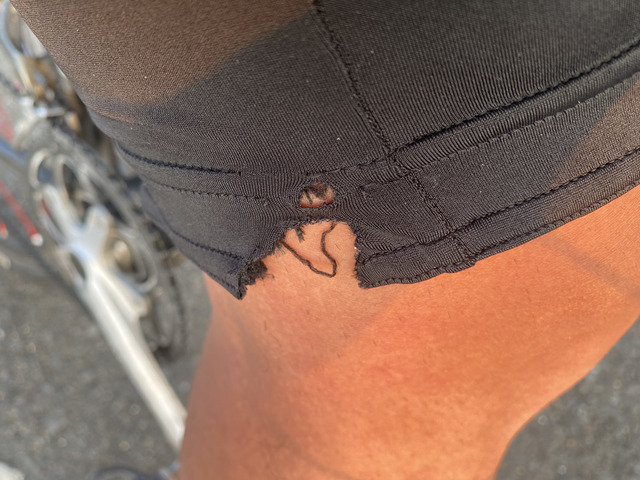

お。なかなかいい感じです。
見た目はちょっとアレですが、快適になりました。

しばらく行くと、食堂がありました。
次のチェックポイントは警察署なので、食べ物は期待できないかもしれません。
ここで食べておきましょう。

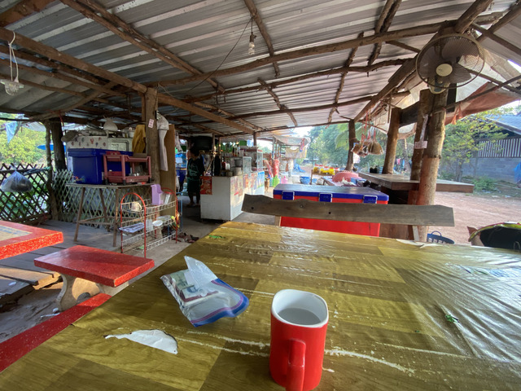

早朝なので、あまり種類はありません。
イサーン地方の名物カイヤーン(焼き鳥)と腸詰めのようなものを食べました。

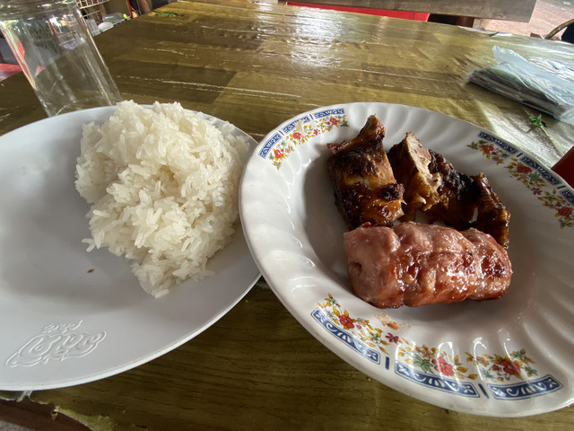

おいしくいただいて、チェックポイントまで足を進めます。

チェックポイントは大きめの警察署でした。
入口近くに受付の方がいて、ハンコをもらいました。

隣に小さな食堂があったようで、何人かはそこで食事をしていました。

## Ctl:Si Mueang Mai(สภ.หนามแท่ง): 670km ～ CP7:Kemmarat(แลโขงรีสอร์ท): 746km

チェックポイントを出たあとは、またすぐに何もない田舎道になりました。

爽やかな朝の道を走ります。

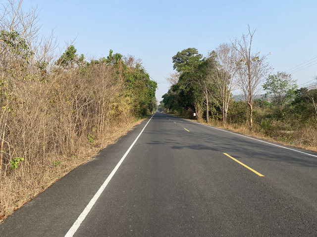

道路の脇に、何か食べ物らしきものが干されていました。

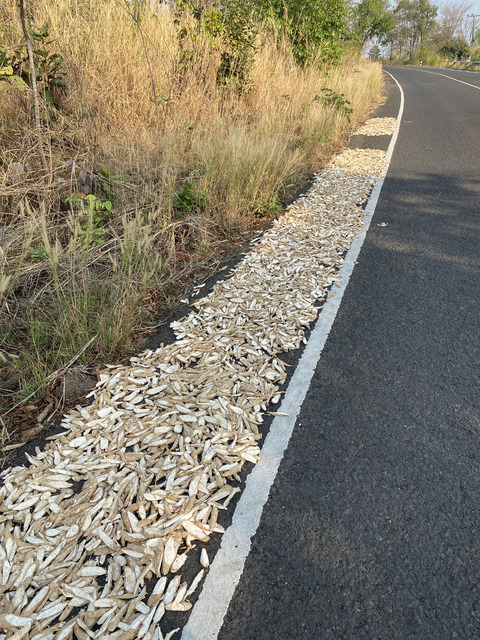

自転車を降りて触ってみたかったのですが、反対側でイタズラされないように監視しているおじさんがいたので、そのまま写真だけ撮って通り過ぎました。

このあと、またしても、アスファルトがガタガタになります。

あまりにもガタガタが続くので嫌気がさした頃、路肩との間の白線の上を走ると比較的スムーズに走れることに気付きました。
これに気付いてからは、ひたすら、白線の上から落ちずに走るゲームです。
落ちなければ、スーーっとスムーズに進みます。
落ちれば、ドゥルルルルルルルルっとなるので、すぐにわかります。

後でFacebookを見ると、Chaiwatさんが動画をアップしていました。



みんな同じようなことを考えていたようです。

しばらく、白線の上から落ちずに走るゲームを続けているとお腹も空いてきました。

ちょうどチャイシーの屋台があったので寄ります。

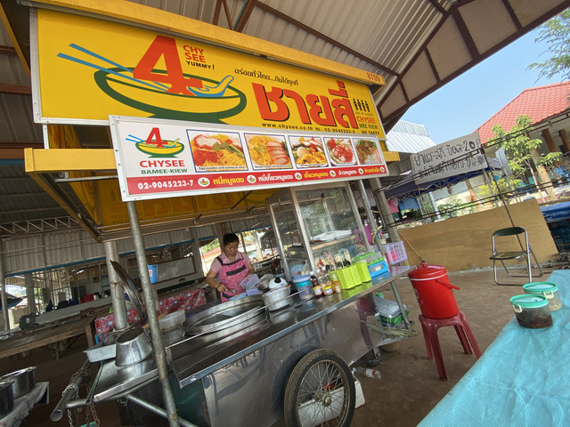

大好きなクイッティアオ・セン・ヤイにワンタン入れです。
今回は、新しく覚えた単語も挑戦してみました。

> 「พิเศษได้ไหมครับ? (ピーセッダイマイカッ？)」(大盛りできますか？)

> 「ได้(ダーイ)」(できますよ。)

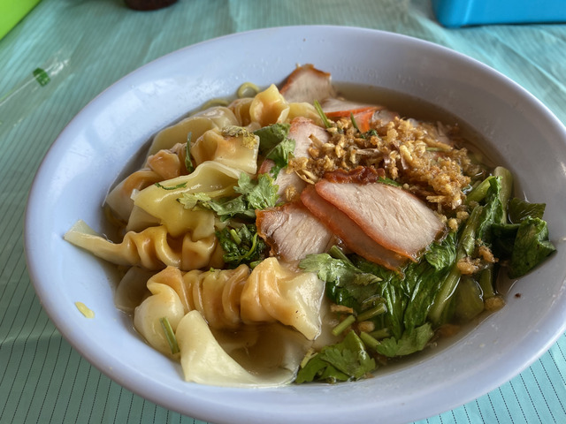

裏のトイレに行って戻って来たらすぐできました。

いやーー。うまうま。

なんで写真を撮ったのか忘れましたが、ガタゴトガタゴト進みます。

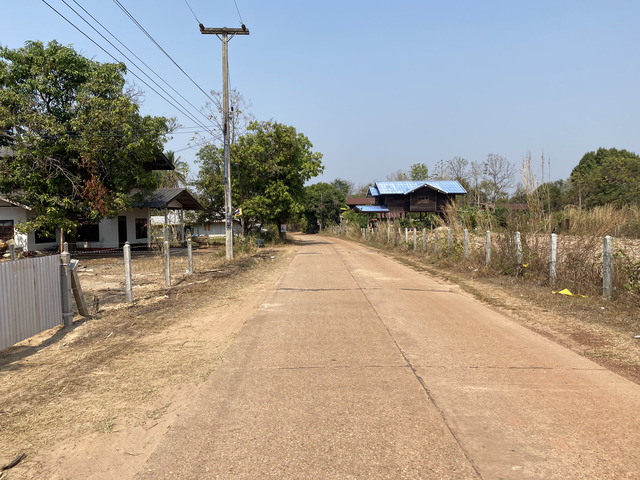

途中、また、マレーシアのチームのサポートカーが追い越していったので、手を振って挨拶しておきました。

短いですが、赤土っぽいところも進みます。

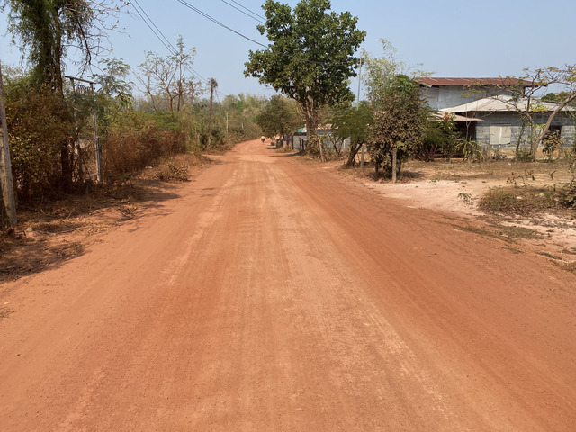

あと2kmくらいでCPです。

すごくきれいな湖の写真を撮った記憶があるのですが、少し疲れていたようですね。

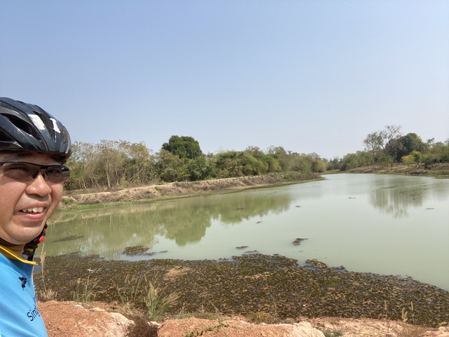

やっとこさ、CPに到着しました。

レコンホテル River Hotelです。
このあたりから2, 3日メコン川沿いをずっと走るので、River Hotelというような名前のホテルはよく見かけることになります。

中に入ると、テーブルを広げて集まっている人たちがいたので、そっちに行くとコントロールは奥ですよ、とのことでした。
さっきのマレーシアのサポートスタッフたちでした。

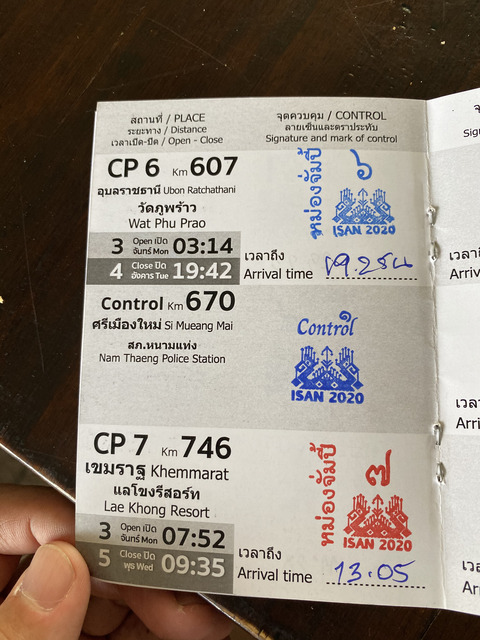

時刻は13時05分。
630km辺りのところを5:50に出てきたので、116kmを7時間15分もかけて来たことになります。
まるで、オダックス日本橋のブルベのようなペースです。

すべてはガタガタ道のせいなのですが、本当に疲れました。

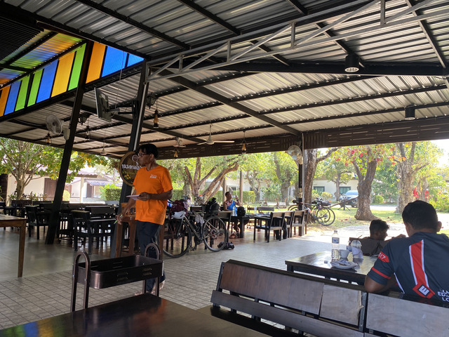

ここでは、チャーハンが無料で振る舞われていたので、お代わりして2回いただきました。

トイレに寄ると、シャワーを浴びてる人たちもいました。
昨夜のうちにここまで来て、今から出発かも知れません。

北海道のAH2400は制限時間がかなり厳しかったので、だいたいみんな同じようなところに泊まって、同じように出発していたのですが、今回は最初から最後まで10km/h(または12.5km/h)で計算されてるので、途中の選択肢の自由度が高いです。

みなさんそれぞれのペースでそれぞれの戦略があるので、だんだんとあまり人に会わなくなってきます。

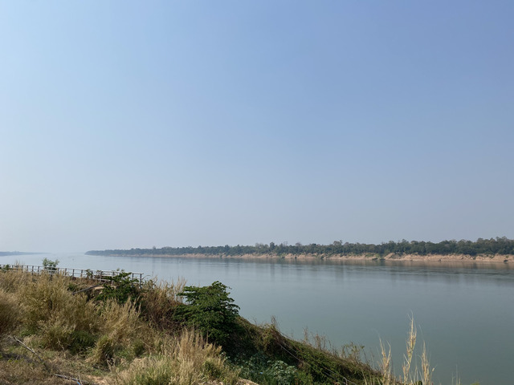

リゾートホテルの裏側です。川の向こうはラオスです。

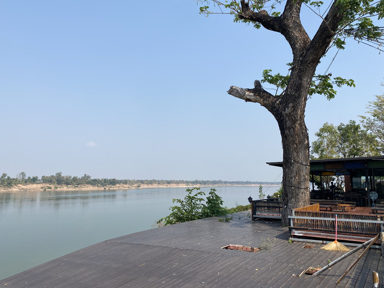

## CP7:Kemmarat(แลโขงรีสอร์ท): 746km ～ CP8:Mukdahan(วัดรอยพระพุทธบาทภูมโนรมย์)

CP7を過ぎると、やっとガタガタ道から解放されました。

大きめの道路を進み、ムクダハーンに入りました。

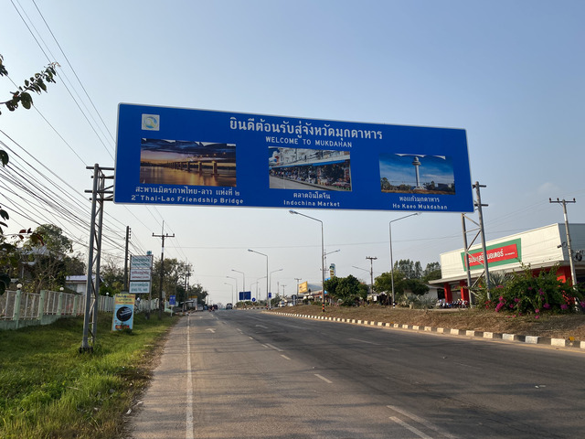

途中、セブンイレブンに寄っておやつです。

海老と蟹のお寿司があったので、買いました。
他には、60KCalのゼリー飲料と、Lactasoy、Maleeのリンゴジュースです。
Lactasoyは豆乳で甘くておいしいので、わりといつも飲みます。

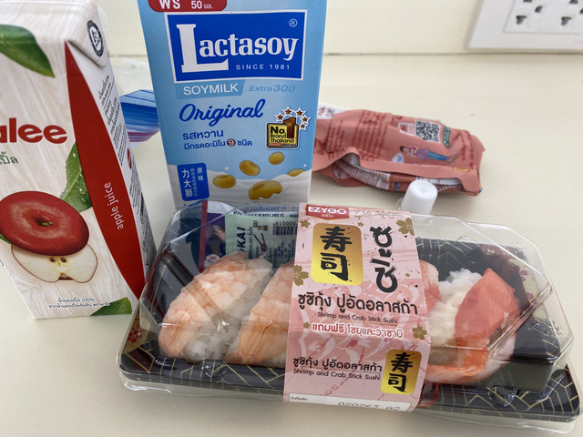

しばらく走って、時刻は6時頃ワット ローイ プラ プッタバート プー マノーロムの入口です。

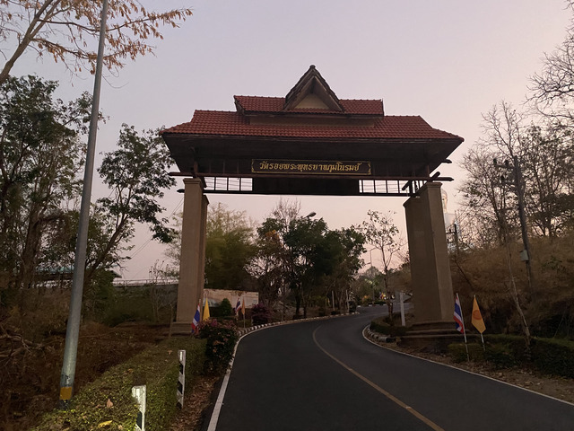

この後1.5kmほどひどい上りで、さすがに降りて押しました。

PC8はてっぺんにあるお寺で、真っ白な美しい仏像が待っていました。

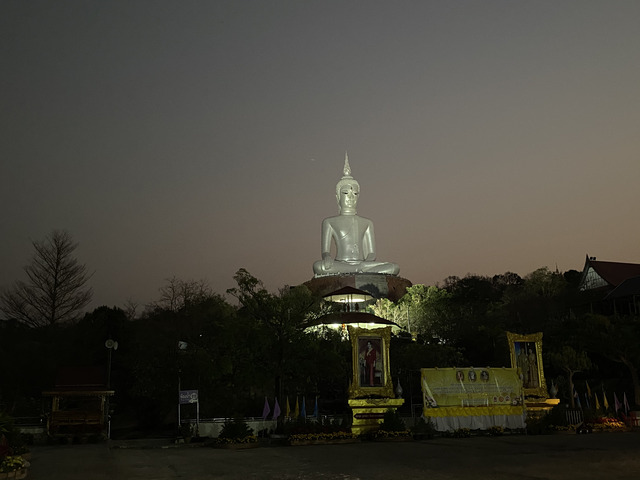

最新の地球の歩き方によると、建設中と書いてあるので、できたばかりの大仏だと思われます。

到着時刻は18:18。制限時刻は翌日の18:12です。
PC7からここまでは、ひどい道路ではなかったので、だいぶスムーズに来れたようです。

受付の人にチェックしてもらい、パンをいただきました。

先に到着していた人と、次のCPまで行こうとは思うけど100kmもあるのよね、とか話していると、ムクダハーンにも宿がいろいろあるよ、とのことでした。
明日はできたらノンカーイ(1250kmくらい)まで行きたいなぁと、この時は考えていたので、ここ(832km)で休むには明日があまりにも遠すぎます。
彼は、しばらく進んで宿を探そうかな、と言っていました。

ちょうど日が落ちた時間帯で、夜景がきれいに見えます。

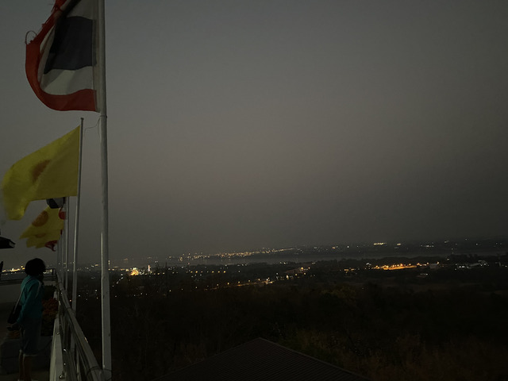

手前はムクダハーンの街、川を隔てて奥が、ラオスのサワンナケートです。

龍のようなのもありました。

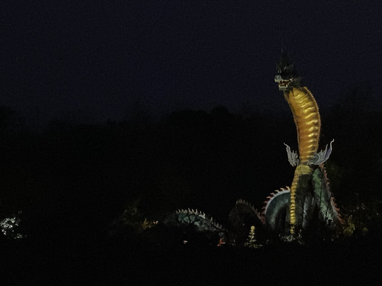

機会があれば、お昼にまた来てみたいものです。

## CP8:Mukdahan(วัดรอยพระพุทธบาทภูมโนรมย์): 832km ～ CP9:Nakhon Phanom(โรงแรมเดอะริเวอร์): 937km

さて、来た道を下って100km先のCP9を目指すことにします。
着くのは早くても12時くらいでしょうか。

坂を下るとすぐ街だったので、夜ご飯にします。

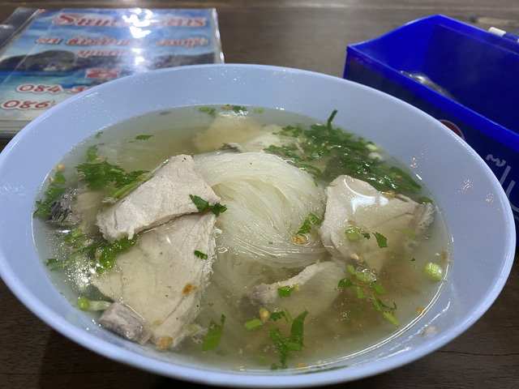

早くできるものをお願いしたら、クイッティアオが出てきました。
魚が入っていて、ものすごくおいしかったです。

しばらく走るとムクダハーンと書いてあったので、写真を取りました。
かなり大きな街のようです。

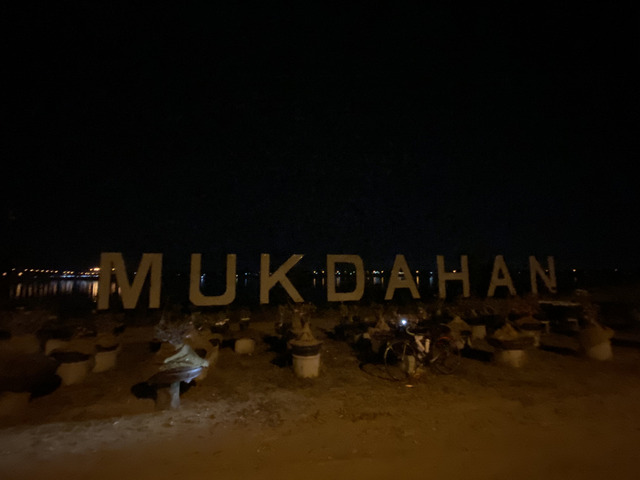

ラオスとタイを結ぶ橋が見えます。

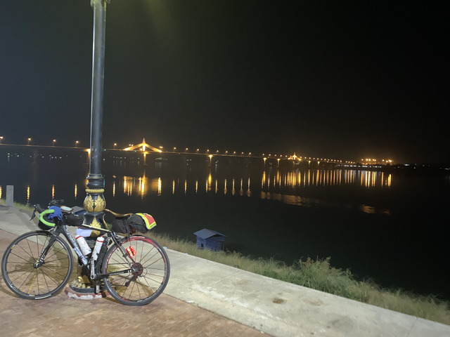

ムクダハーンを出ると、田舎道になりました。
時々お店や民家があるようです。
お昼はわりと賑やかな道路なのかも知れません。

途中小さなスーパーがあったので、飲み物を買いました。

なんかわからんけど、0kmです。
ケーンカバオだって。

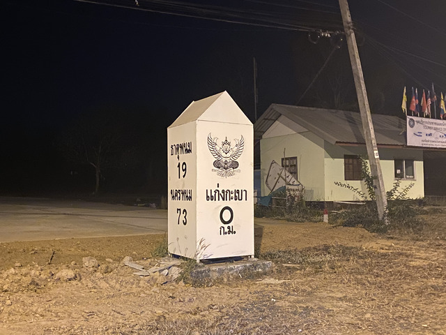

今日の目的地ナコーンパトムは73kmだそうで、その前にタートパノムというところがありそうですが、ここも何もないのでまったく期待はできません。

CP8からちょうど50kmほど、キューシート通りに来たはずなのですが、いきなりナイトバザールに突き当たりました。

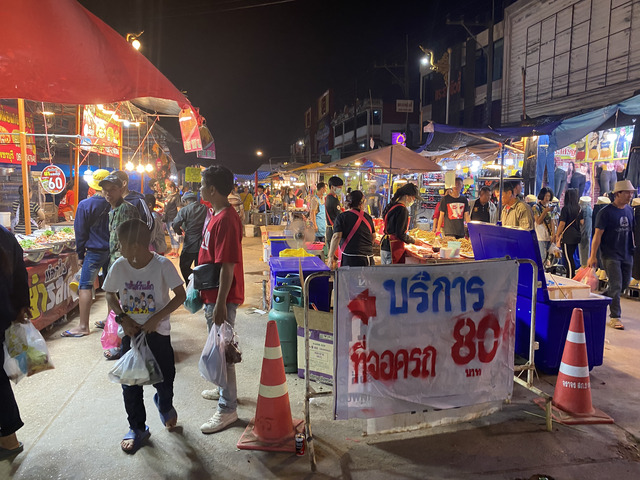

GPSはこのまま直進だし、キューシートにも、お寺の入口から自転車を押し歩いて300m先の車道に出る、と書いてあるので、どうやらこのナイトバザールを突っ切るのが正解のようです。

いちごの屋台があったので、せっかくなので、買ってみました。

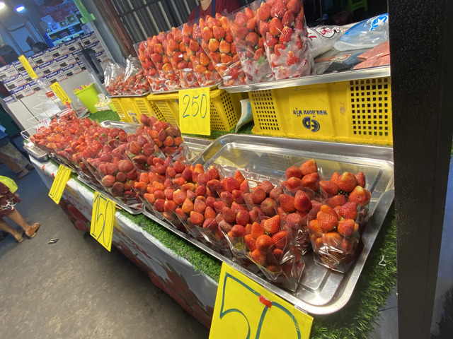

砂糖もくれたのですが、とにかくこのイチゴ、酸っぱくて酸っぱくて・・・。

本格的に、屋台の中心に入っていきます。

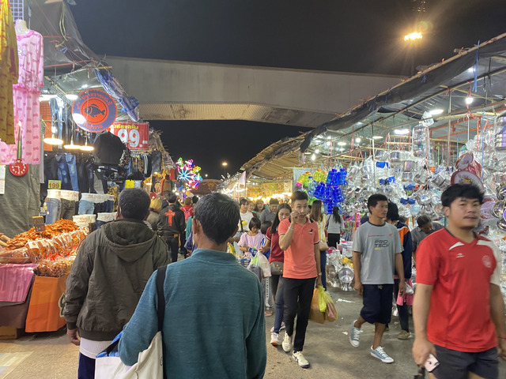

いろいろなものが売られてて楽しいのですが、自転車があるので、ちょっと買い食いとかはやりにくいですね。

屋台を抜けるとお寺が出てきました。

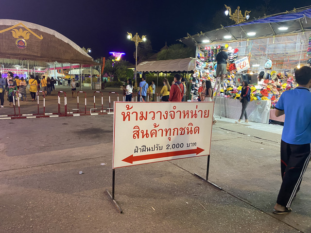

電飾もあって、テンションも上がります。

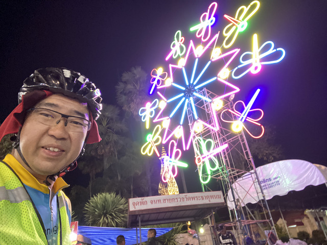

ルートは、この竹の塀に囲まれた狭い通路です。

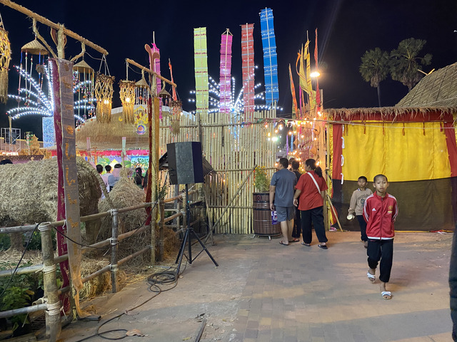

塀を抜けると広くなりました。

左側に見えるのが、タートパノムの有名なお寺のようです。

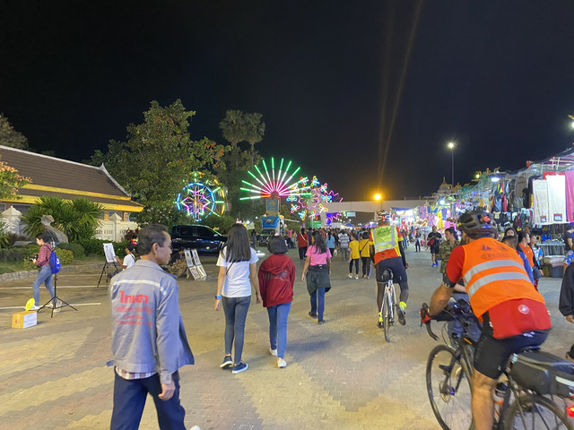

うしろから何人か先を急いで行きましたが、小腹が空いたので、バミーを食べて行くことにしました。

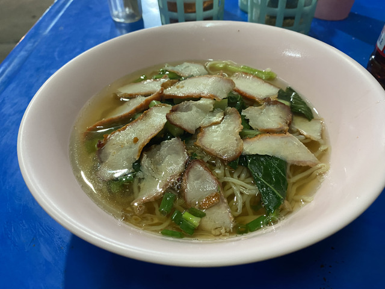

ごちそうさまでした。

このあたり、距離にして880km、時刻は9時半ごろです。
この辺で休んでもいいのですが、もう少し、進むことにします。

街を抜けると、ここに来るまでより道路が大きくなりました。
追い風なのか、スムーズで走りやすいです。

CP9で休む予定なのですが、実はどんなところか知りません。
The River Hotelというところなのですが、用意されている仮眠所がホテルの部屋なのか、大広間の適当なところなのかわかりません。
1年前のGTでは、リゾートホテルの大広間が仮眠所として用意されていて、ホテルの部屋は事前に割引料金で予約できました。

大広間よりは、静かに寝られた方が快適なので、少し手前にでもホテルがあれば入ろうかと、探しながら走りましたが、見つかるのは対向車線ばかりで、わざわざ道路を渡るほどでもないと思ったので、結局CP9まで到着してしまいました。

到着は0:24。寝場所への到着時間としては、今までで一番遅い到着です。

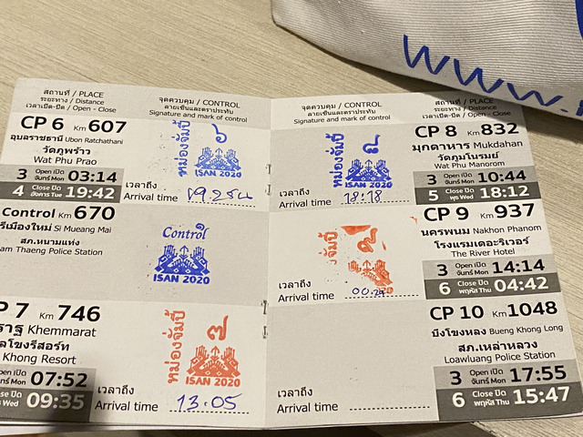

ハンコをもらって、お弁当ももらいました。

CP9はこんな感じの大きなホテルで、部屋に泊まれるようです。

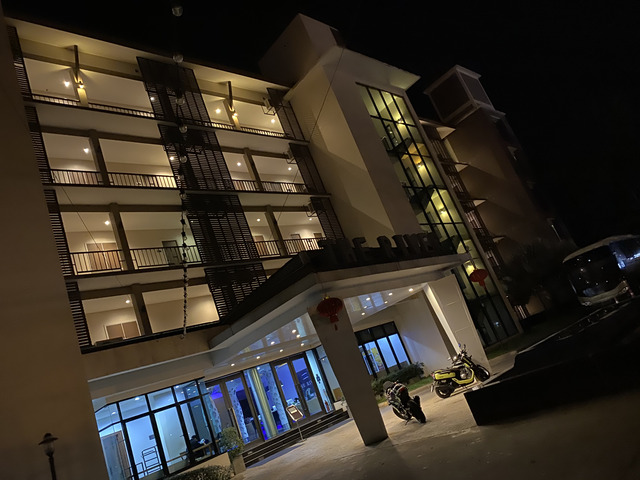

2人1組で泊まる仕組みのようで、外国人は外国人同士の組み合わせにするようでした。

見渡す限り外国人はいないので、次来るまで待っとかないとダメなのかと思っていると、タイ語わかるみたいだし、別にいいんじゃない、ということで、Roongtamさんと一緒にお泊まりすることになりました。

タイ語あまりわからないんですが、ラッキーです。

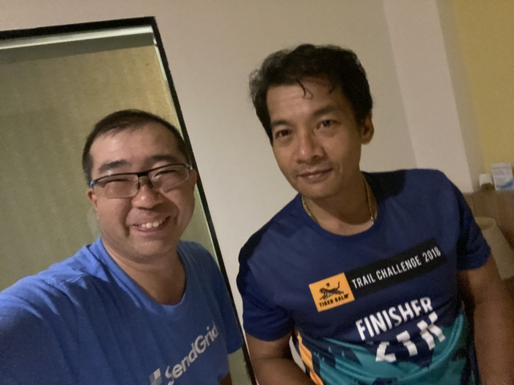

かなり大きなベッドで、おっさん2人が寝ても余裕でした。
部屋は使い回しなので、ベッドやタオルは少し荒れていますが、特に問題はありません。
新品のタオルもありました。

ゴミ箱にはビールの空き瓶があったので、一杯飲んで仮眠して行ったのでしょう。
タイ人はお酒はあまり強くないとよく聞きますが、大丈夫なんでしょうか。

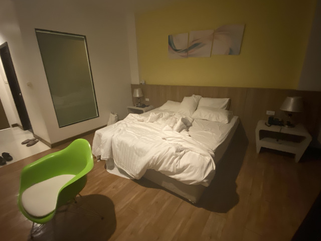

お弁当を3分の2くらい食べて、朝食用に少し残しておきます。
シャワーを浴びておやすみです。
Roongtamさんは3時に起きて出発するそうですが、この時点ではノンカーイので行くのはかなり諦めてるので、5時まで寝ることにしました。

おやすみなさい。

3日目: 移動距離: 307km (計:937km)
