## CP15:Lom Kao(กกกะทอน):1609km ～ Ctr:Lad Dan(บ้านห้วยลาด):1653km

おはようございます。7日目です。
昨日は無理せずに早めに切り上げたので、今朝は体が軽いです。
7,8時間くらい寝たのがよかったのかも知れません。
マッサージもよかったのかも知れません。

出発は朝7時頃です。
鍵を返しに外に出ると、宿屋のおばさんが何やら草を編んでいました。

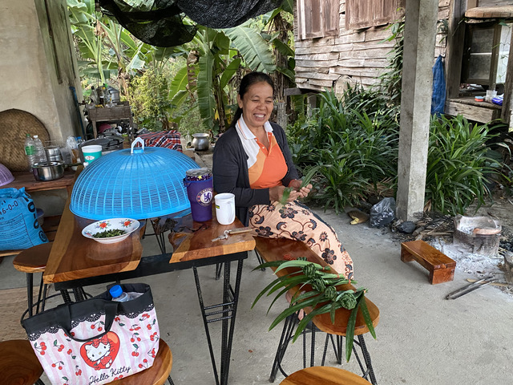

昨晩は気付きませんでしたが、しぶい自転車が飾られていました。

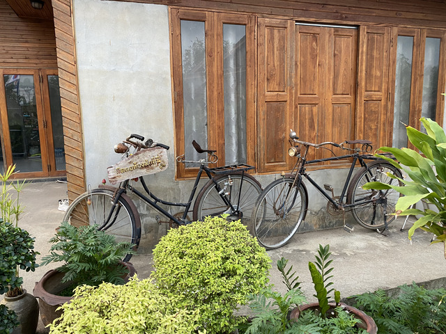

宿屋の看板です。

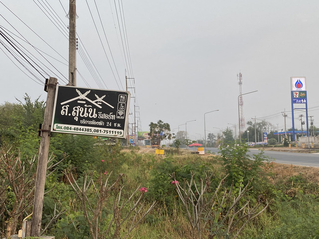

さて、ルートに戻る前に、向かいの7-11で買い出しです。
飲み物などの他、今回はSIMカードとiPhoneのライトニングケーブルを買います。

まず、SIMカードです。
何種類かあるようですが、すべてTrueのものでした。
間違ってるかも知れませんが、Trueはなんとなく都会に強いイメージで、普段はAISかDTACを買います。

とりあえず、店員さんもあまりわかってないようでしたが、店員さんのおすすめの安いものを購入しました。

次は、ケーブルです。
ケーブル類が並んでる棚まで案内してくれました。
案内してくれた後、仕事に戻るわけでもなく側にいます。
なるほど、商品が盗まれないようにロックがかかっていて、選ぶとロック外して取り出してくれる仕組みでした。

これも無事いろんな種類がありました。
長い方が便利なので、2mの丈夫そうなものを購入しました。

さて、SIMを入れ替えるのですが、SIMカードを取り出す装置(何と言うの?)も一緒に落としてしまったようでクリップでも借りようかと思ってたところ、持ち合わせていた爪楊枝が目に入りました。
意外と使えますね。

さぁ、準備はすべて整いました。
残り415kmのんびり楽しみましょう。

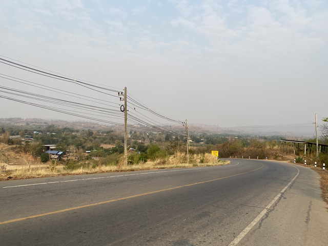

1km程戻ってルートに復帰してしばらく進むと、上りが増えてきました。
昨日の夜、無理して進まなくて正解でした。

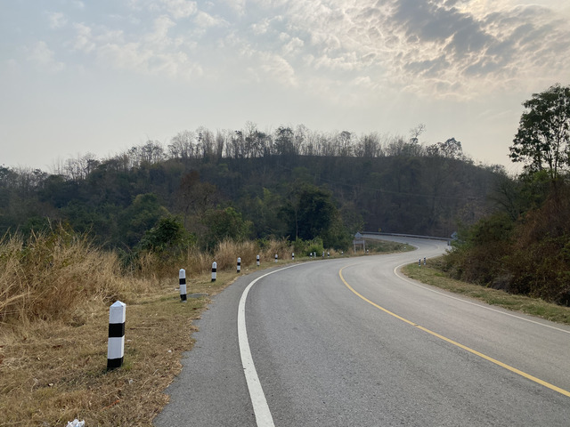

上りが増えると写真も増えるようです。
今の体力では、ちょっと勾配がきついと押し歩きして、それでも疲れるので、すぐ止まって休憩するからですね。
今朝SIMを入れ替えたスマホをいじってて気付いたのですが、FaceBookやLINEは使えるのにそれ以外のネットが使えません。
LINEもメッセージは送れますが、位置情報は送れないようです。
どうやら、このSIMカードはSNS専用で、いくつかのSNSしか使えないようになっているようでした。

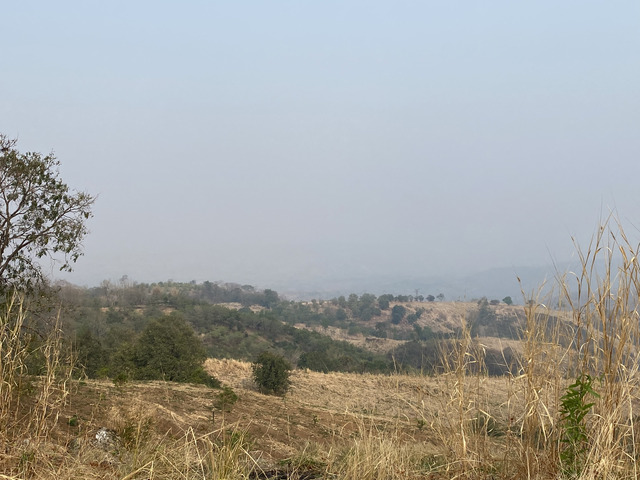

このあたりの山の風景というのはこんな感じです。

野焼きでしょうか。
夜、山の方で赤く燃えて見えていることがあるのですが、それが焼き上がるとこんなふうになるのでしょう。

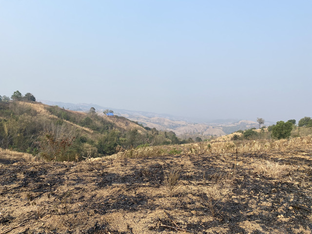

道路脇にも野焼きの後が見られます。

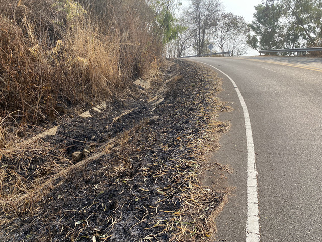

低いギヤを使いましょう。

上りが急なら下りも急です。

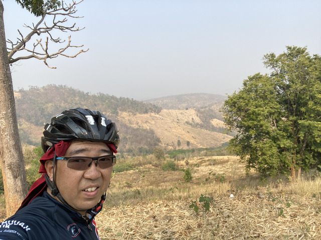

写真撮ったりして遊んでいるとき、ふと、ある考えを思いつきました。
周りに誰もいないし、アップダウンもしんどいし、気を紛らわせるのに音楽でもかけたらいいんじゃない。

さっそく、Amazon Musicを見てみると、なぜか数曲ダウンロードしてあったようです。
ネットワークがSNS専用になっているので、とりあえず、ダウンロードしたものを鳴らしながら行くことにします。

フロントバッグにiPhoneのスピーカー部分を上にして入れて、落ちないように蓋をちょっと開けた状態で閉めます。

と、これがなかなかいいのです。

音楽を聴くことによってリラックスするのか、一定のリズムが生まれるのか、とにかく疲れた感じがほとんどなくなりました。
きつい上りも押し歩くことに変わりはないのですが、一定のペースで押し歩くことができ、途中で止まって休憩、ということがなくなりました。

風の抵抗とか関係なく、前に人がいると楽に走れることがあります。
それに近い感覚です。
音楽の一定のリズムが流れていることで、合わせるわけではないのですが、何かベースになる基準が生まれ、スムーズに進むことができました。

あやしげな音楽を流しながらノリノリで走るっていると、あっという間にチェックポイントに到着しました。

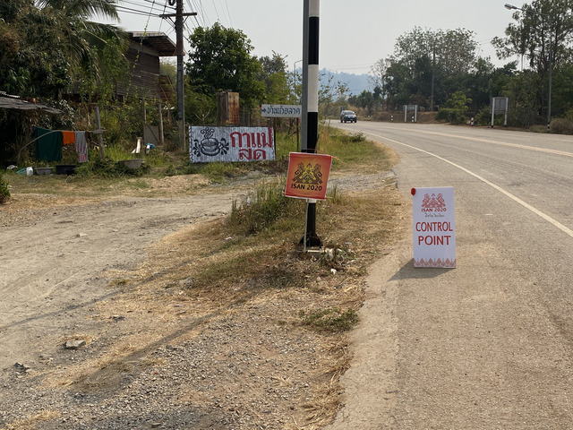

3時間半位で45km、結構かかってますが、上りを押してた割には全然悪くないペースです。

ここのコントロールは食堂なので、お昼ご飯にします。
結構いろいろなものが食べられそうです。

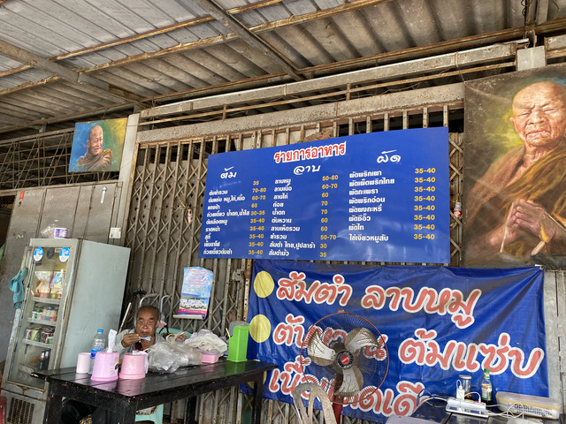

こんな感じの食堂でした。

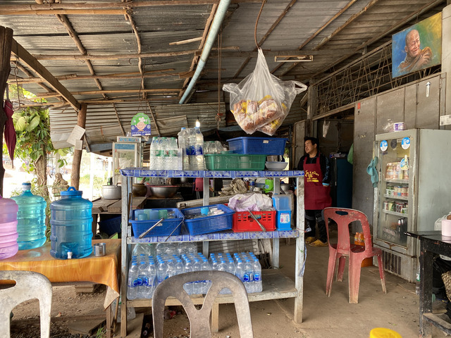

外はそこそこ暑かったので、まずは、チャーイェンをいただきます。

冷たい紅茶なのですが、たぶん練乳がたっぷり入っていて甘くておいしいです。

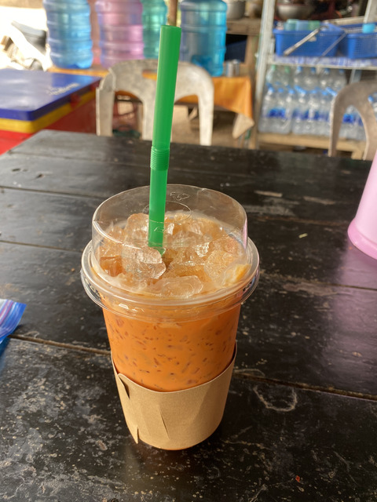

メインディッシュはラットナームーです。

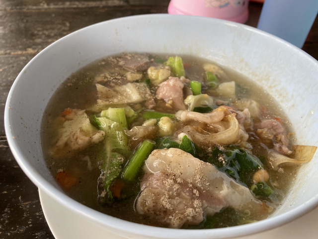

机の上のティッシュにはなぜか日本語がありました。

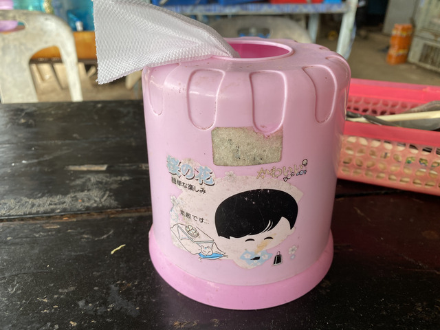

食べ終わったので、氷を巨大なクーラーボックスからボトルに汲みます。
タイの食堂やお店では氷の入った巨大なクーラーボックスが置かれています。
そこに入っている氷や溶けた水は勝手に持って行っても大丈夫です。

氷を汲んでいると、スイカが中に入っているが目に入りました。
暑い中を走っているときの冷たいスイカは心にしみます。

これ、食べたいんだけど、と聞くと、どうぞどうぞ、とのことで、いただきました。
切って売るのかと思ったら、そのままどうぞ、とのことでした。
売り物ではなく、ブルベの参加者用のものだったのかも知れません。

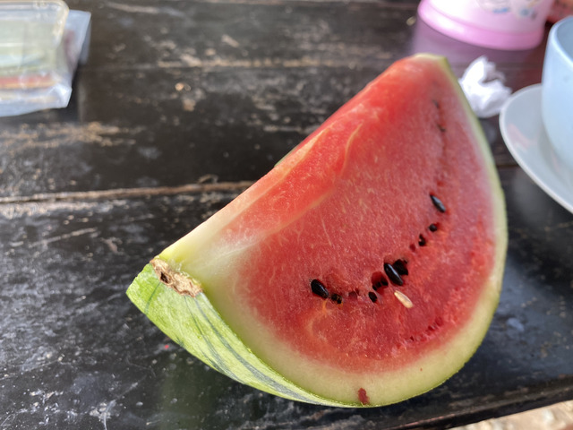

おいしかったので、ペロンといただきました。

## Ctr:Lad Dan(บ้านห้วยลาด):1653km ～ CP16:Nam Nao(พฤกษาวิว โฮมสเตย์):1690km

おいしいご飯も食べて、次のCP16を目指します。
距離は40kmもありませんが、上りなので侮れません。

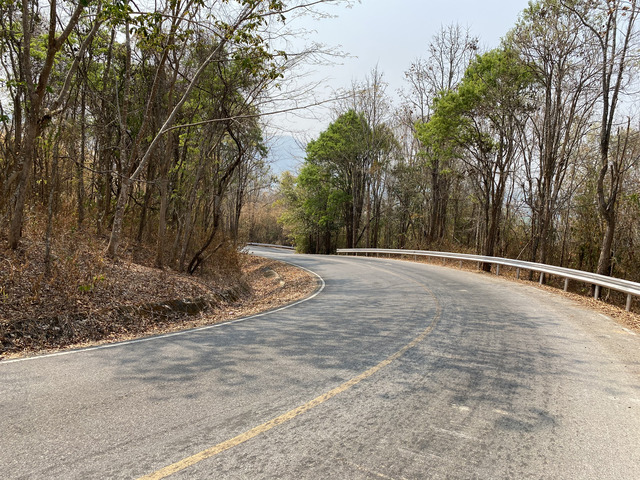

何か日本の国旗がありました。

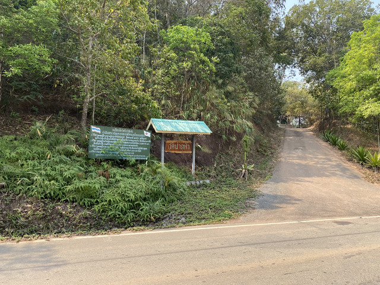

グニャグニャの道路が始まります。

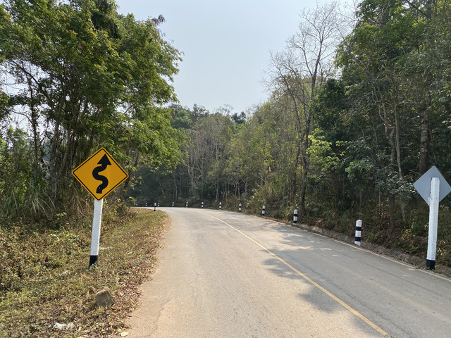

押し歩きながら撮影したものですが、さすがに28%はなかったと思います。

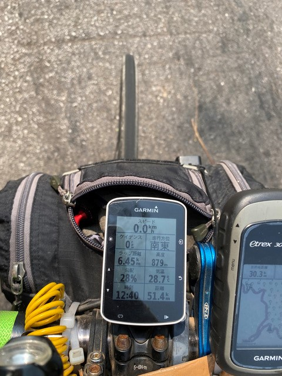

28%はないとしても、かなりの急勾配には違いはありません。

こんな感じのところを上っていると、途中スタッフの方がいて上から写真を撮ってくれました。
主催者のModさんです。
忙しいはずなのに頭が下がります。

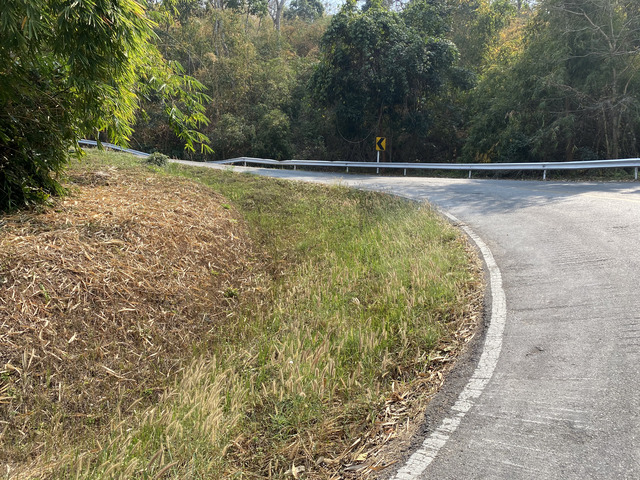

登り切った感じでしょうか。

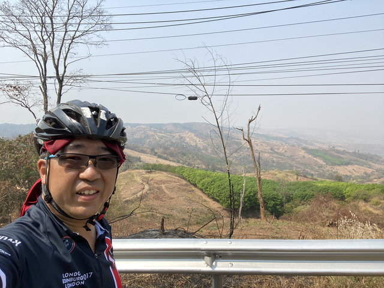

少し平坦になって人の気配を感じるようになりました。

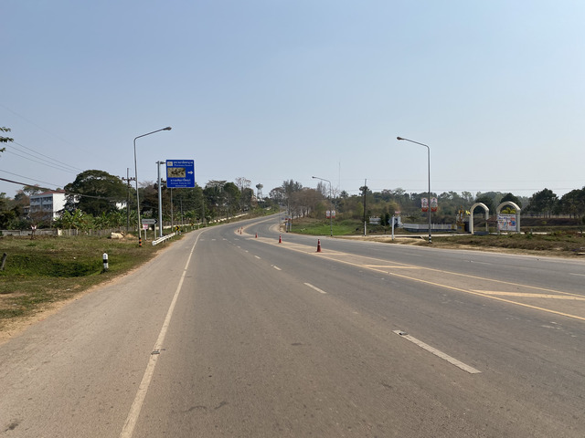

少し走るとCP16がありました。

CP16はドロップバッグのあるCPで、ここが最後のドロップバッグです。
コテージが点在するリゾートでした。

お弁当があったのでいただきました。
食べている間、スマホを充電させてもらっていたので、ここのCPの写真がないのが残念です。

## CP16:Nam Nao(พฤกษาวิว โฮมสเตย์):1690km ～ CP17:Kaset Sombun(ปตท. เกษตรสมบูรณ์):1775km

ここからは少しだけ上って、後は下りと平坦です。
距離は85kmほど。
短いですが、今夜は、次のCPの近くで泊まろうかと思います。

RideWithGPSのデータでは、このあたりに激坂があるようなデータになっていたのですが、どうやら道路両脇の崖の頂上の標高データだったようです。

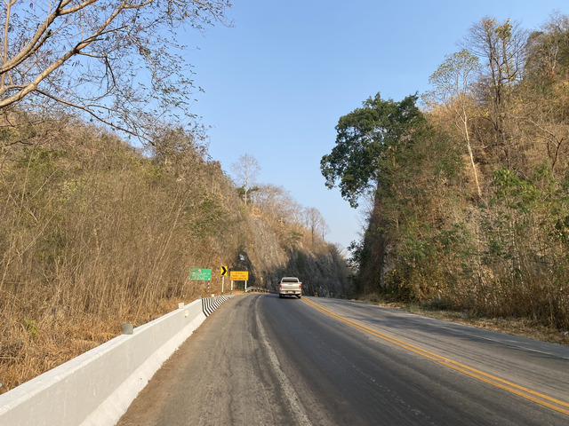

ここを過ぎると下りでした。

下りきったあたりでボトルを見ると、ペコンとヘコんでいました。

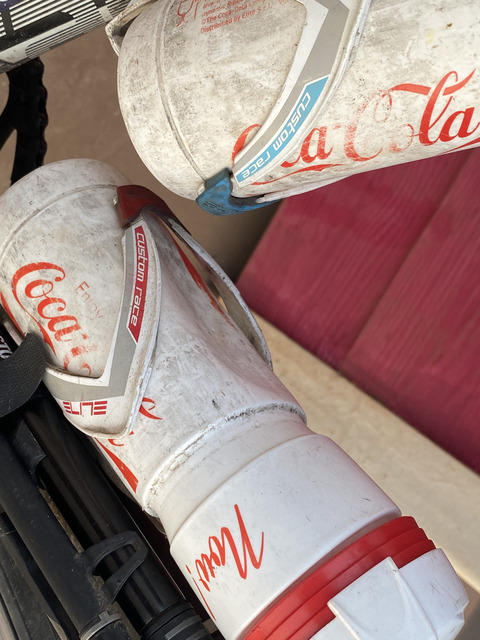

結構下ったようです。

そろそろ陽も沈んできました。

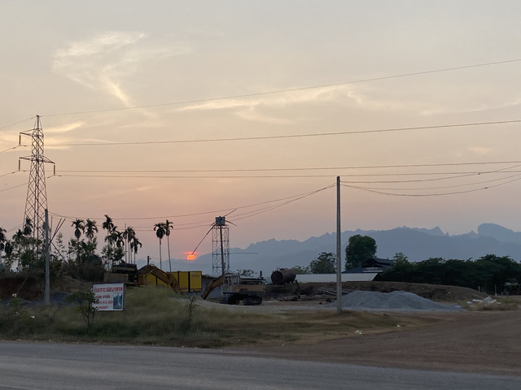

あたりのも真っ暗になり、おなかも空いてきました。

このあたりで、肉か何か、タンパク質をたっぷり取りたい気分です。
どこかいい食堂があったら、今夜は単品ではなく、いくつかの種類の料理を食べてみようかと思います。

しかし、道は真っ暗なままで、お店が全然ありません。

このままCPまで何もないのか、諦めかけていたところ、CPから15kmほど手前で街が出てきました。
車が入っていくのが見えたので見てみると、大きなレストランがありました。

何があるのかわかりませんが、これは、寄って行くしかないでしょう。

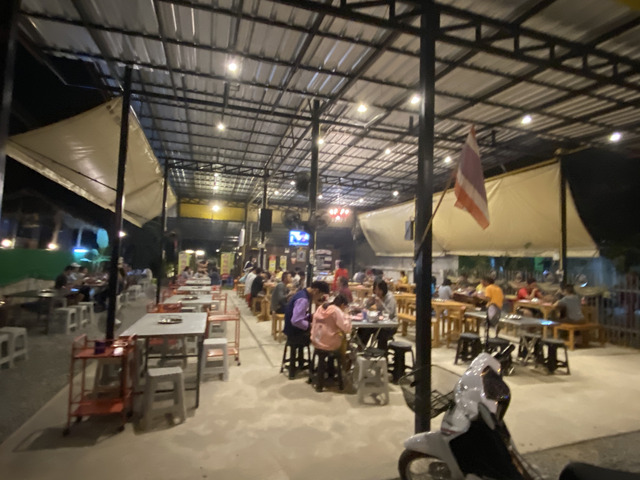

入ってみると、タイスキの食べ放題のお店でした。
昔マレーシアで見たことのありスチームをボート形式で、焼肉とタイスキを同時に楽しめるタイプの鍋です。

肉や野菜の他、いろいろなお惣菜や果物、チャーハンなど全部食べ放題です！！

日本でいうと、すたみな太郎のような雰囲気です。

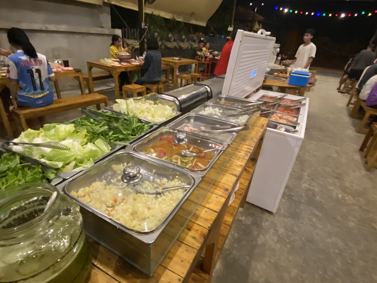

野菜から、お肉から、お惣菜から、素晴らしすぎます！！

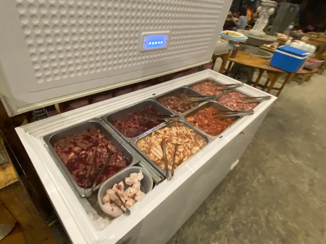

大丈夫です。
たくさん取らなくてもなくなりません。

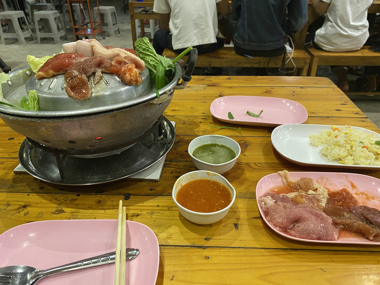

めちゃめちゃおいしいです。
食べ放題なので、これを何回も繰り返します。

さて、気になるお会計は。
なんと、なんと、飲み物など合わせて120バーツくらいでした。
400円くらいですよ！！

ブルベ中のまさかの焼き肉食べ放題ですが、これで驚くほど回復しました。

残り15km程をスイスイと走り、CP17の到着です。

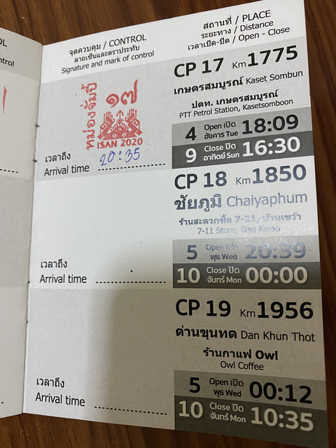

CP17はPTT内の7-11でした。
さっきあれだけ食べたのに、イートインで少しおやつを食べながら隣の人と話していると、昨日の夜Lam KaoのCP15のところで迷ってなかった？と聞かれました。
GPSのトラッキングページを見るとルートから少し外れたところで動いていないのが気になっていたそうです。
あーー。それはホテルで爆睡してたからなのですよ。

さて、今夜の宿なのですが、誰かが9kmくらいでなんたらかんたらと話しているのが聞こえました。
9kmくらい行くときっと町があるのでしょう。
そのあたりを目標に行くことにします。

外に出るとTonさんがいました。
黄色い自転車かっこいいですね。

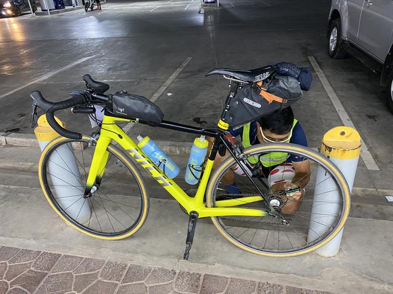

真剣にチェーンのひとこまひとこまに注油していたので、そっと盗撮だけして話しかけないことにします。

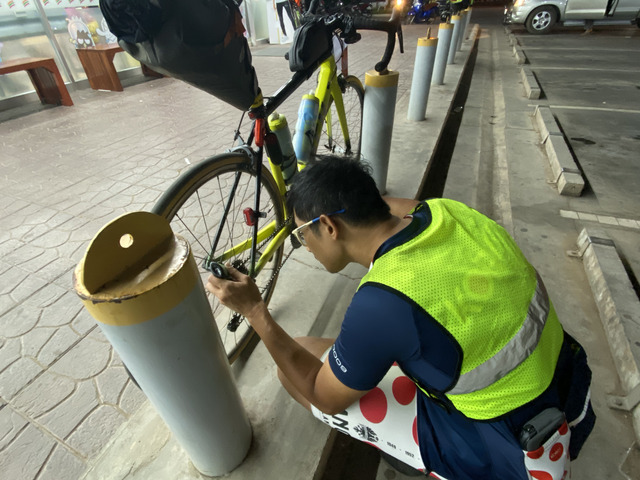

## CP17:Kaset Sombun(ปตท. เกษตรสมบูรณ์):1775km ～ CP18手前のホテル:1847km

出発すると、また、真っ暗な田舎道になりました。
アップダウンはあまりなく、気持ちよく走れます。

さて、9kmくらい走りましたが、あまり街のようなものはありません。
10km, 11km と進みますが、一向に田舎道の様子は変わりません。

見逃してしまったのでしょうか、それとも奥に入らないといけなかったのでしょうか。

安物SNS専用SIMのせいで、FacebookやLINEは使えるのですが、GoogleMapが封印されているという縛りプレイの最中です。
諦めましょう。

途中でどこかいいところを見つけたら入ることにします。
最悪、次のCP18の手前にホテルがあることは知っています。
昨日Nam NaoのCP16まで行っていたらCP18で泊まるつもりでした。
ここからだと、あと60kmほどです。
途中に小さな峠があるはずですが、さっきおいしいものをたっぷり食べてかなり元気なので、それでも大丈夫そうです。

しばらく気分よく走っていると、時々集落が出てきます。
これが、危険なのです。
夜の小さな集落からは犬が飛び出してくるのです。

案の定飛び出してきたので、いろいろ実験してみます。

まずは、ライトを外してあちこちに向けてみました。
おー、これはすごい。
犬が方向を見失ってあちこちに方向転換をします。

なかなかよさそうなのですが、完全に方向を見失ってるので自転車の前に飛び出してくる可能性もありそうです。
ちょっと危険すぎるのでこれは使えなさそうです。

次は、ボトルの水をかけるといいよ、と聞いたので試してみました。
ところが、水が出ません。
まさかの不発です。
これはやばい。
ボトルの口を開けるのを忘れていました。
あわてて、口を開けて、再度攻撃です。

うわっ。ボトルの口が飛んで行ってしまいました。
犬はボトルの口をめがけて方向転換です。

犬は避けられましたが、ボトルの口を失ってしまいました・・・。

犬が出てこなくなったころ、峠が始まりました。
元気なので楽しく越えました。

日付が変わって0:30ごろ、CP17の手前3kmほどのところで大きな道路に出ました。
この反対側にホテルがあることは出発前に確認済みだったので、すぐに見つかりました。

着くと、同じブルベの先客が2人いてフロントで受付をしていました。
ついでに、僕の分も受付してくれました。

さて、残りは180kmほど。
明日中にはゴールできそうです。
帰りの車の希望を明日の昼過ぎにしていたのですが、昼過ぎにはさすがに無理そうです。
たぶん、適当に割り振るのだと思うので、気にしないで夕方くらいに着くように出発することにします。

逆算すると、いつものように7時くらいに出ればいいでしょう。

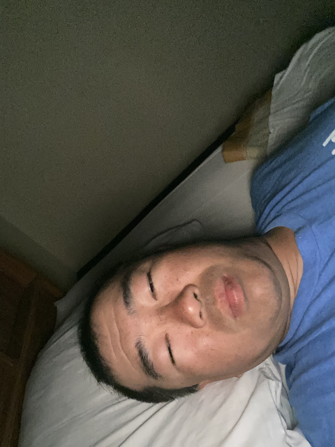

おやすみなさい。

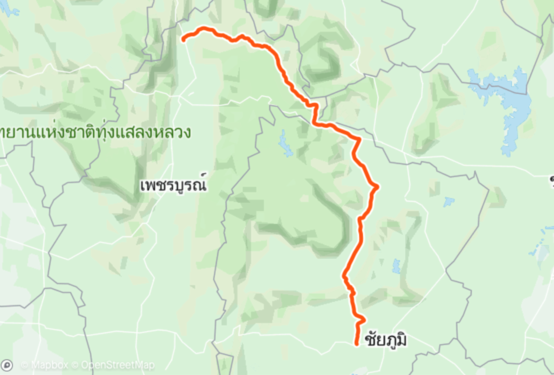

7日目: 移動距離: 238km (計:1,847km)
