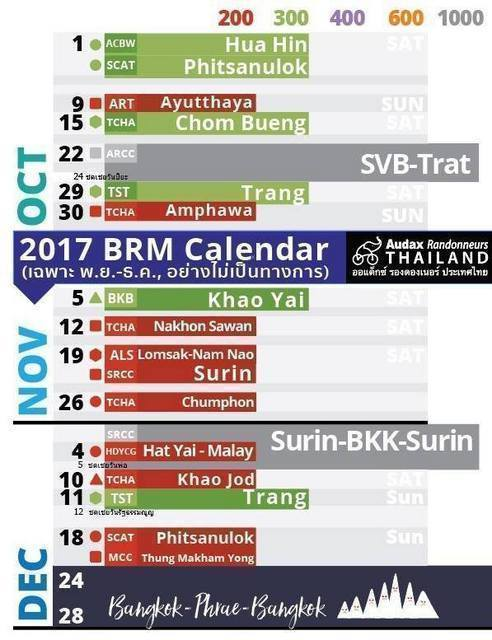

## どこに行こうかな

自転車のロングライドイベントとしては、ブルベをよく走るのですが、主催団体の年度が11月から新しくなることもあり、日本では11月、12月のブルベは開催されていません。
1月からはいろいろと開催されるのですが、寒いこともあり、夜間走行の必要のない200kmや300kmの短いコースが多くなります。
そうだ、どこか暖かい国に遠征しよう。

ということで、たまたま、Audax Japanのサイトを見ていると、日本、アメリカ、イタリア、イギリスに続いてここ数年でタイが急激に認定距離を伸ばしているという情報がありました。

そういえば、昨年のPBPでもタイの選手が70人くらい参加していると聞きました。
タイにはよく旅行で出かけるのですが、ロードバイクに乗った人を本当によく見かけます。
そういえば、前回も宿で借りたMTBで田舎道を走っているとロードのおっさんに声をかけられました。
ということで、タイに決定です。

ちなみに、世界中に469あるクラブの内、2016年度の認定距離のトップはタイでした。
2位は日本のRandonneurs Tokyoです。[(資料)](https://www.audax-club-parisien.com/download/Resultats_2016_05.pdf)

## タイのブルベってどんなだろう

さっそく、Audax Thailandの[ホームページ](https://www.audaxthailand.com/)を見て研究です。
各イベントのところに参加者一覧があるので適当にひとつ選んで見てみると、あれ?! 300人位のリストになっています。
しかも、申し込み自体は今でもまだ受け付けているようです。
日本では普通50～100人位の開催で、人気のあるルートは申し込み開始日にエントリー峠があったりして、申し込めない、なんてこともよくあります。
こんなに、申込者がいるということは、抽選なのだろうか。
抽選だと予定が立てにくいなぁ。
などと考えながら、Resultがあったので見てみると、どうやら抽選などなく、数百人の規模で開催されているようです。
後で、聞いた話では、人気のあるアユタヤの200kmとかだと1000人を越える規模だそうです。

## どれに参加しようかな
10月になったので、ホームページを見てみたのですが、特に更新はなく、2016年度の情報しかありませんでした。
そこで、PBPの時にスタートで隣だったタイ人の友達に聞いてみると、ステキな一覧表を送ってくれました。

最新の情報はどうやら[Facebook上](http://www.facebook.com/audaxthailand)でやりとりされているようです。
この1400kmのBangkok-Phrae-Bangkokというのが開催されるというのは、Audax Thailandのホームページにもありました。
日程がちょうど年末なので、正月休みにかこつけて参加しちゃいましょう。
来年にはイギリスで開催される1400kmのLondon-Edinbrgh-Londonにも参加するので、感覚をつかむためにもいいかもしれません。

ということで、年末の飛行機を予約して、会社にも休む休むと言いふらしておきました。
飛行機チケットは年末にも関わらず少し早めの出発なので、普段と変わらない価格で購入することができました。
