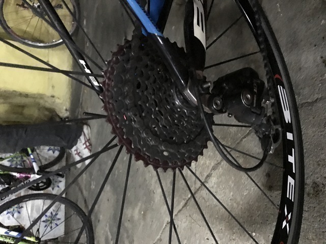
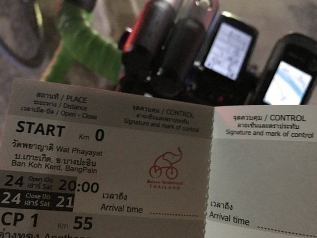

## 準備

受付は16:00から、スタートは20:00からなので、時間はたっぷりあります。
とはいっても、さすがに観光に出かけたりすると疲れてしまうので、ギリギリまで寝る予定です。
まずは、朝10時半位に起きて近所のセブンイレブンへ買い出し。
昼食と持って行く補給食として、バナナ、おにぎり、サンドイッチ、飲み物などを買いました。

とびこマヨネーズなんてのもあって日本風の食べ物も手に入ります。

ついでにお昼ご飯を食べます。
これを2杯いただきました。

お昼ごはんを食べて、再び仮眠です。
16時から受け付け開始、ホテルからスタート地点まで約10km、30分程で行けるので、16時前に宿を出ることにして、それまでゆっくり寝ました。

## スタート地点へ

ホテルのフロントには同じように出場する方達の自転車が置いてありました。

>表にはサポートカーに使用するらしき車も止まっていました。
日本ではサポートカーを用意する人は全くいないのですが、タイでは結構サポートカーを利用していました。
それにしても、オダックスタイランドのロゴはかわいいですね。

ホテルを出て昨日下見した道を10kmほど自走で進みます。
ドロップバッグは2種類あるのですが、荷物が大量ではないので、1つにまとめて背中に背負って走りました。

この大会の名前はBangkok-Phrae-Bangkokですが、なんと、スタート地点はアユタヤで、バンコクは全く通りません。
ま、アユタヤといっても、南の方なので、ほとんど、バンコクと言えばバンコクなのですがね。<

さて、スタート地点であるWat Phayayatに到着すると、すでに20人ほど集まっていました。
受付はまだ開始されていないようで、お寺の本堂で仮眠したり、自転車を組み立てたり、整備したり、おしゃべりしたり、とみなさんのんびり過ごしていました。

>受付のところには炊飯器やテーブル、椅子が用意されてるので、もしかしたらここで食事ができるかも知れません。
スタート前に夕食はどこで食べようかと考えていたので、ここで食べられるなら好都合です。

スタッフの方達ものんびりしています。

## 受付

しばらくすると受付が始まりました。
名前やAudax Thailandの会員番号を伝えて、用意された出走キットと注文してあった記念ジャージを受け取ります。

出走キットはこんな感じで、左上からブルベカード、ブルベカードケース、キューシート(タイ語、英語)、自転車に取り付ける番号札、フレームに貼る番号札、ヘルメットに貼る番号札、一番でかいのが、サポートカーに貼る番号札です。

このほか、記念Tシャツもいただきました。

ブルベカードというか冊子ですが、その中身はこんな感じです。
最初の方のページには名前や緊急連絡先やレギュレーションが詳しく記述されていました。
Wat Phayayatを出発して、55km地点のアントン、148km地点のチャイナート、179km地点のウタイタニー、269km地点のチュムセーン、336km地点のワンクロット。
ちなみに、CPというのはCheck Point。時間制限のあるポイントで、日本でいうPC(Point de Controle)ですね。
Controlは制限時間のないポイントで、日本でいうチェックポイントですね。
なんか、呼び名が逆ですが、意味合いは同じです。

そして、415km地点のピッサヌローク、519km地点のシーサッチャナーライ、585km地点のワンチン、664km地点のプレー、786km地点のナムパット、878km地点のロムクラオ、と続きます。

最後のページが、1034km地点のロムサック。
ナムパットからここまでの約250kmの間に7つの峠があり、今回のルートのメインディッシュになっています。
この7つの峠を含む600kmのブルベを開催した時には時間切れで完走出来なかった人が続出だったと聞いたので要注意です。
その後、1145km地点のペチャブン、1191km地点のウィチァンブリー、1333km地点のロッブリー、最後に1430km走って、ここワットパヤヤートに戻って来て完走です。

もらった番号札を自転車に付けてみました。
今回は、こんな装備で走ります。
フロントのチェーンリングをチートした以外は、普段と全く変わらない貧脚仕様です。
詳しい装備は別ページで書きましょう。

## スタートまでいろいろ

一応準備も整ったので、ご飯をいただきました。
豚の角煮のようなもの、たまご、奥はカレーです。
いやー、うまい。

腹ごしらえもできて、準備は万端です。
友達のTonさんはまだ来ていないようなので、とりあえず、うろうろ見学です。

タイ国旗のついた、かっこいい自転車発見

歓談する人たち。

うろうろしていると、声をかけていただきました。
シンガポールから来た方です。
この前、日本で開催された[Japanese Odyssey](https://www.japanese-odyssey.com/)という大会に出たよ、と話してくれたのですが、恥ずかしながら、知らないイベントでした。
聞いてると、主催者はフランスで日本では知られてないかも、と。
東京の日本橋を出発して榛名山とか乗鞍を越えて四国に行って大阪に行くルートで・・・。はっ?!
すごいです・・・。

タイの方と、深センから来た方です。
Randonneurs Tokyoのジャージを着てるとみなさん声をかけていただけるので助かります。
別にRandonneurs Tokyoの会員でもなんでもないんですが、じゃんけんで勝っていただいたので、さっそく活用させていただいてます。

18:30位になると車検が始まりました。
車検が通るとブルベカードにシールを貼ってくれます。

まだまだ、時間があって退屈なので、自転車を見て回ったり、おしゃべりです。

なんか、後ろのギヤがでかいですね。

たぶん、40T越えてますよね。42Tかな。
MTB用のスプロケだと思うのですが、42Tとか105でも動かせるのですね。
ステキです。
よく見ると、ディレイラーハンガーとかプーリーのところとか改造されてる気がしますね。

とにかく、途中に険しい山があるので、みなさん警戒しているようです。
40Tとか42Tとか付けてる人、本当にたくさんいました。

だいぶ人が増えてきました。
参加者は103人だそうです。

ここの犬はおとなしいです。

## スタート準備

出発15分くらい前になってSTARTのところにはんこを押してもらいました。
いよいよスタート間近です。

tonさんのおばさんが写真を撮ってくれました。
友達のtonさんはどこに行ったんでしょうか。
さっき到着したばかりならしく、ちょっとあいさつして、その後見かけません。
こりゃ、また、PBPの時と同じくスタート地点でのみのごあいさつですね。

そろそろスタートです。
ドキドキしますね。

カウントダウンの後、20:00ちょうどに一斉にスタートしました。
これから1430kmの長丁場、みなさん頑張りましょう！
