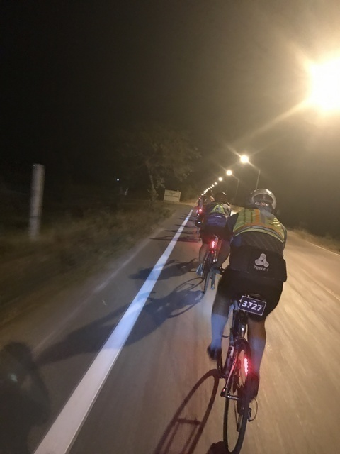
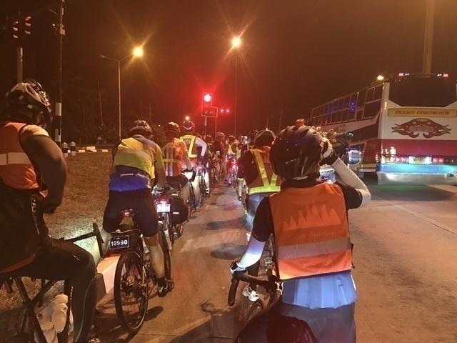
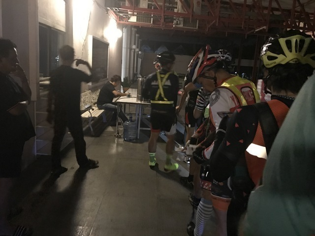
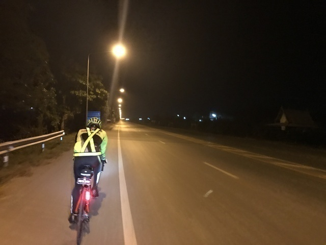
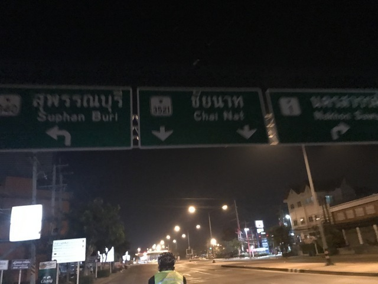
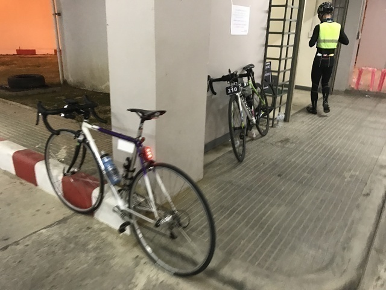
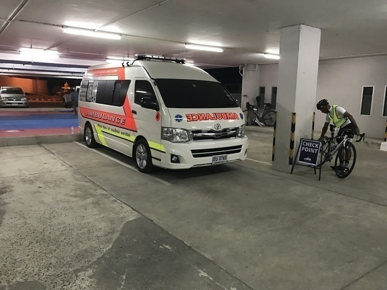
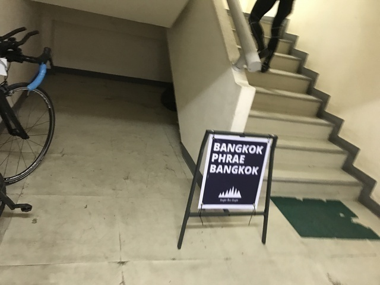
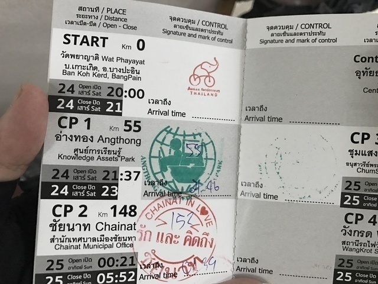
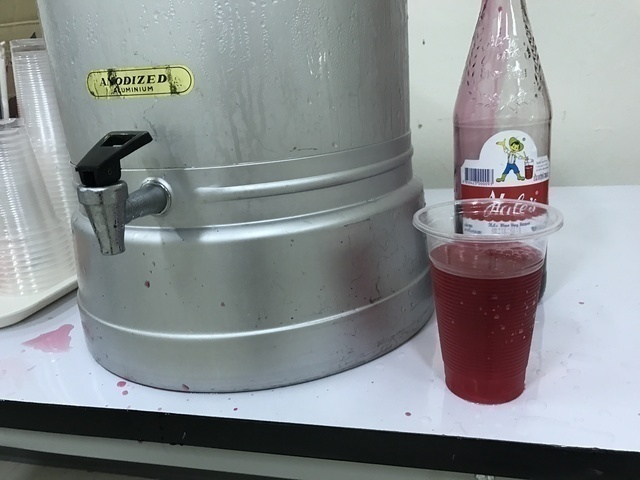

## スタート～CP1(Angthong:55km)

20:00ちょうどの合図とともに、一斉にWat Phayayatのお寺を出発しました。
お寺から一般道に出て集団のペースが22km/hくらいでした。
さすがにこれから1430kmも走るのでのんびり行くんだなぁ、とかもうちょっと速く走ってもいいのになぁ、とか思っていると、後ろから追い抜いていく集団がありました。
ちょっと遅いなぁと思っていたので、その集団に付いていくことにしました。
この集団がなかなか走りやすく、だいたい30～38km/hくらいのペースでぐいぐい進みます。

途中アユタヤの町をかすめるのですが、ぐいぐい走ってるのでさっぱりわかりませんでした。
ちょっともったいないですね。
帰りはゆっくり見て回れる余裕があるといいのですが。

CP1までの間で途中信号に引っかかったところが2, 3カ所しかありませんでした。
交通量の多い道路を避けて、本当にうまくルートを引いているのでしょう。

信号待ちをしていると、後ろの人に、ヘルメットの尾灯は点滅じゃなくて点灯にしてね、と注意されました。
ヘルメットの尾灯は義務ではないのか、付けている人も少ないのですが、付けるなら点滅はダメということでしょうか。
日本のブルベではヘルメットの尾灯は点滅可なのですが、たまにチカチカうるさく感じる時もあるので、ちょうどいいと思います。

↑の写真はスタートから27kmあたり50分ほど経過したあたりです。
前にいた集団に追いついて、結構な人数になってます。
このあたりでは、道路が広いので、2列でガンガン走ってました。
フランスのPBPそんな感じだったので、最初飛ばしすぎてバテた記憶が思い出されます。

この後、抜きつ抜かれつしながら集団はますます加速します。
スピードメーターを見ると44km/hとかいうような数字も見えるのでやばいです。
なんせ、40km/h以上のスピードは出さないと決めているので、最速のギヤで、前48T-後14Tです。
45km/hとか回そうとすると、ギヤが足りないので、心臓バクバクして疲れてしまいます。

そうこうしているうちに、1つめのCP1に到着しました。
さて、ちょっと休憩しようか、と思っていると、なにやら様子がおかしいです。
みなさん、自転車を置いてダッシュでスタンプを押してもらいに走ります。
これって、PBPとかでもトップを狙う集団の人たちがやっている行動そのものです。
時計を見ると21:44。
ここのCPのオープンが21:37で、前に到着した人も見かけなかったので、この集団がおそらくトップの集団でしょう。
55kmを1時間44分、平均時速32km/h近いです。
1400km走るペースとは思えません。
頭おかしいです。
どうやら、やばい集団の中で走ってきてしまったようです。
列に並んで記録は21:46でした。

ということで、せっかくのいい集団で残念ですが、ここでさよならさせていただきます。
水と氷の大量入ったでっかいクーラーボックスがあったので、ここで水を補給できます。
みなさん、急いで出発してしまったので、僕の方はのんびり持ってきたサンドイッチを食べてからゆっくり出発します。

## CP1(Angthong:55km)～CP2(Chainat:148km)

さて、次のCPまでは93kmです。
仮眠用のスペースがあるらしいので、少し寝ていってもいいかもしれません。
とりあえず、集団から外れたので、のんびりひとりでサイクリングします。
ひとりなので、ペースは一気に落ちて25,6km/hってところでしょうか。
しかし、信号のない平坦なので、平均時速がそのまま走行距離になる感じで、貯金がどんどん貯まります。

40km程走ってると、小腹も空いてきたので、補給できるところを探します。
少し入り込んだところでしたが、ちょうどいいところに、セブンイレブンがあったので寄りました。
軽食とコーラの2リットルペットボトルを買ってカフェインを補給します。
コーラをボトル2本に移して、残りを2リットルペットボトルのままラッパ飲みしていると、後から休憩に入ってきた人に、ワイルドやなぁ、みたいな感じで言われました。
タイは普通のペットボトルでもストローで飲むようなお行儀のいい文化なので、2リットルペットボトルのラッパ飲みはさぞかしお行儀悪くワイルドに映ったことでしょう。

さらに、同じような道をひたすに北上していると、少し大きな街に入りました。
この少し先を曲がったところがCP2です。

CP2に到着すると、すでに何台か自転車が止まっていました。
先に到着した人はここで仮眠している人もいるようでした。

外にもマットを敷き詰めて、仮眠所の準備をしている最中でした。
↓の青と赤の部分です。
ちなみに、募集要項には50人以上集まったら救急車を用意するよと書いてあったのですが、その救急車です。
この1台が各CPにいつもいました。
お世話にならない方がいいですが、救急車のなかなか来ないような山奥にも行くので安心ですね。

受付は2階にありました。

スタンプを押してもらおうとすると、GPSは? と聞かれました。
インチキしないようになのかどうかわかりませんが、GPSなど走行距離のわかる物を見せて、ブルベカードに記録してもらう仕組みのようでした。
下に取りに行こうとすると、ま、さっきの人のと同じでいいや、と適当に書いてくれました。
いい感じです。

スタンプは「รัก และ คิดถึง ชัยนาท」あなたを愛して恋してチャイナート、ですかね。
いい感じです。

さて、ここの時点で午前1:40。
とりあえず、トイレに行って、謎の赤いジュースを飲んで作戦を考えます。

ここで仮眠してもいいのですが、まだ全く眠くありません。
それに、寝る前にちゃんと食べておかないと、起きた後に走れなくなるというジンクスがあるので、食べ物のないここで寝るのはちょっとリスクがある気がします。

予定としては、しっかりした休憩は415km地点のピッサヌロークでと考えています。
ドロップバッグもそこに届きますし、寝る場所もあるそうです。
寝ずに進んで、そこでたっぷり寝る時間を確保した方がいいのか、先に少し寝て分散した方がいいのか。

うーん、これだから経験の少ない夜のスタートは困ります。
ま、とにかく、食べるの優先ということで、次のチェックポイントを目指すことにしました。
なぜなら、次のControlは179km。
わずか31km先で、そこには「Food」と書いてあるのです。
こりゃ、おいしいもの目指して、どんどん前に進むしかです。
