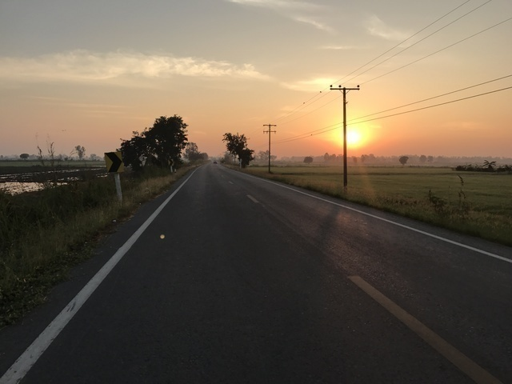

## CP2(Chainat:148km)～Control(Uthaithani:179km)

さて、日付は変わって2日目。
寝てないのでまだ1日目なのか。
とにかく、CP2のChainatを出発して30kmだけ先のUthaithaniを目指します。
着いたら何かしら食べ物があるはずなので、まずは腹ごしらえをしてから考えましょう。

片側3車線 + 広い路側帯の道路をしばらく走ります。
なかなか快適です。

さらに進んで片側1車線の道路を走っていると、対向車線にピカピカ光る警察のバイクがいました。
そのまま軽快に走っていると、後ろからそのバイクが近づいてきます。
どうぞお先に、と手で合図をしたのですが、先に行く様子がなく、ずっと後ろをついてきます。
真夜中に走る怪しい自転車を警戒しているのか、それとも暗い道を走る自転車を警備してくれてるのか、真意はわかりませんが緊張します。
写真撮ったりしたら怒られるのかな、とか考えながらおとなしく走ります。

大きな通りに出たところに救急車が止まっていて、警察のバイクはそこに合流したようでした。
事故か何かあったのかわかりませんが、とにかく逮捕されなくてよかったです。

そこからほんのしばらく進むと、今度は道路が通行止めになっていました。
右の方へ迂回しろということで、とりあえず、それっぽい方へ進むと、今度はバイクのおばちゃんがこっちに付いてこいという感じで先導してくれます。

少し進むと、ラウンドアバウトの横で道路にまではみ出してControlがありました。
地元の人がいろいろ世話をしてくれているようで感謝です。
これ、ちょうど夜中の3時ですよ。

こんな感じの食事を頂きました。
奥にも屋台のようなのがあって、食べるのに夢中で写真は取り忘れましたが、いろいろ頂きました。

いろいろ食べていると、Audax ThailandのWitさんが声をかけてくれました。
ここでちょっと寝てってもいいの? とたずねると、近くにホテルもあるから案内しようか、とのことでした。
いや、1時間くらい休むだけなのでいいですよ、ということで、ここで少しだけ仮眠することにしました。

おやすみなさい。

ということで、結局45分程寝て目が覚めたので、ボチボチ出発することにしました。
起きたら横に蚊取り線香が置かれていて、タイの人の優しさを感じます。
外なのですが、寝ている間も全く寒くなく、なかなか快適でした。
出発するころには、仮眠している人の人数も増えていました。

出発前にトイレの方に行くと、すでに市場の準備が始まっていました。
午前4時過ぎ、市場の朝は早いですね。

## Control(Uthaithani:179km)～CP3(ChumSaeng:269km)

次のCP、ChumSaengまでは90kmです。
1時間ほど走って小腹が空いてきたのでガソリンスタンドについてるコンビニでカオパップー(かにチャーハン)をいただきます。
夜にもこういうご飯ものが食べられるのは本当に助かりますね。
フランスだとこうはいきません。

トイレにはマリリンモンローもいました。

ここのガソリンスタンドには他にも今回のブルベとは関係ないサイクリストの人たちがいて、話しかけようとしたのですが、タイミングを逃してしまいました。
やはり、タイは暑いので朝早くから走るようですね。

朝7時くらいになると、ようやく太陽が昇ってきました。
なかなかいい感じです。

いい感じなのですが、この辺りでスピードやケイデンス、距離などを表示させているGarminの電池がなくなってしまいました。
USBの充電池があるので、つなげばいいだけなのですが、なんと、持ってくるUSBケーブルの種類を間違えてしまったようです。
さすがに、こんな田舎道ではUSBケーブルは手に入るはずもないので、あきらめるしかありません。
地図はGPSに、キューシートはKindleに入ってるので、道に迷うことはないのですし、最悪iPhoneもあるのでなんとでもなるのはなるのですが、普段、いろいろな数値データを元に精神的に安心しながら走ってるので、なけれはけないで落ち着きません。

地図表示に使っているGPSにもいくつか情報は表示できるので、いろいろ試したところ、スピードよりケイデンスを表示する方が向いていることがわかりました。
とにかく信号のない平坦で、風向きによって負荷か変わる程度なので、どうやらスピードを気にするより踏みやすいギヤで、脚の回転を一定にさせた方が楽なようです。

ここに来るまでも実はケイデンス80～84で走るのが一番気分がよく、その時のスピードは26km/hくらいでした。
時間はかなり余裕があるので、疲れず気持ちよく走れるのがベストだろう、ということで、ケイデンス80～84でひたすら走り続けるゲームがスタートしました。

謎のお寺やステキな田舎の風景を楽しんでいると、どんどん進みます。
途中すごく活気のある市場もあったりして、足を止めて写真を撮ったり見学したりすればよかったのですが、なんかどんどん進んでる時は逆に余裕がないのか、素通りしてしまいました。

そして、朝8時24分、出発から12時間24分で269km地点のチュムセーンに到着です。
普通の200kmのブルベを走るくらいの時間で寝る時間も入れて270kmなので、かなり速いですね。
信号がないとここまで違うのですね。

インディートンラップ(ようこそ)と書いてあって歓迎ムードです。

受付では、チュムセーンの観光案内地図となにやらお土産をもらいました。
いろいろと一生懸命街の話をしてくれたのですが、あまり覚えてません。
ごめんなさいね。

ハガキにも住所を書いてくれたら後で送るよ、ということなので書きました。
日本だけど大丈夫? と聞くと、ちゃんと送るよとのことでした。

軽いおやつも用意してくれていて、豆乳やバナナの皮で包んだお餅、飲み物などいただきました。

ハガキは後ほどチュムセーン市長からの年賀状として、無事日本まで届きました。
感激です。

受付の様子です。
今見るとCHUMSAENGのジャージの人ばかりなので、地元の自転車チームの人もお手伝いしてくれていたようですね。

受付の裏にありました。
偉い方でしょうか。

## CP3(ChumSaeng:269km)～CP4(WangKrot:336km)

しばらく休憩して9時過ぎに出発しました。
次のCPまでは67kmです。
線路を右側に見ながら北上するような形です。
途中めちゃめちゃ長い貨物列車がかっこよかったので、走りながら写真を撮ろうとしたら、暑くなってきたからか、汗で滑ってiPhoneを落として反省したので、この区間写真がありません・・・。

1時間半ほど走ると、またまた小腹が空いてきたので、ちゃんとご飯にします。
タイは道路脇に小さな食堂やガソリンやお菓子や飲み物を売る雑貨屋のようなお店がよくあります。
どれもとびらなどのない開けっぴろげなお店なので、入りやすくていいですね。

ご飯を食べて元気になって、また走り続けます。
そして、また、小腹が空いてペースが上がらなくなってきた頃、CP4へ到着しました。

336km地点、12:17到着です。
やっと、スタンプが1ページ埋まりました。

おなかが空いたので、近くの食堂でクィッティアォをいただきます。

そして、とりあえず、暑すぎるので、氷をいただきます。

うだうだしていると、Witさんがまた話しかけてきてくれました。
どうやら、今回タイに住む日本人の方がひとり参加しているそうです。
ちょうどこのCPにいるということでTさんを紹介していただきました。

少し話をして、疲れてきて遅いので迷惑かも知れませんが、しばらくご一緒することになりました。
Tさんもサポートカーを従えているということで、もしかして、USBケーブルが余っていないかたずねたところ、なんと、ちょうど合うものがあったのでお借りすることにしました。
このあと、本当に助かりました。
ありがとうございます。

## CP4(WangKrot:336km)～CP5(Pitsanulok:415km)

13時過ぎに出発しましたが、すでにめちゃめちゃ暑いです。
ひとりだと滅入るのですが、一緒に走る人がいるとだいぶ気持ちが違います。
しかも、日本だと車も多く法律的にも横に並んで走るわけにいかないのですが、ここでは横並びでおしゃべりしながら走っても大丈夫です。
24,5km/hのペースで楽しくおしゃべりしながらどんどん距離を伸ばします。

途中暑いので飲み物休憩です。
Mountain Dewをがぶがぶ飲んで水分と糖分を補給します。

なんだかこの時はMountain Dewがやたらとおいしかったので、おかわりしちゃいました。

田舎道を走り終えると、Pitsanulokの街に出ました。
Pitsanulokの街は今まで通ってきたどの街よりも巨大な街で、車が渋滞するのを始めて見ました。
結局、今回のルートすべての中で一番の大都会だったと思います。

大都会を抜けると、また、走りやすい道になりました。
なかなか都市との境が極端なようです。
そこから、15km程走って、16:54にCP5の学校に到着です。

今日はここで休むことにします。
まずは、食事です。
こういうご飯にぶっかけ系のは食べやすくてほんと助かります。
しかも、おいしい！
塩分が足りない時は、唐辛子の浮かんだナンプラーがあるので、これをかけます。
これが、また、おいしいのです！

その後、シャワー(というかタイ語のアップナーム)です。
巨大な桶に水道のホースが突っ込んであって、水が溜まっているので、小さい手桶ですくって水浴びします。
桶はお世辞にもきれいではないので潔癖症な人にはきついかも知れませんが、ま、学校なのでこんなもんなんでしょう。
冷たいけど、この時間だとまだ気持ちいいですね。

お風呂が終わったら、アームカバーと頭に巻くタオルをちょっと洗濯して、お休みです。
Tシャツと短パンに着替えて、耳栓、アイマスクのフルセットです。

なかなか快適な寝床です。
ここのcloseが23:40なので、40分貯金を持った状態で、23:00出発の予定ということで、18時頃から22時過ぎまで4時間ほど寝ることにしました。
時差ぼけなのでぐっすりとはいきませんが、疲れは取れました。
ちなみに、目覚ましは音を鳴らすと迷惑なのと、そもそも気づかないことも多いので、タニタのバイブレーションタイマーをパンツの中に忍ばせます。

起きた時にはかなりの人が寝ていました。
ここにはドロップバッグも届いているので、ジャージとレーパンを着替えました。
昼間はめちゃめちゃ暑かったので、背中もメッシュになっている真夏用のジャージを着込みます。
また、この季節は雨は降ることはないということなので、自転車に積んでいたレインコートはドロップバッグに移動しました。

Tさんはサポートカーでお休みなので、とりあえず、もう一度ご飯を食べて、待ち合わせして23:00ちょうどに出発です。

みなさん、ひと足お先に失礼しま～す。
