## CP5(Pitsanulok:415km)～Control(SiSatchanalai:519km)

4時間ほど寝て、ご飯を食べて、23時ちょうどにTさんと出発しました。
次のControlまでは104km。
夜の道をひたすら走り、2時間半ほど進んだところにセブンイレブンがあったので、また、ご飯です。

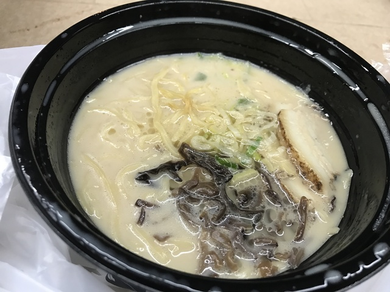

なんと、セブンイレブンには冷凍のとんこつラーメンがあったので、さっそくチャレンジしてみました。
レジの電子レンジで温めてもらっていただきます。
味は、とてもおいしかったです。
日本のセブンイレブンの冷蔵の温めるだけのラーメンよりずっとおいしかったです。
ただ、残念なことに、お箸が置いていなかったので、フランクフルト用かなにかの長いめの竹串を2本もらってそれでいただきました。

しばらく走っていると、やはり夜中の3時頃になると、どうしても眠くなってきます。
よほどゆっくり寝ていないと、どうしてもこの時間帯は眠いようですね。
次のポイントは幸いControlで時間制限のないポイントですし、眠い時には休むのが一番です。
眠るタイミングあたりのCPの次がControlになっているあたり、なかなか考えてくれています。

ということで、バス停のようなところがあったので、しばらくお休みです。

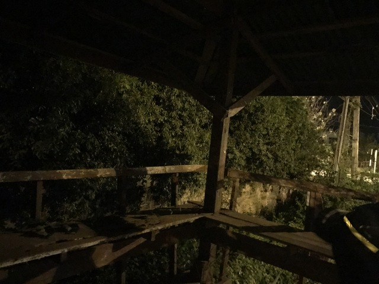

15分ほど仮眠して、出発です。
眠い時は少し横になるだけで楽になりますね。

この後も、時々眠くなって、仮眠しようとしたのですが、ことごとく犬がいて場所の確保ができませんでした。
タイの犬は昼間は寝ていて安全なのですが、夜の特に田舎の方の犬は危険です。
自転車を降りて、バス停に近づくと近くで犬が見張っている。
あきらめて、また、走り出す。
これの繰り返しでした。

ただ、この過程でわかったことが、どうやら、自転車から降りて押し歩くだけでも眠気は少しはなくなるらしい、ということ。
完全な検証は得られていませんが、眠くて危ないと思ったら、試してみる価値はあると思います。

しばらく走ると、謎のライトアップがありました。
結構夜にきれいにライトアップされているところを見かけるのですが、そういうものは基本的にはお寺です。

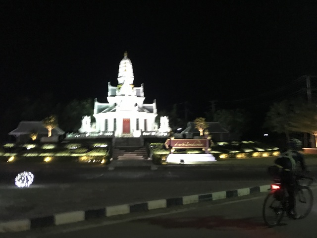

さらに走って、朝の5:30、次のControl、シーサッチャナーライに到着しました。

チェックポイントは、なんと、警察でした。

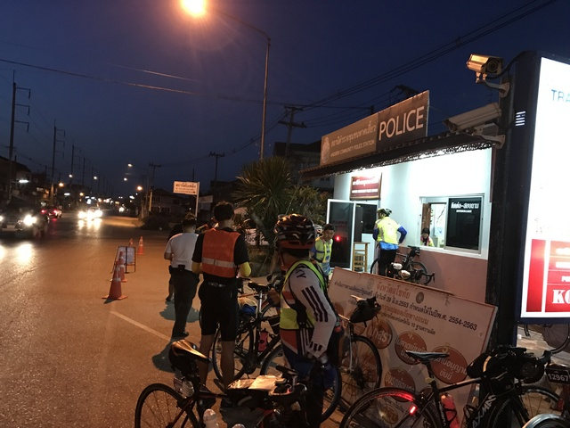

警察の中に入り、スタンプを押してもらいます。
ついでに、部屋の奥の方にあるトイレも借ります。
奥の部屋では、仮眠している人もいました。
どうやら、交番の中で寝てもいいようです。
犬のせいでゆっくりできなかったので、せっかくなので30分程休んでいくことにしました。
入り口近くの机の下にスペースがあいていたので、そこでお休みです。
Tさんも車で仮眠していくそうです。
シーサッチャナーライには遺跡の観光に来る日本人は山ほどいても、遺跡も見ずに交番の机の下で仮眠して素通りしていく日本人はなかなかいないかもしれません。

しばらくして目が覚めると、Tさんはまだお休み中のようだったので、先に行くとメッセージを残して出発準備です。
ちょうど出発する時に車から出てくるところにお会いしたので、少しあいさつをして、ひとりでお先にのんびり行くことにしました。

## Control(SiSatchanalai:519km)～CP6(WangChin:585km)

出発したのはちょうど6:30ごろ。
次のCPまでは65kmほどです。
11:00までに到着すればいいので、なんとでもなりそうです。
ここから先は、少しアップダウンが出てきますが、大きな上りもないので走りやすいです。
ただ、外は明るくなって、まだ涼しいこの時間帯は、犬の活動が活発になっているようで、非常に危険です。
道路の真ん中に陣取っているのもいますし、草むらにいても、自転車が近づくと、カサカサカサっとすごいスピードで追いかけてきます。
ちなみに、30km/h位だと追いつかれてしまいます。
35km/h位で振り切れる感じです。
陣取ってるエリアを過ぎると戻っていくのですが、とにかく、カサカサカサっという音がしたらすかさずスプリントです。
上りであろうが関係ないので、足に余力を残しておかないと、かなり危険です。
ピッサヌロークを過ぎたあたりから危ないとは聞いていたのですが、想像以上です。

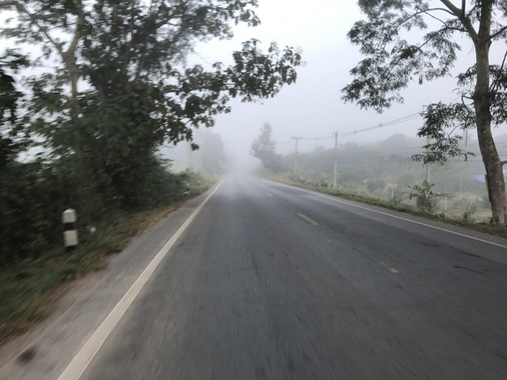

犬から逃げ回りながら走っていると、今度は、後ろからすごいスピードでTさんが追い越していきました。
ゆっくり休めたのか、めちゃめちゃ元気です。
少し後ろを着いていきましたが、さすがに千切れてしまいました。

しばらく行くと、Tさんがチェーンが落ちたとのことで止まっていました。
チェーンを直して、出発。
少し進んだところで、、Tさんの自転車からパンッという音。
なんと、チェーンが落ちたのではなく、チェーンが切れてしまっていました。

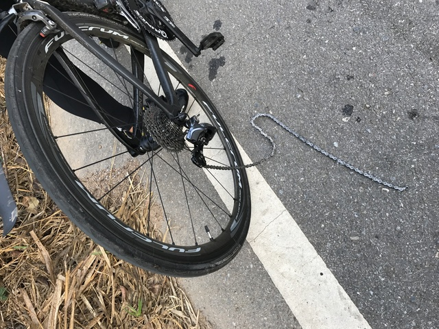

最近は、チェーンリングを曲げる人や、クランクを外す人の話も聞いたのですが、チェーン切れですか。。。
さすがに、修理することはできないようなので、Tさんは残念ながらDNFとなってしまいました。

のんびり走っているとおなかも空いてきました。
次のCPにはfoodとは書かれていないんですが、何か食べ物があるといいなぁ、と考えながら走っていると、後ろからいいペースのグループが来たのでついていきました。
しばらくついて行っていると、次のCPまで、あと3km位かな、というところで、道路の反対側にある学校に入っていきました。
あれれっと思ってよく見ると、Check Pointの看板がありました。
いやぁ～、危ない危ない。
うっかり見逃して行き過ぎてしまうところでした。
ということで、9:12、無事585km地点のWangChinに到着です。

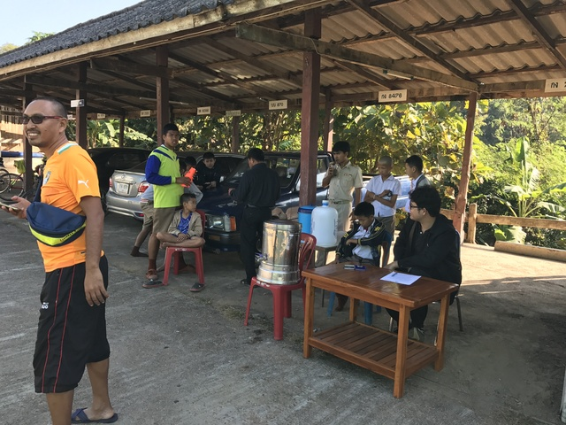

ここのCPはこぢんまりしていて、食べ物はバナナだけ用意してくれてありました。
バナナでも助かりますので、3本ほどおいしく頂きました。
ちなみに、タイのバナナは日本よりだいぶ小ぶりです。

あまり長居しても仕方なさそうなので、トイレによって出発です。

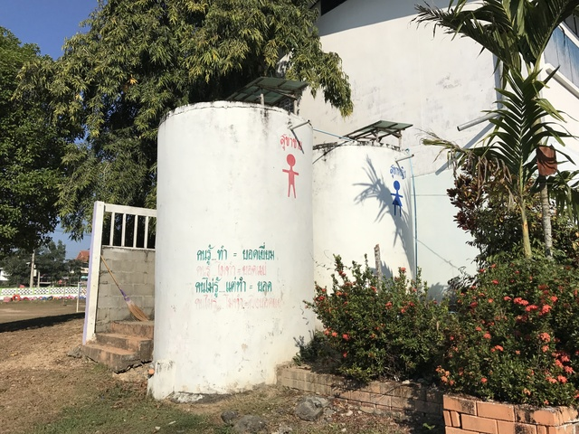

## CP6(WangChin:585km)～CP7(Phrae:663km)

2,3km進むと、食堂がありました。
こういう感じの田舎の山道では、次にいつ食堂が現れるかわからないので、すかさず寄ることにしました。
中に入ると、すでに、何人かお仲間が食事をしていました。

ご飯ものが食べたいので、カオパッムーをいただきます。
いやー、おいしいおいしい。

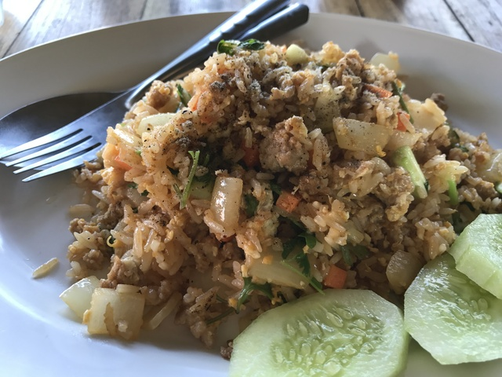

店を出て出発の準備をしていると、CPはどっちですか～っという感じで聞いてきたので、元来た方を指さして、ティーノーンと言っておきました。
うまく通じたようで戻っていきました。
よかったよかった。
やはり、ここのPCは距離がちょっとずれてるんでしょうかね。

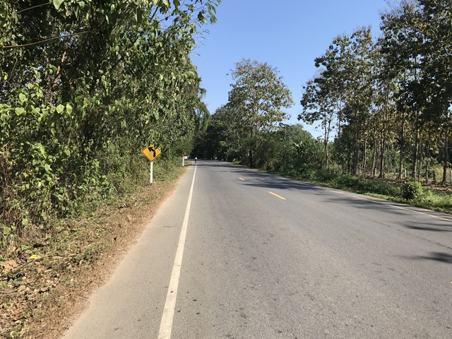

ちょっと進むと、何やらトラブっている人がいます。
手伝って欲しいとのことなので、お手伝いすることに。
どうやら、チェーンが落ちてはめられずに困っているようです。
普通だと、前のギヤにちょこっと引っかけて、ペダルを回せばすぐに解決するのですが、後ろのディレイラーが引っ張るようで、うまく前を引っかけられません。
どうなってるのかと、後ろを見てみると、たぶん44Tくらいのめちゃめちゃデカいスプロケットが付いています。
そのために、ディレイラーというかプーリーの部分が大きく上に跳ね上がってます。
プーリーをちょんと押して下に下げることで、うまくチェーンがかかりました。
あほみたいにデカいスプロケを付けるとこんな感じになるのですね～。
勉強になります。

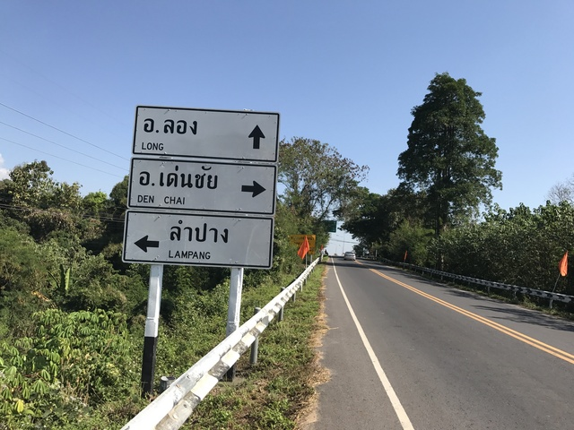

昼を過ぎて、どんどん暑くなってくるので、雑貨屋さんのようなお店で飲みものを飲みます。
買った飲み物を軒先で座って飲めるので、休憩にも最適です。
ついでに、空になったボトルに氷(ナームケン)を詰めてもらおうとお願いすると、おばちゃんは、「あー、ナームキン」と言いながら、奥に行って、冷たい水を汲んできてくれました。
ほぉほぉ。ナームキン、食べる水で飲み水の意味ですね、きっと。
氷はゲットしそこないましたが、新しい単語をゲットしました。
これは使えそうです。

こういうお店は、ガソリンスタンドも兼ねていることが多いですね。
なかなか日本では見かけることのない仕組みのガソリンスタンドです。

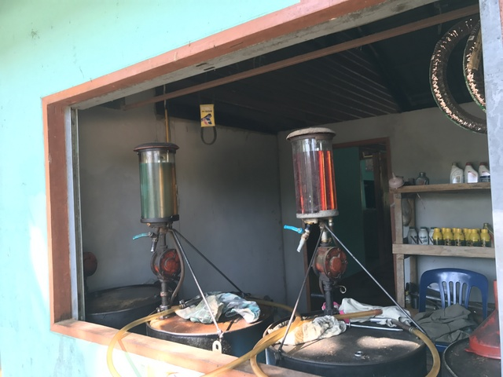

ひたすら続く道路。暑い暑い。

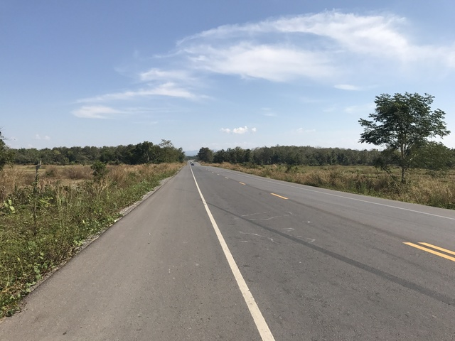

暑い時は、これを食べるのが大好きです。
シャーベットのような、氷をくだいたような飲み物です。
下にはタピオカが入っています。

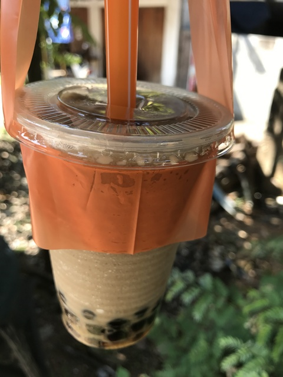

こんなに暑い時は休んでおいて涼しくなってから移動した方がいいような気もしますが、ま、一応進みます。

写真ではあまりわかりませんが、13%の上りがひたすら続く、というような鹿野山のような上りもありました。

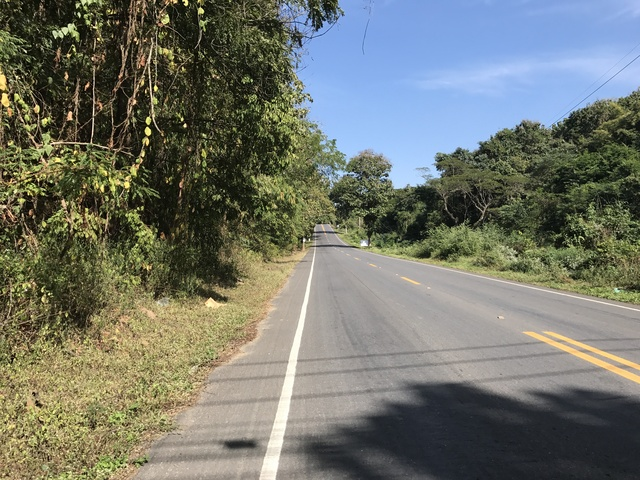

ちょっとした峠を越えるとプレーの街に出ました。
663km地点のCP7に14:25到着です。
今朝(?)、出発してから約13時間半で248kmです。
CPはGingerhouse Bread Galleryというお店で、入り口には名前とIDの寄せ書きがありました。
たくさん集まったあたりの写真をAudax Thailandさんから拝借です。

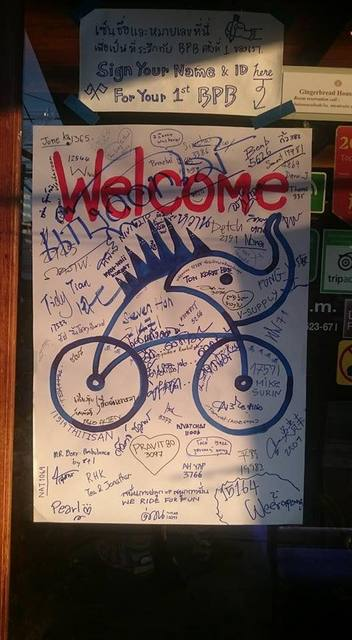

CPはおしゃれなカフェです。
スイカとお菓子を無料でいただきました。

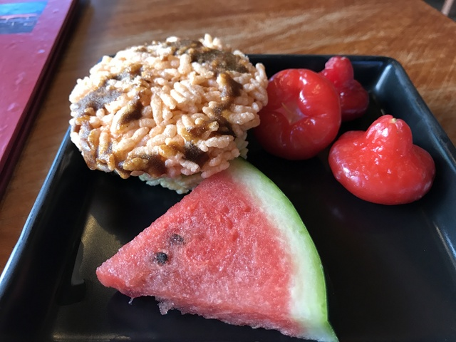

お腹が空いているので、さっそく注文するのですが、ちょっと失敗しました。
2品注文したのですが、まさか、どちらもご飯が付いてるとは思いませんでした。

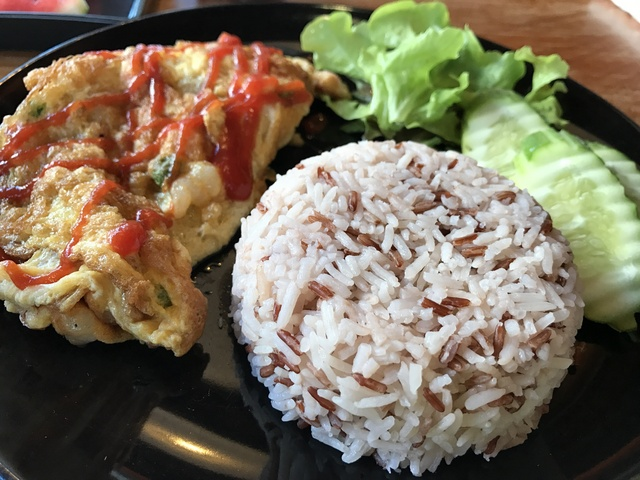

ちょっと食べ過ぎですね。
ご飯を食べながら、Witさんからルートの情報を仕入れます。
次のCPを出発して5,6kmのところに、コンビニとスーパーがあるそうで、そこを過ぎると200kmくらい何もお店がないそうです。

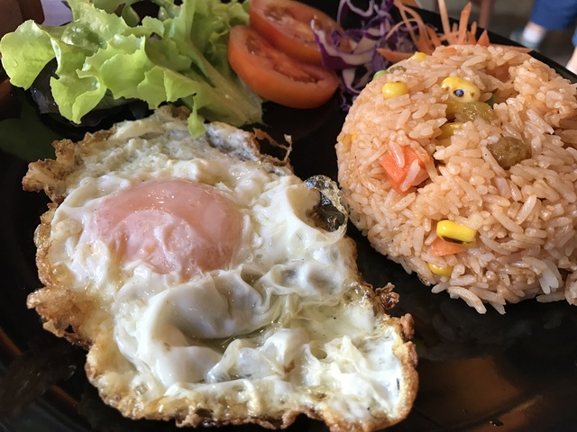

## CP7(Phrae:663km)～CP8(NamPat:786km)

1時間ほど休憩して、15:30頃、次のCP8を目指します。
次のCPまでは123km。
CP8にはドロップバッグも届いていますし、寝床もあるそうです。
何時に着くのかわかりませんが、CP8の次は山岳地帯なので、今夜はCP8でゆっくり休む予定です。

外に置いてあった自転車のガーミンの温度計を見ると、41.6度になってました。
あくまで、日差しを浴び続けていたガーミンの温度なので、気温はそうでもないのですが、しかし、まぁ、暑いですね。

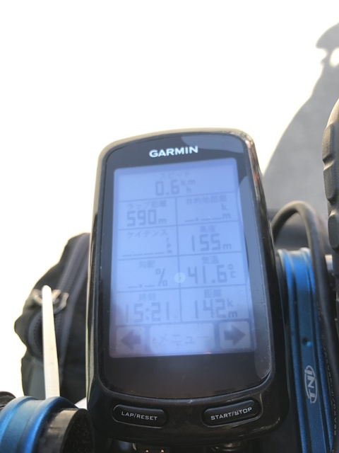

出発してしばらくはたくさん食べたので元気です。
ガンガン進みます。
が、1時間くらいで暑くなってきたので、ジュースを買って、背中のポケットに入れておきます。
ひやー、冷たいですね。

その後、交差点を曲がるとそこからは上りです。
すごく急というわけできないのですが、大きなバイパス道路のようなところをひたすら上ります。
ちょうど、河内長野の南花台に上るところの371号バイパスの風景にそっくりです。

途中、なぜか、今日は足がクルクル回らないなぁと思い、サドルの高さを調整してみました。
皮のサドルはお尻に優しくていいのですが、雨や湿気などですぐ伸びますし、長時間乗ってたりガタガタ道を走ると、ネジが緩んできてテンションが変わり、結果高さが変わります。
未だに、よくわかりません。

途中2, 3度調整すると、かなりスイスイ進むようになりました。
上りでスイスイ進むのは重要です。

15kmほど上ると頂上でした。
頂上は小さいサービスエリアのような感じで、コーヒーショップやお店がありました。
スタートから705kmくらいで、やっと半分を超えたところです。
時刻は17:45で、そろそろ店じまいしそうな雰囲気なのですが、まだ大丈夫そうです。
休憩がてらコーヒーを飲んでドーピングします。

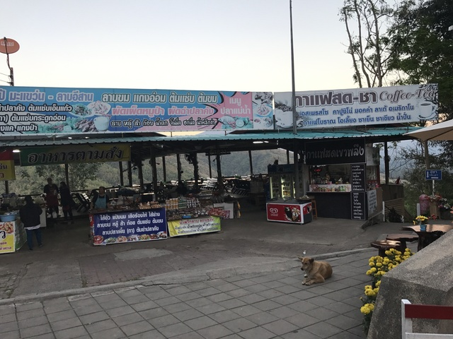

駐車場からの景色はこんな感じです。
峠っぽいですかね?
どうでしょう。

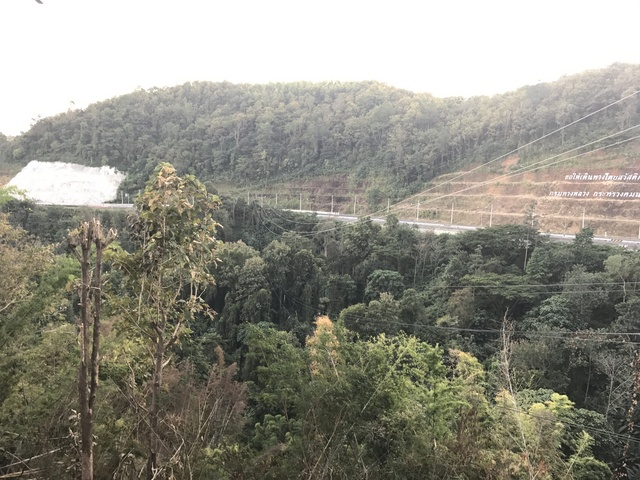

峠を越えてると下りです、大きな道なのでかなり快適です。
地元の原チャリも追い越しちゃいます。
下りが終わった頃にはちょうどドーピングしたコーヒーが効いてきて、めちゃめちゃ元気です。
追い風でもなかったような気がするのですが、30km/hちょいでスイスイ進みます。
よくわからないのですが、カフェインを摂取すると、ある程度の速度でいくらでも走り続けられる感じになります。
まさに、ドーピングですね。

CPの40kmほど手前で雑貨屋を見つけたので寄ります。
パンを買っておこうと思ったのですが、残念ながら売っていなかったので、飲み物とお菓子をいくつか買いました。
ソンクラーから来たという人たちが先に休憩していたので、少しおしゃべりして、一緒にCPを目指すことにしました。
リーダーっぽい人だけが前を牽いているようだったので、疲れたら時々僕も交代する感じに進んでいきました。

途中小さな峠を越えて、CPまではあと少しです。

と、思ったら、CPは少し標高の高いところでした。
最後は激坂を上り、21:28に無事PCに到着です。
日付の区切りがよくわかりませんが、1日目は415km、今日は371km。
あほみたいに、よく走ってますね。

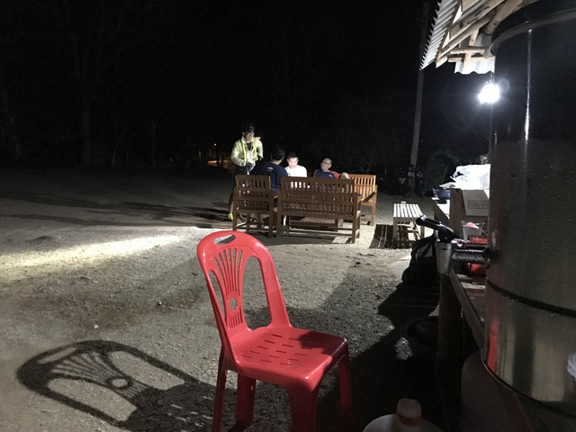

CPはPak Pat Forest Park(สวนป่าปากปาด)というキャンプ場のようなところで、テントがたくさん張られていました。
屋根(だけ?)のある建物にも布団が敷かれています。
ドロップバッグもここに到着しているようです。
テントで寝るか、ここで寝るか、選択肢があるようです。
ただ、標高はそうでもないですが、北部の山の中なので、少し寒いかも知れません。

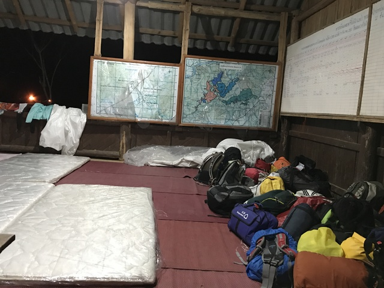

とにかく、よく考えると、お昼の3時頃食べ過ぎてから123kmを6時間、コーヒーのドーピングだけで走ってきたので、お腹が空きました。
まずは、腹ごしらえをします。

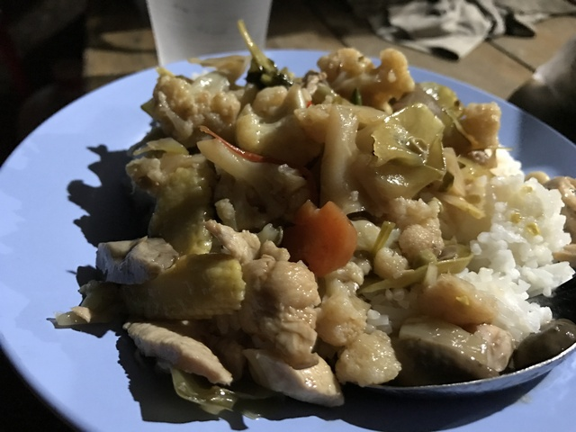

いやー、こういうの食べやすいし、おいしいし、タイは本当に素晴らしいです。

シャワー(アプナームです)の場所を聞くと、広場の反対側の建物の中にあるということなので、さっそく向かいます。
例によって、水道の水をためた巨大バケツから水をすくって体を洗います。
きれいになりましたが、ひやー、さすがに冷たいですね。

シャワーから出てくると、その建物の廊下に布団が並べられていました。
ここは壁もあるので、こちらの方が快適ですね。
テントにしようと思っていたので、引っ越しです。

時刻は22:30。
タイマーを5時間にセットして、それではおやすみなさい。Zzz...

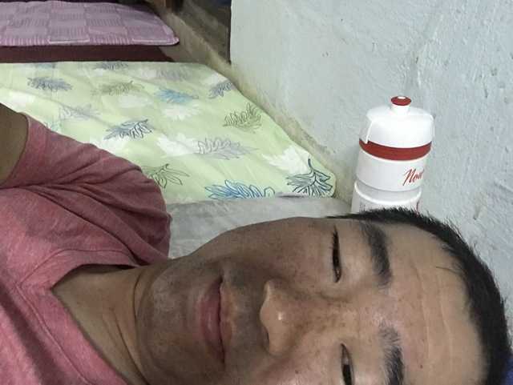

しかし・・・、しばらくして目が覚めます。
寒さで目が覚めてしまいました。
やはり、山奥。
半袖短パンの掛け布団なしでは寒かったようです。
タイは南国とはいえ、今は涼しい季節です。
しかも北の山奥です。
千葉の次くらいに侮ってはいけません。
ドロップバッグから、明日朝寒かった時のために念のためと持ってきていたメリノウールの長袖インナーを取り出して着込みます。
さらに、緊急用のエマージェンシーシート(スペースブランケット)を取り出して掛け布団代わりにします。
いや～、これで快適です。

それでは、ふたたび、おやすみなさい。Zzz...
