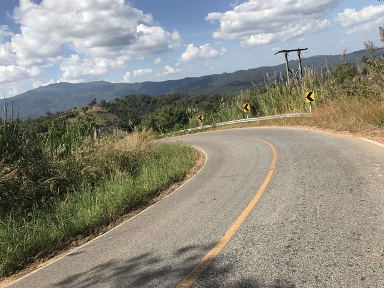
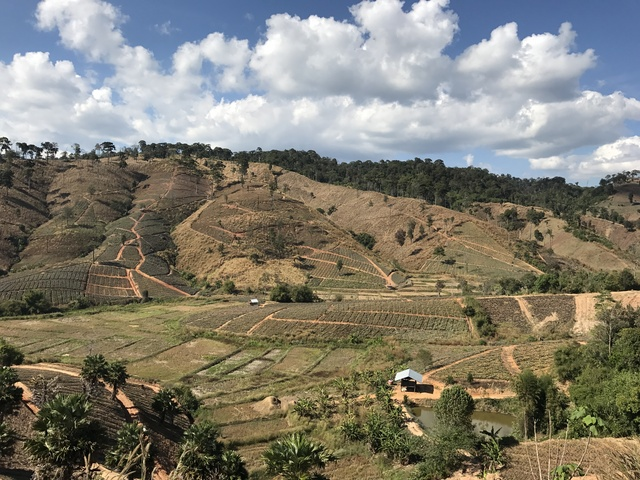

## CP8(NamPat:786km)～Control(Romklao:878km)

5時間ほど寝て、荷物を整理して出発準備をします。
ライトの電池を入れ替えて、充電用の電池も入れ替えます。
キューシートの表示に使っているKindleも予備のに入れ替えます。
結構寒かったので、防寒兼用で常備していたレインコートのズボンを履きます。
更に、ウィンドブレーカー的なものがあればよかったのですが、残念ながらピッサヌロークのドロップバッグに入れてきてしまったので、今頃はロムサックに向かって移動中でしょう。

今日はこの大会のメインディッシュとなります。
途中に峠が7つあります。
7つの山はこの大会のロゴマークにもなっています。
一番高い峠でも1134mなので、そんなに高い山を登るわけではないのですが、結構急な坂が多いと聞きました。

いろいろ準備して朝4:10頃出発しました。
ここのCPのclose時間が4:17なので、ほぼ貯金0の状態でのスタートです。
次のポイントは制限時間のないControlなので、その次のポイントまでに制限時間内に到達すれば、とにかくなんとかはなります。
次の次のポイントのCP9は1034km地点で、ここから248km先です。
600kmを越えてからは制限時間の計算が15km/hではなく、1000kmまでは11.428km/h、その後は9.6km/hになるので、そこに深夜の2:33までに到着すればいいということになります。
とにかく、最悪寝る時間が減りますが、22時間半ありますのでのんびり行きましょう。

さて、まずは、買い出しと朝食のためにコンビニを目指します。
何人か同じ頃出発した人たちがいたので、一緒について行きます。

コンビニに到着するとそこそこの人たちがいました。
昨日食べておいしかったとんこつラーメンを朝食に頂きます。

ここから110kmほど先のControlまで、補給は期待できないし、その先のお店はないと思われますので、パンやバナナなどの食料も買い込みます。
飲み物も、700mlのボトル2本に加えて、500mlペットボトルをサドルバッグに積みました。

30分程ゆっくりして5時過ぎに出発です。
他の人たちはまでしばらくいるようだったので、一人でのんびり出発しました。

こんな感じの真っ暗な夜道をひとりでさみしく上ります。
ま、他の人たちと走っても上りはペースがあわないので、どのみちひとりでさみしく上ります。

1時間ほど走って1つ目の峠到着です。
特に峠の名前の看板があるわけでもなく、ちょっと残念です。

ちょうど明るくなってきたので下ります。
このあたり、下りはそんなにはスピードは出せません。

なかなかいい景色です。

しばらく走ってると、何やらすごい看板が出てきました。
一番上は知らないですが、317kmでビエンチャン、389kmでルアンパバーンですよ。
どれもラオスの地名です。
ここは、タイ、外国の街までの距離が表示されています。

この大会のゴールまで、まだ600km。
その半分くらい走るだけでビエンチャンとかルアンパバーンに行けちゃいます。
なんか、ワクワクします。
パスポートも持ってきてますしね。
と、そんな気持ちを抑えてゴールを目指します。

時々木々の中にこんな看板も見かけます。
何の看板でしょう。

しばらく走ってると町がありました。
すべて山の中で全く町がないのかと思っていましたが、人の住んでいるところは通るようです。

段々畑もいい感じです。

しばらく走ってると、チェーンが落ちて、手がドロドロになるくらい苦労して困っている人がいたので、またお手伝いです。
日本だとこういうときは決まってパンク修理している人なのですが、なぜか今のところ見かけたトラブルはすべてチェーン絡みですね。
見てみると、フロントのディレイラーとチェーンリングの間にチェーンが引っかかってしまってチェーンが動かなくなってしまっているようでした。
フロントの変速を動かしてみると、簡単に外れました。
よかったよかった。
ウェットティッシュもたまたま持っていたので、少し差し上げて、お先に失礼します。

この木は何の木でしょう。ちょっと休憩です。

バスを待っている子供達もいます。

2つめの峠の途中、少しお腹が空いてきました。
時刻は9時半くらいです。
ちょうど屋根のある建物があったので、少し食事休憩です。
パンやバナナをおいしくいただきます。

山道になってから、ずっと携帯の電波が全く入らなかったのですが、ここは少し入るようだったので、googlemapを見てみると、まさに、ラオスとの国境にいるようです。
えらい遠くまで来たもんです。

3つ目の峠を越えてしばらく走っていると、だんだん気温も上がり、飲み物をすべて飲み干してしまいました。
と、ちょうどいいところに、Phu Soi Dao National Parkというのが出てきました。
入り口の小屋の方に昨日覚えた単語を駆使して聞いてみると、飲み水をいただけるということで助かります。
小屋の横にある冷蔵庫から水をいただきます。

水をもらっていると、何人かが道路の方を走って行くのが見えました。
走っているとみんな同じようなペースなのか、なかなか誰にも会わないのですが、止まっているとだいたい何人か通り過ぎていきます。
出発しようとすると、Audax Thailandのスタッフの車も入ってきました。

ところで、この水は最初はよかったのですが、途中から気持ち悪くなってしまいました。
あまりきれいな感じではなかったので、大量に飲むとダメなのでしょうね。

しばらく行くと、国境なのかチェックポイントがありました。
この後何カ所か同じような場所を見かけました。

何か立ってます。

この辺りの地名なのでしょうか。
英語にするとNew Love Thaiです。

チェックポイントです。
特にチェックはありません。

このあたりから4つ目の峠を上り始めます。
4つ目の峠の頂上に次のControlがあるはずです。

あまり写真ではわからないですが、日本の道路で7%か8%くらいの感覚で12%, 13%の坂が登場します。
このあたりはだいぶ疲れてきたので、押し歩きです。

こんな感じで

どんどん進みます。

たまに押し歩いてると、同じように押し歩いている人に追いついたりします。
タイ語で一生懸命話しかけてくれるのですが、ほとんど聞き取れません。
でも、「昨日は15分くらいしかちゃんと寝れなくて、さっき崖から落ちそうになったよ、うわー、危ない危ない」というようなことを言おうとしていることは伝わります。
気をつけてくださいね。

まだまだ上って、

12時57分、やっと878km地点のバーンロムクラオ学校に到着です。
9時間かけて112kmです。
200kmのブルベだと、完走は無理ですね。
前回このルートを含む600kmを開催したらしいのですが、完走率は低かったそうです。

学校の入り口に果物などを売っている屋台がありました。
受付は奥だそうです。

これで、ブルベカード2ページ目制覇です。

ここでは鶏の唐揚げと豆乳を頂いて、しばらく休憩です。

トイレにも寄っておきます。

出発しようとすると後から到着した人がスイカを買ってきていて、1切れ頂きました。
いやぁ、おいしいですね。

## Control(Romklao:878km)～CP9(Lomsak:1034km)

ちょうど1時間くらい休憩して出発です。
このあたりはなかなか景色もいいです。

少し下った後は、5つ目の峠です。これが、なかなかくせ者です。
かなりの急勾配がひたすら続きます。
あきらめて押していると、押し歩き疲れて休憩している人に出会ったりします。

自転車を押すのに疲れていたのか、坂に飽きていたのか、このあたり写真がありません。

5つ目の峠に到着すると、ちょっとした看板もあっていい感じでした。

ちょっとだけ登ると、標高1135mの360度パノラマビューがあるらしいので、行ってみます。

どうでしょうか。
パッと景色が開けるのは、この方面だけで360度見れるわけではありませんでした。

自転車のところに戻ろうと下っていると、下から何やら歌声が近づいてきます。
歌声が大きくなってくると、自転車を押して歌いながら、おっさん達が3, 4人やってきました。
歌でも歌いながらじゃないと、やってられませんわな。

しばらく下っいると、車から応援を受けました。
車に番号シールを貼っているので誰かのサポートカーですね。
この後、何回かすれ違って、写真を撮ってくれたりしました。
どっかのfacebookとかに載ってるんでしょうかね。

さらに下って行くと、やっと町が出てきました。
小さな雑貨屋があったので、飲み物を買って、持って来たパンを食べて休憩です。

このあたりから、小刻みなアップダウンがあるのですが、道がめちゃめちゃ悪いです。
ここに来るまでは、少なくとも北海道の道路よりは状態がいいと思っていたのですが、この辺りはフランスの石畳を出っ張らしたり、穴を開けたり、というような状態でした。
めんどくさいので、ダダダダダダっと突っ込んで走っていましたが、よくパンクしなかったものですね。

そんな道を過ぎると、また道路状況はよくなります。
今度は6つ目の峠です。
6つ目はわかりやすい峠があるわけではなく、何個か小さな峠がある感じです。

写真で見えるよりは、実際にはもっと急です。
のんびり写真を撮っているということは、だいたい押し歩いています。
上りが急な分、当然下りも急で、このあたりは、道路もよく、下り始めると、あっという間に50km/h位になります。
直線で、放っておくと70km/hを越えました。

6つ目の峠の最後の坂を登る頃にはすっかり暗くなってしまいました。
道路に大きな穴が空いていると嫌なので、前輪のハブに取り付けたライトを点灯します。
上りでゆっくりだってので、ちょっと横着して走りながらライトのスイッチを探ります。
いつもある場所にないので、あれっ、おかしいな、と思っていると、イテテテテッ、指を前輪に巻き込みました。
横着するとだめですね。

ちゃんと停止して確認してみると、ライトが下に向いていました。
そりゃ、いつもの場所にスイッチがないわけです。
と、いろいろ調整していると、車が1台止まって声をかけてくれました。
「ペンアライ? (どうしたの?)」
対向車線だったので、関係者ではないと思います。
タイの人は優しいですね。

峠を越えて少し下ると、最後の7つ目の峠まで、しばらくは平坦です。
そろそろいい時間になってきたので、食事にしたいのですが、お店も食堂も全然ありませんね。
町に出るまで頑張りましょう。

しばらく行くと、食堂のようなお店がありました。
逃すと、またしばらくないかも知れないので、寄ることにしました。

クイッティアオをいただきます。

自転車がよく通ってるけどどこ行くの、みたいに聞かれたので、ブルベカードを見せながら、いろいろ説明です。
彼氏が大阪のレストランで働いているとか、いろいろ話をしながらゆっくり休憩させてもらいました。

しばらく走ると、やっと街が出てきました。
セブンイレブンもありました。
ゆでたまごを買って食べたのですが、ちょっと変な匂いがして気持ち悪かったです。
腐ってたかも。
ハズレですね。

途中、先ほど声をかけてくれたサポートカーと同じ番号の人がいました。
少し話すると、あれはサポートじゃなくて観光に来てるだけだよ、はっはー、みたいに言ってました。

さて、次のCPまで65km程のところで左折すると、両側4, 5車線のとても広い道路なのですが、なにやら目の前の道路が壁のように見えます。
写真を取り損ねたので、参考画像を貼っておきます。

広いくせにかなりの急勾配で、横を自転車よりわずかに速いくらいの速度で大型トレーラーが走っています。
お互い10km/hは出ていないと思います。
対向車線にview pointがありましたが、この時は登るのに一生懸命で寄りませんでした。

約750mの峠を越えると、残り約60kmは下り基調です。
ずっと幅の広い大きな道路です。
下りでほぼこがずに、まっすぐ走って、カーブを曲がって、まっすぐ走って、カーブを曲がっての繰り返しです。
なんか、この感じどこかで走ったことのある雰囲気なのですが、あまり思い出せません。
北海道1200の時かなぁ、とも思うのですが、わかりません。

途中犬がいて非常に怖かったですが、なんとか、無事にCP9まで到着しました。
1034km地点。時刻は日付を回って0:13でした。

食事をもらおうとすると、ほとんど残っていませんでした。
ちょうど買い出しに行ってるということで、少し待っていろいろいただきました。

ここは、ドロップバッグもあるし、寝るところもあるので、今日はここで休みます。
他の人たちは、そのまま出発した人もいるようですが、次のCPまで行くのでしょうか。
街なので、近くの宿で泊まるのでしょうか。
宿泊場所はフィットネスクラブの床です。
布団もなく、ランニングマシーンに挟まれていますが、床はいい感じの絨毯なので寝心地はとてもよかったです。
掛け布団がちょっと欲しくなったので、またしても、エマージェンシーシートが大活躍です。
常夏のタイでエマージェンシーシートがこんなに大活躍するとは思っていませんでした。

ということで、またタイマーを5時間に合わせて、おやすみなさい。Zzzz
