## CP9(Lomsak:1034km)～Control(Phetchabun:1145km)

昨日と5時間ほど寝ました。
時刻は朝6時過ぎです。
ここの制限時刻は2:33なので、4時間ほどオーバーすることになるのですが、次の制限時刻のあるポイントは157km先で、18:54までに到着すれば大丈夫です。
途中は大きな峠もないので、普通に行けばなんとでもなるでしょう。

自転車のところに戻ると、スタート地点で出会った深センから来たTさんに再会です。

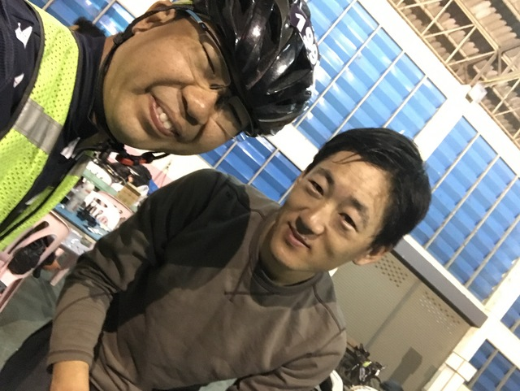

ついでに写真を撮ってもらいます。

今日のジャージは今回のBangkok-Phrae-Bangkokの公式ジャージです。
ちょこちょこちょこちょこ山のマークがいっぱい描かれています。

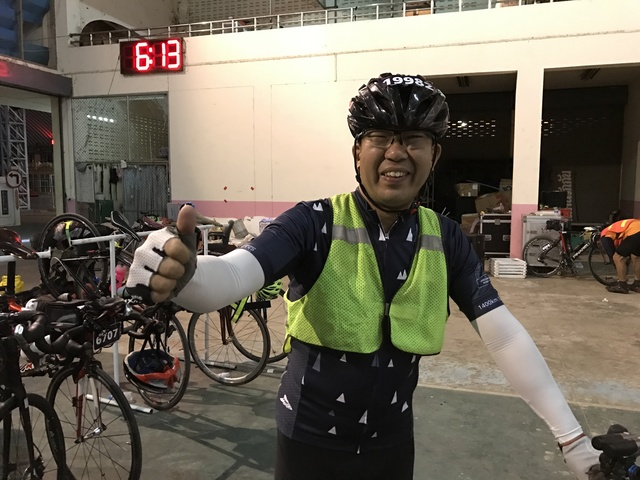

街を抜けてしばらく行くと、こんな感じの田舎道です。

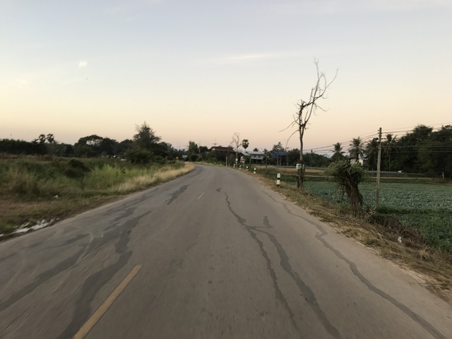

0kmポスト発見しました。

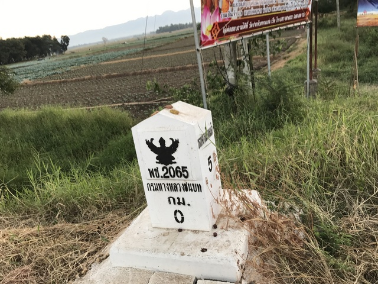

かなり広い道路ですが、車は少なくて走りやすいです。
ここを右折して行きます。
直進は青信号、右折は赤信号。
わかりやすいですね。
赤でも曲がって行くバイクは、ま、そんなものです。

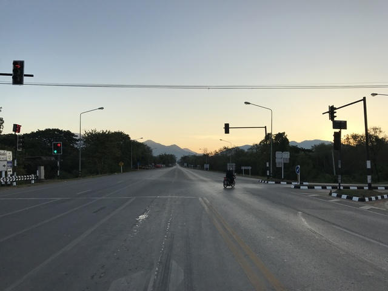

ここからは、広域農道で、ちょっとしたアップダウンが続きます。
ただ、広くて穏やかなので、嫌な感じの広域農道ではなく、走ってて気持ちのいい広域農道です。

ときどきお坊さんも歩いてたりします。

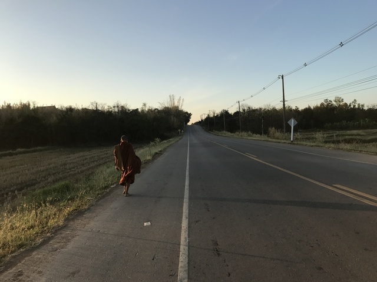

アップダウンがいい感じに見えるように、わざわざ対向車線にまで行って撮ってみました。

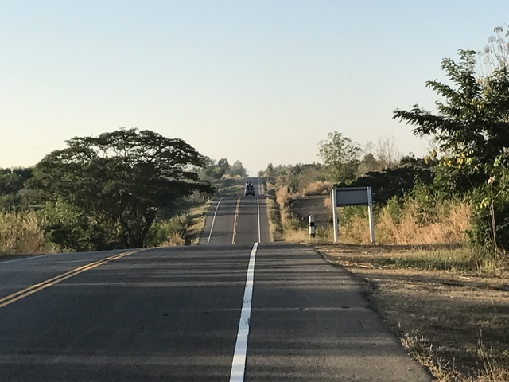

8時頃になって小腹が空いてきたので、朝ご飯にします。
朝8時でも小さな食堂が開いていて、こういったものも作ってもらえるので非常に助かります。
更に、今回寄った食堂のすべてがそうだったのですが、開けっぴろげで、入り口というようなものがありません。
外からよく見えるので、ちょっと立ち寄るのに非常に入りやすくて助かります。

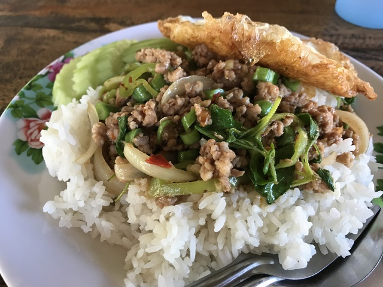

お腹も満たされて、また、同じような道を楽しく走ります。

アップダウンの道が終わって、のんびり走っていると、後ろから深センのTさんが追いついてきました。
僕が出発した時はまだパジャマ姿だったのに速いですね～。

しばらく後ろをついていったあと、そっとお見送りしました。

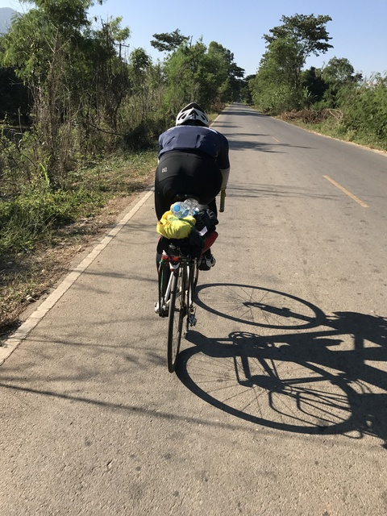

この後、大きな道に出て次のCPまで42km直進です。
途中雑貨屋で飲み物休憩などを挟みながら、のんびり進みます。
雑貨屋ではトイレを借りたのですが、お店のトイレというわけではなく、近所の共同の水場という感じのところで、お風呂とトイレと洗濯場が一緒になっているような小屋でした。
ちょうど洗濯をしている人がいて、場所を空けてくれました。

さて、CPのセブンイレブンに到着です。
1145km地点、時間はだいたい12:15頃。
30分ほど貯金のある計算になります。

日本ではほぼすべてのチェックポイントがコンビニのレシートを集める形式なのですが、今回のタイではすべて有人のチェックポイントで、今回が初めてのコンビニです。
レシートをもらって、その場にいた何人かの人たちと同じように、レジでホッチキスを借りてブルベカードに留めました。
コンビニのスタンプもあったので、押してもらいました。

次のCPが近いので、何か食べ物があるとふんで、ここではミロのアイスを食べました。

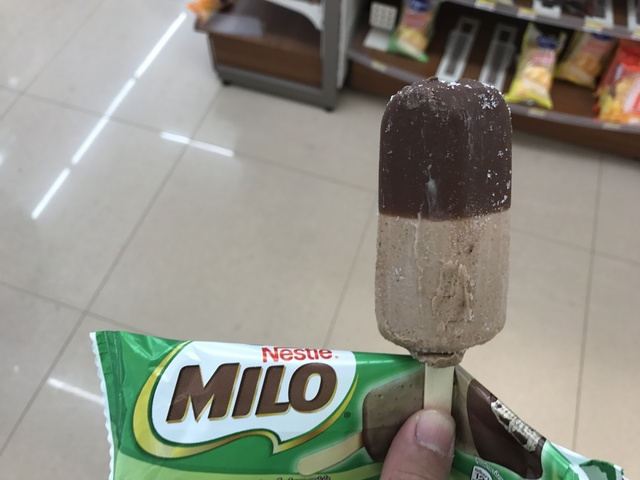

そして、豆乳をいただきます。
実は、ここに来るまでこの豆乳をあちこちでよく飲みました。
すこし甘めで味もかなりおいしいし、チョコレート味とかもあります。
さらに、なんと、8種類ものアミノ酸も配合されているので、きっと疲労回復にも効果抜群です。
実際、自転車に乗る人たちがよく買っていたので飲んでみたのですが、かなりいけます。
日本に戻ってからは、運動中に飲みたくなるような、おいしい豆乳がなくて残念です。

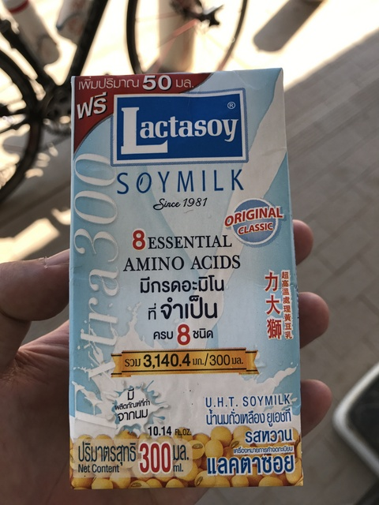

またまたWitさんがいたので撮ってもらいました。
素晴らしい大会を開いていただいて感謝です。

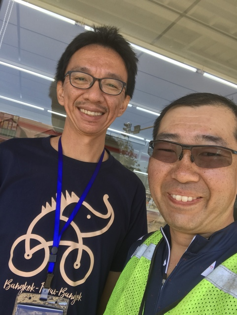

## Control(Phetchabun:1145km)～CP10(Wichian Buri:1191km)

さて、次のCPまでは36kmです。
すぐですね。

同じようなまっすぐな道路をひたすら走ってるうちに、少し商店の建ち並ぶ街に入りました。
右折して少し進むと、Wichian Buriの市役所(?)に到着です。

1191km地点で、時刻は14:28です。
貯金も4時間半ほどになっており、いい感じです。
受付でブルベカードとさっきのコンビニのレシートも渡します。
コンビニのところは、コンビニスタンプはやっぱり無効なようで、上からスタンプを押していました。

受付後ろにかっこいい看板があったので、一緒に写真を撮ってもらいました。

Wichian Buriへようこそ。
下の長いのはわかりません。
(1,400 LRM バンコク - プレー - バンコク)

という感じです。
Lが小文字になってるのかIに間違えているのか、なかなかいい感じです。

おいしいものがあるかと期待したのですが、カップ麺やお菓子でした。
それでも助かりますので、いただきました。

お昼過ぎで、かなり暑かったので、ここはのんびり目に休憩します。
時間に余裕が出てきたので、暑い時間の走行を減らすのでベターです。

## CP10(Wichian Buri:1191km)～CP11(LopBuri:1333km)

1時間ほど休憩して、この町でなにか食べて行くことにします。

さっそく見つけたお店で、とりあえず、カオムーデーンいただきます。

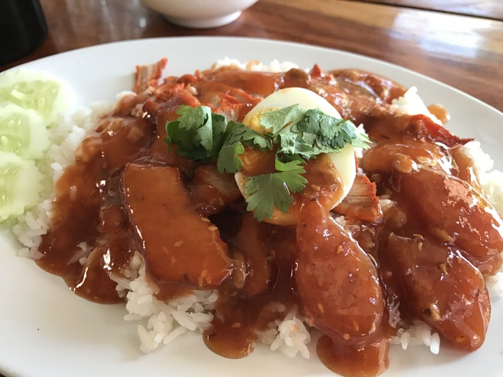

腹ごしらえもしたところで、ぼちぼち進みます。

途中なんか有名そうなお寺の看板があったのですが、これですかね。
違う気がしますが。

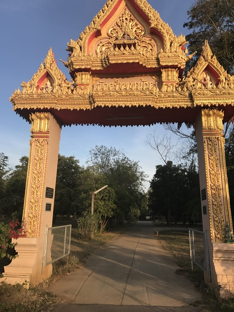

このあたりから、アップダウンのない広域農道というようなところを走ります。
三輪車のトラックのようものと何度かすれ違ったのですか、ハンドルかやたら長くてかっこいいです。

途中、サポートカーともすれ違いました。
このくらいの距離になると、さすがにわりとバラバラで、なかなか前後の人とすれ違いませんでした。
サポートカーでも関係者とすれ違うと元気になりますね。

そのうち、道路はかなり大きな幹線道路になりました。
中央分離帯のあるようなかなり広い道路で、自転車やバイクは路側帯を走りましょうと書いてあるような道路です。
なんだか、都会にやって来た気分ですが、まだまだ田舎の地方です。
そして、この道路、なぜか下ってるように見えて、実は上っているという感じにだましにかかってきます。

さらに、なんと、ときどきですが、犬が襲ってくるのです。
車は少ないとはいえ、結構なスピードで飛ばしているので、逃げ場に困ります。
一度、無意識によけたら、後ろの方で車がキュルキュルキュルーっと急ブレーキをかけて止まりました。
いやはや、危なかったようです。
失礼しました。。。
しかし、まぁ、犬に殺されるか、車に殺されるか命がけです。

ガソリンスタンドに付属のコンビニでパンを食べたりしながら、進んでいると、背中の携帯からやたらゆれくるコールが鳴っていたので、ちょうどあったドライブインのようなところに立ち寄りました。
大阪の友達から茨城で地震だったと聞きました。
家の中、ひっくり返ってないですかね。

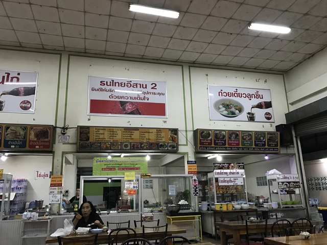

ちょっとちゃっちいけど、おいしくいただきました。

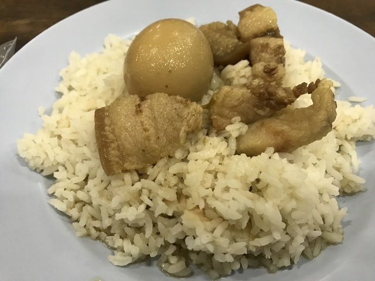

足がモゾモゾするのでびっくりしたらネコでした。

次のCPが近づいてくると、セブンイレブンがあったので、夜食を買い出しします。

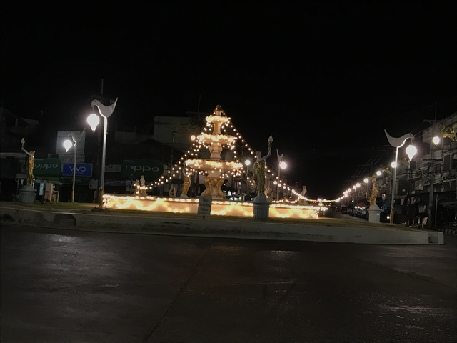

さて、CPに近づいてきましたが、入り口がよくわかりません。
タイの空軍か陸軍の施設なのですが、巨大すぎます。
ゆっくり探しながら走ってると、点滅の尾灯を道路脇に置いて、わかるようにしてくれてありました。
写真は朝撮ったものでわかりやすいですが、夜は真っ暗です。

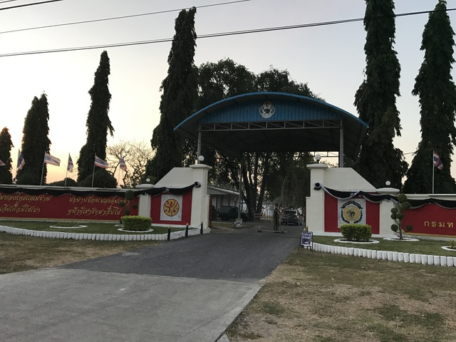

門は閉まっていて、近づくと開けてくれました。
外国の軍事施設に入れる機会はあまりない気がするので貴重です。

あっちですよ、教えてもらったのはいいのですが、施設の中も、また、ひたすら走ります。
至る所で、建物の2階から兵隊さんが監視しているので緊張します。
間違って入ってはいけないところに入ったりすると怒られそうです。

かなり進んで、無事、それっぽい建物に到着しました。
最後のCPです。
時刻は23:54。1333km地点です。

こちらも朝の写真ですが、建物は空軍内のメディカルセンターというところでしょうか。

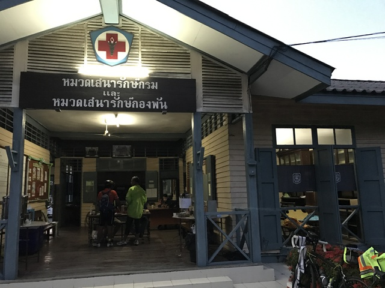

受付を済ませようと、ブルベカードを差し出すと、おっと！事件発生です。
ブルベカードが自分のじゃないでしょ、と。
見てみると、確かに自分のではありません。
どうやら、昨晩のCP9のところで入れ替わったようです。
ということで、無事、先に到着していた自分のブルベカードに交換です。
間違った方の人はコンビニスタンプはもらっていなかったようで、残念ながらコンビニスタンプはなくなってしまいました。

さて、ゴールまではあと97kmです。
このまま走り続けてもいいのですが、早く着きすぎると宿がありません。
それに、アユタヤあたりを夜通過するのももったいない気がしますし、外国の軍事施設で宿泊できるとかそうそう経験できません。
ということで、ここで明るくなるまで休んでいくことに決定です。

寝床はこんな感じの簡易ベッドです。
なかなか快適そうです。
ということで、おやすみなさい。Zzz

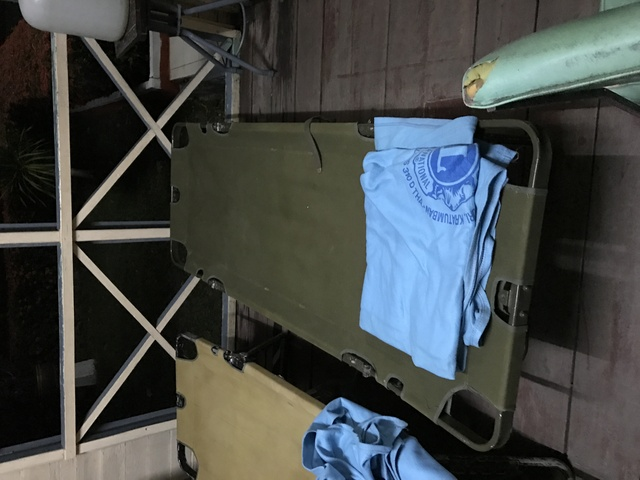

そして、しばらくして、なんと、体がブルブルと震えて目が覚めました。
実は、奥の窓のように見えているところにはガラスも何もありません。吹きさらしです。
そして、このハンモックのようなベッド、下が、すうすうするのです。
暑い昼間なら、さぞかし快適でしょう。
しかし、そんなに北でもないくせに、ロッブリーの夜は冷え込みます。

またしても、今回3度目のエマージェンシーシートの登場です。
まさか、こんなに大活躍するとは思ってもいませんでした。

ちなみに手前の銀色のみの虫です。

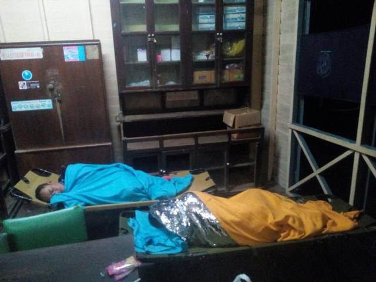

これで、快適ですね。
おやすみなさい。
