## CP11(LopBuri:1333km)～Finish(Ayutthaya:1430km)

時間半ほど寝て、時刻は朝6時過ぎ。
昨日と同じです。
規則正しい健康的な生活ですね。

残りの距離は97km。
制限時刻は16:40です。
10時間くらいあるので、本当に時速10kmで走っても間に合います。

建物の前には昨日は全く気付かなかったCheck Pointの立て看板がありました。

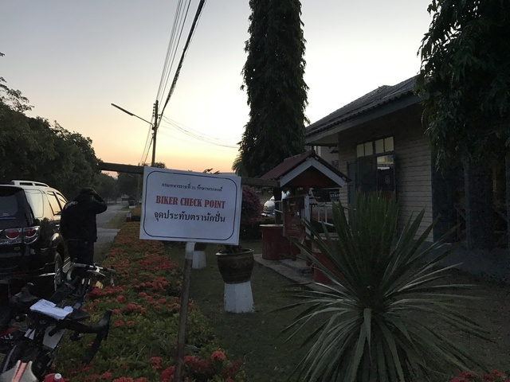

出発して、基地内を走っていると、昨日と同じく見張りの人がたくさんいるので、軽く会釈して通り過ぎます。
ご苦労様です。

基地を出ると、ロッブリーま街です。
田舎町なのですが、今までと比べると建物がたくさんあるので、都会だと勘違いしてしまいます。

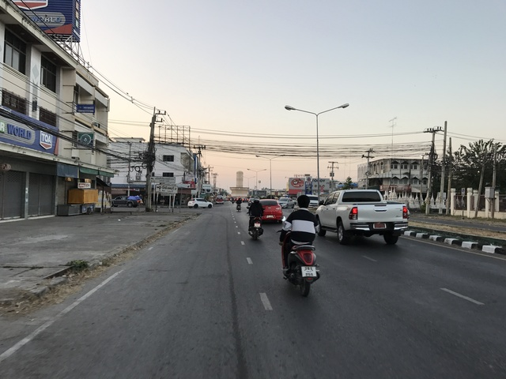

街の中心のロータリーです。
前に観光で来た時に、バスがこの辺に止まったような気がします。
懐かしいですね。

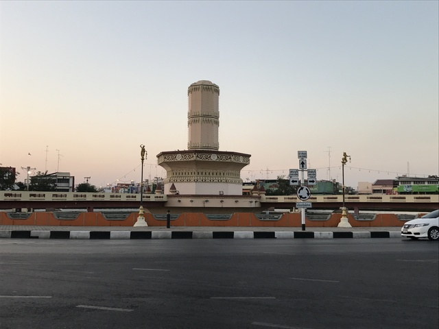

どこかで朝ご飯にしてもいいのですが、昨日買ったパンが余っているので、食べながら走ります。

途中花を売っている人がいたので、1束買いました。
華やかになって、なかなかいい感じです。
本当はもう少し長かったのですが、ちょっと前輪に巻き込んでしまいました。
タイではよく道路の真ん中を花売りの人が歩いています。
みなさん車のルームミラーにぶら下げてますね。

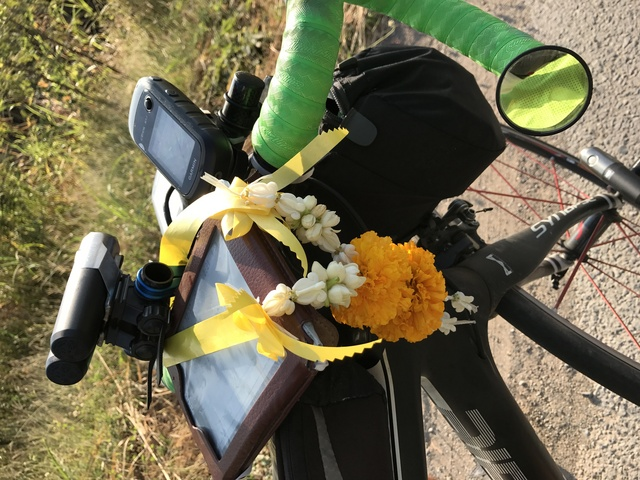

変わったお寺も出てきて、アユタヤに近づいてきた感じがします。

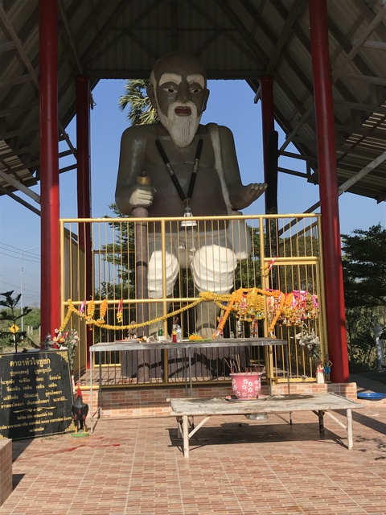

今度は牛が歩いていました。
後ろの象は偽物です。

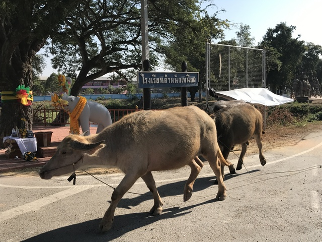

牛や象の次はニワトリです。Wat Sam Wihanだそうです。

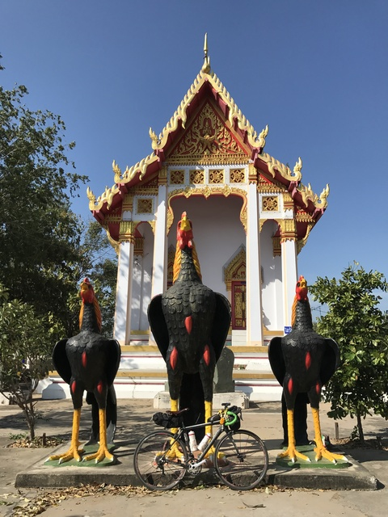

大きなチェディもあります。

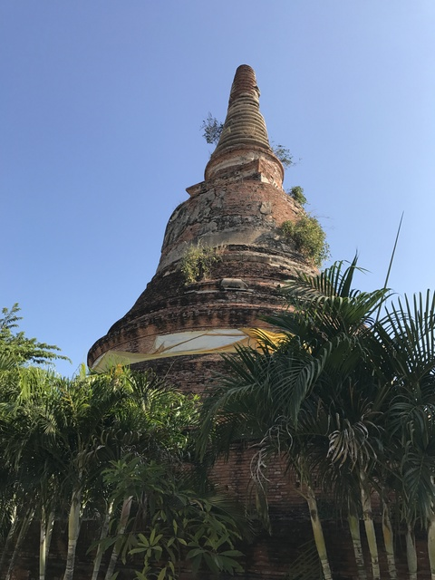

次は、Wat Suwannawas

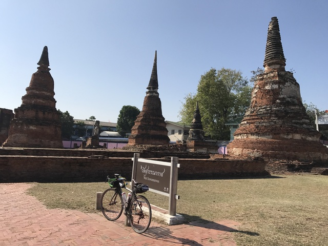

川沿いも通ります。

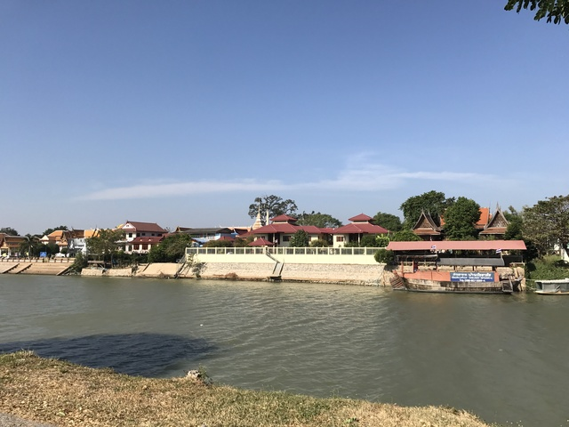

Wat Chai Wattanaramです。

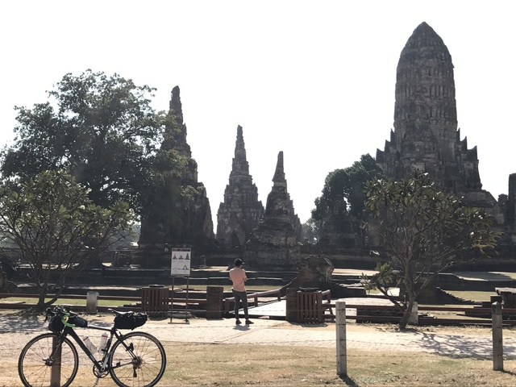

さて、アユタヤ観光も終わりです。
時刻は10時過ぎ。
残りの距離は、あと15km。
今日は29日で出発は24日の午後8時です。
つまり、ちょうどスタートから110時間すぎということになります。
残りは15km。
1時間あれば到着できるでしょう。
ということは、狙えますよ、111時間11分！

ここからは、少し追い風で、すごく走りやすかったです。
しかし、速く走りすぎてもいけません。
めちゃめちゃゆっくり走ってると、後ろから追い越しながら、あと少し頑張って～！と声をかけてくれました。

そうこうしているうちに、ゴールのWatpPhayayatが見えてきました。
時刻は11:08。
いい感じです。
といろいろ考えていると、おっと、入り口を通り過ぎてしまいました。

慌てて戻って中に入ります。
今から110時間前に出発して、ついに戻って来ました。
懐かしい景色です。
感慨深いです。

そして、ついにゴール受付。
GPSでは1437km走って11:11の到着でした。
トータル111時間11分。
30番目くらいの到着だったそうです。
お疲れ様でした！

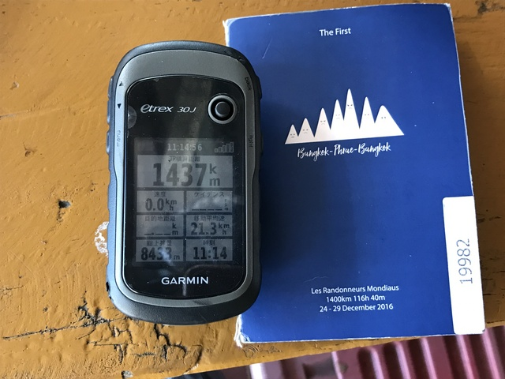

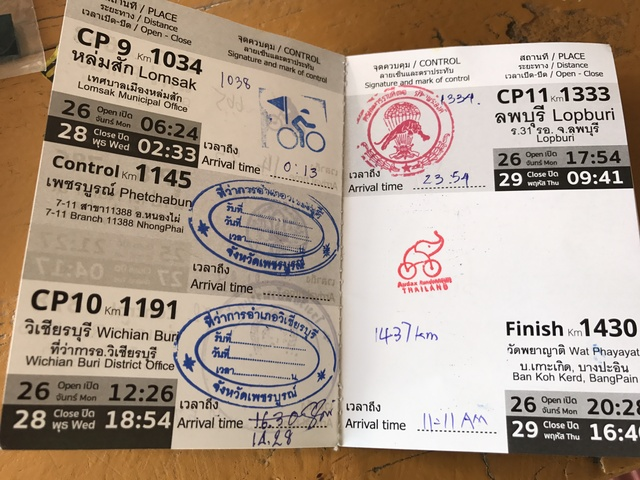

記念撮影です。

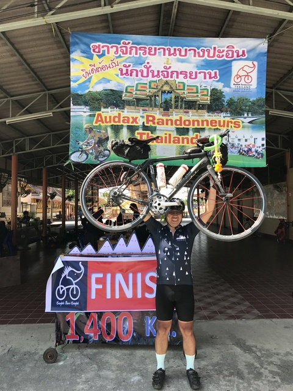

実はこのFINISHの看板、1400KGって書いてあるんです。
いい感じです。

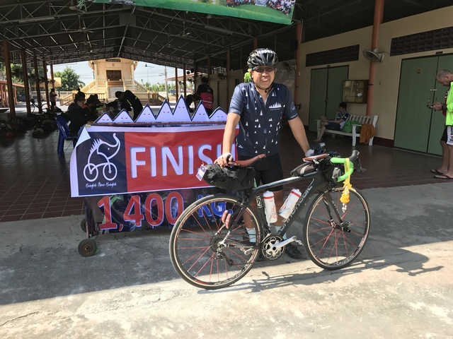

さて、お腹も空いたので、食事をいただきます。
写真手前はだしがらですよ。

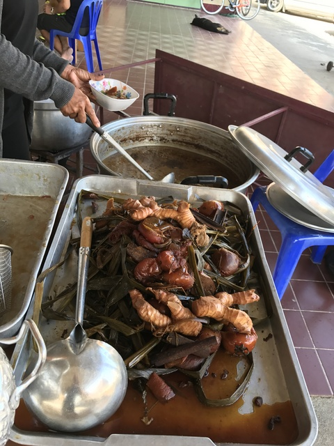

とてもおいしかったです。
この後、お代わりもいただきました。

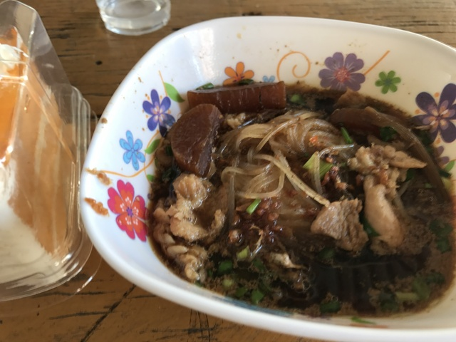

Cycling Club DNF。ステキなチーム名なので撮らせてもらいました。
ここにいるということは、チーム名に反して完走されたのですね。

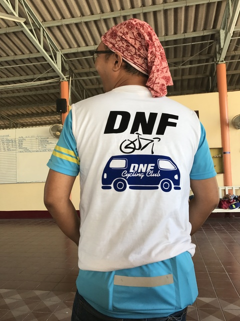

ゴール地点はこんな感じです。

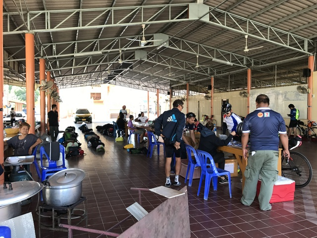

スタッフの方もお疲れ様でした。

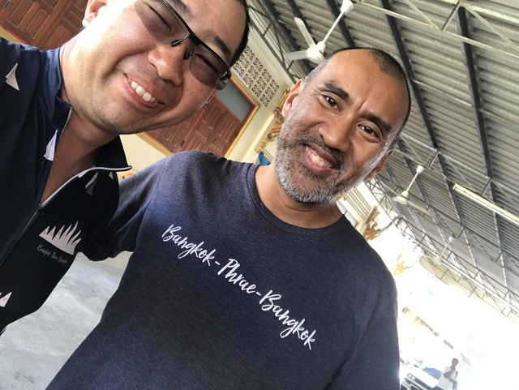

その後、10km程走って、宿にチェックイン。
少し昼寝です。

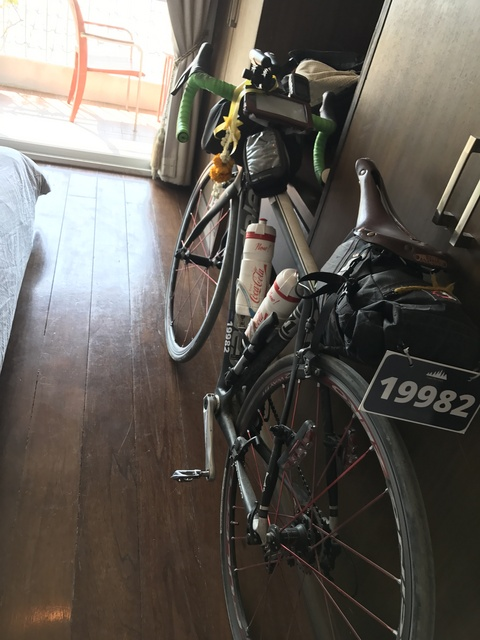

夜はナマズのスープとかいろいろ食べてひとりでお祝いです。
ごちそうさまでした。

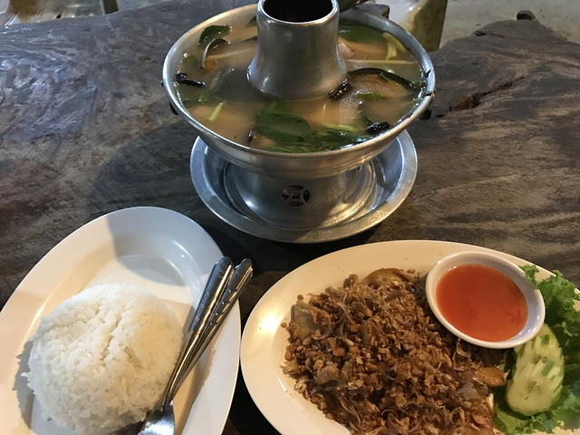
