## スタート地点まで

スタート地点までは同宿の坂東さんと電車で30分と自走で向かいました。

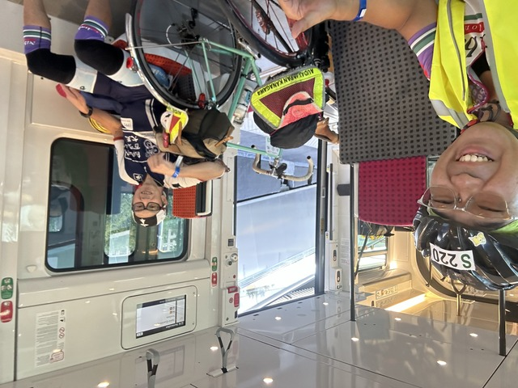

僕はSで20:30のスタート、坂東さんはRで20:15のスタートです。
ちょうどRの列が出来ていたので坂東さんは先に行きました。

## スタート地点

スタート地点では4つくらいの列があり、車検に出発したら新しいグループの列が出来る仕組みです。

列が出来ても1時間くらいはまで時間があるので、みなさんのんびりとすごしています。

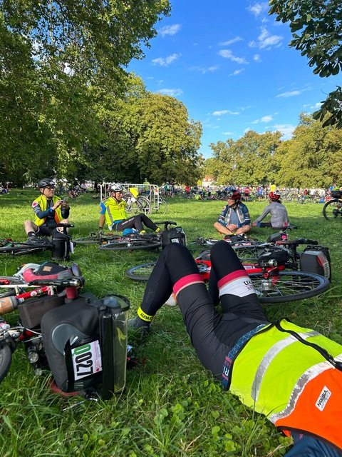

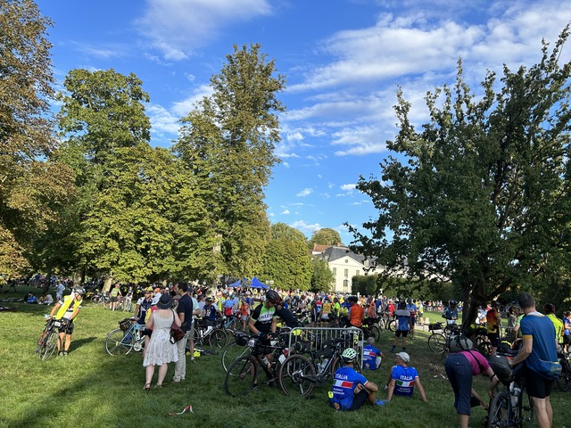

トイレに行ったら熊坂さんに会いました。
2018年の北海道2400kmで熊に遭遇して以来の再会です。

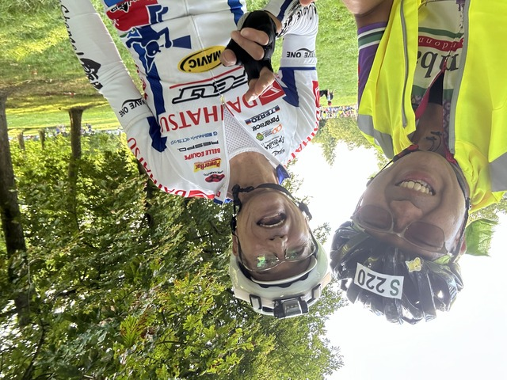

かっこいい自転車です。

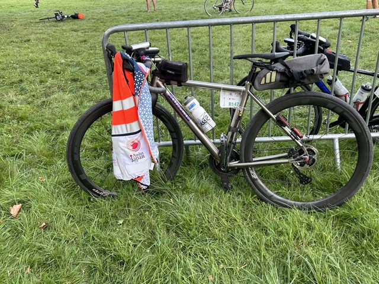

列から動いた後は車検をして、スタート地点へじわじわと進みます。
ちょうどPのグループがスタート地点へと移動していました。

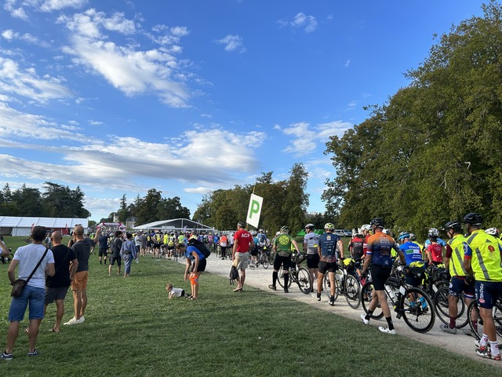

Pのグループはこのあと10分程で出発です。

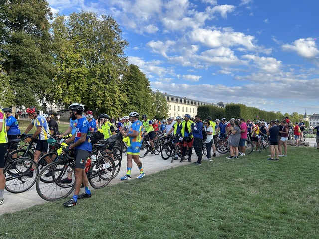

Rの列が動き始めました。

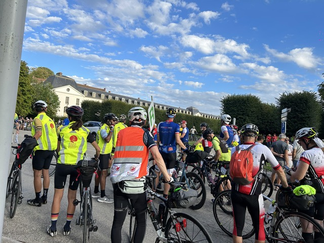

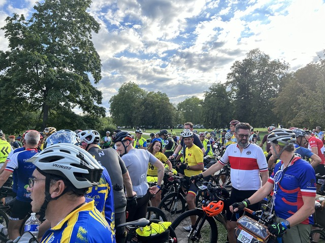

といってもまだまだ暇なので、近くにいた日本人の方達とお話ししました。

最終グループはUの21:00なので最後から3番目のグループなのですが、このあたりにはあまりアジア勢がいないように思います。

さて、列が動き始めました。

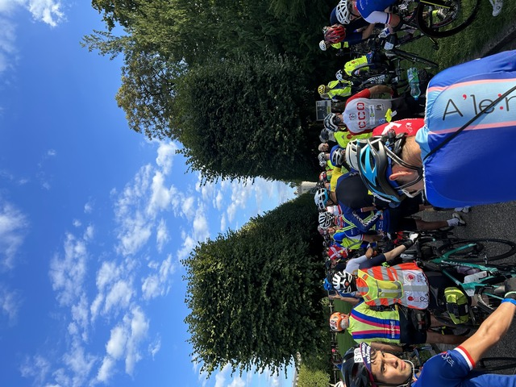

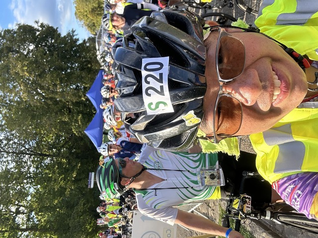

ここから車検に向かいます。
といっても、前回のような徹底的なものではなく、ライトやベストを持っているか程度の適当なものでした。

スタート地点まで移動して、スタートまで待機します。

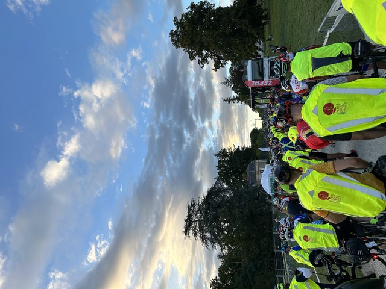

## スタート Rambouillet ～ Mortagne-au-Perche: 120km

カウントダウンと共に一斉に、というほどではなく、列の後ろの方だからかのんびりとスタートします。

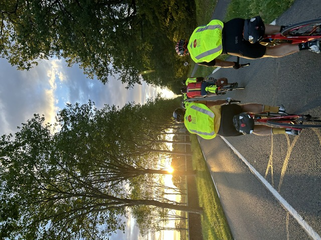

最初は先導車がいるので2列がおとなしく着いていく感じです。

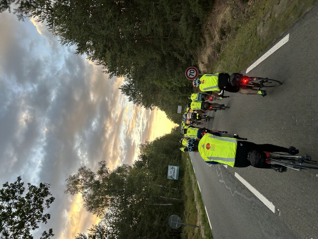

前にも後ろにもたくさん人がいる状態です。

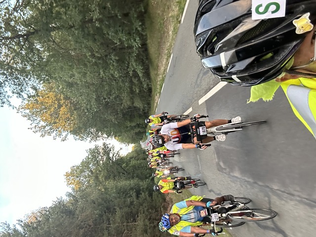

走り出して20分くらいでこんな感じに陽が暮れてきました。
時刻は20:49です。

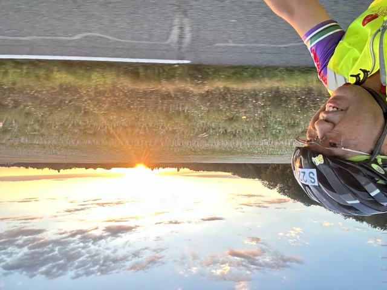

先導車もいなくなり、速い人のペースが上がりばらけてくるので、なるべく大きな、でも、ペースの合う集団に付いて行きます。

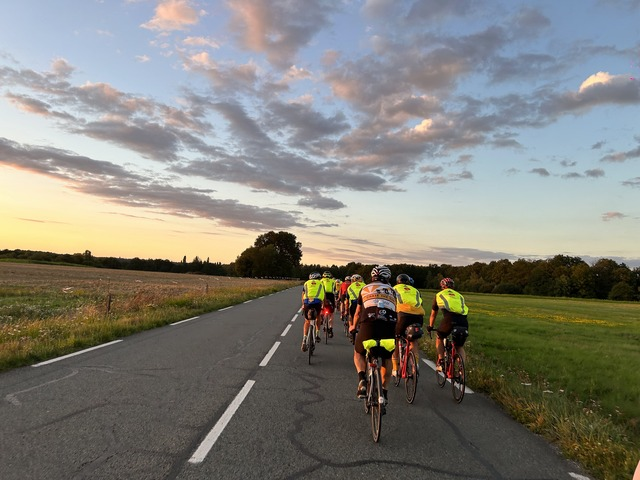

美しいですね。

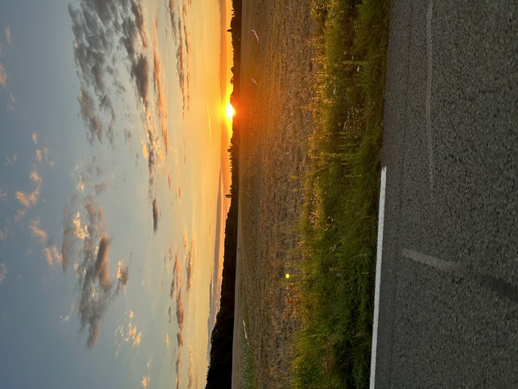

このあと、暗くなったからか、一生懸命走ったからか、Mortagne-au-Percheまで写真がありません。。。

とりあえず大きめ集団の中で走っていると、まわりはイタリア人ばかりのようです。
イタリアは大多数をSのグループに寄せてきたのかも知れません。
普段からいつも一緒に走ってる集団という感じでもないので、適当に真ん中に入って走らせてもらいました。

ここにいた集団の走り方は、平地はそこそこ速いのですが、上りは比較的ゆっくり登って、下りもゆっくり下る感じでした。

ということで、僕はなぜか元気だったので、いつの間にかじわじわと集団を追い越してしまい、ひとりになってしまいました。

若干向かい風な感じの中を失敗したなぁと思いながらひとりで進みます。

前方にテールランプがいくつか見えるのですが、追いつくと集団ではなく、単独で走ってる人だったのでそのまま追い越す、ということを何度か繰り返しました。

何人か抜いているのですが、ほとんどが同じSのグループの人で、RやQはまだまだまばらでした。
坂東さんがRで、神成さん軍団がQにいるので、追いつかないかと期待したのですが、そう簡単にはいきません。

しばらく走っていると、Rの坂東さんを追い越しました。
彼は淡々と走り続けてその結果速いので、追い越したとしても後でたっぷり寝て余裕な顔をして登場しますので、無慈悲に追い越して大丈夫です。

ひとりも飽きたなぁというころ、イタリア+α集団が後ろから追いついてきました。

ということで、再び集団に吸収されます。

途中開いてるお店もありましたが、ごはんはたっぷり食べたので寄ることはなく、私設エイドで何度か水だけいただきました。

そんなことが何度かあり、午前1:11、4時間41分で120km地点のMortange-au-Percheに到着しました。26km/hですね。かなり速いペースです。
リザルトは1:59になっていますが、これは出発した時刻ですね。

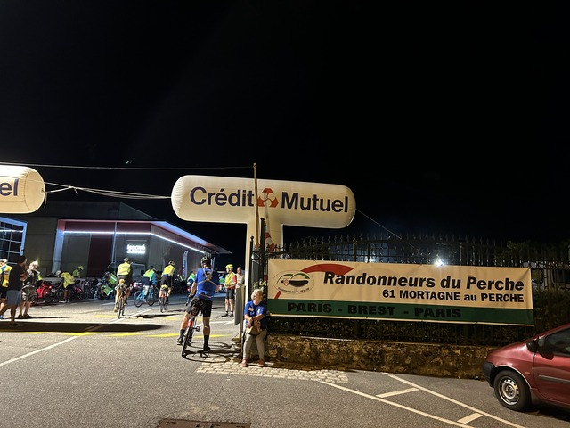

結局、Qの神成さん軍団は見かけませんでした。

最初は、ここではサンドイッチでも買って、ささっと出発しようと考えていたのですが、予想以上にお腹は空くものです。
ちゃんと食べた方がいいと、直感が警告していますので、食堂で食事にしました。

よくわからずポンポン注文すると、こんな感じになりました。

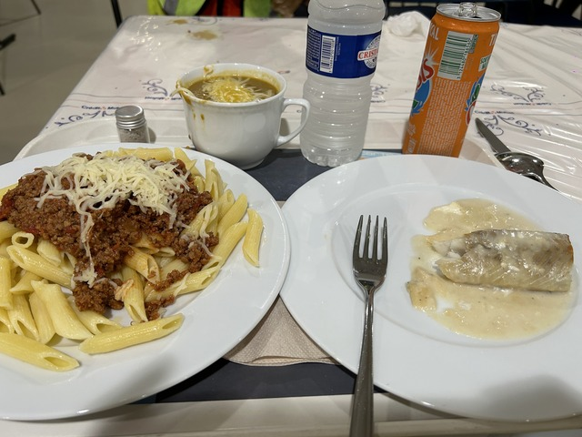

食堂にも神成さん軍団の姿は見えず、さすが3人チームで鍛えてるだけのことはあって、もう先に行ってしまったのかも知れません。

川合さん夫妻がいたので、パチリ。
ポーズを撮る暇もなくお忙しいようです。

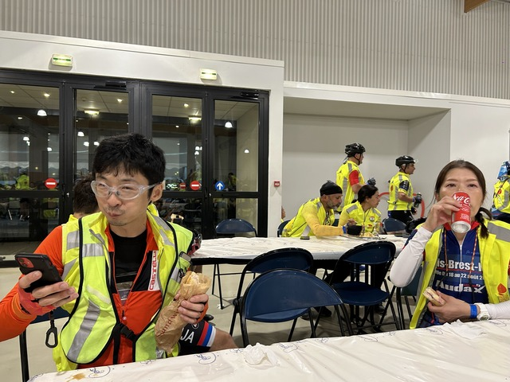

たかとりさんはあわててポーズしてくれました。
つかぽんさんは微動だにせずコーラをすすっています。

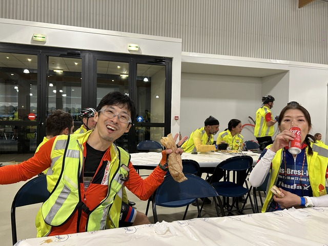

このあとお二人は先に出発しました。

120kmなのでまだ元気です。

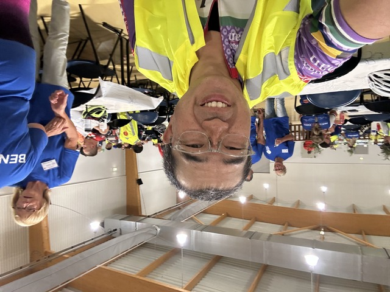

ここから冷えるので夜用の長袖ウールジャージ、長タイツに着替えました。

水を汲んでいると、大きな声で野田さんを呼ぶ神成さんと、その声の先に野田さんを発見しました。
先に行ってたと思っていたのですが、どうやらどこかで追い越したようです。

ということで、時刻はちょうど午前2時。滞在時間50分くらいで出発します。

## Mortagne-au-Perche: 120km ～ Villaines-la-Juhel: 203km

次のコントロールまで80kmです。

Mortangeまで一緒だった何人かを見つけて一緒に走ってた気がするのですが、この区間、ほとんど記憶がありませんね。

一生懸命走ってたのだと思います。
写真も全然ありません。。。

Villaine-la-Juhelに到着する直前にパン屋や小さなスーパーがあります。
コントロールで買うより早いし、出発は反対側なので、ここで必要なものは買うのがいいです。

スーパーによってリンゴジュースを買いました。
1リットルか1.5リットルくらいの箱や瓶で1.x€とコントロールで売っている水より安いです。
今回は糖分とエネルギー補給にリンゴジュースが活躍しました。

スーバーの中では韓国から出走している日本人と韓国人のカップルが食事をしていました。
お互い頑張りましょう！

スーパーの向かいにはかっこいい自転車が停まっていました。

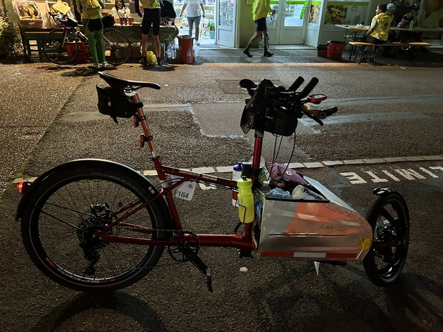

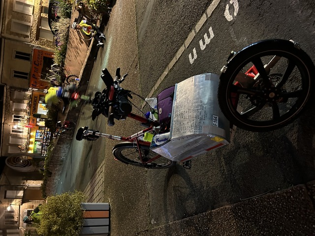

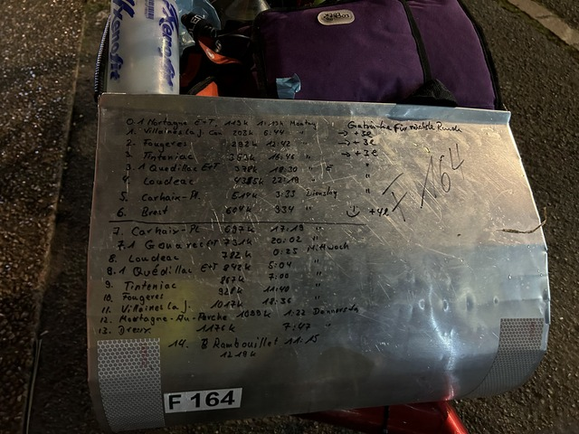

コントロール到着は午前5時40分頃でした。
80kmを3時間40分でなかなか快調です。
ま、前回も前々回も、ここまでは快調で、この後仮眠後ペースが落ちます。

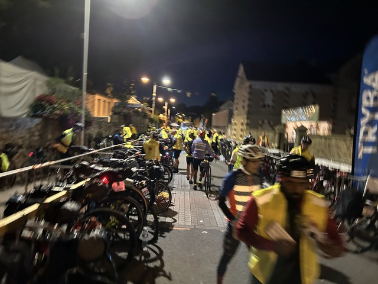

さて、ここでシナリオの分岐点です。
仮眠を取るか、そのまま進むか。

前回も前々回もここで仮眠を取っていますが、その後また眠くなって時間がなくなっています。
どうせ眠くなるなら後でまとめて寝るのもアリな気もしますが、一日目をリセットして新たな気持ちでリスタートした方がいいかも知れません。

ということで、明るくなるまで寝ることにしました。

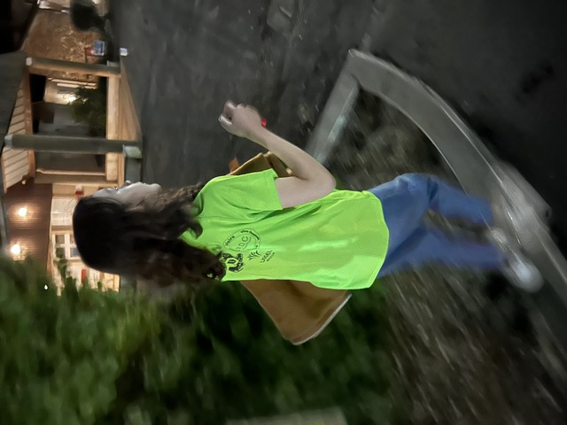

早朝に労働させられている少女に寝床まで案内してもらいます。
この少女には復路でも深夜労働していただきました。

ここの往路で寝るのは3回目ですが、前回も今回もとても快適でした。
部屋もとても暖かく、湿ったジャージを脱いでアミアミのインナーだけで快適でした。
1.5時間で目覚ましを合わせて眠りにつきました。

おやすみなさい。
