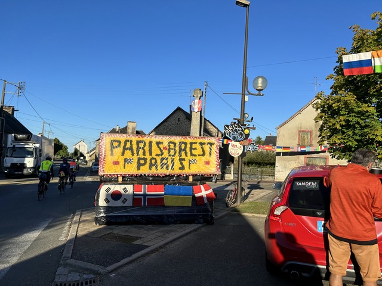
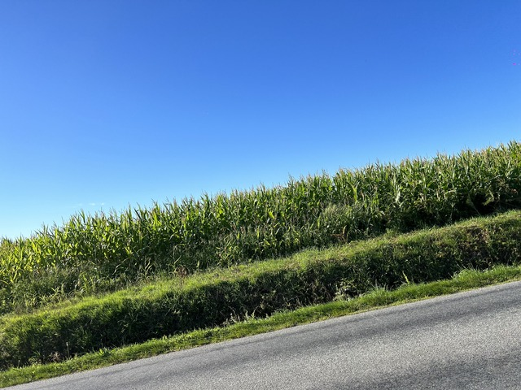

## Villaines-la-Juhel: 203km ～ Fougeres: 293km

1.5時間くらいの目覚ましより早く目が覚めました。
1時間15分くらい寝たでしょうか。

ここVillaines-la-Juhelは仮眠所の近くに大きな食堂があり、道路を挟んでコントロールの近くに小さな食堂があります。
ちなみに、コントロールの近くのトイレは仮設ですが、仮眠所の方にあるトイレはきれいです。

前回大きな食堂は朝はあまり何もなかった記憶があるので、コントロールの方でパパッと食べて出発しようと行ってみると、神成さん軍団が団らんしていました。

パン買って神成さん軍団に合流して話していると、韓国の人がやって来て、僕の写真を撮ってもいいですか?と聞かれました。
なんですか、アイドルですか?!
会ったことがあるのかと思い聞いてみると、会ったことはないけど知っているとのことでした。
韓国の2030kmを走った謎の韓国語を喋る日本人ということで一部で有名なようですね。

そうこうしていると、今度は、取材クルーがやって来てフランス語はわかるのか、と聞くので、
「ジュヌパルルッパフランセ！」とか冗談を言ってるとなんか取材を受けることになりました。

取材は英語で、ここは日本語で答えてください、とか後の編集のことをよく考えていました。

どこで使われるのでしょう。楽しみです。
Abandonジャージのおっさんが話してる動画を見かけたら教えてください。

さて、時刻は午前8時。2時間20分くらい滞在していたようです。
ゆっくりしてしまいましたが出発です。

しばらく神成さん軍団と野田さんに着いて行くことにしました。
神成さん、ミキさん、園田さんの3人は完走を目指して1年くらいトレーニングや対策を練ってきているので、着いていけば安心です。

パリブレストパリの応援看板がありました。

この後もたくさんたくさんあったのですが、今回は完走優先であまり写真は撮っていません。

しばらく走っていると、速い園田さんとミキさん、ゆっくりの神成さん、神出鬼没の野田さんに軍団はばらけ始めました。
あれれ。チームで走ってるのかと思っていたのですが、聞いてみるとスタート直後からバラバラに走っているそうです。
それだと、風よけとかチームのメリットを生かせず、チームの遅い人のペースになるだけでは、と思いつつ、園田さんと長い坂を駆け上がり、頂上で後続を待ちますが、待てど暮らせどやって来ません。

パンクなのか、戻ろうかと思っているとタイの上田さんが登ってきました。
「私喉が渇いたのぉ」と大きな声で話してるお嬢様と取り巻きの男衆がいたらしいので、パンクではなく走っているようです。

10分程してやっと追いついてきました。

何があったのか聞いてみると、なんと、オランジーナを飲んできたそうです。
なんということでしょう。。。
僕もオランジーナ欲しいです。

こんなにいい天気で暑いですからね。

途中、日本語のわかる韓国の人と少し話をしました。
なんと、仕事の都合でこの次のコントロールから帰国しないといけないそうです。
大変だぁ。

さて、オイルを注したかったので軍団から離れてオイルを注して走り始めると、おっと、坂東さんがいますよ。

やっぱり、ぐっすり寝てマイペースでいつの間にか前にいるのです。
僕は坂東さんのようにマイペースでは走れないので、僕の中では坂東さんに追いつかれるのは危険信号です。
実際、前回も行きのカレで会ってるのですが、坂東さんは完走、僕はタイムアウトのDNFです。

これは急がないといけません。

神出鬼没の野田さんです。

先頭の園田さんに追いつくと、様子がおかしいようです。
どうやらひざをやられたそうで、次のコントロールまでかも知れないとのことでした。

一番走れると思ってた園田さんがまさかの怪我で、ロングライドはなかなか難しいものです。

止まっておやつを食べていると、タイの上田さんと監督さんが来たので合流しました。

上田さんは快調に進むので一緒に走っていると、園田さんとはここでお別れすることになりました。
園田さんは監督さんと一緒に走っていたようです。

上田さんとちょっと休憩です。

この後上田さんは超特急で進んで行ったので、ひとりでぶらぶら走りました。

コントロール手前の7,8kmで、後ろから超速い韓国のトレインが来たので便乗しました。
下りの60km/h以上でもまだまだ回す爆速集団です。

Korea2030に出て改めて確信したのですが、韓国はチームで走ることが多いようで、超長距離でもしっかりまとまっています。
そのままコントロールまでご一緒しました。

到着は12時25分頃。
90kmを4時間20分くらいなので、悪くはないペースです。

韓国の自転車ユーチューバー、パクセムさんです。
Korean2030以来の再会です。

姫井さん、豪快です！

コントロールはいろんな人に会って楽しいですね。

亀太郎軍団の人がいたので、一緒にご飯にしました。

