## Fougeres: 293km ～ Tinteniac: 354km

食堂は何部屋かに分かれていて、トイレを探して別の部屋に行くと神成さんがいました。
ちなみに、ここのヴィレンヌと同様に食堂にきれいなトイレがあります。

神成さんはかなり疲れているようで、ちゃんと寝た方がよさそうです。
園田さんがDNFした今、神成さんとミキさんではペースが違いすぎます。
彼は他人思いなので、チームメンバーを差し置いて自分からは休めません。

ということで、神成さんには自分のペースで完走を目指してもらって、足が速いけど初参加のミキさんをルデアックあたりまで連れて行くことになりました。
今年のママチャリグランプリ3位のペアの再結成です。

ミキさんは大きな栗の木の下でゴロゴロしているらしいので、カフェの方まで迎えに行きます。フジェールは食堂とカフェが離れているので自転車で移動するのでいいです。

ということで、食堂で並んだり、行ったり来たりしたり、結構時間を使いましたが、次のタンテニアックまで60km一気に行っちゃいましょう。

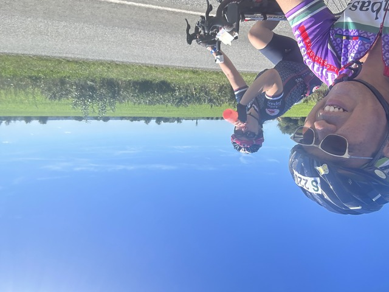

細かなアップダウンが続きますが、ミキさんも元気についてきています。
このままのペースで行けば、ルデアックに9時か10時頃着けるでしょう。

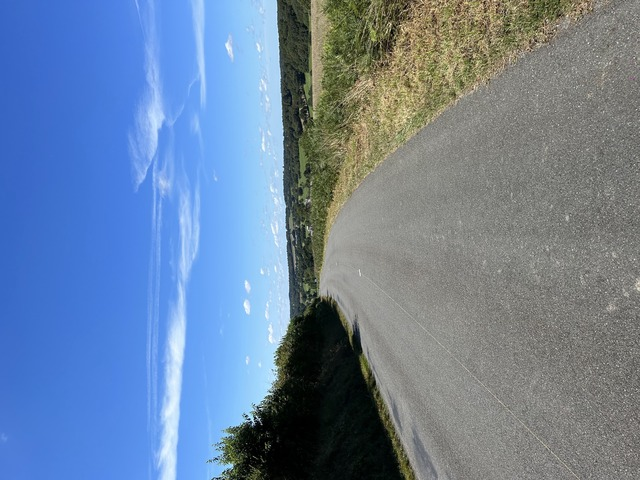

というような話をしていると、後ろにいたミキさんがいなくなりました。
どうやら、コーラの効果が切れたそうで、コーラがないと走れないのだそうです。

困りました。
お店も全然ないし、私設エイドも小規模で水しか用意していません。

完全にコーラが切れて時速は10kmくらいにまで落ちて、気分もどんどん落ちて行っているようです。

このまま完走しても神成さんを見捨てたことになる。神成さんのペースに合わせても完走出来ないかも知れない。

どうやらチームの一人がDNFしたときや途中でチームを解散するときのルールを決めたり合意を取っていなかったようで袋小路です。

こりゃどんな結果になっても不幸です。
ドラマなら、あいつが生きていたらどんな顔をすると思う?! とかいうような台詞が飛び出すシーンです。

が、よそのチームの話なのでなんとも手出しも出来ず、とにかくちょっと先行してコーラを探します。

少し大きなエイドを見つけたので、コーラがないか聞いたところ、コーラはないけど紅茶はあるとのことで、少し残ってるのを出してきてもらいました。

しかし、紅茶では復活しないようで、冷たいコーラじゃないとダメなようです。

日本のどこにでもコンビニがある状況からすると、PBPは、というか欧米全般かも知れませんが、補給がかなり難しいですね。

そんな感じでタンテニアックの待ちが見えてきました。

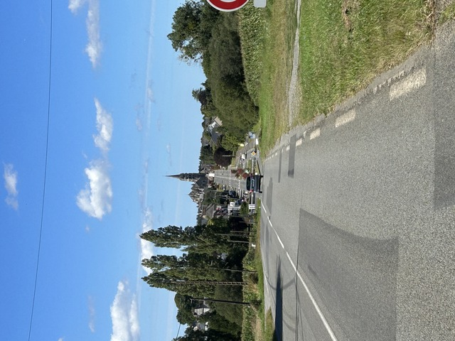

ここまで来ればコーラはあと少しです。

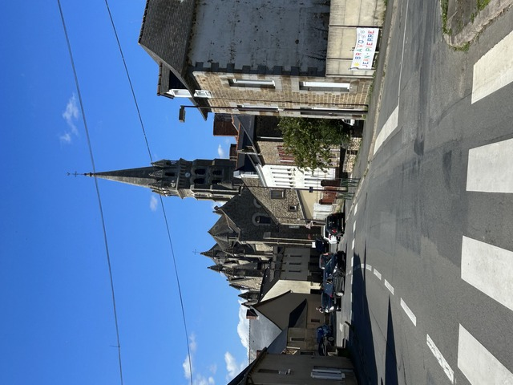

ということで、16時45分頃、ようやくタンテニアックに到着です。

コーラを2本購入してご満悦のところに、川合さんが登場しました。
わりと同じペースですね。

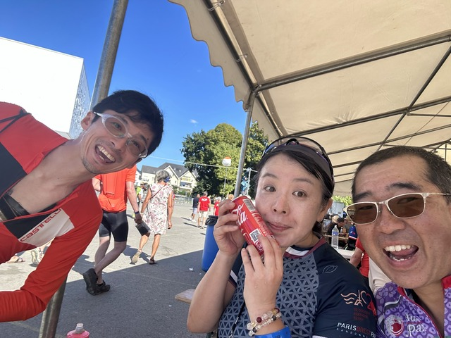

うろうろしていると、大野さんもいました。2,3時間昼寝してたそうです。
死神のUですが、速い人なので大丈夫です。

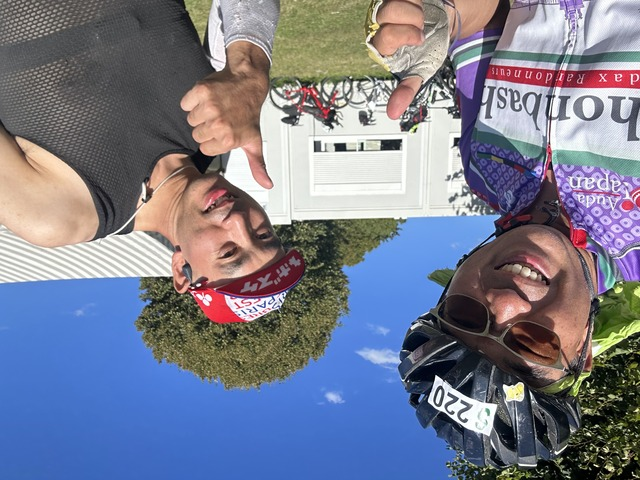

さて、ミキさんはルデアックでやめるような気になっているようですし、今はペースも違いそうなので、別々に行くことにしました。

FBのメッセンジャーも撤退情報が増えてきて、負のオーラ満載で精神的に危険なので、一旦退出しました。

## Tinteniac: 354km ～ Quedillac: 379km

次のケディヤックは寄らなくてもいいのですが、タンテニアックでは何も食べなかったので、ケディヤックでご飯にします。

ケディヤックまでは25kmです。
短いのには何か訳があるのか、と走ってみると、登りますね。。。
暑いのにめちゃ登ります。

お、川合さん夫妻がいました。

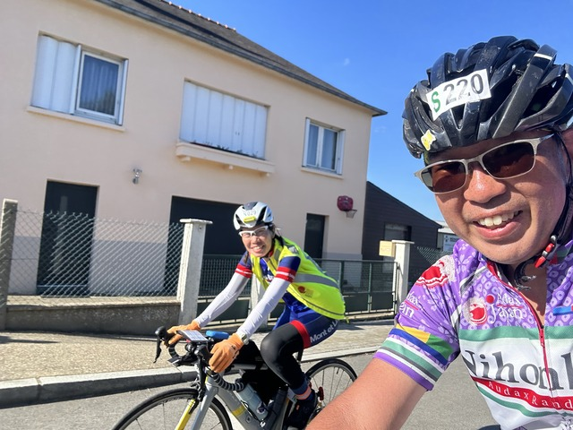

どうも、お先でーす。

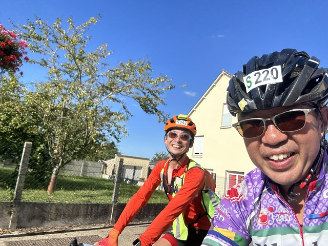

あまりにも暑いので、途中にあった小さなお店で缶ジュースを飲んで冷却しました。

しばらく行くと街が見えてきました。
さっきも見たような景色でどこも同じです。

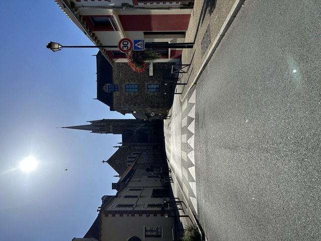

ケディヤックには午後6時半くらいの到着です。

大量のコンセントがあったので、ガーミンとスマホを充電しつつ、ごはんをいただきます。

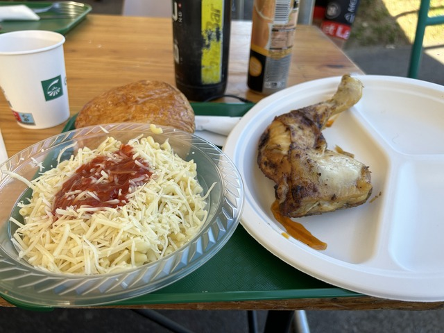

このチキンは外で炭火で焼いていました。
ここは毎年外でバーベキューしたものを提供しているようです。

## Quedillac: 379km ～ Loudeac: 435km

さて、次のルデアックに向けて進みます。
ルデアックまでは56kmです。

わりと平坦な記憶があったのですが、間違っていたのでしょうか、結構なアップダウンが続きます。

途中で暗くなってきたので反射ベストを着ていると、ミキさんが追い越していきました。

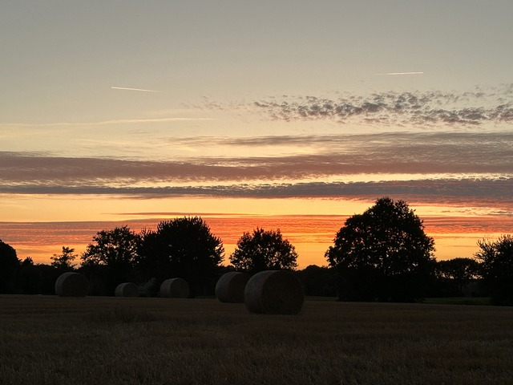

後で追いかけましたが、コーラを投入して調子があがっているようで、まったく歯が立ちませんでした。

ママチャリグランプリのリザルトを分析したときからわかっていたのですが、僕よりミキさんの方がだいぶ速いです。

22時半頃、ルデアックに到着です。

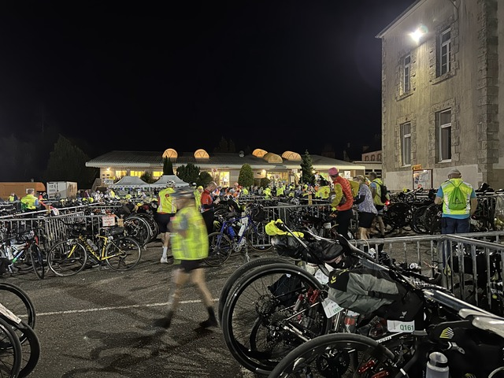

今回ドロップバッグは使わなかったので、ここでやることはありません。
次のWPで寝ようかと思っています。

ミキさんもすでに到着していて、大きな声で話していると、タイの上田さんがいました。

上田さんはすでに1時間半位前に到着していたそうで、いろいろ話していると、次のWPまで一緒に行くことになりました。

## Loudeac: 435km ～ Saint Nicolas-du-Pelem: 482km

ルデアックを11時過ぎに出発しました。
次のサンニコラまでは50km程です。

のんびりの話しながら進みますが、ルデアックを過ぎるとアップダウンが激しくなるのでなかなか思うようには進みません。

ゆっくり走ってると、ルデアックで仮眠した後の元気な人たちがどんどん追い越していきます。
たまに道路脇を見ると、仮眠中の人がごろごろ転がっています。

先行しているタイの金辻さんから上田さんに連絡が来たようで、この先の475kmのあたりにシークレットがあるそうです。

途中のエイドで平松さんとも会いましたが、その後、スイスイ先に行かれました。

しばらくして、ふと後ろをみると、あれれ、上田さんだと思っていた人は違う人でした。
曲がり角のところで待っているとやって来ました。
あまりにも眠いので、ちょっと仮眠してから行くそうです。

「では、また後ほど！」

シークレットがあるというあたりの手前で1kmくらいまで行ったとき、逆走してくる人がいました。

シークレットがあると聞いて、その距離を過ぎたけど見つからなくてうろうろしているそうです。
「今、何kmですか? あー、どっか寄り道したでしょ? まだ○○kmですよ。たぶんあと1kmくらいです。」

ということで、1kmくらいでシークレットはありました。
見逃すことはないくらいにはなっているので大丈夫です。

仮眠所はなかったので、トイレに寄って、7km先のWPを目指しました。

サンニコラの到着はたぶん2時半か3時くらいかなぁ。

とりあえず、眠いので寝ます。

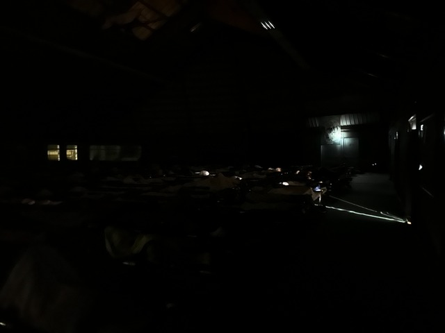

ここの仮眠所も暖かく快適でした。
シャワーが仮眠所の中にあるので、移動が楽です。
がっつりパジャマに着替えて寝ました。
50分くらいですが。

おやすみなさい。
