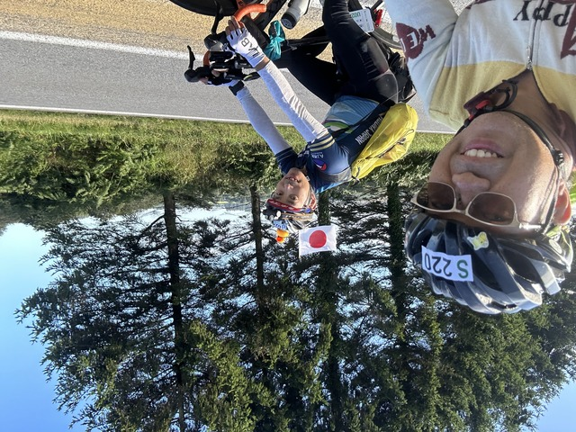
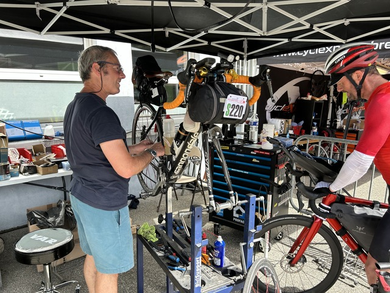

## Saint Nicolas-du-Pelem: 482km ～ Caraix-Plouguer: 515km

4:30頃起きて食堂でサンドイッチを食べました。
サンドイッチを食べるとなぜか右の頬がポキポキ鳴ります。
枕にした袋の中に固いケースが入っていましたが、それがよくなかったんでしょうか。

ポキポキうるさいなぁ、と顔をしかめていると、ルデアックのホテルで仮眠して元気になったミキさんがやって来ました。

ここにいるということは、完走に向けて吹っ切れたようですね。
今ここにいるなら時間的にもまだ大丈夫そうです。
お互い頑張りましょう。

ていうか、顔が曲がってますね。よほど変な寝方をしてしまったようです。

さて、カレまでは40km程度ですが、またまたアップダウンが続きます。

昨晩あたりから気にはなっていたのですが、変速をガチャガチャ変えているとフロントに違和感があります。

ワイヤーは伸びきっているはずなのに、なにやら様子がおかしいです。

念のためフロントディレーラーのワイヤーをもうちょっと張ってみようかと確認したところ、なんと、ワイヤーの頭の部分がありません。
かろうじてネジのところまではあるようですが、このままでは、スポッと抜けたらおしまいです。

あと700kmくらいもってくれるのを期待しつつ、だましだまし進みます。

カレのクローズ時刻は6:48なので、とりあえずタイムオーバーで到着する予定です。

と思っていたのですが、残り10kmくらいになって、なんか間に合いそうな雰囲気なので、なんとなく急いでみます。

ということで、カレには6:48ぴったりで到着しました。

コントロールでハンコをもらうころには6:49でした。

ご飯にしようと食堂に行くと、大野さんがいました。
大野さんと話してると、あらら、近くにいた人が食べたものを全部戻してしまいました。
すかさず大野さんが、みんな同じだから大丈夫ですよーってその辺のナプキンを手渡します。
優しいですね。

みなさん胃をやられたり、極限で戦っているようです。

さて、ここのレジは遅いので並びますが、僕はお腹が空いたので朝ご飯です。

少し元気になったかな?

## Caraix-Plouguer: 515km ～ Brest: 604km

大野さんは机に突っ伏して寝ているので、そっとしておいてブレストに向かいます。

まず、緩やかな大きな上りがあります。
ちんたら登っていると、後ろから大野さんがやって来ました。

いい感じのペースで進んでくれるので一緒に行くことにしました。

しばらく行くと、すごい景色がありました。

こんなの前は知らなかったですね。

はい、チーズ。

いい天気で気持ちがいいですね。

この坂を下って、右に曲がると早い安いおいしいの三拍子揃ったステーキのお店があります。

時間はすでにマイナスですが、寄ることにしました。

ふだんは、バーなのですが、PBPの日はランドヌール用のメニューが用意されています。

13.8€のステーキセットをライスで頼みました。

時間のある人はアントレも付けて17.8€のコースもありますし、ムール貝とフライドポテトなんてのもありますよ。

暑くなってきたので、半袖に着替えていると、料理が出てきました。
実は昨年も寄ったのですが、着替えてる間に出てきました。

バターもたっぷりあって、この後まだ少し登るので補給にぴったりです。

デザートはアイスを選びました。

食べ終わった頃、ミキさんが通りがかったのでステーキをオススメしてお先に出発しました。

だいたい同じくらいのペースで来てますね。

さて、おいしいステーキも食べて元気に出発します。

引き続き大野さんがいいペースで連れて行ってくれます。
完走できるようにアシストしてあげるよ、とのことでいいペースで進んで行きます。

ガシガシ進んでいると、後ろに小集団が出来てました。
大野さんはカレの手前でも100人位の集団を引き連れていたそうです。

いい感じで13:09頃、ブレストまで到着です。
制限時間からは20分遅れくらいですが想定内です。

フロントのワイヤーが爆弾になりそうなので、まずはワイヤーを交換してもらうことにします。

メカニックに自転車を預けて、コントロールに向かいます。

ブレスト到着から自転車を預けてコントロールまでわずか3分。
無駄のないいい動きです。

修理の間にご飯を食べてと思い、食堂に行ったのですが、あまりよさそうなものがありません。
ここは、さっと出て、途中で何か食べることにします。

うろうろしてると、何人か、ここでDNFするという人に会いました。

みなさん、だいたい、なぜやめることにしたのか、どうしていたらよかったのか、これからどうするのか、など事細かに話をしてくれます。
報連相がしっかりできていて、仕事の出来る感じです。

何人かから報連相を聞いて、メカニックに戻ると、自転車を逆さまにつるして、なにやら大事になっています。

ありゃりゃ、ワイヤーがフレームの中を通ってるのでアウターはそのままにしてワイヤーだけ変えてほしかったのですが、全部抜いてしまって苦労しまくっているようです。

これはまだまだ時間がかかりそうです。
仕方ない、待つしかありません。

かなり待った後、20€払って完了です。
ま、時間はかかりましたが、町中の自転車屋を探すよりは全然ましでしょう。

大野さんとコントロールを出て、スーパーに寄って食事をしました。

食事をしていると、またまた、DNFの人がやって来ました。
ブレストはDNFの負のオーラが漂う危険な場所でした。

ふと時計を見ると、すでに午後3時前です。修理も時間がかかりましたが、DNFの報告を聞いている時間も何人もともなるとバカにはならないようです。

ということで、大野さんたちとは分かれて、一人で先に行くことにしました。

## Brest: 604km ～ Caraix-Plouguer: 697km

今回は復路は往路とは別のルートです。

ブレストの橋は復路で渡ります。

走りながら、今後の計画について考えます。
ブレスト到着が42時間を越えると、完走率が一気に下がると言われています。
ブレスト出発時点で、42.5時間なので、かなり危険や領域です。

さらに、今夜どこで休むかですが、ルデアックあたりが距離的にはよさそうですが、混むらしいのでちゃんと寝られるか心配です。

でも、時間を計算してみると、寝る時間などほとんどなさそうです。
睡眠時間はほとんど取れていないので、今夜は3時間くらいは寝ないともたない気がします。

ちゃんと寝れない状態であと2日間とか無理ですよ。。。

と、いろいろ考えてるとどんどん進むスピードも遅くなってきます。
DNFの話もたくさん聞いたし、なんでわざわざ走ってるんだろうと、なんかだんだんやる気がなくなってきました。
負のオーラに当てられるのは危険だとわかってるのですが、すっかりやられてしまったようです。

こころなしか眠くもなってきました。もう進む気力もありません。

草むらの涼しそうなところがあったので、少し休むことにしました。

Zzzzzz

10分ほど寝たでしょうか。
大野さんの声がします。

もう時間なくてやる気なくなりましたよ、と話していると、そんな弱気じゃダメだ、と喝を入れられました。

そうですよ、せっかくここまで来たのに最後まで頑張らずにやめるわけがありませんよ。

すっかり負のオーラに呑みこまれて、戻って来れないところでした。危ないところでしたよ。

少し、また、一緒に走ってると、左側にスーパーが見えました。
ふと、ミキさんが、コーラがないと走れない、と言っていたのを思い出しました。
そう、コーラがあると走れるかも知れません。
実際ミキさんはその後ちゃめちゃ速くなっていました。

よし、コーラでドーピングです。

スーパーで1.5リットルのよく冷えたコーラを買って、とりあえず、ごくごく飲みます。
暑くて喉が渇いてるのでいくらでもいけます。
残った分をボトル満タンに入れます。
この時、蓋は開けておくのがコツです。
そうしないと、空気が膨張して、飲むときにブハってなります。もしかしたら、ボトルが爆発するかも知れません。知らんけど。

ボトルは2本あるので、1つは水、1つはコーラの状態で、追加の補給も大丈夫です。

後ろから吸い込まれるようにたくさんの人がスーパーに来て、大野さんは知り合いの人と遊んでいくそうなので、ひとりでお先に出発しました。

このあとは、驚くほど快調です。
コーラパワーすごいです。

いつ切れるかわからないドーピングなので、効いてるうちにどんどん進みます。

途中でシークレットがありましたが、ここもパパッとハンコをもらって出発しました。

20時10分ごろ、再びカレに戻って来ました。
途中どうなることかと思いましたが、90kmを5時間ちょいなので、悪いペースではないようです。

さて、何はともあれご飯です。

朝魚を食べたので、帰りは肉にしようと思っていたのですが、魚しか残っていませんでした。

左上のパンは持っていく用に買ったのですが、うっかり忘れて置いて行ってしまいました。

## Caraix-Plouguer: 697km ～ Gouarec: 732km

35kmほどですが、アップダウンを進みます。

23時過ぎにGouarecに到着です。
とりあえず、眠いのでここで3時間くらいがっつり寝たいところです。

仮眠所の受付に行くと、ちょうどPekoさんが出てきたところでした。
「ここ環境最悪！毛布とか取り合いだからなんとか確保して！」とのこと。
助かります。アドバイスありがとうございます。

仮眠所は大きなテント、確かに寒い環境でした。

まず、毛布のあるベッドを確保して、とにかく寝ます。

おやすみなさい。

50分くらい寝たでしょうか。
ふと、目が覚めました。
その5秒後、体が震えだして歯がガタガタガタガタ鳴って止まりません。
この環境で濡れたメリノウールで寝るのは寒すぎたようです。
とにかく、これ以上いても時間の無駄で、命の危険も感じるので、仮眠所を後にして食堂に向かいました。

食堂は仮眠所よりはまだ暖かく、ここの床で寝た方がよほどましでしょう。

何人か知り合いが到着していて、川合さんが震えてるところを写真に撮ってくれました。

とりあえず、バナナと何か忘れたけど軽食を食べて、とにかくルデアックまで行って二度寝しようと思います。

その後タイの上田さんに久しぶりに会いました。
無事ここまで来ているようで安心しました。
彼はここで休んで出発するそうです。
食堂の床が快適だとオススメしておきました。

## Gouarec: 732km ～ Loudeac: 782km

出発しようとすると、タイのPayuさんと社長さんと呼ばれてる人がいましたので、一緒に行くことにしました。

いきなりアップダウンで、しばらく一緒に走ってると社長さんがまだ来てないようです。
Payuさんは社長さんを待つということで、少しでお別れです。
また、後で会いましょう。

夜も深まって退屈なので、Bluetoothのスピーカーで音楽をかけながら走ってると、ドイツから来た人にラジオですか? と声をかけられました。
実は、この後も何人もからラジオですか、と聞かれました。
ヨーロッパではラジオをかけながる走るんですかね。

しばらく眠気覚ましにいろいろ話をしながら走ったのですが、全然覚えてないですね。。。

最後はまた一人で走って、午前4:10頃、ルデアックに到着しました。
クローズより30分遅い時間ですが、もうクローズ時間は無視することにします。

まずは、ご飯です。
お腹が空いたので、がっつり食べます。

この時間の食堂は空いていました。

というよりみんな寝てました。

僕はがっつり二度寝したいので、仮眠所に行きました。
仮眠所とシャワーが離れているのがちょっと不便ですが、シャワーも浴びて、パジャマに着替えました。

7時に出発する予定で1.5時間ほど寝ることにしましょう。

おやすみなさい。
