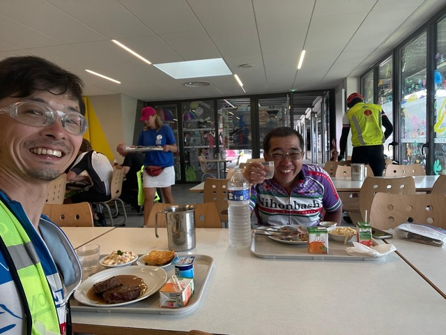

## Loudeac: 782km ～ Tinteniac: 867km

1時間20分くらい寝たでしょうか。
今日も頑張って出発しましょう。

前回は朝6時にここに着いて、諦めてDNFでした。
ここから先は未知の世界です。

駐輪場に行くと伊地知さんがいました。
僕が出発した次の日に出発しているのにさすが早いですね。

前回諦めたときはあまり変わらないような時刻ですが、午前7時頃ルデアックで出発します。

しばらく走るとドイツの人が引っ張ってるちょうどいい感じの集団がやって来ました。
みなさん翌日スタートの84時間組の人たちです。

特に交代して走るわけではなく力のある人に着いて行っているタイプの集団なのでただ乗りさせてもらいます。

昨日の大野さんの言葉を思い出して、集団にしっかり着いて行きます。

しばらくすると集団は追い越した人を飲み込み始め、タイ人の社長さんも合流しました。

40kmくらい一緒に走ったでしょうか。
集団も大きくなり、無理して着いて行っている人たちも混ざり、ちょっと危ないと感じはじめたころ、エイドがあったので集団からは離脱してエイドに寄りました。

おーーー、マレーシアのLeeさんではないですか?!
昨年タイのTanaosri 1200kmを何度も一緒に走った戦友です。

本州縦断1900kmで、天橋立のCPを通り過ぎようとしたのをお声かけした田中さんもいます！

その後僕の自転車を見てCanondaleのSynapseを買ってPBPに挑んでいるらしいです。

世界の超ロングライドで会ったことのある人と再会する、ほんとに元気をもらえる瞬間ですね。

エイドを出た後はLeeさんと一緒に走りましたが、友達を探すとのことでほどなくして離脱しました。

その後インドの人や韓国の人たちと一緒に走ってると、韓国のチームに怖い顔をサドルバッグに付けた人がいました。

これ、昨日の夜ルデアックに行く途中に何回も見ましたよ！
という話をしていると、ちょっと韓国語のアクセントが違うみたいです。
フィリピン出身で韓国に住んでいるそうで、日本人とフィリピン人が共通語として韓国語で話しているという状況です。
おもしろいですね！

しばらくして、行きにも寄った小さなスーパーを通ったのでリンゴジュースを投入しました。

インドの人です。なんか日本人の知り合いがいるらしく、日本語の動画メッセージを撮影されました。
また、謎の日本人が広まりますね。

しばらくひとりで走っていると、マレーシアのLeeさんが追いついてきました。
なにやらめちゃめちゃ元気です。

この元気をいただきながら、一緒に走りましょう。

タイでもかなり一緒に走ったので、お互い力量もわかってて走りやすいです。

速い韓国のチームが来たので吸収されます。

外国人が韓国語で一緒に混ざっていいですか、と言うと嫌な顔はされないのでお得です。

韓国のチームは誰かを待つようで、離脱したのでまたLeeさんと進みます。

ケディヤックはパスするようで、僕も特に用事はないのでパスします。

タンテニアックには11時頃到着しました。
85kmを4時間弱、4日目はめちゃめちゃ快調な滑り出しです。

到着すると、タイのPayuさんがいました。

パンを買いながら電話中です。

僕は、とりあえずお腹が空いて仕方がないので、ガレットソーセージを食べます。

屋外で焼いてるんですよ。楽しいですね。

ソーセージを食べながら、そのまま食堂で注文します。
列は全くなくガラガラでした。

ソーセージを食べながら、めっちゃお腹空いてるんですよぉと話をすると、めっちゃ大盛りになりましたよ。

ちょっと食べ過ぎな気はしますが、元気そうです。
川合さん撮影です。

マレーシアのLeeさんにあいさつして、お先に出発しまーす。

韓国のブロンプトンの人がいましたよ。
お忙しそうでした。

## Tinteniac: 867km ～ Fougeres: 928km

こんなにアップダウンがあったっけ、と思いながら走ってると少し眠くなってきました。

いい感じの草むらを見かけたので、10分だけ寝ます。

なんか、頭の後ろで、ピロリンっと音がしたので、目を覚ますと、マレーシアのLeeさんが写真を撮っていました。

これ。

さて、またボチボチと進むことにします。

なんで撮ったのかは覚えてないですが、教会です。
同じような景色は100回くらい見ました。

草のオブジェもありました。

退屈なので音楽をかけながら走っていると、またもやラジオですかと聞かれました。

しばらく後ろに着いた後、いい音楽ありがとう、と行って追い越して行く人もいます。

実は、みんな退屈なんでしょ?

ということで、フジェールに15:45ごろ到着です。

おいしそうなデザートとかもいろいろありましたが、さすがにさっき食べたばかりなので、これだけにしておきます。

食堂では川合さんと一緒に食べて、一緒に行くことにしました。
だと思います。ここから先、一生懸命走っていたのか、写真がないんです。

## Fougeres: 928km ～ Villaines-la-Juhel: 1018km (残り291km)

川合さんと次アイスを売ってるところがあったら必ず寄ろうとか、次回までにここにジェラート屋をオープンするよ、とか話をしながら走っていると、いつの間にか後ろに小集団が出来ていました。

小さな町に入ったところで、ついに小さなスーパーが見えました。
アイスを売っているようです。
ルートから30mほど逸れるので、そっちじゃないよぉって教えてくれますが、アイスなんです！

ついでにトイレに行きたかったので、店の人に聞いてみると、ちょっと行ったところの12番地にホテルがあるよ、と教えてもらい行ってみると、ホテルは17時まででした。
よくわかりません・・・。

ま、緊急でもないのでいいのですが、歩いて行ったので時間を使ってしまいました。
川合さんお待たせしました。

アイスも食べて元気に走ってると、超高速トレインがやって来たので乗ってみました。
めちゃ速いです、やばいです、誰が誰の後ろに着いているかもわからない団子なのでちょっと怖いです。
ということで、川合さんのチェーンが落ちたタイミングで離脱しました。

ヴィレンヌが近づいてきました。
この辺りは、往路と同じなので、あー、ここの坂長かったなぁ、とか、ここで神成さんを待ったなぁ、とかいろいろ思い出されます。
そういえば、神成さんやミキさんはどうしてるのでしょうか。園田さんが抜けてもへこたれず走り続けているといいのですが。

そうこうすると、22時すぎ、ヴィレンヌに到着しました。

川合さんは眠いのでここで休んで完走を目指すそうです。

ヴィレンヌの配置は頭に入ってるので、食堂に向かいながら、まず仮眠所の場所と受付を説明します。

と、深夜残業の少女達が声をかけてきます。
あーー、あなた知ってますよ！往路で仮眠所まで案内してくれましたよね！

お互い思い出して上機嫌で食堂の案内をしてくれます。

注文の手伝いから、食事の運搬までやってくれます。
疲れてる体には助かります。

深夜残業少女にデレデレするおっさんです。

深夜残業少女のサービスなのか、チーズがたっぷりです。
こうやって食べるものなのですね。

僕はいつもスープにもチーズを入れます。
コクがでておいしいですよ。

さて、時刻は23時。
残りはあと200kmです。
制限時刻は明日の14:30。
あと、15時間30分です。
2時間休んで、ブルベのペースで行けば間に合います。
しかし、そんなにうまく行けるのでしょうか。

なんせ、200kmもあります。

そう、このタイミングになると、感覚的には200km「も」あるのです。

まだまだ元気ですし、ちょっと不確定要素も多く怖いので、ここは少しだけ仮眠して、残り120kmの次のコントロールまでこのまま行くことにします。

外は、まだ暖かいですが、雨が降りそうな気もするので小さな食堂で寝ます。

空いてますね。
15分くらい寝て、再開しましょう。

おやすみなさい。

## Villaines-la-Juhel: 1018km ～ Mortagne-au-Perche: 1099km (残り201km)

15分くらい寝て、時刻は23:20。81km先のコントロールを目指します。

外にはブロンプトンも止まっていました。
ここまで1000km以上。過ごすぎます。。。

このあと走り始めるとめちゃめちゃ調子がいいです。
ビュンビュンビュンビュン進みます。

上りでもごぼう抜きです。
あーー、コーラ飲んだからですね。
コーラすごいです。

コーラのドーピングが切れたころ、全く進まなくなりました。
再びミキさんの言葉を思い出します。「私、コーラがないと走れないの」

なるほど、コーラを飲むと、コーラがないと走れなくなるのですね。
これは体力の前借りですね。

さっき速かった分と今遅くなった分、トータルするとどうなんでしょうか。

遅くなっただけではなく、眠気も襲ってきました。
走っている人を見ると、みなさん、わりとゆっくり走っていて道路脇に平坦な場所があると吸い込まれて行きます。

同じように眠くて仮眠場所を走りながら走っているようです。

前を走っていた人がいいポイントを見つけたので、僕も同じようにそこで仮眠をします。
10分仮眠して起きると、もうその人はいなくなっていました。
みなさん5分くらいの仮眠を繰り返して走ってるんでしょうかね。

何回か仮眠してみますが、眠気が全然取れません。
普段なら5分でも眠るとスッキリして続けられるのですが、コーラでドーピングしているからか、全く疲れが取れません。

何人もすれ違うのですが、話しかける元気もありません。
途中日本人はなんで熊鈴を付けてるんだ、と聞かれて北海道とか熊が出るからねぇと適当に返事した覚えがありますが、おしゃべりな僕がそれ以外全く会話しませんでした。

それどころか、後ろにいた人が突然前にいたり、記憶が途切れ途切れです。

これは、異常事態です。

ちょうどバーがあったので、パンオショコラを食べて、店の床で30分か40分ほど仮眠させてもらいました。
目を覚ますとかなり体が冷えていて、疲れも眠気もあまり取れていない感じでした。

このままいても仕方ないので、コントロールを目指します。

ほとんどどう走ったのか記憶もないまま、モンターニュオペルシェには午前5時半ごろ到着しました。

80kmを6時間もかけて来たようです。
これはひどいですね。前のコントロールで寝てから来た方かよかったのかも知れません。

とりあえず、ご飯を食べながら対策を立てます。

必要なものは、
- ご飯
- 睡眠
- 時間
です。
眠くなる原因のひとつは、エネルギー不足です。
エネルギーが足りないと睡眠も質も落ちますし、起きたときに力が入りません。

ということで、今このパスタをしっかり食べるのは必須です。
問題はお昼ご飯ですが、ゴールは14:30なので、次のコントロールでパンを買って食べながら走れば大丈夫でしょう。

次に、睡眠と残り時間のバランスです。

残りは120km。8時間くらいあれば力が出なくてもなんとか間に合いそうですが、それだと寝る時間がほとんど取れません。
普段は1.5時間単位で睡眠を取るのですが、昨日までの経験で50分というのもひとつの区切りとしてありそうです。
ということで、50分がっつり寝ることにします。

というようなことを考えていると坂東さんがやって来ました。

行きのルデアックでDNFして、パリ・ルデアック・パリをやってるそうです。
坂東さんからは悔しさは感じられても負のオーラは感じなかったので、この後のルートの特徴を教えてもらいました。
さいわい、アップダウンは少ないそうです。

食堂の隅に行くと前に寝た人がダンボールを置きっぱなしにしていました。
これは、快適ベッドです。いただきます。
ということで、タイマーを60分にして、寝ます。
さて、吉と出るか凶と出るか。
おやすみなさい。
