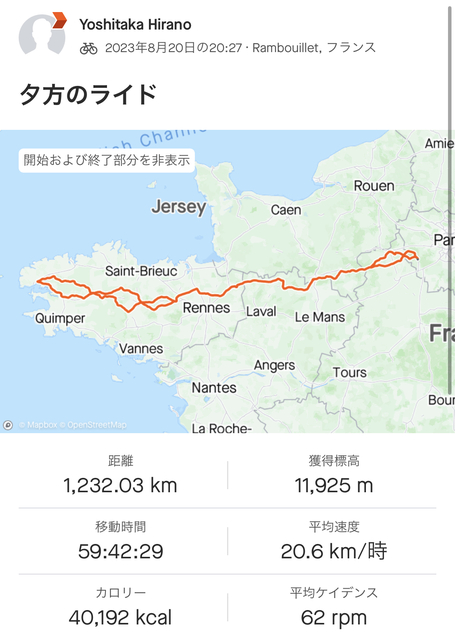

## Mortagne-au-Perche: 1099km ～ Dreaux: 1177km  (残り120km)

午前6時50分ごろ、起きました。
思ったより疲れは取れたようでスッキリしています。
いろいろ準備して7時10分ごろ出発します。

残りの距離は120km、残り時間は7時間20分です。
16.4km/hでいけば行ける計算です。
元気なら行けそうですが、普通のブルベの制限時間から考えるとそれよりも速いペースが必要で、自信がありません。

走り始めると意外と回復しているようで進めます。
とにかく、また眠くなってしまって仮眠が必要だと時間も足りないかも知れません。
元気なうちに速めのペースで走ります。

でも、ちょっと回転が重い気がします。
ということで、ちょっと時間を使いますが、タイヤに空気を足しました。

だいぶ速くなった気がします。
プラシーボかも知れませんが、そのまま突き進みます。

寝る前と比べるとかなり元気になってようで頭もよく回ります。

「寝る前に坂東さんに会ったときに、いらない荷物とか押しつけてきたらよかったなぁ。」

悪知恵まで働きます。

今は朝、ゴールは昼です。
ライトの電池とか2灯目3灯目のライトとか、パジャマとかいらないものがいっぱいあります。
坂東さんはといえば、巨大な輪行袋を担いで走るような変態です。
ライトとか電池とか持ち運ぶのもきっと好きに違いありません。

と考えていると、なんと、前方に坂東さんがいました。

一瞬ライトを渡してしまおうかと思いましたが、おはようございますとあいさつをするだけにしました。

調子よく進んでいると、道を違えてしまいました。
といったも、10mくらいで気付いたのですぐに復帰です。

しばらく行くとイタリアの人が追いついてきました。
一緒に行きましょうという感じで何やらイタリア語でペラペラペラペラ喋ってる来るんですが、イタリア語は無理です。。。。

しばらく一緒に走ってたのですが、疲れたのか彼は少し後ろに下がってしまいました。

そのうちいつの間にか後ろに集団が出来ていました。
少し向かい風になった頃、遅くなったと感じたのか後ろの集団が一部前に出て行きました。
いい感じです。理想的です。
僕は真ん中くらいで着いて行かせてもらいます。

コントロールが近くなり、水がなくなったので集団を抜けて小さなスーパーのようなのを見つけたのでリンゴジュースでも買おうかと寄りました。
おっと、失敗しました。
精肉店でした。
全く役に立ちません。

気を取り直してコントロールに向かいます。

ドルーのコントロールに10時40分頃到着しました。

78kmを3時間半で来ました。
これは素晴らしいですね。

ゴールまでは42km。
残り時間は3時間50分です。

もう大丈夫でしょう。

ここでは、パパッとパンをポケットに入れて、と考えていましたが、ゆっくりご飯を食べていくことにします。

なかなか元気そうな表情です。

出発しようと外に出ると、ゴミ箱のあたりのスタッフの人がいいジャージ着てますね。写真撮ってもいいですか。
と来たので背中のかわいいロゴを取らせてあげました。
「アバンダン(途中棄権)するんですか?」「いやいやしませんてー。」
とかいいながら、そうだ、ゲン担ぎにアバンダンをゴミ箱にアバンダン(放棄)しちゃおうと、アバンダンジャージを捨てました。

スタッフなしバージョン

前面

暑いし重いので本当に捨てていこうかとも思いましたが、このジャージがことのほか人気だったので、これを着てゴールすることにします。
下の長タイツだけ脱いでいきます。

こういった冗談もできるくらい心に余裕も出来てきて、残り時間はあと3時間20分。
ゴールに向けて出発します。

## Dreaux: 1177km ～ Rambuille:1219km (残り42km)

ゴールまでは平坦でした。
とくに眠くもないし順調なので安全なペースで進みます。

途中雨が降ってきましたがそもそも暑いので気にせず進みます。
別にゴールまでびしょ濡れで行っても着替えはサドルバッグにありますし、とても気が楽です。

あと20kmのところで、1時間くらいでゴール着くよーと連絡すると、神成さんたちが来てくれるそうです。

ついに、あと、5kmくらいでゴールです。

もしかしたら田中さんがゴールでトランペットを吹いているのではと思い、Amazon Musicからオーシャンゼリゼをダウンロードして繰り返し再生に設定します。

あと数kmともなると、辛い思い出と共に感動で涙がこぼれそうになるポイントですが、大音量のオーシャンゼリゼに合わせて大声で歌いながら走っているので、とても陽気です。

ついに、会場に入りました。
計測ラインを越え、ゴールのゲートをくぐります。

神成さん達はいませんでしたが、川合さん夫婦が到着していました。

肝心の顔が切れてますが、無事時間内に到着したそうでさすがです。

パチリ

ゴール受付を済ませてメダルを授与してもらいます。

完走おめでとう！

ドルーまで一緒走ったイタリアの人もゴールしていました。

おめでとうございます！

手のしびれはほとんどないんですが、手のひらがボロボロですね。

手袋は変えた方がいいかもしれません。

ゴールでは食事が無料で付いてるのでいただきます。

ステーキは2枚欲しいと言ったらくれましたが、デザートは１つだけでした。
このデザートはパリブレストというお菓子で、この大会が起源になっている伝統のあるケーキです。

結果はこんな感じでした。

地図にするとこんな感じです。

食堂をうろうろしているとマレーシアのLeeさんいました。

おー。Tianさんも久しぶり！
今回は59時間でのゴールで中国の歴代1位です。

せっかくなのでジャージ交換しましょう！

後日大きなサイズで再度交換。
日本橋ジャージもライトな方に交換です。

帽子は台湾のJJさんからです。

台湾のJJさん

台湾のひとたち

ゴールの写真いくつかです。

暑くはないだろうと思ったら、めっちゃ日焼けしました。

おしまい。
