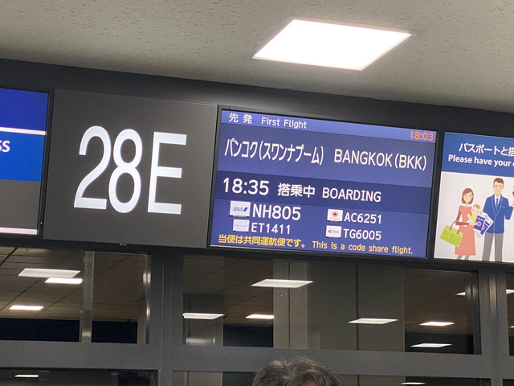
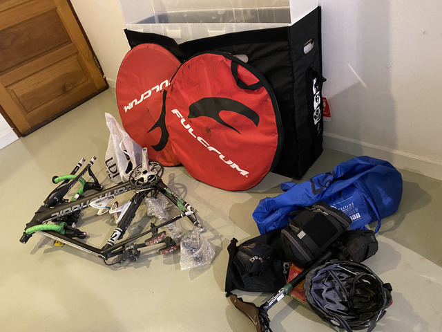
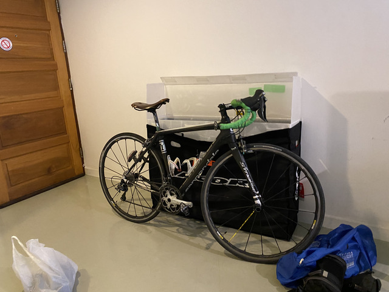
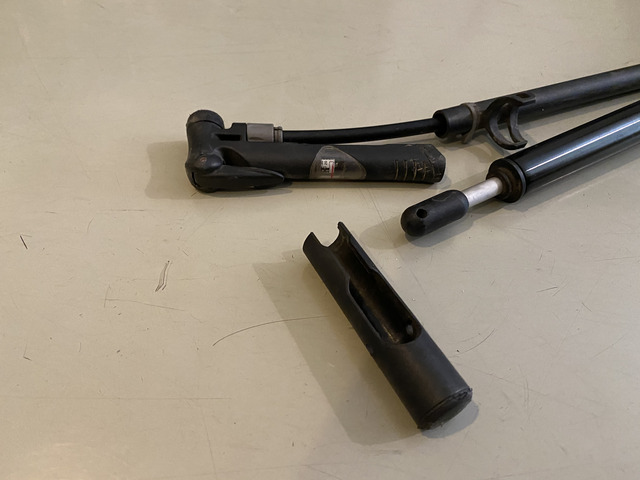
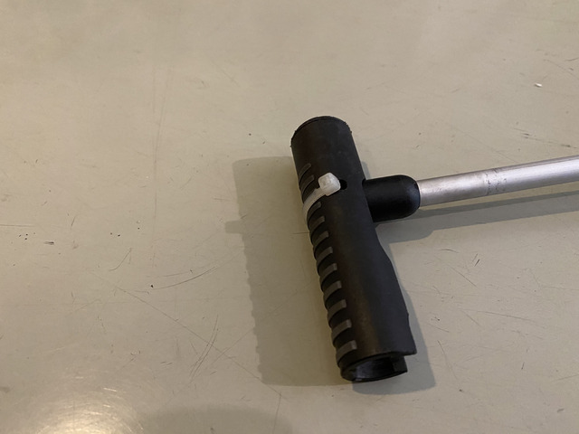
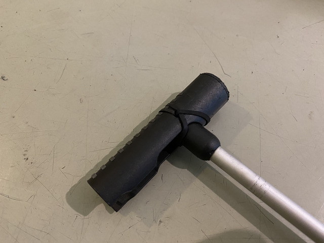
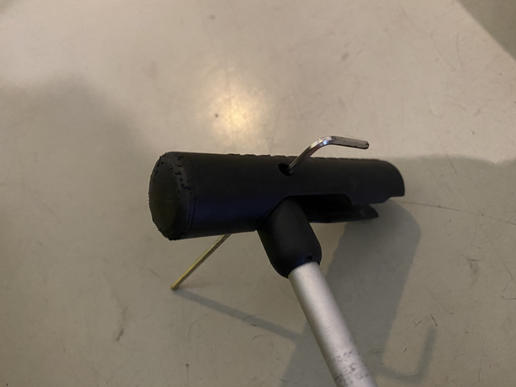

## 出発

夕方成田に到着し、2019年12月27日 18:35の便でバンコクに向かいます。
この日は最終出社日で結局1日お休みをいただいたのですが、大掃除を手伝うつもりくらいはあったのですよという意思表示です?!

## 到着

フライトは7時間くらいで、タイとの時差は2時間なので、到着したのは日付が変わる0時前でした。
ウィルスの影響で中国からの便がいくつかキャンセルになっているからなのか、入国審査は空いていました。

ホテルまでタクシーで移動します。
自転車はいつもバイクポータープロという箱に入れて持ち運ぶのですが、タイのタクシーはこれが後部座席に高さがぴったりで入ります。

ホテルに到着すると、なんと・・・・閉まっていました。

受付のドアに名刺が貼ってあったので、何度か電話して開けてもらいました。

## 自転車組み立て

その日はそのままバタンキューして、翌朝、自転車を組み立てます。

だいぶ手慣れた物です。

組み立ても終わったので、さて、空気を入れようとすると、

あらら。
携帯ポンプの手を持つところで壊れてしまっています。

ネジがあった形跡があるのですが、いつ、どこで落としてきたのか。
困ったものです。

タイラップで固定したり。

ゴムで巻いたり。

いろいろ試しましたが、どれも弱くて、空気を入れている間にちぎれるか、力が入りませんでした。

最終的には

これが完璧でした。

これで、空気も無事入れることができましたし、道中でも同じ方法でいけそうです。
