## バンコク～サラブリー

さて、今日は12/29。サラブリーというところまで、行ってみるつもりです。
今回の旅は、1/3にラオスのヴィエンチャンから飛行機に乗れればokです。
その間は自由です。
600kmくらいを5日で行けばいい計算です。

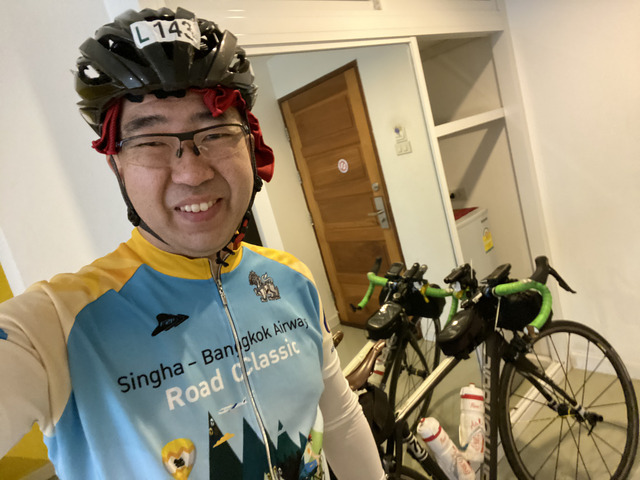

朝、宿に箱など荷物を預けて出発です。

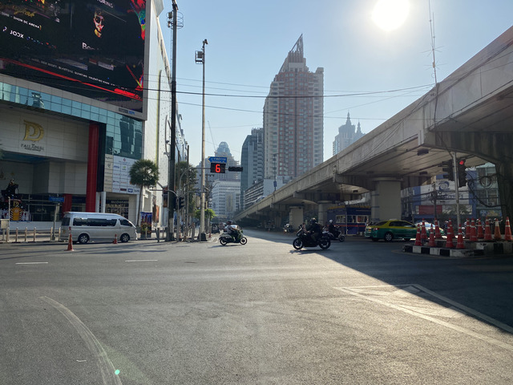

バンコクなど大都市の信号には青と赤それぞれカウントダウンがあります。

水をかけられないようにしましょう。

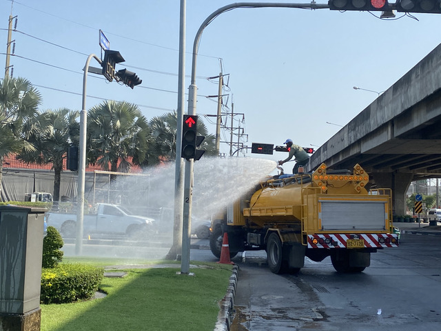

ちなみに、赤信号でも左折可です。

途中、セブンイレブンで休憩です。
だんだんと暑くなってきました。

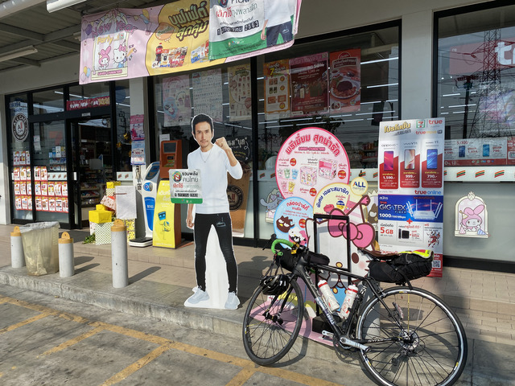

10時半くらいになるとかなり暑いので、自転車に乗るなら朝は早い方がいいです。
タイは時差や緯度の関係で日本より早く明るくなるので、日本より朝の時間はたくさん取れると思います。
僕はブルベの時以外は朝寝坊ですが。

大きな道より裏道の方が走りやすいので、しばらく裏道をルートにしました。

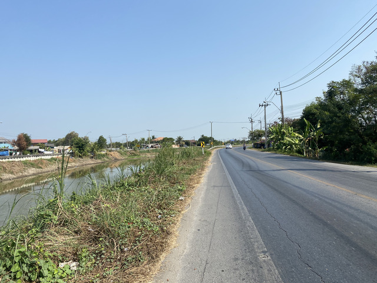

川沿いでなんとなくいい感じです。

いい景色を堪能しながら楽しみます。

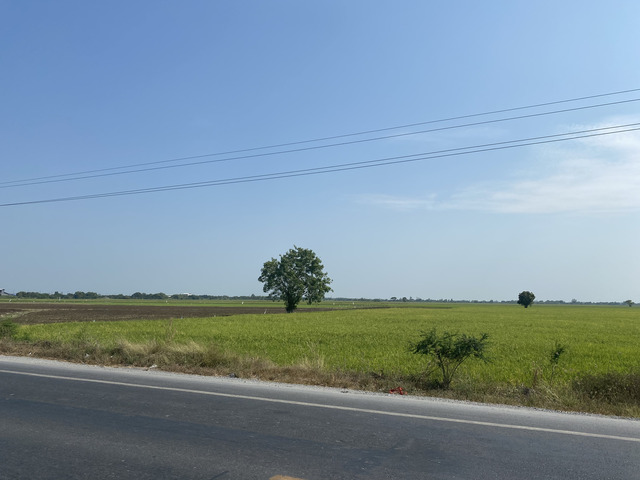

途中、食堂があったので昼食に寄りました。

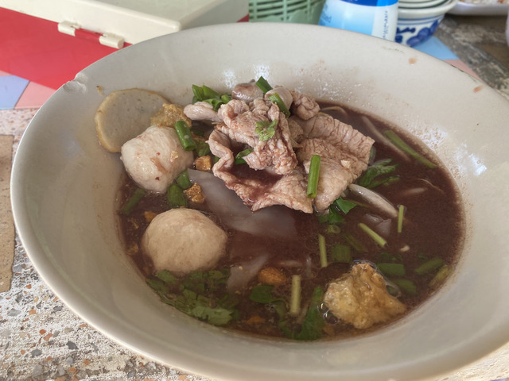

サイクリング中に食べるクイッティアオは最高です。

しばらく走って、暑いので水分補給です。

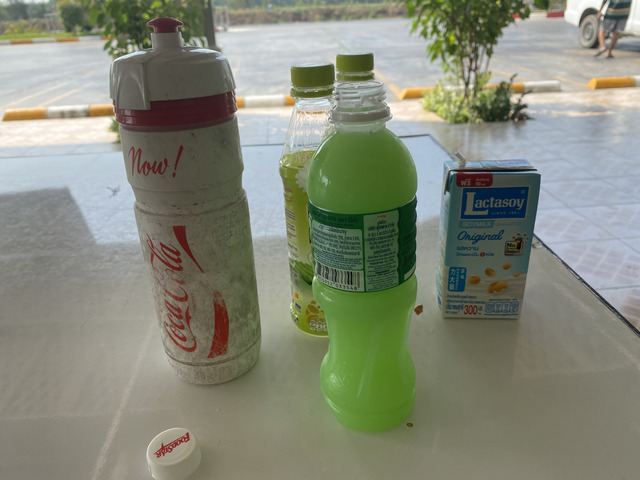

サラブリーの手前20kmか30kmくらいで、謎の建物が見えてきました。

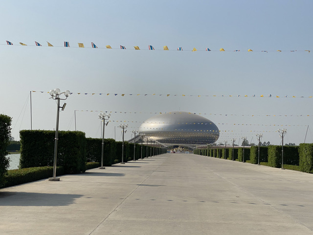

これは、さすがに気になるので、寄り道してみましょう。

近づいてみるとこんな感じになっています。

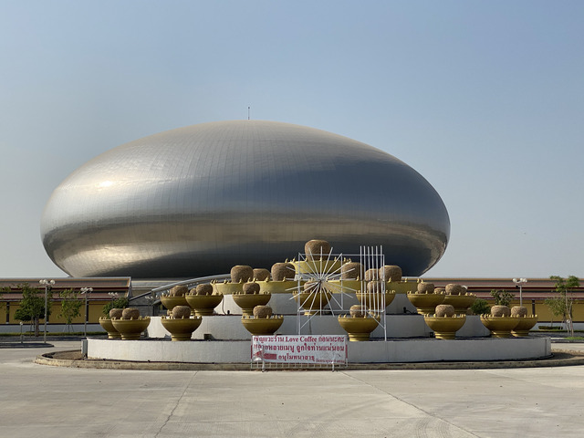

中に入ってみると、なんと、お寺でした。

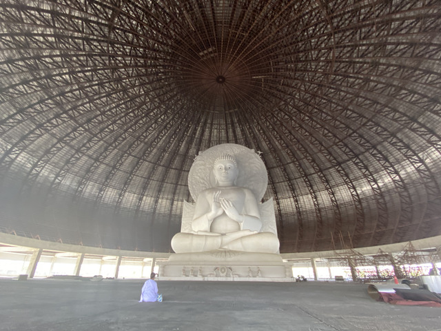

今回の旅の安全をお祈りしておきました。

サラブリーまでしばらく国道1号線を走ります。
帰省ラッシュで車が多いです。
路面も、裏道よりは悪く走りにくいです。

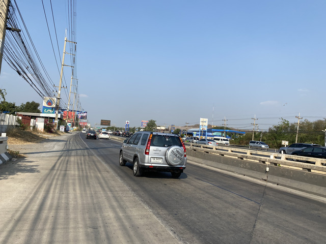

## サラブリー

宿を確保して、サラブリーの街を少し観光します。

船乗り場がありました。

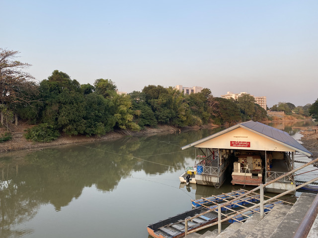

このあたりでも海運は発達しているようです。

鉄道駅の周辺に屋台が大量にあります。
写真が全く残っていないのですが、お腹が空いていてそれどころではなかったようです。

ラートナームーです。

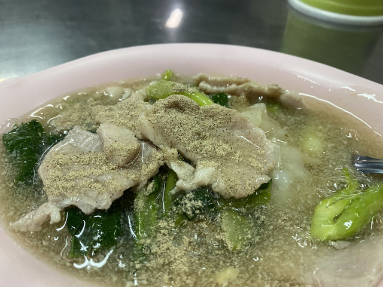

めちゃおいしかったのですが、ちょっと足りなかったので、はしごします。

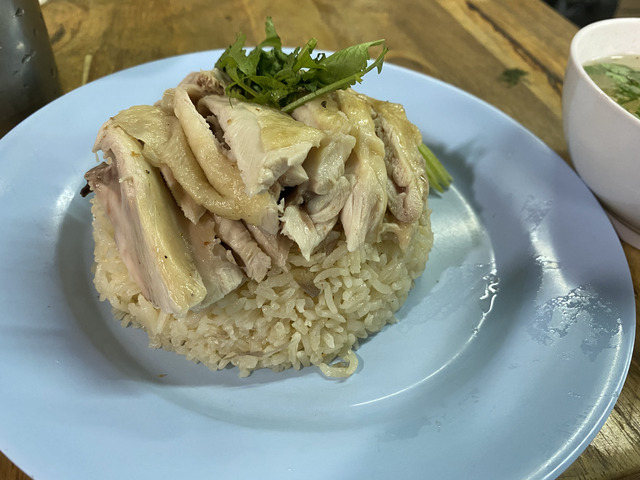

カオマンカイです。

こちらも、めちゃおいしかったです。

[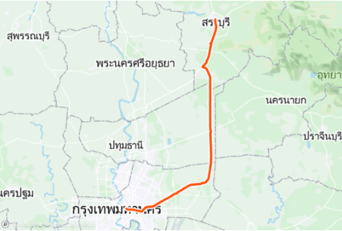](https://www.strava.com/activities/2964308917)

今日の移動: 121.1km
