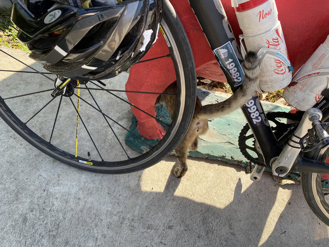
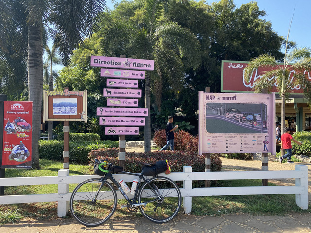
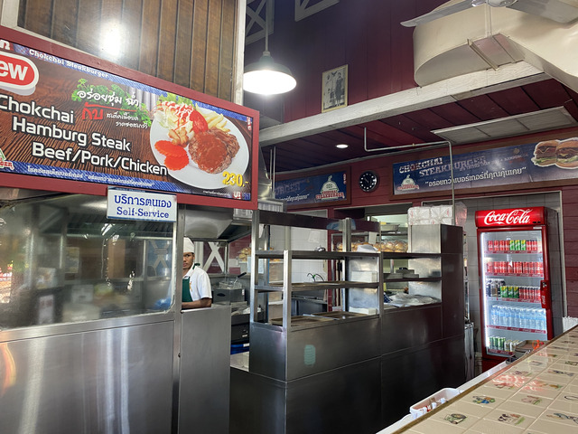
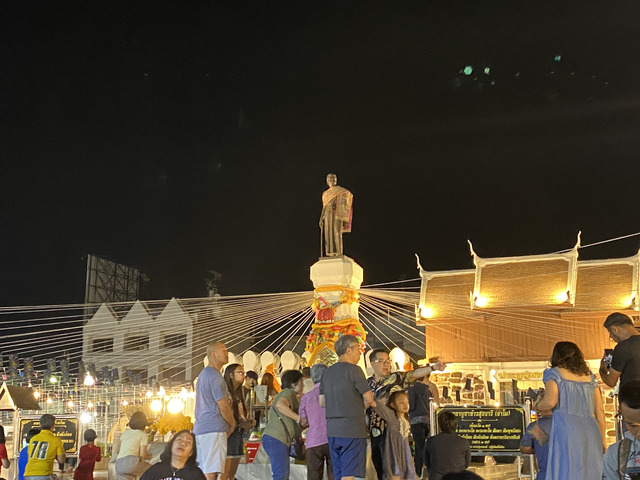

## サラブリー出発

今日は12/30。ナコーンラチャシマーまで、行ってみるつもりです。
20km先から少し登りがあって、上りきったところにおいしいハンバーガーとかステーキがあるらしいので、寄ってみることにします。
途中、2月に開催されるISAN2020のスタート地点も近くにあるようなので、こちらも、寄ってみることにします。

それでは、サラブリーを出発します。
めずらしく踏切にひっかかりました。

出発してすぐ、国道2号線の0kmポストがありました。
「กม」はそのままアルファベットでkmです。

2号線はこんな感じです。

20kmほど走って、登り始めたあたりに、気になるお店がありました。

THAI-DENMARK MILK LAND

いかにもおいしそうですね。
さっそく寄ってみましょう。

中はおしゃれなカフェですね。

こんなのを頼んでみました。

暑くなりかけた時間帯だったので、おいしかったです。

外に出ると、なにやらいますね。

しばらく走ると、ナコーンラチャシマー県に入りました。

道路はすでに帰省の車で大渋滞です。

道路脇では凧が売られてたりします。

向かい風ですよ!

峠を上りきると、歩道橋がありました。

ナコーンラチャシマー側の様子です。

歩道橋を渡って、反対車線側に出ると、本日1つめの目的地です。

## チョクチャイファーム

ミニ動物園など、いろんな施設があるようです。

目指すのはお昼ご飯です。

ありました、CHOKCHAI STEAKBURGER。
ここにしましょう。

中はこんな様子です。

メニューはこんな感じですね。
なかなかいいお値段するのですね。

注文すると、カウボーイのようなお兄さんが調理してくれます。
出来合いのものを挟むのではなく、ちゃんと焼いているようで、これは期待できます。

おーーー。
おいしそうです。
いただきます！

隣に、Umm!.. Milk というお店もあったので、こちらも寄ってみます。

ジェラートです。

おいしかったです。

## ISAN2020 スタート地点

数km走って左に曲がって少し行くと、2月に開催される2020kmブルベ、ISAN2020のスタート地点がありました。

上って、裏側です。

あと、1ヵ月ちょっとで、またここに来ると思うと感慨深いですね。

## 出発

スタート地点の周りには小さな街しかなかったので、なんとなく雰囲気だけ予習して出発です。

裏道は国道2号と違って非常に走りやすいです。
交通量の多い道路の路肩はやっぱり路面が悪いようです。

路面はかなり快適です。

と思ってると、こんな道になりました。

休憩がてらにスマホを見ると、なにやら友達が実家に帰省していて、それが、ナコーンラチャシマーの手前30kmくらいにあるそうです。
ルートから5kmも離れていないようなので、せっかくなのでお邪魔することにしました。

## 友人宅

ということで、迷いまくりましたが、途中自転車で迎えに来てもらってなんとか着きました。

大きな家ですね。
田舎のタイの家は初めて来ます。

裏庭です。

友達は飲み物を買いに出かけてしまったので、おじいさんと談笑です。

英語はまったくわからないので、できるのはタイ語の教科書の最初の方のページにあるような会話です。

「アユッタオライカップ?」

94歳だそうです。
すごい！お元気です！

このあと、1,2時間ほどゆっくりして、ナコーンラチャシマーに向けて出発しました。
夕方になると風向きが変わるようで、追い風になって楽に進めました。

## ナコーンラチャシマー

宿を確保して、街の散策です。

有名なタオスラナリ像です。
この周りに屋台などが集まっていました。

焼きイカ

バミー

もう一軒行きましょう。

ごちそうさまでした。

ホテルに戻っておやすみです。

今日の移動: 164.4km 計: 285.5km
