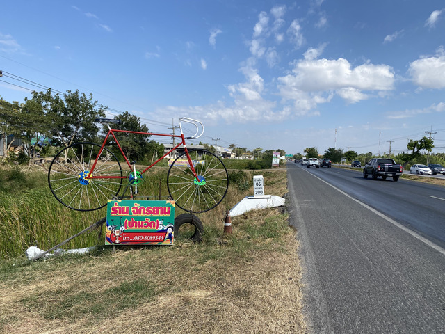
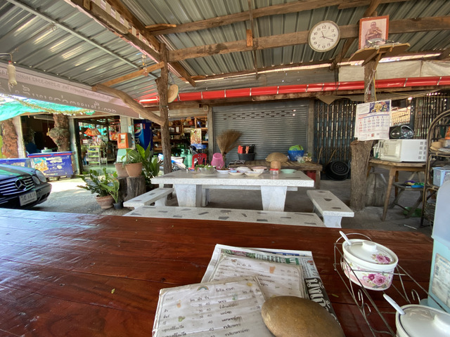
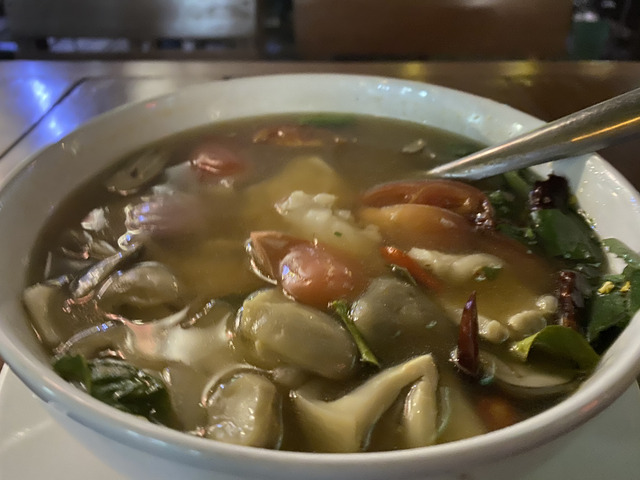

## ナコーンラチャシマー出発

今日は12/31、大晦日です。
今日はコンケーンまで行ってみる予定です。

朝ご飯を食べて出発です。

卵がおいしかったので、おかわりしました。

今日もいい天気です。

今日は帰省ラッシュも落ち着いたようで、道路はかなり空いていて快適です。

バス停でちょっと休憩です。

しばらく走ると、国道2号線の200kmポストを発見しました。

そういえば100kmは見かけませんでしたが、裏道を走ってたのかもしれません>

今日も元気そうです。

しばらく走ってると自転車屋がありました。

今のところ、問題はなさそうなので、寄らずにそのまま進みます。

暑くなってきて、お腹も空いてきたので、食堂に寄ることにします。

真ん中の青い入れ物は保冷容器で、中に氷と水が入っています。
こういった食堂ではだいたいこういうのが置かれていて、この中の水や氷はセルフで勝手に飲んで大丈夫です。
横にはコップもたくさん並んでますね。

飲み物もたくさん種類があるようです。

お腹が空いたので、カオパッをいただきます。

外には干し草のベンチや机もありました。

暑い中、さらに走っていると、ガソリンスタンドの中にマッサージ屋がありました。
せっかくなので、寄ってみました。

筋肉痛のところをマッサージされて、ひーーーーーって感じでしたが、終わった後はすっきりしてかなり快適でした。

何か売っていますが、何でしょう。

はちみつかな?

久しぶりに見かける信号です。

おっさんからビタミンをもらいながら、更に進みます。

どんどん進みます。
軽いアップダウンはありますが、ひたすらまっすぐです。

国道2号線の300kmポスト、発見です。

横を見ると、今日の目的地コンケーンまで37kmだそうです。
ちなみに、ウドンタニーまでは157kmのようです。

少し暗くなった頃、コンケーンに到着です。

## コンケーン

宿にチェックインして、少し散策です。

まずはお腹が空いたので、食事です。

おしゃれなオレンジジュースを飲んで料理を待ちます。

ナマズのスープです。

これ、すごくおいしいので好きなんですが、なかなか見つけられません。

こっちは鶏ですね。

ごちそうさまでした。

どこかでカウントダウンとかやるのかも知れませんが、土地勘がないのでいまいちわかりませんでした。

今日の移動: 191.8km 計: 477.3km
