## コンケーン出発

สวัสดีปีใหม่ครับ. あけましておめでとうございます。

年が変わりました。2020年1月1日です。
ノンカーイまで行こうかどうか迷いましたが、今日はウドンタニーまで行くことにしました。

出発して、しばらくすると食堂がありました。

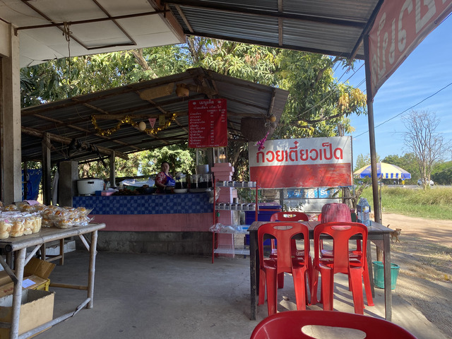

正月です。おせち料理です。

ではなく、いつものクイッティアオです。

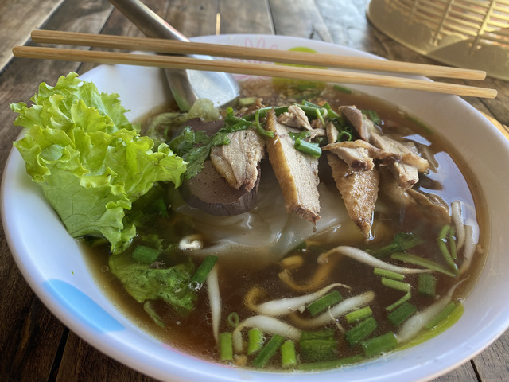

เป็ดは何でしょうか。鴨ですかね。
とてもおいしかったです。

相変わらずまっすぐな道路を進んで行きます。

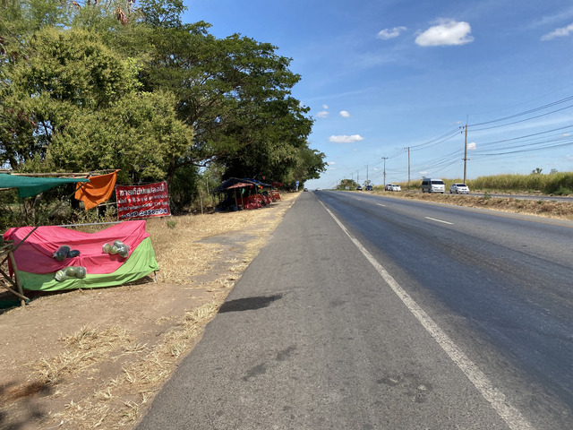

交通量が少ないからでしょうか、田舎に行くほど路面がよくなってきた気がします。

しばらく、進んでいると、オーラーファームという看板が見えました。

今回の旅で、ファームにはおいしいものがある、ということを学習したので、さっそく寄ってみることにします。

はい。学習結果はは正しかったようです。

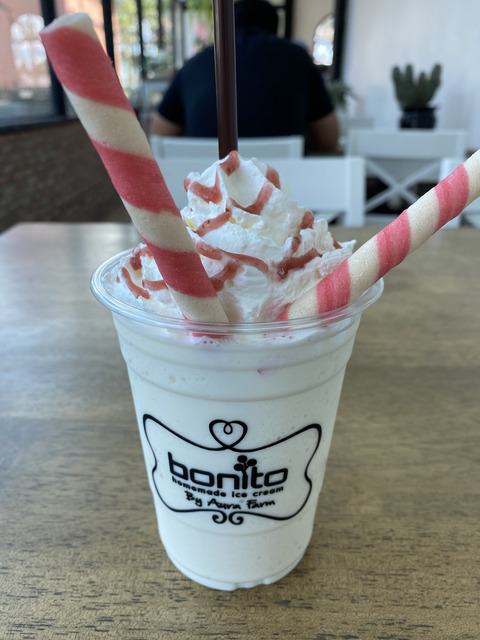

正月の朝からおしゃれですね。

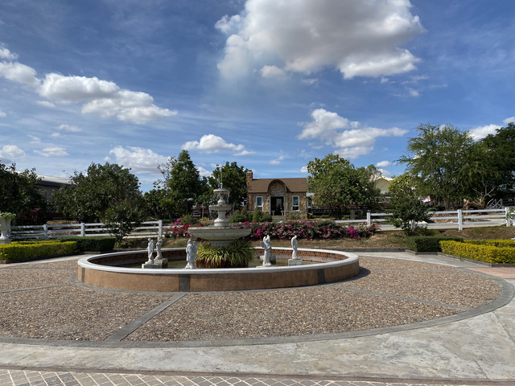

庭園なんかもありました。

きれいな青空の下を、さらに北へ進みます。

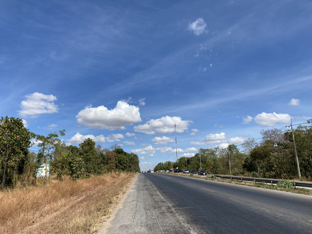

Khon Kaen Zooという動物園もありました。

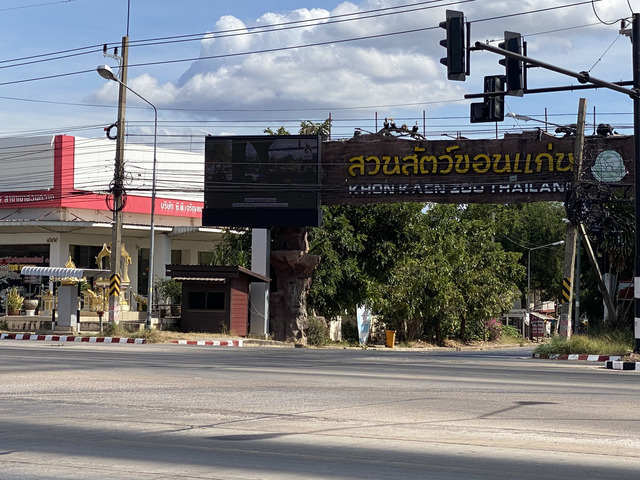

旗がたなびく写真を撮ってるときは、向かい風なんですよね～。

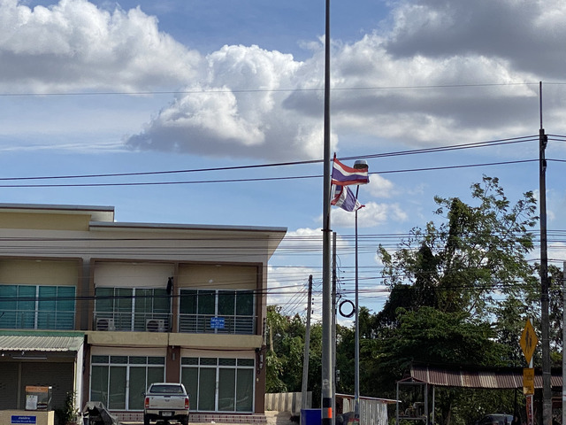

どんどん進みます。

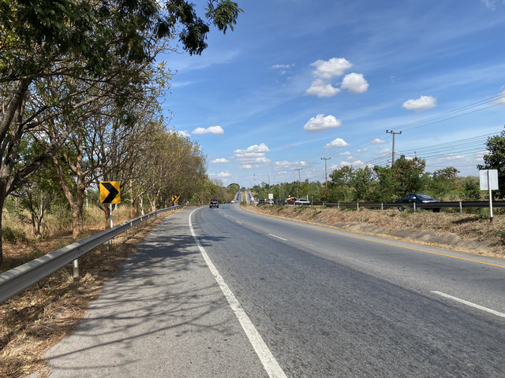

国道2号線、400kmまで来ました。

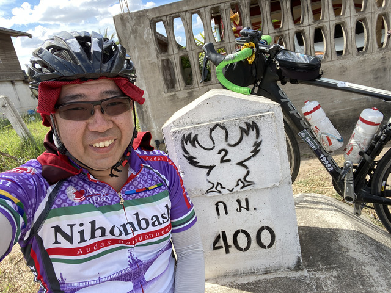

なぜ、ガソリンスタンドを撮ったのか覚えがないですね。

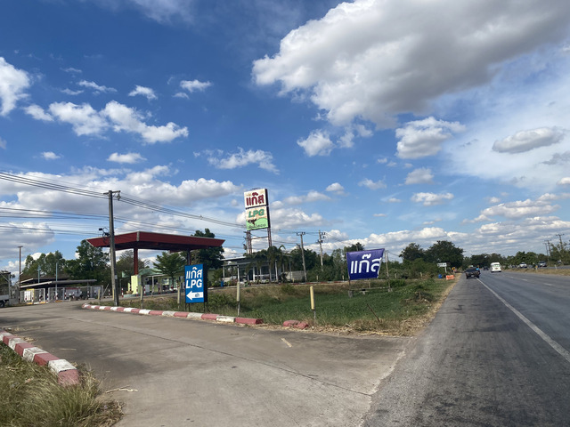

タイのガソリンスタンドはLPガスも置いてたりします。

自転車がありました。

何か売っているようです。

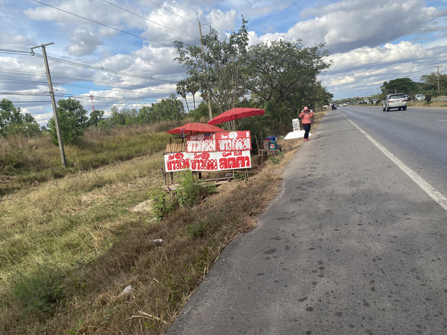

気になるので寄ってみました。

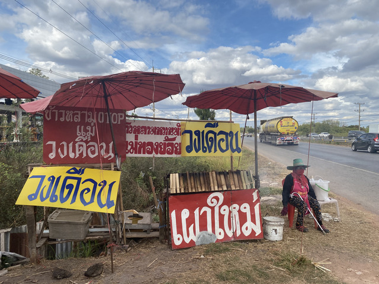

木の筒を3本買いました。

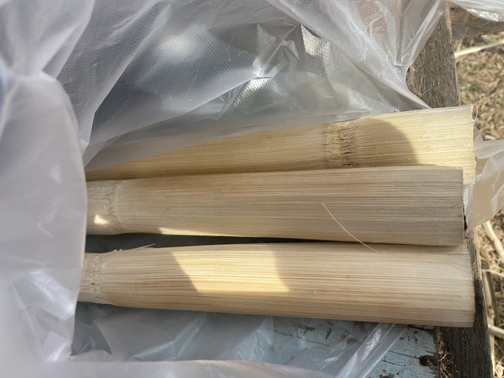

中はご飯などが入っていて、蒸されているようです。

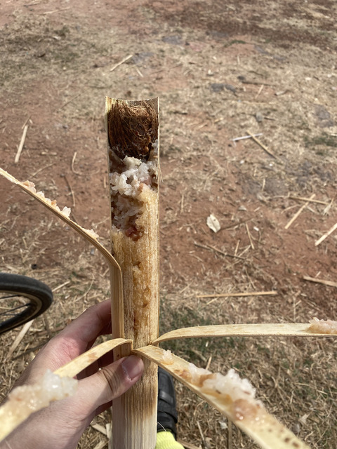

おやつにちょうどいいですね。
いただきます。

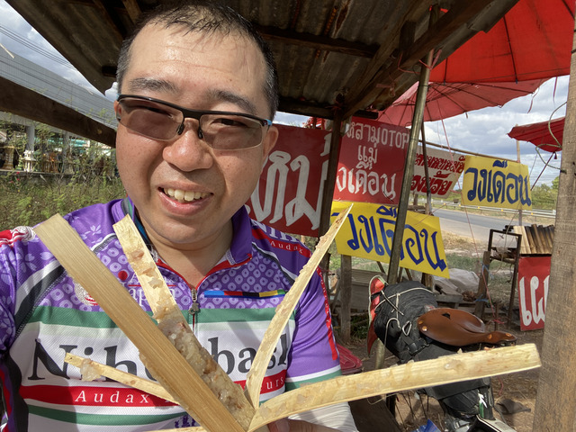

しばらくすると、ウドンタニーに入りました。

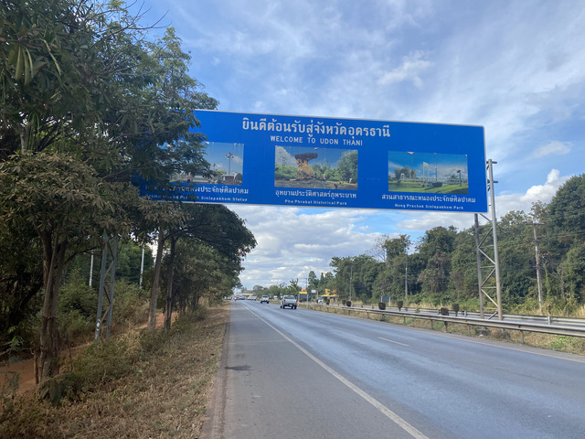

このあたりは、至る所にカイヤーンのお店が出ています。

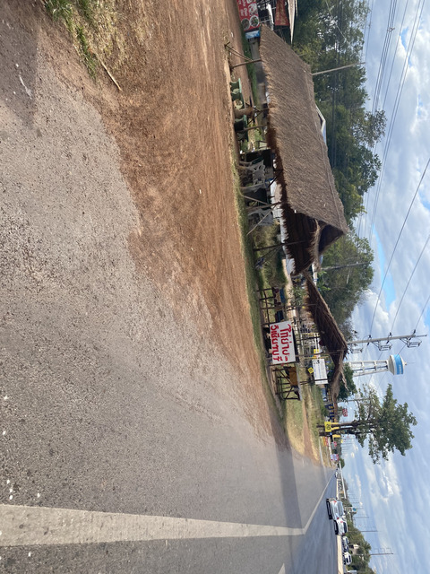

カイヤーンはイサーン地方の料理で、焼き鳥です。

## ウドンタニー

宿に自転車を置いて、ぶらぶら散策です。

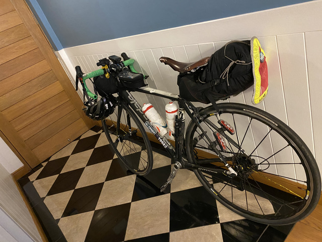

ウドンタニーは駅を中心に賑やかな街です。

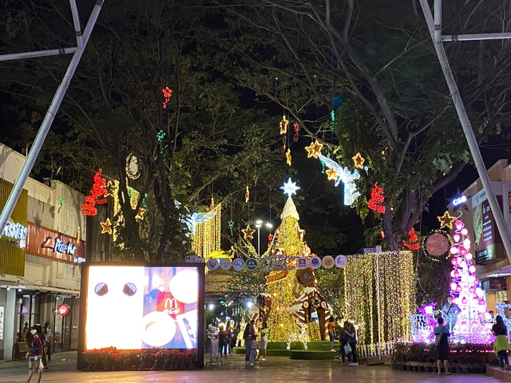

例によって晩ご飯を何軒かはしごします。

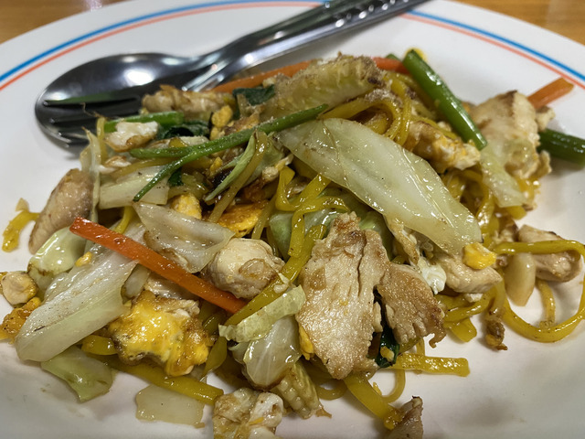

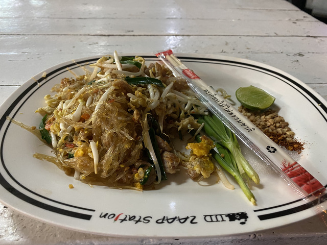

ごちそうさまでした。

[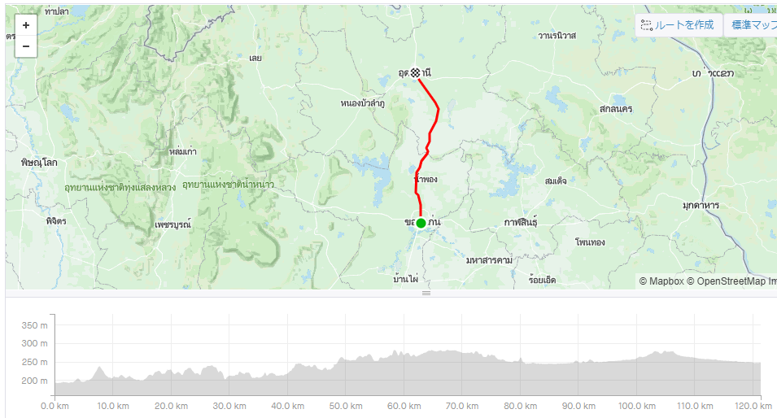](https://www.strava.com/activities/2972156827)

今日の移動: 121.3km 計: 598.6km
