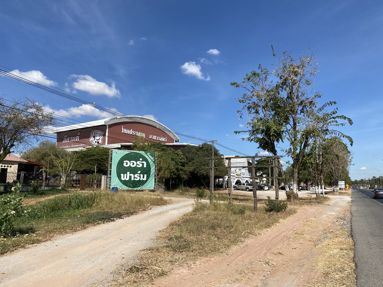
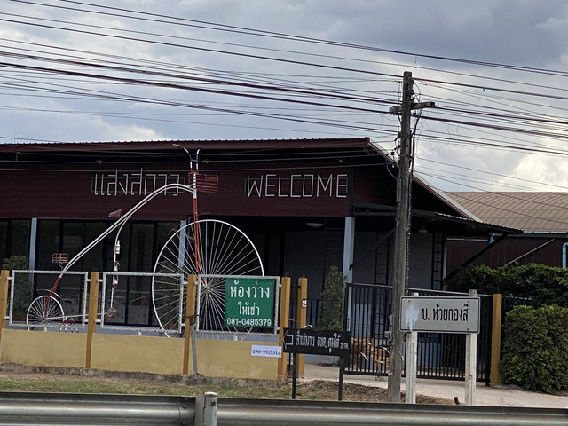

## コンケーン出発

สวัสดีปีใหม่ครับ. あけましておめでとうございます。

年が変わりました。2020年1月1日です。
ノンカーイまで行こうかどうか迷いましたが、今日はウドンタニーまで行くことにしました。

出発して、しばらくすると食堂がありました。

正月です。おせち料理です。

ではなく、いつものクイッティアオです。

เป็ดは何でしょうか。鴨ですかね。
とてもおいしかったです。

相変わらずまっすぐな道路を進んで行きます。

交通量が少ないからでしょうか、田舎に行くほど路面がよくなってきた気がします。

しばらく、進んでいると、オーラーファームという看板が見えました。

今回の旅で、ファームにはおいしいものがある、ということを学習したので、さっそく寄ってみることにします。

はい。学習結果はは正しかったようです。

正月の朝からおしゃれですね。

庭園なんかもありました。

きれいな青空の下を、さらに北へ進みます。

Khon Kaen Zooという動物園もありました。

旗がたなびく写真を撮ってるときは、向かい風なんですよね～。

どんどん進みます。

国道2号線、400kmまで来ました。

なぜ、ガソリンスタンドを撮ったのか覚えがないですね。

タイのガソリンスタンドはLPガスも置いてたりします。

自転車がありました。

何か売っているようです。

気になるので寄ってみました。

木の筒を3本買いました。

中はご飯などが入っていて、蒸されているようです。

おやつにちょうどいいですね。
いただきます。

しばらくすると、ウドンタニーに入りました。

このあたりは、至る所にカイヤーンのお店が出ています。

カイヤーンはイサーン地方の料理で、焼き鳥です。

## ウドンタニー

宿に自転車を置いて、ぶらぶら散策です。

ウドンタニーは駅を中心に賑やかな街です。

例によって晩ご飯を何軒かはしごします。

ごちそうさまでした。

今日の移動: 121.3km 計: 598.6km
