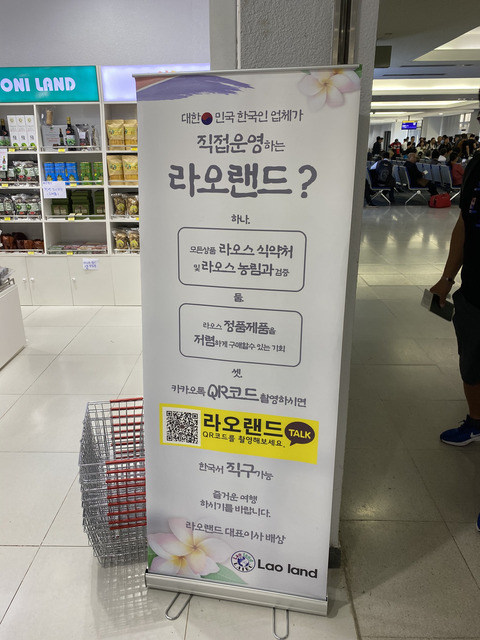
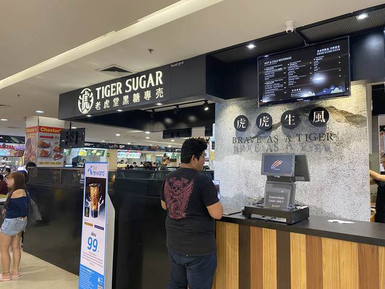

## ヴィエンチャン空港

今日は飛行機輪行で一気にバンコクまで戻ります。

宿から空港までは自転車で移動です。

ヴィエンチャンはラオスの首都ですが、小さな空港です。

輪行袋に詰めて、このまま預けます。

11:40のバンコク行きです。

ラオスではクルンテープではなく、バンコクと書くのですね。
ていうか、仁川に10分おきに3本飛んでるのですね。

それでか、ラオスの空港は韓国語だらけです。

ラオスは日本からは直行便がないので、来にくいんですよね。

## タイスマイルエアウェイズ

ということで、タイスマイル航空で出発です。
ちなみに、タイ航空と違って、スターアライアンスは使えません。

機内食が出てきました。

先週に続き、2度目のスワンナプーム空港です。

入国に時間がかかるかと思っていたのですが、かなり空いていました。

## バンコク

黒糖タピオカミルクティのお店を見つけたので行ってみました。

ついでにさっき食べましたが、また、ご飯を食べます。

クワィチャップと、

カオターキーです。

ブルベ腹ですね。

エラワンプームに初詣にもいっておきました。

