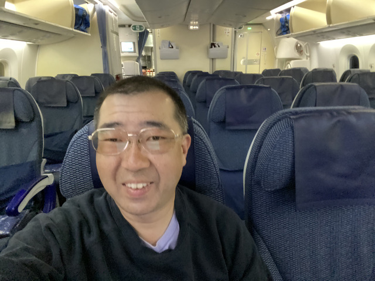

## スカイレーン

タイに住む日本人の友達が巨大な車で朝6時に迎えに来てくれました。
今日は、スカイレーンをサイクリングして、そのまま飛行機で帰ります。

スカイレーンは、1周23kmくらいの自転車専用のサイクリングロードです。
場所は、スワンナプーム空港のすぐそばにあります。

早朝にもかかわらず、超巨大な駐車場には車がたくさん止まっています。
というか、逆にお昼は暑いのでガラガラです。

入場するためのパスがあるのですが、なくしてしまったので、再発行をお願いしました。
次回来たとき、またもらえるそうで、今日は、仮のONE DAY PASSを借り受けました。

初めての人は、登録にパスポートが必要なので、忘れないように持って行きましょう。

入口はこんな感じで、自動改札機のところにPASSをかざすと、認証されて上のモニターに顔が表示されます。

3人で記念撮影です。

いつもはもう一人いるのですが、今、バンコクからチェンマイまで走ってるそうで、今日は欠席です。

コースは反時計回りの一方通行で、水色と紫のレーンにわかれています。

水色は低速走行、紫は高速走行用のレーンです。

我々はのんびりと雑談をしながら水色のレーンを走ります。

空港のすぐ側なので、飛行機も見えます。

いろいろ話しながら、なんとなく2周しました。

走行距離はだいたい48kmでした。

## スワンナプーム空港

スカイレーンで自転車を箱に詰めて、空港まで送ってもらいました。

飛行機は17:40なので、まだまだ時間があります。
だいたい、空港のチェックインは早くても出発の2時間前か3時間前なのですが、スワンナプーム空港には裏技があります。

スターアランアンスGOLDであれば、開いてる時間はチェックインできます。

ちなみに、プノンペン行きです。

いっぱい運動してお腹が空いたのでご飯にします。

まだまだ時間があるので、タイマッサージを受けました。
これで、1週間の疲れも全部取れました。

いい時間になってきたので、保安検査を受けてラウンジ巡りをします。

この空港は、たくさんの航空会社が入っているので、数え切れないくらいのラウンジがあります。

さて、プノンペンに向けて出発です。

機内食が出てきましたよ。
たくさん運動したので、もう少し食べても大丈夫でしょう。

## プノンペン

カンボジアはビザを待っていないので、トランジットのみです。

さすがに全く読めませんが、ナリターと書いてあるような雰囲気は伝わって来ます?!

ラウンジに入ってみました。

もう、食べなくてもいいですよね･･･。

でも、ちょっとだけ食べて、

ラウンジ内にシャワーがあったので浴びてみました。

それでは、日本に帰りましょう。

おやすみなさーい。
