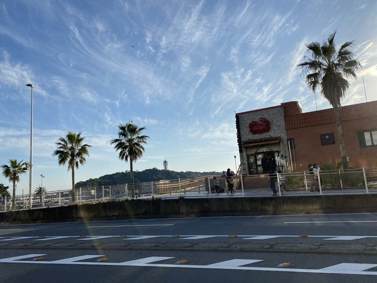

## はじめに

オダックスランドヌール日本橋主催のブルベ100周年記念イベントに参加してきました。
1921に初めて開催されたブルベのルートをオマージュしたルートになっています。
100年前のルートは、パリを出発してドルー(Dreux)、シャルトル(Chartres)を経由してパリに戻る周回ルートでした。
さて、どんなルートに仕上がっているのか楽しみです。

## スタート

スタートは{}です。

延期開催されたBRM123(難読地名)のスタート受付を担当してからスタートに移動したので、スタートは午前7:15でした。

ベルサイユ宮殿は朝早かったからか、門は閉まっている状態でしたが、きらびやかな門は美しいです。
天気も快晴で、いいサイクリングになりそうです。

{}を抜けるまでは、渋滞や信号が多く相変わらずスムーズに走れるとは言いがたいですが、途中川を渡る橋の上から{}がきれいに見えました。

市内を抜けて少し郊外に入ると、美しい銀杏並木になりました。

たぶんここがシャンゼリゼ通りです。

シャンゼリゼ通りを過ぎて登り区間の始まりです。
高尾山口のインターを過ぎると車も少なくなり、ここに来るまでの平坦路より平均速度は速いかも知れません。
しかし、コロナ明けだからか、昨年来たときよりは交通量はかなり多いように思いました。

相模湖に下った後も、相模湖の駅前の信号を先頭に長蛇の渋滞でした。

渋滞を抜けて、アップダウンをしばらく進むと、通過チェックの上野原駅に到着しました。

11:59までに着けばいいところ、10:51に着いたので、1時間ちょっと余裕ができました。
少し余裕があるということは、観光しないといけません。
(このあとかなりアップダウンなので余裕があると考えることは間違っているのですが、知ったこっちゃありません。)

上野原駅には400mほど、行って来いになっているので、わざわざここをチェックポイントに選んだことがうかがえます。
しかし、100年前のフランスのブルベというテーマからの関連性がなかなかわかりません。

そんなことを考えながら後ろを振り返ると、食堂があったので、ここに寄ることがルート作成者の意図かな、と勝手に決めつけて食事にすることにしました。

外の看板の一番上に書いてあった人気メニューっぽいのが、ルート作成者の食べてほしいものに違いない、というとで、牡蠣カレーチャーハンを注文しました。

お昼には早い時間でしたが、早起きしてお腹が空いていたので、牡蠣カレーチャーハンは非常に満足でした。
これでここからのアップダウンも元気に進めそうです。

ちなみに、正解は、この近くにある正法寺というところに土塁があって、これがドルー(Dreux)たというだじゃれだったそうです。
参加者に牡蠣カレーチャーハンを食べさせたかったわけではなかったのですね。

## ひたすら続くアップダウン

ご飯を食べて出発すると、さっそく{}が見えてきました。

いくつかアップダウンを進むと、ぶるべの樹がありました。

すごい！！
まさにブルベ100周年にふさわしいポイントです。

さらにアップダウンを進むと、出てきました！
みんな大好きな丸い輪っかのある道路です。{}です。

途中何回か12%の看板が出てきます。
牡蠣カレーチャーハンのおかげでスイスイ上ったので途中の写真はありません。
丸い輪っかがガタガタガタガタと走りにくいので、斜めに○のない部分をうまく通ろうとしましたが、うーん、無理ですね。

牧馬峠を下ったあと、もうひつとくらいアップダウンがあって、キューシートによるとその後は下りだそうです。

しかし、その下りの手前の曲がり角で悲劇が起こります。

## 通行止めからの迂回

なんと、全面通行止めです。

この先まで行って戻って来た人の話によると、道路が全面バリケードで封鎖されていて、間から通れるとかそういうレベルではないようでした。

そもそも、崩落なので、間から通れたとしても、進んでるうちに追加で崩落したら死にます。

ということで、迂回するしかないのですが、崩落したのは★の虹の大橋というところです。

なんせ大きな湖で他に渡れる橋がないので、湖をぐるっと回らないと行けません。
しかも、湖に沿って道があるわけではないようで、ちょっと離れたところまで回り道をする必要があります。

湖の周りってだいたいどうなってるかご存じでしょうか。
そう、湖って四方八方が山に囲まれてるんですよね。

200mくらい下って、また登るんですよ。
距離も元々のルートより10kmくらい余分にあります。
でも、通れないんだから仕方がないですよね。
諦めて遠回りすることにします。

通行止の方から戻って来たYさんと一緒に出発します。
が、先に行ってもらいました。

そうです。
ただ遠回りするだけでは済ませられません。
しっかり観光します。

美しいですね。
{}です。

奥の方にダムが見えますが、あの上を通れるといいんですけどね。
もっともっと向こうから遠回りです。

大変なのに意外と楽しそうな顔をしてますね。安心しました。

と、いうのもつかの間。

激坂を下ると、なんかの有料施設の駐車場にぶつかりました。
どうやら突き当たりのようです。
湖を時計回りなので、右へ右へと行けばいいと思っていたんですが、罠にはまったようです。

地図を確認しながら元ルートに戻れる道を進みます。

やっと、戻れそうな気がしてきました。
なぜか、登坂車線とか書いてありますが、ここを登って行けば、あの山の向こうが{}です。

さて、やっとルートに復帰しました。

この時、すでにオンタイムです。貯金はちょうどゼロ。
さて、仕切り直しで行きますよ。

## {}

ここからは、キューシート通り下りです。
だいぶ昔にヤビツ峠を一周してよく通った道です。
懐かしい気分で走ります。

134号に出ると車の流れのせいか追い風です。
気持ちよく飛ばしていると、Yさんがいました。
Yさんを吸収してズンズン進みます。

しばらくすると、見えてきました。
{}です。

すぐに2つめのチェックポイント、{}駅に到着しました。

竜宮城がモチーフなのだそうです。

参考の制限時刻は16:31、現在時刻は15:30なので、ちょうど1時間余裕があります。
が、このときは、なぜか計算間違いをしていて30分くらいの余裕だと思っていました。

ま、時間があろうがなかろうが関係ありません。

おやつの時間です。

タイのお茶で作ったアイスをいただきます。

フランス関係ないですがいいでしょう。

そういえば、今回のルート上にもローソンが何軒かありましたが、さすがここはフランスです。
パリチキが売られていました。

## 通過チェック3へ

しばらく走ると、{}がありました。

パリを出発してドルー、シャルトル、パリへと回る今回のルートのシャルトルまで来ました。

あとは、パリまで戻るだけです。

と思っていた矢先、ドルーに逆戻りです。

ドルーの写真を撮っていると、後ろを{}が通って行きました。

ドルーはやはり、DNFしやすいポイントのようです。

港が見える丘公園までの激坂の手前、Yさんに追いつきました。
足を残しておいた方が得策だろうということで、激坂は押し歩きました。

ここまで渋滞や信号が多かったのもあって余裕は55分。
Yさんは、僕の45分前に出発しているので、10分の貯金です。

ちょっと不安そうなYさんですが、ここからは平坦です。
頑張れ～。

僕はちょっと観光です。

迂回したりして遅くなったおかげで、ちょうど夜景の時間に来ることができました。

こりゃ美しいですね。
ちなみに、この展望台のあるところはフランス山とも呼ばれるそうです。
何のために上らされたのか、昨年のミステリーのルート使い回しただけちゃうの、と一瞬思いましたが、ちゃんとわけがあったんですね。
素晴らしい景色と、意味のある設定に感服です。

## ゴールまで

赤レンガ倉庫や観覧車のところを通過していると、ブルベ中の方に会いました。

話を聞いてみると、R東京の真鶴に参加していたようです。
別のルートの参加者とたまたますれ違うのは楽しいですね。

{}へ戻る途中、自由の女神も祝福してくれました。
あっち向いてますが。

{}に入った頃、またYさんに追いつきました。
どうしてるのかと心配していましたが、今ここで会ったなら、時間内にゴールはできるでしょう。

安全運転を心がけながら、人や車の多い{}を進みます。

神宮橋とフランスの関係はわかりませんが、ここから先は{}です。

朝に通ったところではなく、こっちが本当のシャンゼリゼだったようです。

オー・モッテサンドー オー・モッテサンドー♪



{}を抜けると、まもなく、{}が見えてきました。

ついに{}に戻って来ました。
時刻は19:46。
12時間31分で無事ゴールです。

Yさんも13時間15分くらいのはずですね。
満面の笑みでのゴールです。
お疲れ様でした！
