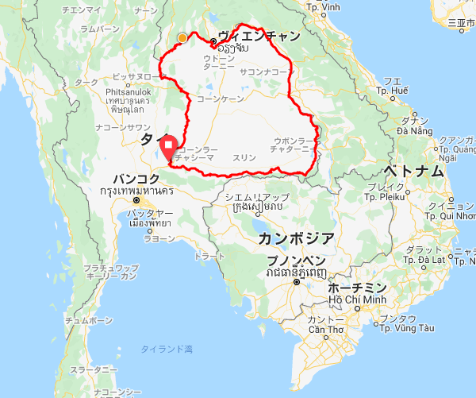

## ISAN 2020

2020年2月2日、タイで2020kmのブルベが開催されたので、参加してきました。

制限時間は168時間と202時間の2つから選択することができます。
長すぎてよくわからないので、日数にすると、7日ちょうどと、8日と10時間です。
いやいや、それでもよくわからないので、時速にすると、12km/hと10km/hといえば想像しやすいでしょうか。

どちらを選択しても、とくに結果に変わりはないようなので、202時間を選択しました。
朝7時のスタートなので、8泊9日で2020kmを旅行すればいいだけ、ということになります。
理論上は・・・。

## 場所

タイトルの通り、タイの東北部に位置するイサーン地方をぐるっと反時計回りに一周するルートです。

イサーン地方は、平均標高約200メートルの緩い起伏が続くコラート高原がほぼ全域に広がっているそうで、大きな山はなくてもアップダウンはありそうです。

コースのプロファイルを見ると、1300km以降はのんびりと進めるように計画した方がよさそうです。

## 大会情報

ホームページが残っているようです。

[ISAN2020 公式ホームページ](http://www.isan.bike/2020/#)