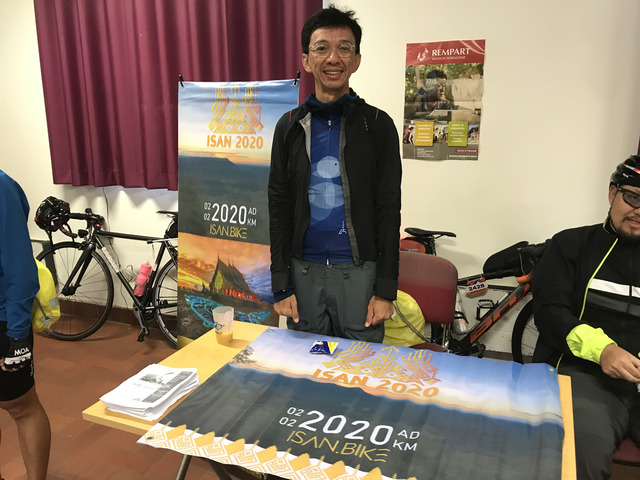
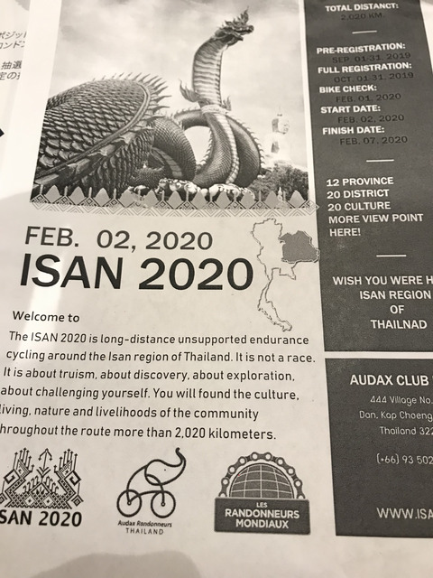
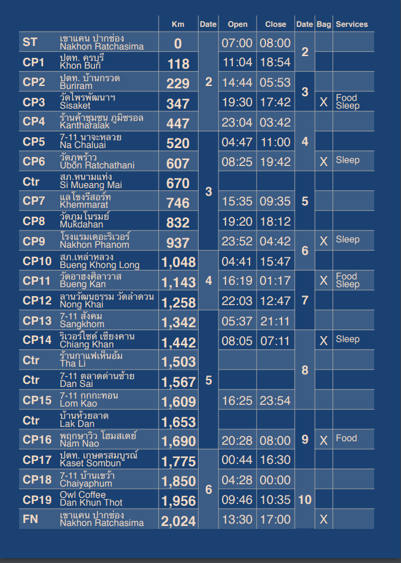
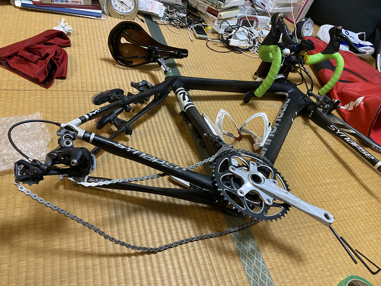
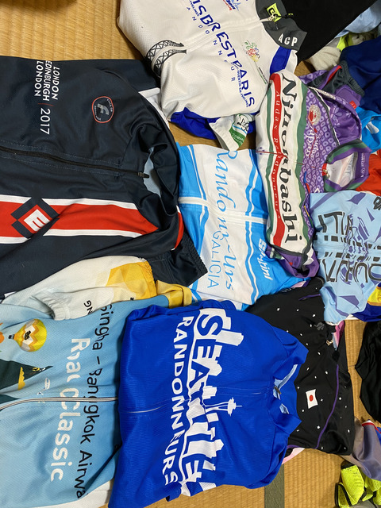
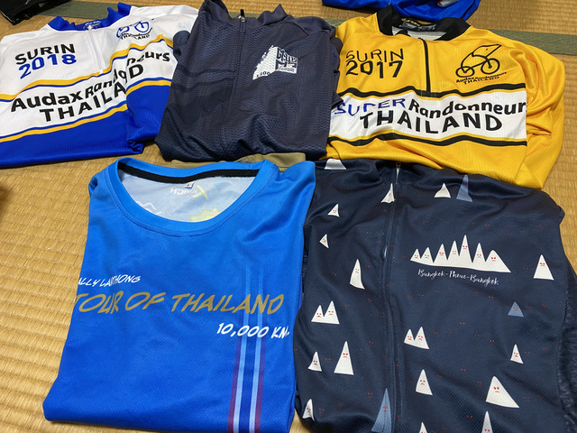
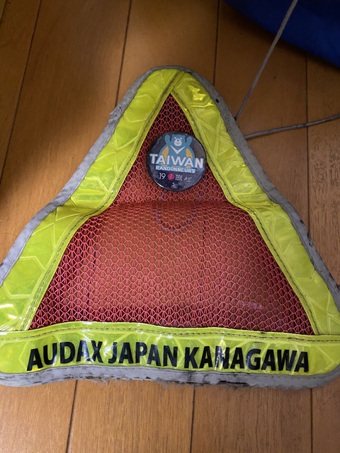
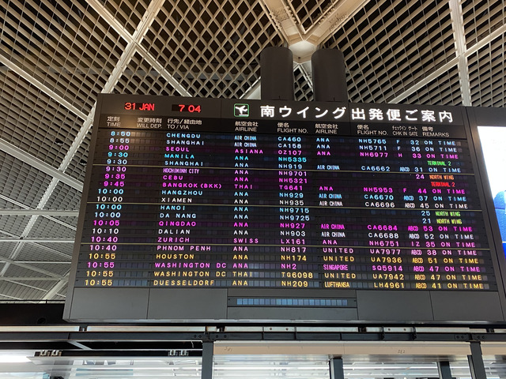
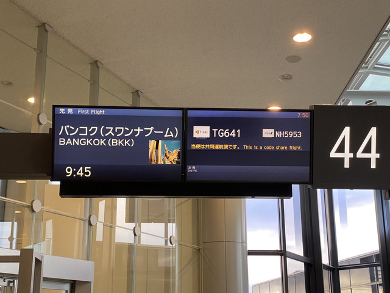
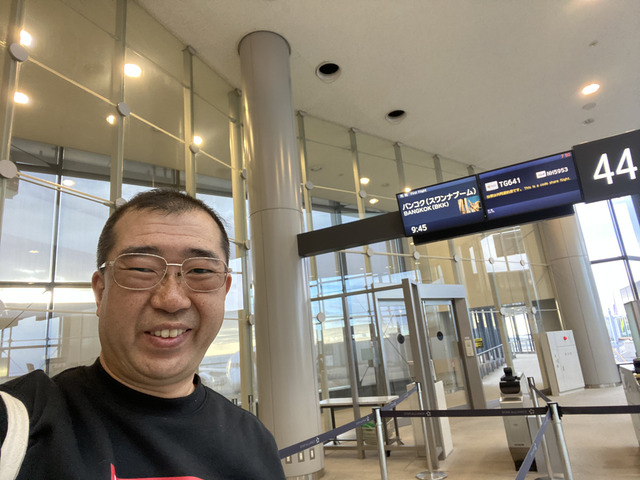

## ISAN2020との出会い

Facebookの情報等で2020年に2020kmのブルベをやるという噂は聞いていたのですが、半分冗談かなとも思っていました。

ところが、PBP2019に参加したとき、受付近くの宣伝ブースどLELなどに混ざってタイのブースが出展されていました。

チラシも用意していて、どうやら本気のようです。

しかし、2/2スタートでFinishが2/7となっています。
仮に0時スタートだとしても6日で2000kmはさすがにちょっときつすぎますね。

でも、ま、どうせタイのことだから、後で変わるでしょう。
(実際、後で変わりました)

どうやら本気だということがわかったので、予定を立てられるか検討してみることにしますが、なんせ、今年はRAAMのクルーをやって、PBPに参加してと、有給を使いまくりなのです。
ま、この際、もっと使っちゃいましょうかね。

## 申し込み

今回は、オダックスタイランドのホームページからではなく、ISAN2020専用の特設サイトからの申し込みでした。
サイトでは、申し込み開始数日前になると、秒単位のかっこいいカウントダウンが始まりました。
日本のエントリー峠に慣れているので、こういうのを見ると0秒キッカリに申し込まないといけない気分になってきます。

10、9、8...パソコンの時計を合わせて、申し込みボタンが現れるのを待ちます。
3、2、1、0、-1、-2、-3... あれっ？！
申し込みボタンが出る気配はありません。

もしかして、タイは2時間時差があるからでしょうか。

2時間後に再チャレンジです。

が、2時間を過ぎても、2時間半を過ぎても、申し込みボタンは現れる様子はありません。

どうやら、考えすぎたようです。そもそもタイのブルベには日本と違ってエントリー峠なんてものはありません。
申し込んだ人全員が参加可能なのです。
多いときには2000人近くになったこともあるようです。

結局3, 4時間後にサイトはオープンしました。

参加費は、スタート地点への送迎、記念ジャージなど含めて9200バーツくらい(3万円くらい)でした。

## スタート地点への送迎

スタート地点はパクチョンという田舎町です。
送迎してくれるというので、その方が便利なので申し込んだのですが、どこから出発するとかの情報がありません。

問い合わせてみると、どこでも行くよ、とのことでした。
要するに、車で参加する人が空いてるスペースに乗せるという仕組みのようでした。

ちゃんとマッチングするのか心配になるのは日本人だからでしょうか。

## 走行計画

GPSデータやキューシートの準備なども大事なのですが、泊まる場所についても簡単に予習しておくことにします。

タイは暖かいので、まぁ、どこで仮眠してもいいのですが、野犬なども多く適当に道ばたで寝ようとしても、うまく眠れない場合があります。

チェックポイントには仮眠場所がありますが、できればホテルでしっかり眠る計画も盛り込みたいと思います。

各チェックポイントの情報はこんな感じです。

1日目はCP3(347km)で寝るのがよさそうです。
2日目はCP6(607km)でもいいのですが、CP3から260kmしかなく、3日目をCP9(937km)にしようとするとCP6からは330kmあります。
できれば、2日目を増やして3日目を減らしたいところです。
いろいろ探してみると、CP6から25kmほど先にリゾートホテルがありました。
ちょうどいいので予約しておきます。

4日目はCP11だと210kmなのでちょっと近すぎます。CP14までは行けるわけがないので、CP12のNong Khaiか少し手前で宿の候補を調べておくことにします。

このあたりまでで、既に、おそらく皮算用でしょう。
予定は未定なので、ルート上に宿のありそうなところだけ調べておくことにします。

## 出発準備

さて、出発2,3日前です。

自転車をばらして箱に詰めたり

持って行くジャージの選定をします。

いつの間にかたくさんのジャージがあるのですが、今回は、機能重視で選択します。
着脱しやすいようにフルジッパーで、着心地がゆったりしたもの(これ重要)優先で選びました。

タイのジャージは好きなのですが、残念ながら落選です。

神奈川の大おにぎりも持って行くことにします。

これがなかなか目立つので、僕がAUDAX KANAGAWAの人だと勘違いしている人もいるようです。

これがなかなか目立つので、僕がAUDAX KANAGAWAの人だと勘違いしている人もいるようです。

## 出発

さて、どこに行こうかな。

1月31日、まずはバンコクに向けて出発です。

行ってきまーす！
