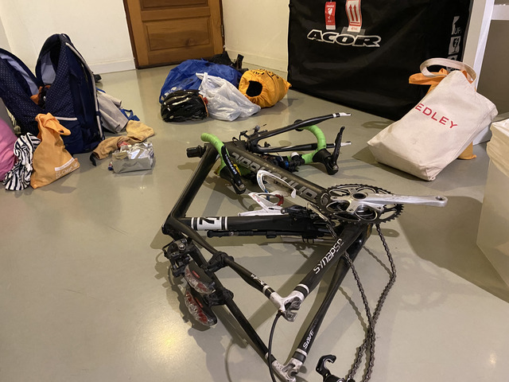

## 到着～バンコク

さて、バンコクスワンナプームに到着です。

この前正月に入国したときも思ったんですが、今回はそれよりも、もっともっと入国する人が減っています。
新型コロナの影響で、中国からの飛行機がキャンセルになっているからだと思うのですが、この感じだと、海外と行き来できるのは今月いっぱいくらいかも知れない、という気がしてきます。

いつのもように、エスカレーターの壁をこすりながら進みます。

直接スタート地点に行ってもよかったのですが、箱やいらない荷物がない方が身軽なので、バンコクで1泊して荷物はここで預かってもらうようにしました。
ここの宿の部屋は広いので自転車の組み立てには便利で、箱もいつも預かってもらってるので安心です。

## バンコク～パクチョン(スタート地点)

翌日、事前に連絡を取り合っていたAodyさんがピックアップに来てくれました。

これなら何台でも積めそうです。

インドからの参加者もピックアップして、3人でスタート地点に向かいます。

## 受付

受付は運動公園のようなところで建物やシュワーもありました。

Shimanoのブースもあってメンテしてもらえるようです。

Shimanoのブースもあってメンテしてもらえるようです。

受付はこんな感じです。

ジャージはまだ間に合わなかったそうで、サンプルを着させてもらいました。
なかなかいい色なので、早く欲しいのですが、2021年5月時点でまだ到着していません・・・。

受付では、ドロップバッグ6枚と、ブルベカード、キューシート、ゼッケンをもらいます。
また、500バーツの保証金を払ってGPSを受け取ります。

本体の写真を撮り忘れたのですが、このGPSはほんとに小さくて邪魔にならず素晴らしかったです。
下の写真の黒いのがケーブル込みの画像です。

本体の大きさは一般的なUSBメモリより少し小さいくらいで、電池は3日くらい持つそうです。
充電は1時間くらいで終わります。
でかい上に感度の悪いSPOTなんかとは比べものになりません。

ドロップバッグは6枚あり、預けると、それぞれ347km, 607km, 937km, 1143km, 1442km, 1690km地点のCPで受け取れます。

## ドロップバックの準備

スタート地点近くに予約したホテルに移動し、ドロップバッグを詰め込みます。

ジャージ、靴下、100KCalの粉飴3つ、仮眠所の夜はたまに寒いのでエマージェンシーシート、替えのチューブ、ライトの替えの電池、乾電池、このあたりは全バッグに入れます。
ライトの電池は夜間や早朝の走行が多くなりそうな区間は2つにしておきます。
モバイルバッテリーは2と4に入れます。
タイヤの替えは1本は積んでるので、4に入れておけばいいでしょうか。

1つのドロップバッグが移動する方式ではないので、電池やチューブの予備は多く必要になりますし、数の少ないものは、どこに入れるかが悩ましいです。

これに、レーパンを加えて完成です。

レーパンは4着しか持っていないので、2, 4, 5に入れてみました。

寝る場所とドロップバッグのあるCPが必ずしも一致しないので、パジャマやお休みセットは自転車に積んでおきます。

と、書いてて気付いたのですが、1泊目がCP1なのはほぼ確定なので、1に入れてCP1までは身軽にしておけばよかったですね。

## ブルベカード

もらったばかりのブルベカードはこんな感じです。

はたして、2月10日の17:00までに戻ってこれるでしょうか。

## ブリーフィング

ブリーフィングはタイでははじめてな気がします。
というか、どこにもやるよと書いてなくて、友達に、ブリーフィング終わったら飯行こうぜ、と誘われるまで知りませんでしたが。

スライドを使ってのルートの簡単な概要説明もありました。

## 前夜祭

なぜか、ご飯をごちそうになりました。

タイのブルベを立ち上げた方達だそうです。

7-11に買い出しに行ったら、香港シンガポール軍団がいました。
おー、お久しぶり！

## エイドステーション？！

宿に戻ると、Surinに住む友達からメッセージが来ました。

「Surinのあたりは何日の何時頃どの辺通るの?」

話を聞いてみると、自分の住んでいるところの近くを通るようなので、エイドステーションを作りたいということでした。

Surinは明日の目的地であるCP3の少し手前にある町です。
おそらく、速い人で21時くらい、遅い人で深夜2時くらいに通過するのではないかと思われます。
とりあえず、ルートやスタートからの距離などを伝えておきました。

おやすみなさい。

## スタート準備

夜はぐっすり寝て、翌日スタート準備です。

朝食をいただきます。

記念撮影です。

スタートの看板もありました。

スタート地点のハンコをもらいます。

スタート直前の様子です。

さて、これから9日間、2000kmの長丁場。
みなさん、よろしくお願いします。

それでは、行ってきます！
