## スタート:เขาแคน ปากช่อง～CP1:Khon Buri(ครบุรี)7-11: 118km

カウントダウンが終わると、一斉に、というわけではなく、いつものようにのんびりとスタートします。
特に狭い公園内を抜けて大通りに出るので、ゆっくりと進みます。

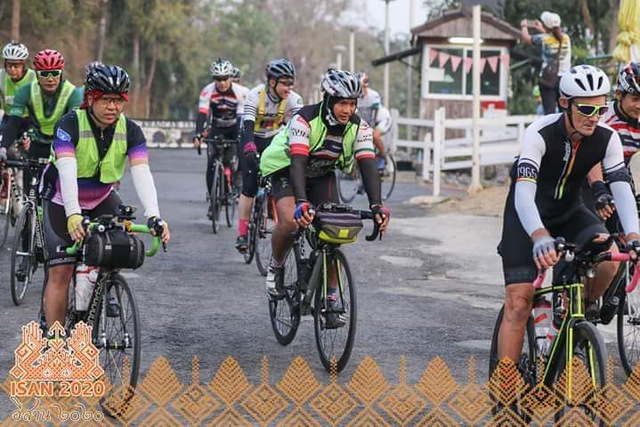

大通りに出ると徐々に速度が上がります。
前の方にPhadyaさんの集団がいたので着いて行きます。
少し向かい風なので助かります。
ていうか、あれれ。CP1まではゆっくり行くとかいってたくせに、35km/hくらい出てますやん。
ま、せっかくなので、しばらくついて行くことにします。

僕のペース的にはちょっと頑張りすぎのゾーンに入っているのですが、ま、序盤なので大丈夫でしょう。
しかし、さすがはイサーン県。
バンコク近郊のスタートとは違い、すぐに緩いながらもアップダウンが始まります。
しばらくは集団に着いて行きますが、さすがにきつくなってきたので、残念ですが、さよならです。

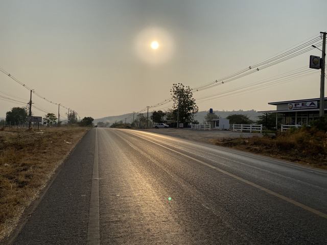

風車があったりと景色もいい感じです。

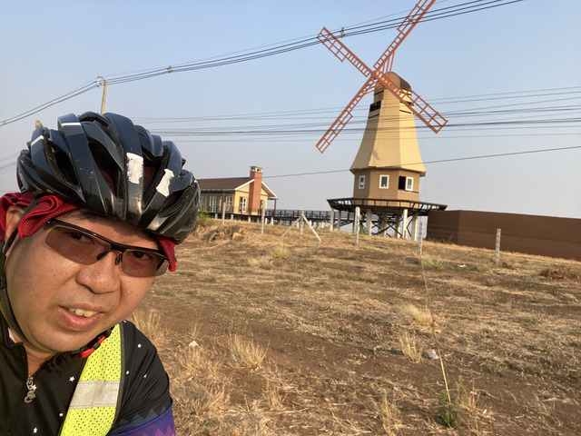

少し向かい風とアップダウンがきついところですが、路面は非常によく、信号もまったくありません。

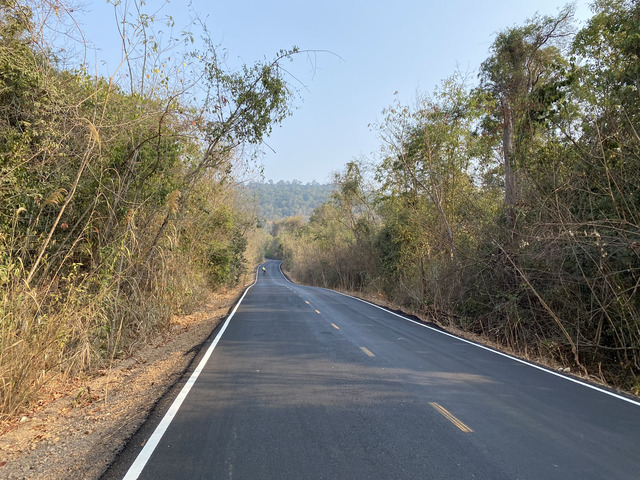

と、油断をしていると、えげつない激坂が現れました。
1kmくらいで150mくらい登ります。

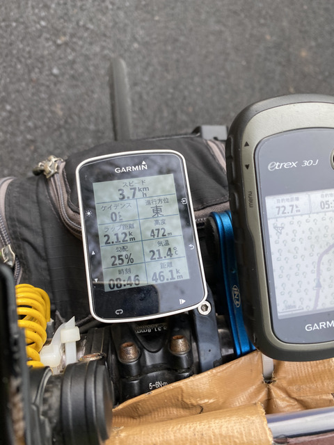

こんな坂と戦って体力を使っても仕方がないので、のんびりと押し歩きしていると、隣を「歩いてもほとんど速さ変わらないよね～。」と言いながら、立ちこぎしている人がほとんど変わらない速度で追い越していきました。

激坂を過ぎると、平坦や軽いアップダウンで平和になりました。
何人か同じような速さの人たちがいたので、しばらく一緒に走りました。
話はしなかったのですが、たぶんインドから来た人たちでしょう。
今回は、インドから多く参加しているそうです。

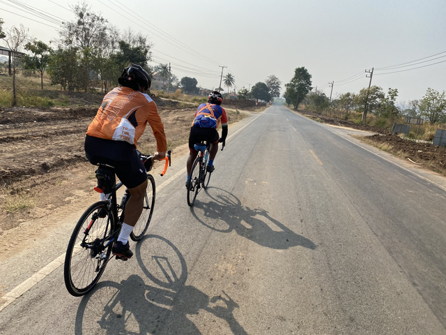

しばらく走っていると、先頭をNikornさんが牽いている集団に会いました。
Nikornさんとは、おととしのGT(タイ版ヘブンウィーク)でも何度もご一緒しました。

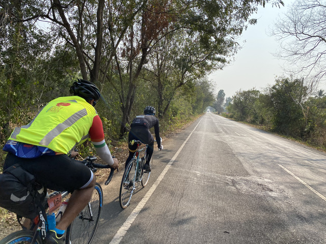

かなり速いので、着いて行くとひどく消耗することは前回経験済みなのですが、せっかくなので一緒に行くことにしました。

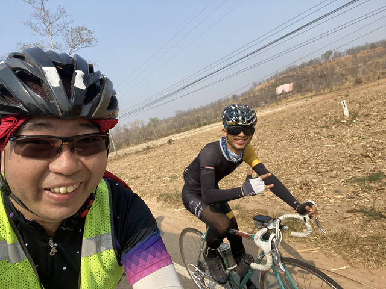

ドロップバッグがあるとは言え、これから2024kmも走るとは思えないほどの軽量です。
ていうか、何も持ってません。
心配性なので、ついついいろいろと持ち運んでしまうのですが、これくらい潔くなりたいものです。

そうこうしているうちに、CP1到着です。
このCPは7-11なので、食べ物や飲み物を買って、ブルベカードにスタンプを押してもらいます。
ちなみに、買い物はしなくても、スタンプはもらえます。
スタンプの「๑」(上下反対向いてますが)はタイの文字で「1」です。
CP毎にスタンプの数字も増えていくのでしょうか。
楽しみです。

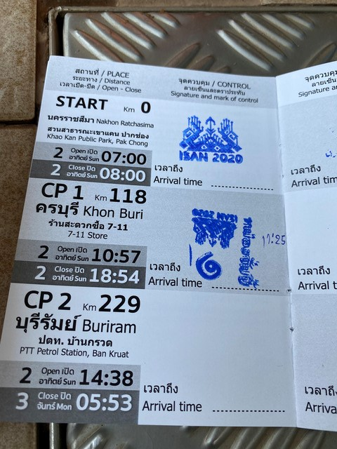

ここまで118km。
出発から4時間25分、11:25の到着です。
今回、制限時間は時速10kmで計算されるので、制限時刻は18:54。
7時間半ほど、余裕がある状態です。

ちょうどお昼時なので、お昼ご飯にしました。
写真のほかにも、いくつか食べたはずです。

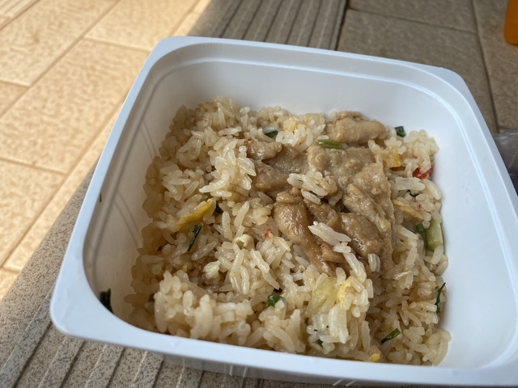

Oatさんの自撮り写真の後ろに写ってました。
そんなに暑くなかったので外で食べてますが、中で通路に適当に座ってたむろして食べても大丈夫です。
タイのブルベでは、コンビニの通路で仮眠している人もよく見かけます。

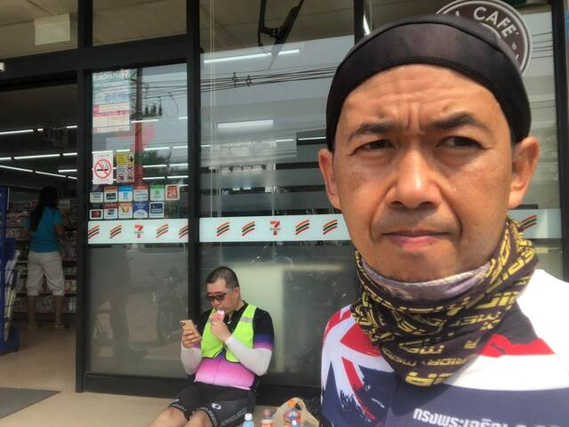

しばらく休憩していると、続々とお友達が到着してきました。

タイの長距離ブルベにはいつも参加している、香港からのMini Teaさん。

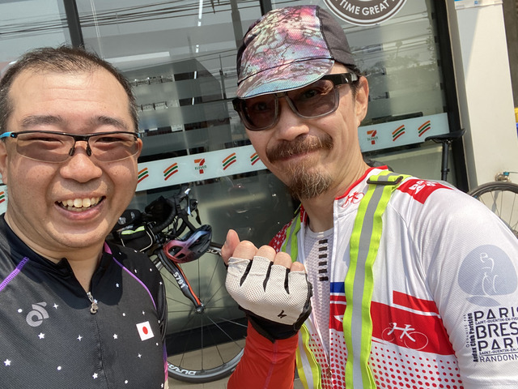

2015年のPBPで会って、僕がタイブルベに参加するきっかけにもなったTonさん。

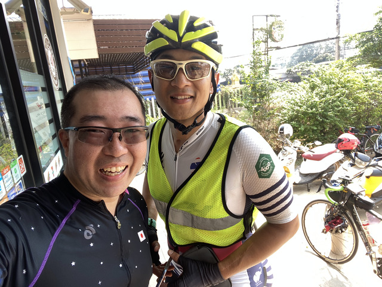

あれ?! さっき先に行ったはずなのに、なんで後から来るの?
2017年のLELで会ったPhadyaさん。

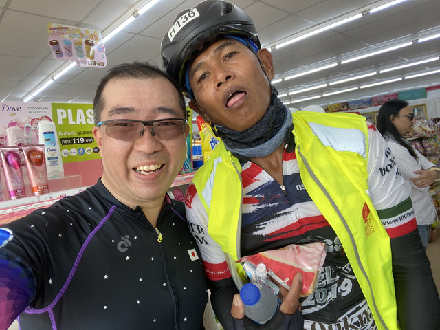

CP1では30分くらい滞在しました。
みなさん、これから休憩のようなので、のんびりとひとりで出発しました。

## CP1:Khon Buri(ครบุรี)7-11: 118km～CP2:Buriram(บ้านกรวด)PTT: 229km

しばらく行くと、信号がありました。
珍しくて写真に撮ってしまうくらい、信号はありません。

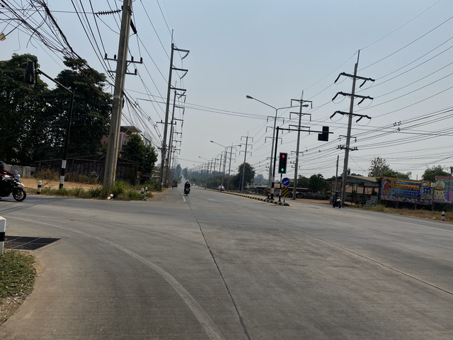

平坦なところを過ぎると、ちいさなアップダウンが続きます。
のんびり走っていると、後ろから、「オレオレオレ～！」となにやら叫びながら二人組が追い越していきました。
なんて、怪しい人だ、と思ったら、2年前のTanaosri 1200 (Western Thailand Grand Randonnée)でグラベル酷道40kmを一緒に走った戦友、Samakarnさんでした。

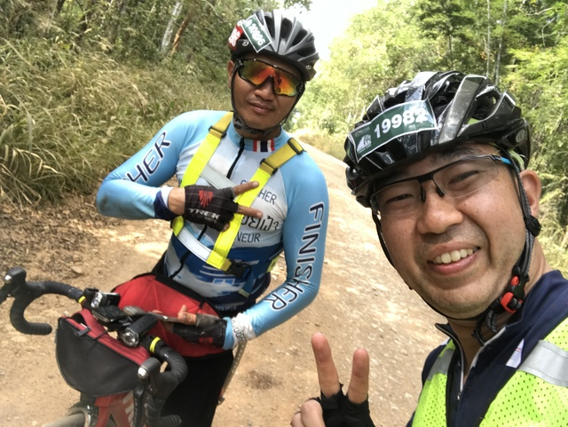

これが2年前の写真。

せっかくなので、着いて行くことにしました。

いろいろと、この辺の町は何々だ、とか説明してくれるのですが、その肝心なところは難しくて聞き取れません。
ごめんなさいね。
しかし、相変わらずいい人です。

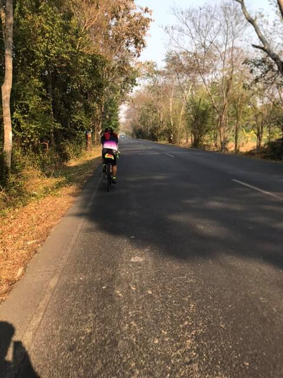

途中トイレに行きたくなったころに、ガソリンスタンドが見えてきたので、ここまでかな、と思ったのですが、彼らも寄るようです。
タイではガソリンスタンドのトイレが一番便利です。
洗面台も付いていることがほとんどで、顔や頭をジャブジャブ洗って、頭に巻いてるタオルも洗ってびしょびしょにし、ジャージの袖やレーパンの太もも部分に水をぶっかけます。
ちなみに、手前が大で小は奥にあります。

ガソリンスタンドの他には、道沿いにもトイレは時々見かけます。
コンビニにはお客さん用のトイレとして見えるところにはがありませんが、店員さんに言えば、バックヤードに案内してくれます。
ちいさな商店や食堂でも、お店の人に聞けば案内してくれます。
たまに、家の中だったりするので、生活が垣間見られます。

CP1から55km程で、小さなお店があったので、飲み物休憩にしました。

Samakarnさん
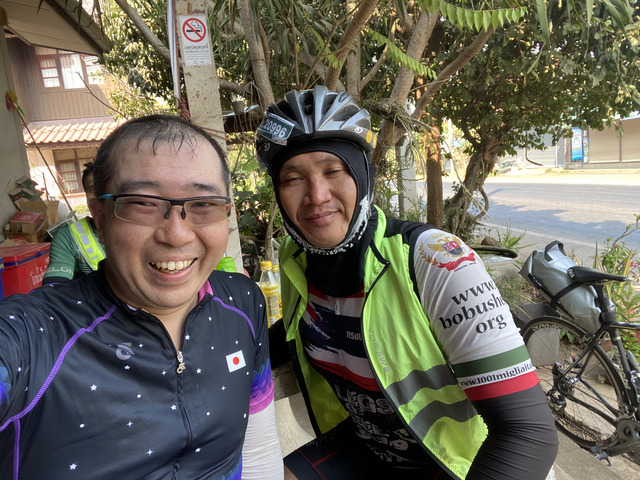

Manopさん
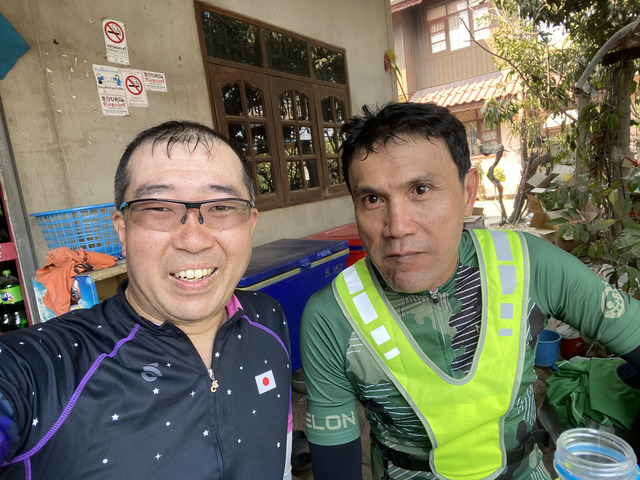

このあたりから、比較的に平坦になってきました。
そして、ペースが結構上がります。

ひぃひぃ言いながら、あっという間に残り50kmくらいを走ってCP2へ到着です。

CP2はBuriramのガソリンスタンドです。

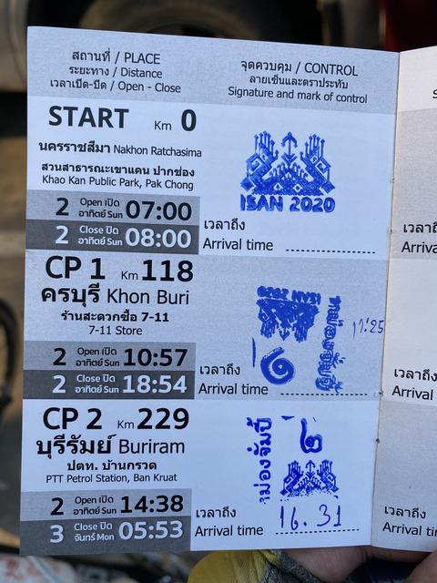

時刻は、16:30過ぎ、ここまで、約230kmでよく考えたらトイレに寄ったのを除くと、2回しか休憩してません。
タイのガソリンスタンド、特にPTTは、トイレ、コンビニ、カフェなどが敷地内にあります。
7-11で飲み物やゼリーを買いました。
何かがっつり食べたかったのですが、ガソリンスタンド内の店はちょうど閉店したところでした。
さすが、田舎です。早すぎます。

適当に走りながら、食堂を探せばいいかと、Samakarnさん達とはここで別れ、先に出発しました。

## CP2:Buriram(บ้านกรวด)PTT: 229km ～ CP3:Sisaket(วัดไพรพัฒนาฯ): 347km)

1時間くらい走ったところで、小さなお店がありました。
何か食べられるか聞いたところ、インスタントラーメンなら作れるよ、ということなのて、作ってもらうことにしました。

飲み物を飲んで待っている間、いつものように、どこから来たのかとか、どこに行くのかという話で盛り上がります。
こういうときに、地名の入っているブルベカードは便利です。
近所のボクサーだという青年もやって来て、自転車乗るなら腹筋とかもすごいのか? といいながら、
自慢のシックスパックを見せてくれました。

こちらも、負けじと、俺はシックスベイビーが入ってるぜ、とお腹をポンと叩くと、大受けでした。

彼は、去り際に、頑張れよ、とスポンサー(タイのスポーツドリンク)を奢ってくくれました。
いいやつです。

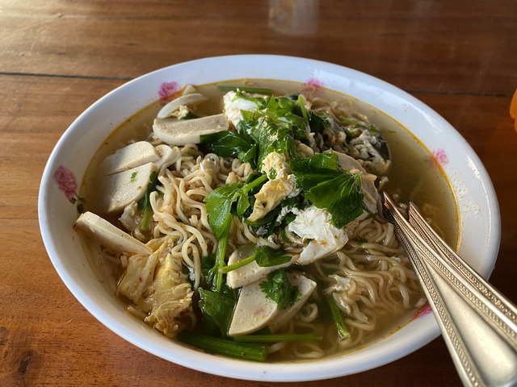

できあがったインスタントラーメンですが、具や卵も入れてくれて、なかなかいい感じです。

しかし、すごくおいしいのですが、あまり喉を通りません。
これは、やばい。
どうやら、あまり休憩もせず、食事も取らず、飛ばしすぎで胃をやられたようです。

なんとか、半分くらい食べて、残してしまいました。
せっかく作ってもらったのに、全部食べられなくて申し訳なかったです。

このまま、今まで通り走り続けると、走れなくなることがわかっているので、なんとかリカバリーに入ります。

太田胃散を飲んで、負荷をできるだけ下げて、ゆっくりした速度で進みます。
経験的にエネルギーが足りていないと食べられなくなるので、さっき食べたラーメンを消化させることを優先します。
そして、粉飴のジェルをもっていたので、30分毎くらいに補給しました。

50kmほど進むと、セブンイレブンがありました。
少し胃も落ち着いてきたので、おにぎりを食べました。

Wakeさんのお友達だという、Chaiwatさんにも日本語で声をかけてもらって少し元気になりました。

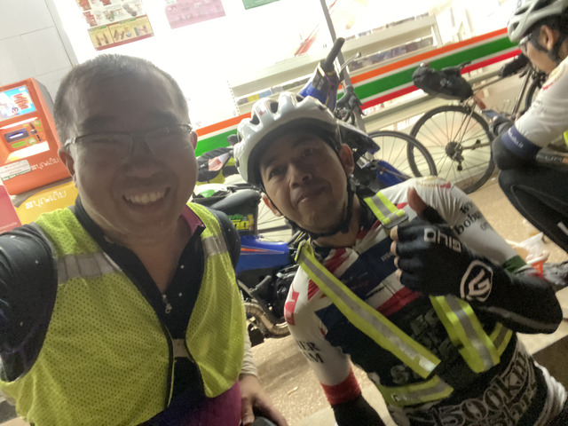

引き続き、ゆっくり進みます。

燃やしているのか、燃えているのか、道路脇の林が燃えている光景は時々目にします。

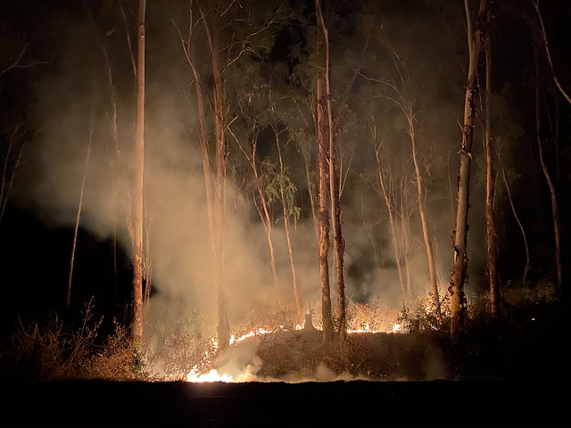

少し行くと、「ご飯あるよ～。寄ってって～。」と。
私設エイドです。
何時間大声で呼びかけてたんでしょうか。
声が枯れてます。
「あ～、ひらちゃん！ひらちゃんは寄らないとダメよ。」
あ、はい、もちろん。

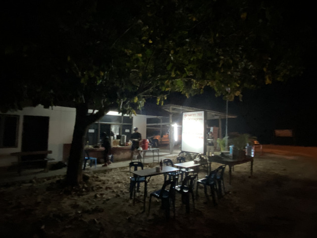

昨夜、設営したいと話していたので、机ひとつとコーヒーポットくらい持ってくるのだろうと思っていたら、
なんと、警察署の敷地を借りてこんな大がかりなエイドですよ。
1日でここまで用意するのは、すごいです。

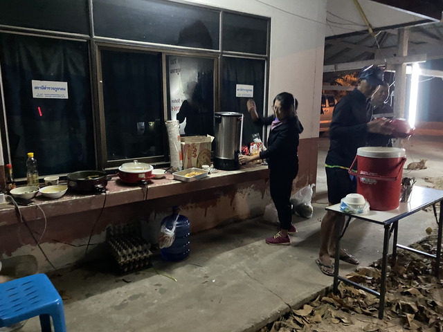

入った時は1人だったんですが、さっきのChaiwatさん達も通りかかったので、ぜひにと呼び止めました。
温かいスープと、食事、それにスイカ。
ちょうど胃も回復してきていたので、本当においしくいただきました。

気付くと、人数も増えて賑やかになりました。

僕のことを知ってる人もいるようで、Tanaosri 1200でDNFした後、またタイに来て続き走った人だと紹介されました。
どうやら、DNF後再び続きを走りに来た日本人がいたというのは多くの人が知っているようです。

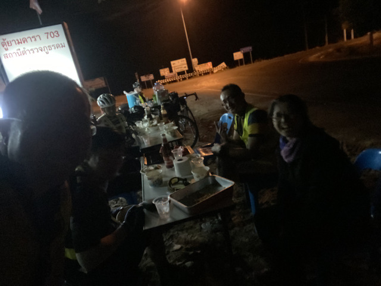

おかげさまで、おいしく食べて、すっかり元気になりました！
コップンカップ！

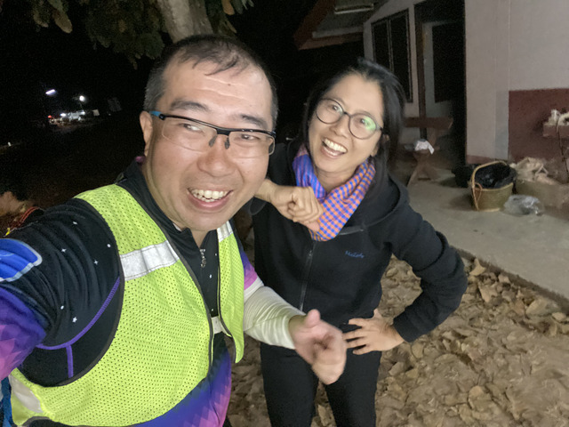

さて、次のCPまで残りは30kmほどです。
ゆっくりひとりで行くか迷いましたが、Chaiwatさんご一行とご一緒することにしました。

ペースも速すぎず、元気をもらいました。

一緒に走ってた人が電池を替えている間、少し休憩です。
このくらいの時間になると、かなり涼しくなっていて気持ちいいです。

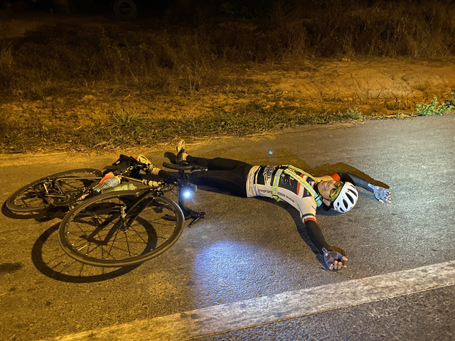

順調に進んでいましたが、残り10kmでグループから離脱してゆっくり走ることにしました。
次のCPで睡眠を取るつもりなので、すぐに眠りにつけるよう、少し心拍を落とした状態で到着したかったからです。

CPに到着したら彼らも少し前に到着したようだったので、同じようにペースを落としたのかも知れません。

ということでCP3到着です。

朝7:00に出て23:23到着です。
347kmを16時間半くらいで、だいぶ速いですね。

制限時刻は明日の17:42なので、18時間くらい余裕があることになります。

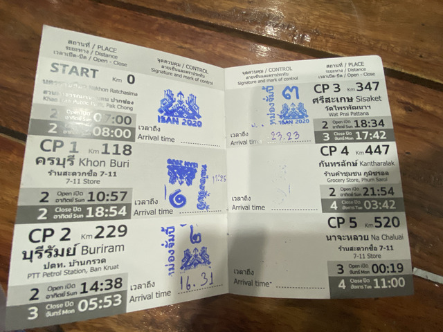

CP3はシーサケットにあるワットプライパッタナー(วัดไพรพัฒนา)というお寺です。

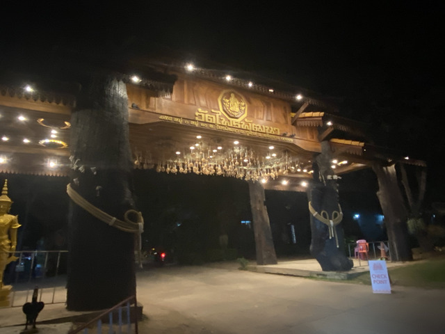

受付の横には、大量の口の付いたUSB充電器があったので、ここでGPSなどを充電できました。
このCPにはドロップバッグも到着してるので受け取ります。

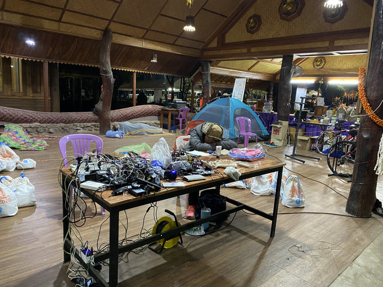

まず、汗を流しにお風呂です。

タイのお寺ではこのようなお風呂が一般的です。
バケツの水は水道の水そのままなので、この時間帯ではかなり冷たいです。

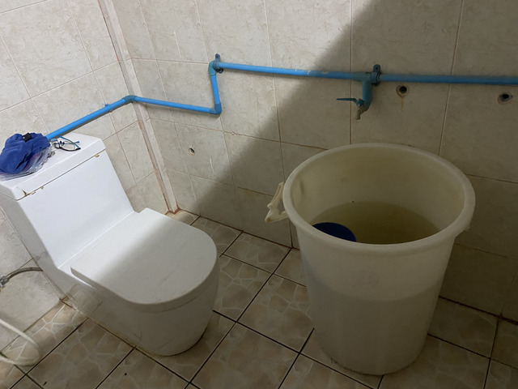

体を洗って、さっぱりして、食堂に行くと、PopさんとNikornさんがいました。
さすが、彼らは速いです。

おかゆのようなものを食べて、さて、寝るとしましょう。

薄いマットと枕、毛布が用意されていて、こりゃ快適そうです。

このCPで休む人としては早く着いたようで、まだ、寝床はガラガラです。

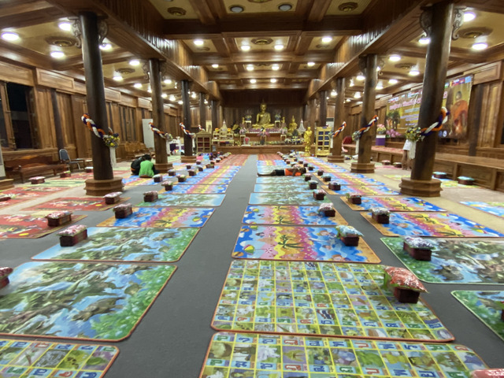

それでは、おやすみなさーい。

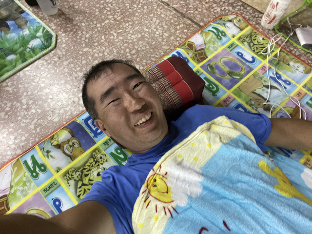

0:30就寝。Zzzz

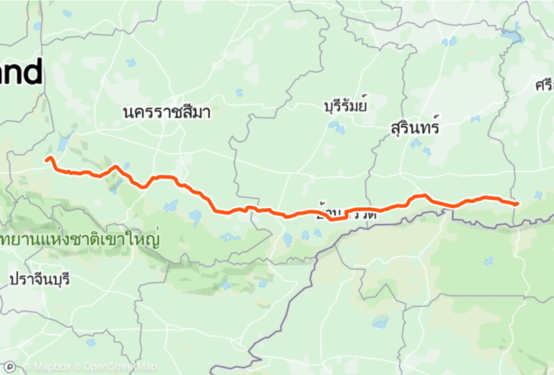

1日目: 移動距離: 347km
