## CP3:Sisaket(วัดไพรพัฒนาฯ): 347km ～ CP4:Kantharalak(ร้านค้าชุมชน ภูมิซรอล): 447km

0:30頃寝たので、5時まで寝て6時に出発しようと目覚ましをかけましたが、4時に騒がしいニワトリ達に起こされてしまいました。
頭もスッキリしてるので、このまま準備して出発することにします。

顔を洗って、昨夜と同じおかゆを食べました。

ドロップバッグには替えのジャージのや電池が入ってるので着替えて電池を入れ替えます。

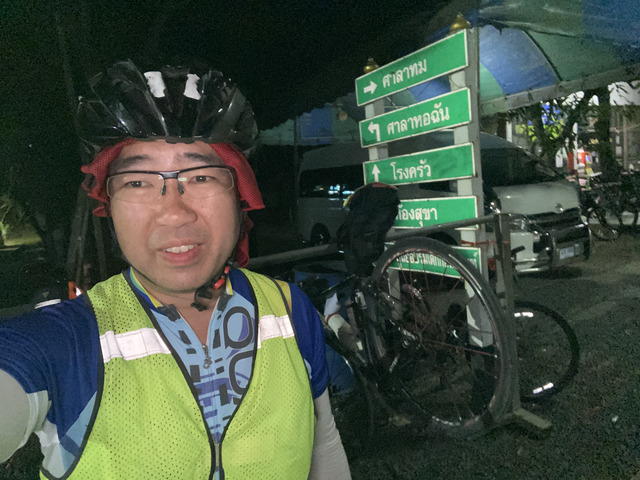

おはようございます。
ちょうど5時頃の出発です。
外はまだ真っ暗です。
2月のタイは6時半頃に明るくなってきます。

真っ暗な軽いアップダウンをしばらく走っていると、道は平坦になり、空は薄明るくなってきました。

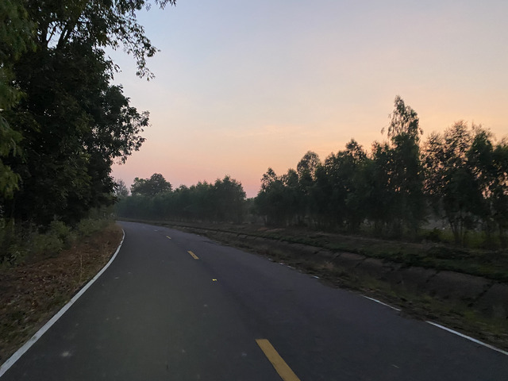

タイではこの位の時間帯が暑くもなく、暗くもなく走りやすいです。

走りやすいのですが、そろそろお腹が空いてきました。
このあたりには、お店はないようです。

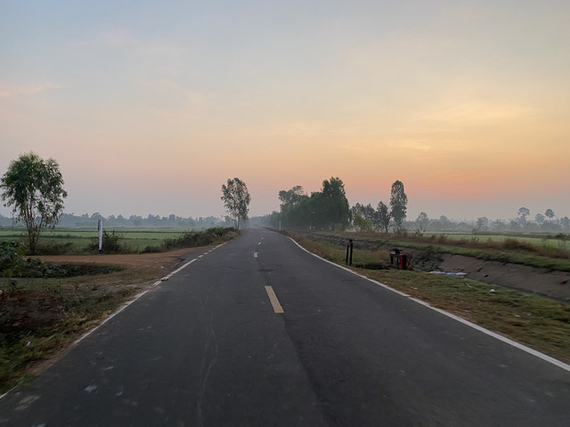

しばらく行くと、グラベルが出てきましたが、数100メートル程度なので、大したことはありません。

なかなか、美しくていいのですが、かなりお腹が空いてきましたよ。

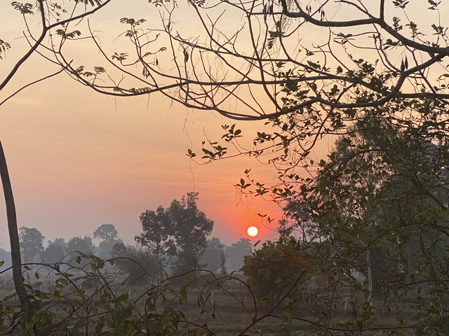

そして、やっと小さなお店を見つけました。
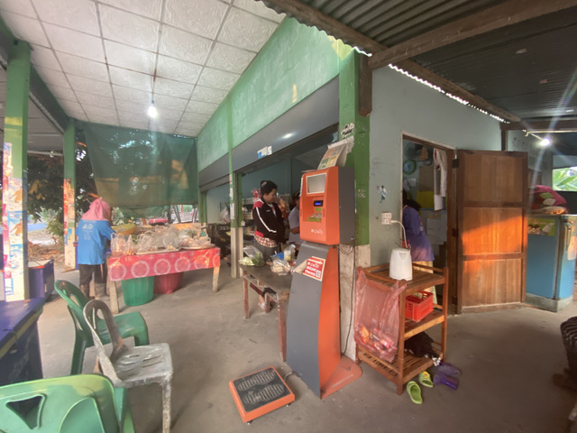

ビニール袋に入ったお惣菜が売られています。

パッタイとお餅のようなものが2つずつ入った袋を買いました。

座って食べて行ってもいいらしいので、休憩がてらゆっくりさせてもらいます。

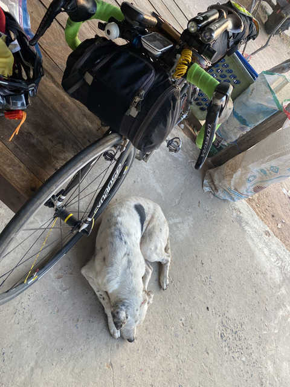

ゆっくりしていた間に、犬が通せんぼしています。

元気になったところで、出発です。

CP3から60kmあたりで、対向車線側に7-11がありました。
次のCPまでは、まだ43kmありますので、補給していくことにしました。

うろうろしていると、Witさんも入って来ました。
今回はスタッフではなく出走番号1番で、ライダーとして参加です。

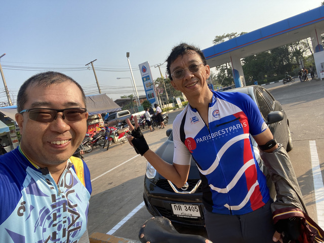

7-11を出発して、道がひどくなりました。
普通の舗装道路なのですが、アスファルトが粗く、ガタガタガタガタガタガタガタガタします。

なんとか、走りきって、CP4に到着です。
ブルベカードにはGrocery Storeと書いてあるのですが食堂でした。
場所もGPSデータより少し手前のような気もしますが、ここはタイです。
細かいことは気にしません。

到着した時ちょうど、香港のMini Teaさんが出発するところでした。

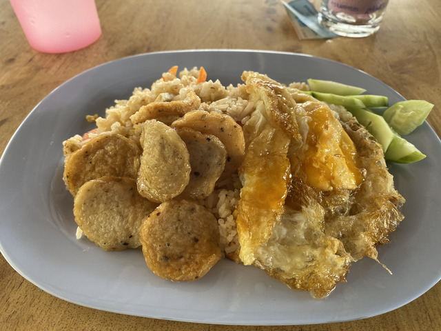

時刻は10:16。お腹も空いたので、ゆっくり食事をいただきます。
昨日と同じ轍は踏みません。

## CP4:Kantharalak(ร้านค้าชุมชน ภูมิซรอล): 447km ～ CP5:Na Chaluai(นาจะหลวย) 7-11: 520km

CPに入る前にこれから向かい風になるような気がして心配したのですが、希有だったようです。
つぎのCP5までは、73km程です。

あまり誰にも会わないので、のんびりマイペースで走ります。

途中、RAAM Qualifierと書かれたロゴをつけたジャージの人に会いました。
RAAMの選手かクルーなのか、と聞いてみたのですが、あまり何を言ってるのかわからず、話し相手にもなってくれなさそうだったので、そのままスルーしました。

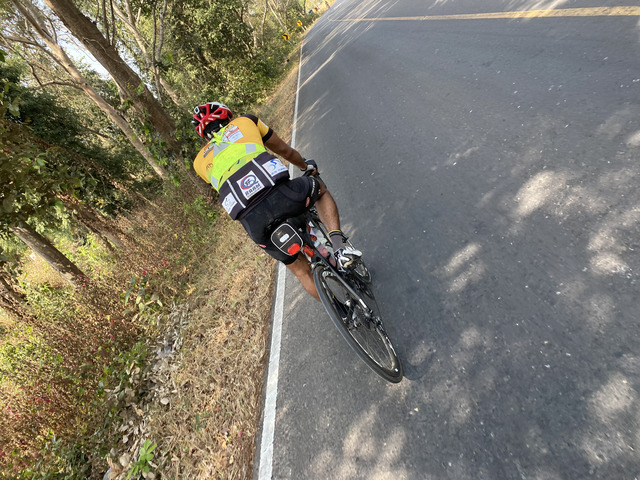

偏見かも知れませんが、タイの人や他の外国の人は言葉がわからないなりにも一緒に楽しく走れるのですが、インドの人はなんかあまり相手にしてくれない気がします。
ま、ふらふらと走ってたので、ただ、眠かっただけなのかも知れません。

また、ひとりで走っていると、マレーシアの国旗を貼り付けた車が追い越して行きました。
マレーシアからも何人か参加しているらしいので、そのサポートカーでしょう。

そうこうしているうちに、CP5に到着しました。
CP5は7-11です。

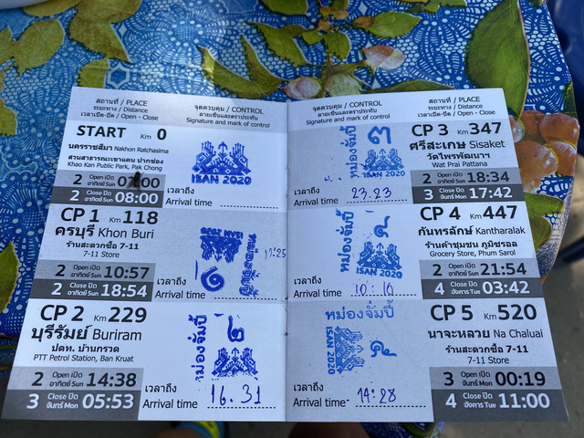

ここまで、520kmでCP3から173km、時刻は14:28です。
CP3は5時に出たので、9時間半ほど。
昨日ほど早くはないですが、ぜんぜん悪くないペースです。

到着した時、ちょうど、また、香港のMini Teaさんが出発するところでした。
どうやら同じようなペースで走ってるようですね。

彼には日差しがきつかったらしく、レーパンの太もも部分にタオルを挟んで、いい具合に日よけにしていました。

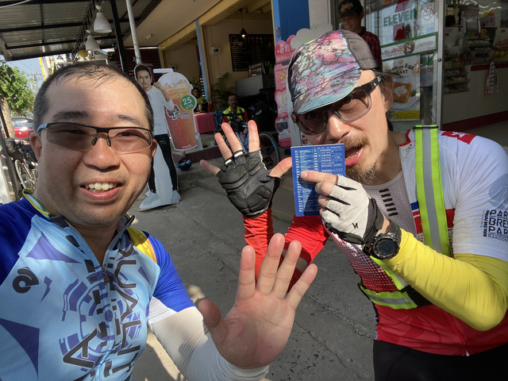

CP5なので、5本指を広げています。

7-11の店の前にクイッティアオの屋台があったので、ここで、また、クイッティアオをいただきます。

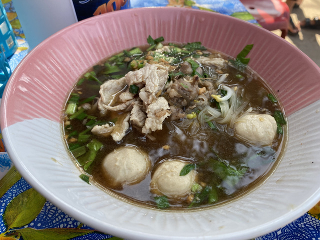

ほんと、生き返ります。

## CP5:Na Chaluai(นาจะหลวย) 7-11: 520km ～ CP6:Ubon Ratchathani(วัดภูพร้าว): 607km

クイッティアオを食べて、元気が出たところで出発したのですが、あらあら、また、道路がガタガタです。

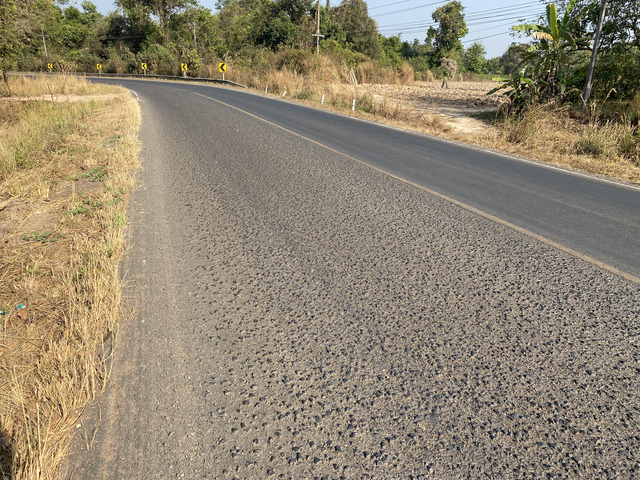

朝よりももっとひどい気がします。

まだ道がきれいだったところで、時速15kmくらいで走っていたトラクターを追い越したんですが、追いつかれてしまいました。

メーター読みで11km/hくらいでしか走れませんでした。

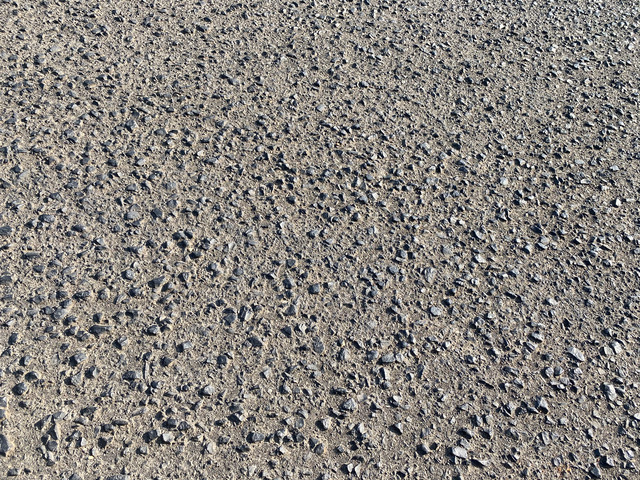

暗くなってきた頃、CP6に近づいてきました。

あと、4kmくらいのところで少し急な登りが出てきました。
そして、残り、2.2kmのところで、キューシートによると、自転車を押して中央分離帯を越えて右折、とのことです。
右折すると、いやー、もっと急な登りになりました。

そして、登れば登るほどどんどん急になっていきます。
この時はなぜか元気で、13%くらいありましたが、座ったまますいすい登れました。

登り切ったところにあるお寺がCP6です。

時刻は2月3日の19:25。制限時間までは24時間と15分ほどあります。
距離は昨日からあわせて607km、今日だけだと260kmです。

CP6はドロップバッグや食事などがあるので、まずは食事をいただきます。

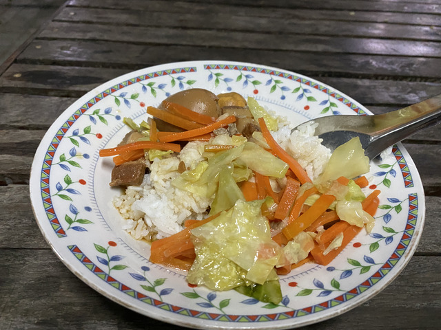

お腹が空いていたので、同じものを2回食べました。

何人か知ってる人たちが既に到着していて、Phadyaさんはここで寝ていくそうで、Oatさんは140km先のCP7まで行くと言っていました。
僕は、20kmほど先にあるホテルを予約してあるのでそちらに向かいます。
1日おきにホテルに泊まろうかとこの時は漠然と考えていました。

さて、ここのドロップバッグにはジャージや替えの電池の他、レーパンも入れてあったので全部着替えます。
この後、さらに予約してあったホテルまで走るので、お風呂は省略です。
ライトの電池は、今日はほとんど使わなかったので、予備として持って行くことにしました。

## CP6:Ubon Ratchathani(วัดภูพร้าว): 607km ～ ホテル: 630km

ドロップバッグほ返却して、ホテルに向かいます。
ホテルは23kmくらい先のリゾートホテルです。

さっきせっかく登ってきた激坂を下って、中央分離帯を押し歩いて、さっきの通りの続きを進みます。
幸い、道路はガタガタせず、とても走りやすいです。

スムーズに進み、ルートを逸れて宿へ向かうところにちょうどお店があったので、飲み物を買いました。

バーンライクライラオスリゾート(บ้านไร่ใกล้ลาว)というところで、文字通りラオスとタイを分けるメコン川に近いところにありました。

ホテルに着いたのは21時すぎくらいでしたが、本物のリゾートホテルなので、こんな時間に到着する人はあまりいないでしょう。
受付がどこかわからなかったので、おっさん達が飲んで団らんしているところに行って聞いてみると、宿の人が出てきてくれました。

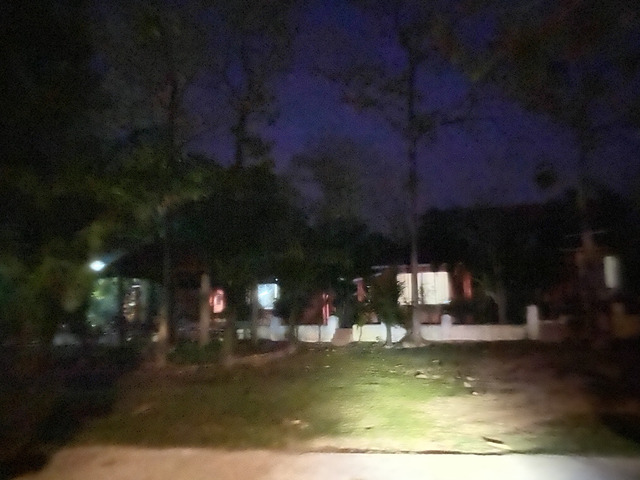

部屋はコテージタイプで、一軒家です。
リゾートっぽくていい感じです。

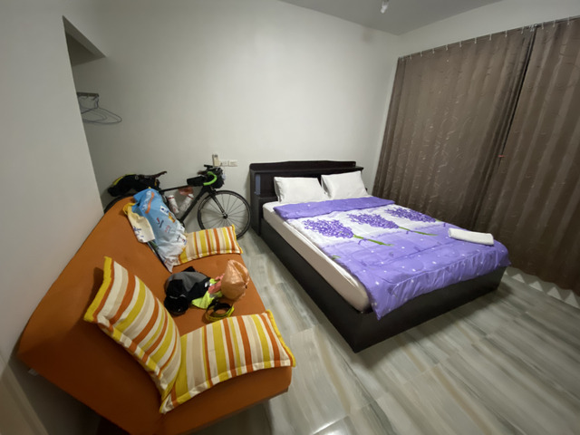

タイヤの空気を入れて、おやつを食べて、充電をして、暖かいお風呂に入って、いろいろやっていると、あっという間に時間が過ぎ去ります。
寝たのはたぶん11時くらい。

明日は6時くらいに出発することにします。

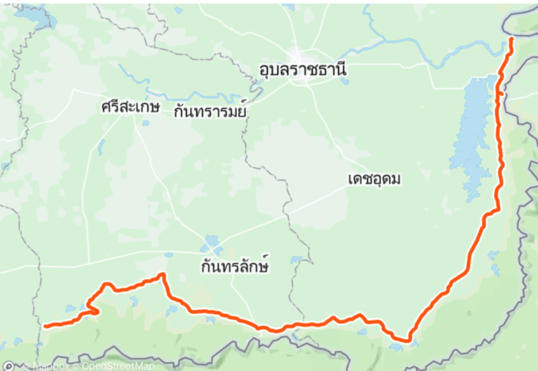

2日目: 移動距離: 283km (計:630km)
