## 6日目のジンクス

さて、ついに6日目です。
6日目には少し不安があるのです。
実は6日間まるまる走った経験は今まででAH2400しかありません。
BPB1400は夜スタート、LEL1400は午後スタートだったので、スタートの日を一日目と数えれば6日目を走ってはいるのですが、6日目は朝にゴールしていますので、実質5日とちょっとです。

そのAH2400では5日目までは非常に快調だったのですが、6日目は向かい風の影響があったものの、全くペースが上がらず夕方には風邪をひいてしまい、残りの紋別までの100kmを温かい友人達に支えられながら死にそうになりながら走ったのでした。

しかも、その後は風邪がなかなか治らなかったので、個人的に6日目くらいで免疫力がぐっと落ちるのではないかと疑っています。

さて、今回はこの6日目のジンクスを破ることはできるのでしょうか。

## CP14:Chiang Khan(ริเวอร์ไซด์ เชียงคาน):1442km ～ Ctl:Tha Li(ร้านกาแฟเห็นอ้ม):1503km

とりあえず、規則正しく5時すぎに起きました。
何時に寝たかは覚えていないのですが、たぶん、5,6時間寝たんだと思います。

着替えて出発しようとすると、あらら。前輪がパンクしていました。

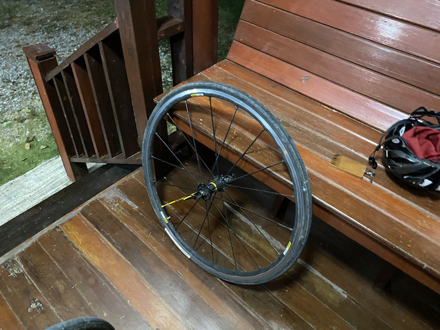

パンクは嫌ですが、走ってる途中だともっと嫌なので、まぁ、出発前でよかったです。
ここはドロップバッグのあるCPなので、替えのチューブの補充も気にする必要がありません。

さて、せっかく出かける気満々だったのですが、気を取り直してパンク修理です。

修理を終えて、本館の方に鍵とドロップバッグを返却に行くと、2015年のPBPの反射ベストを着けた人がいました。

日本の友達がいるんですかぁ、とタイ語で話しかけると、おどおどしてていまいち返事がもらえませんでした。
と、よく見ると、あらら、香港のWiwinさんじゃないですか。
ネイホーネイホー。

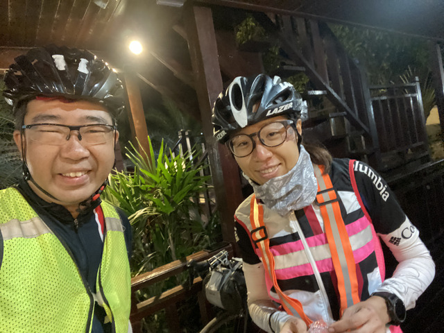

ちょうど今到着したそうで、これからここでゆっくり休んでから再出発するそうです。
おやすみなさい。

食堂に行くと、パンが用意されていました。

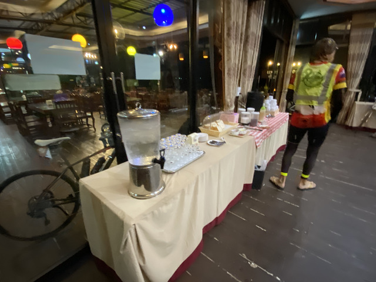

2枚ほど食べて、出発です。

時刻は朝6時60分、少しずつ明るくなってきました。
リゾートホテルのすぐ横は、このようなサイクリングロードです。

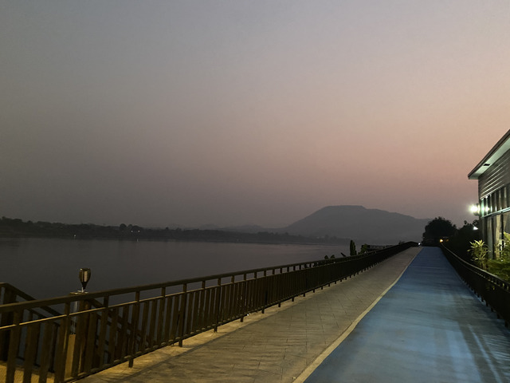

しばらく進むと、マラソン大会の門がありました。

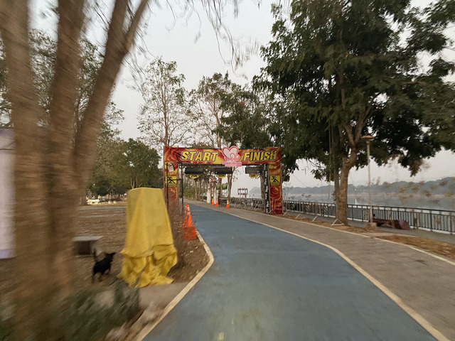

何人か走っている人もいました。
サワッディーカップ！とお互い挨拶します。

さらに進むと、こんな感じになりました。
いい感じです。

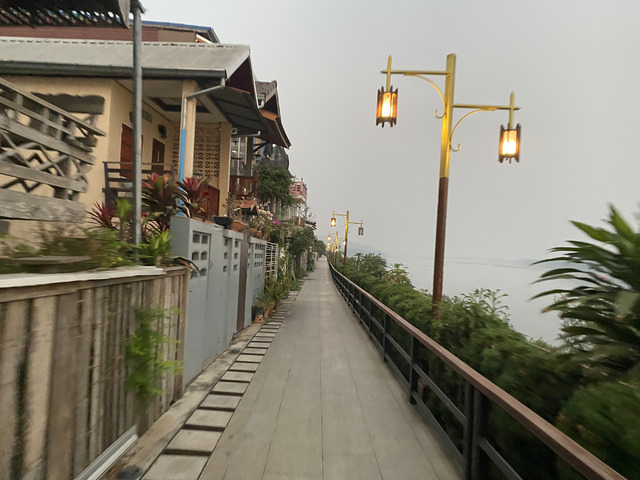

その後、一般道に出ると、また、少しアップダウンが始まります。

1時間ほど走ったところで、お店がありました。
さっきの小さいパンだけでは足りないので、朝食をいただきます。

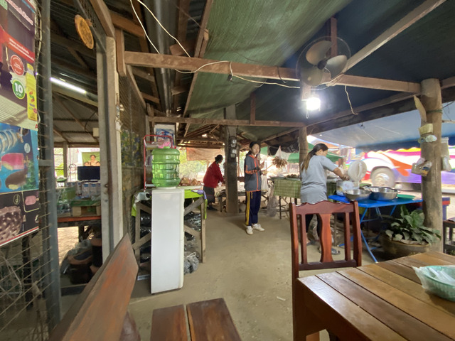

カレーがあるというので、さっそくいただきます。

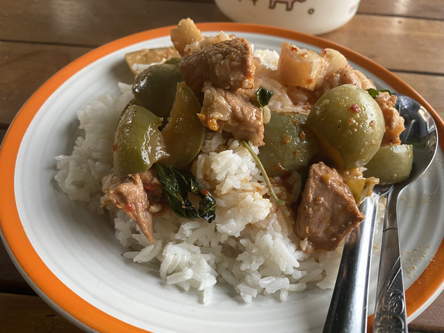

めちゃおいしいです。
朝7時半からこんなおいしいカレーが食べられるのは幸せです。

今日もラオス国境沿いを進みます。

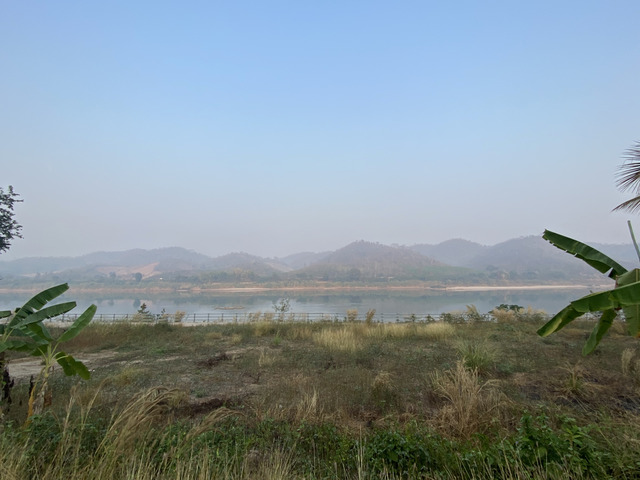

学校で遊んでいる子供達もいます。

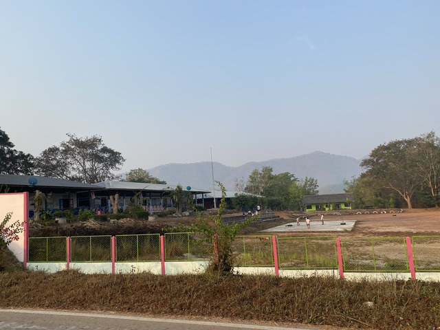

右に行くと、大仏があるらしいですが、寄り道する気力はありません。

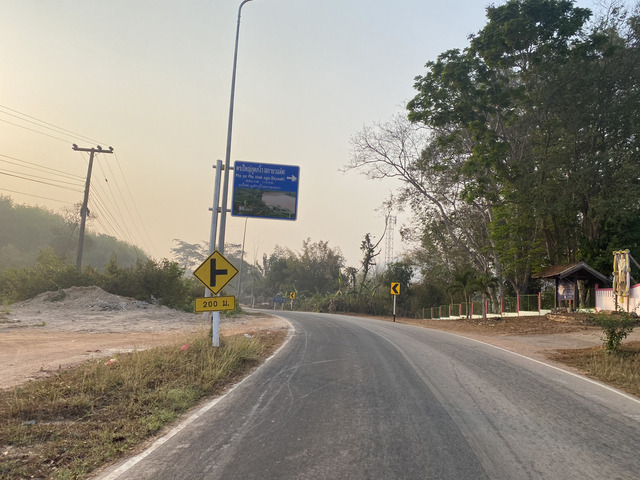

大きな峠はないのですが、アップダウンが体力を削ります。

昨日までと比べて、明らかに山の景色が近いような気がします。

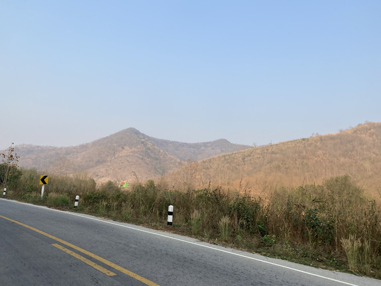

上りは嫌だなぁという気持ちは伝わりますでしょうか。

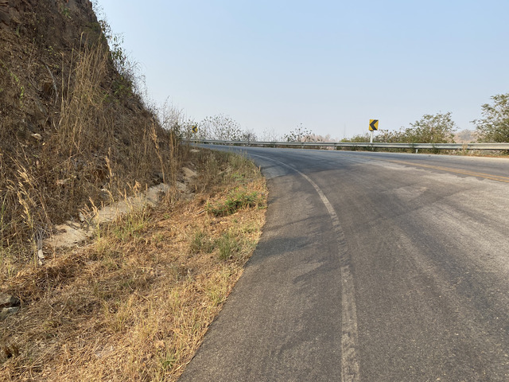

この日は午前中の記憶はほとんどなかったのですが、写真を整理してみると、このような道路の写真を大量に撮影していたようです。

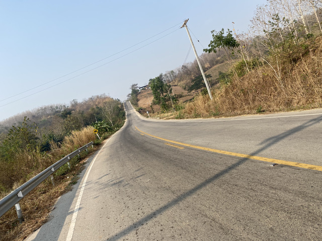

久しぶりに山の景色でうれしかったのでしょうか、それとも、アップダウンに対する恨み節なのでしょうか。

今となってはあまり覚えていないのでよくわかりません。
特に変わらない感じの道路がひたすら続くだけで、疲れていたという記憶で上書きされてしまったようです。

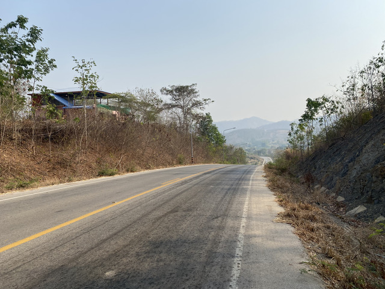

山道を抜けると、道路標識も出てきました。

まっすぐ進むと、Dan Sai。
はい。次の次のチェックポイントです。

右に行くと、えっ。
ルアンパバーンですって。
ルアンパバーンはラオスです。
着くのかも知れませんが、ここからだと、たぶん、だいぶ遠いです。

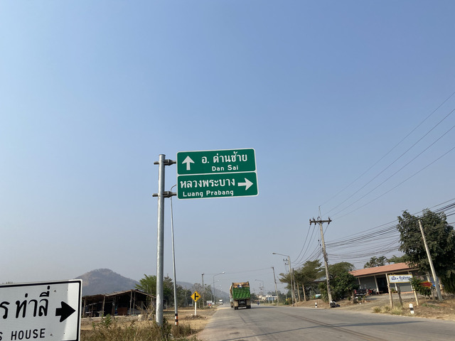

少し行くと、チェックポイントの看板がありました。

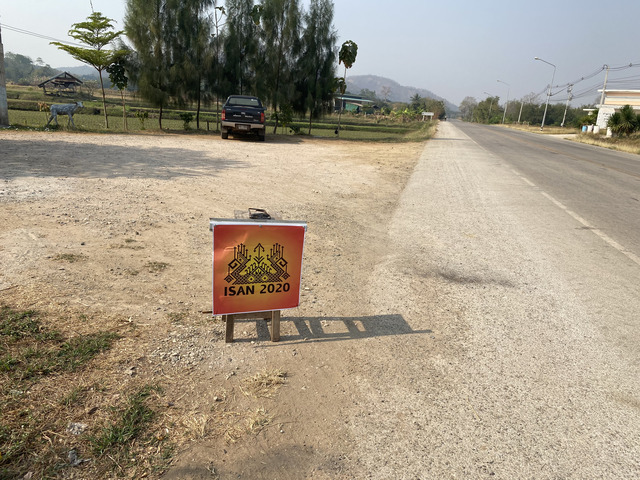

チェックポイントのカフェに到着です。

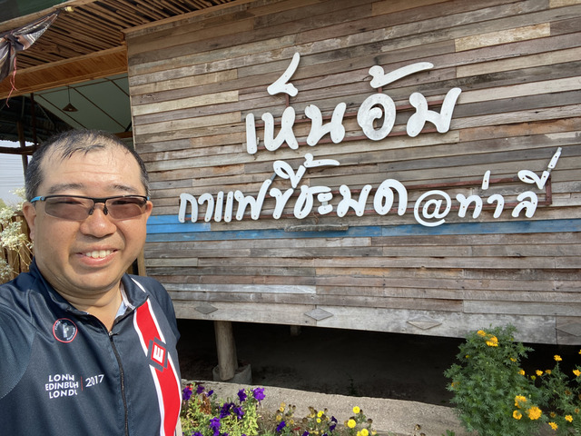

なんか、めちゃむくんでますね。
体調悪そうです。

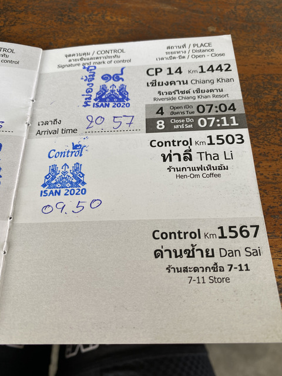

60kmを3時間半ほど。
ペースとしては悪くはないようです。

カフェなので、チャーイェン(冷たいお茶)を注文します。

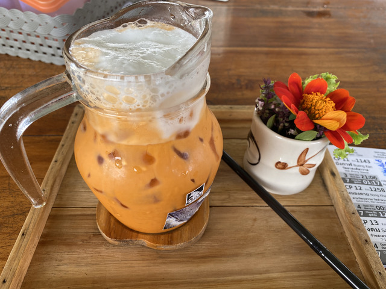

なんか、花が付いてきましたが・・・。
きれいですねと言ったら、「アロイドゥアイ」と言われたんですが、どういうニュアンスなんでしょう。
きれいだし、「しかも、おいしいよ」ってことなんでしょうか。
食べられるんでしょうか。

ちょっとだけ食べてみました。
なんというか、花です。

さらに、ラットナームーをいただきます。

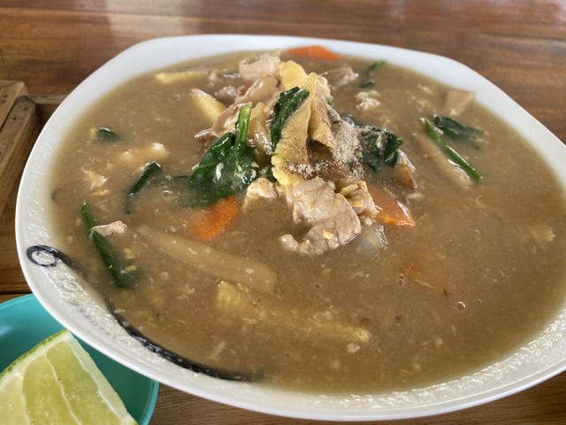

おいしいし、塩分も取れるしで、すばらしいです。

お店のモニターには、GPSの情報が映し出されていました。

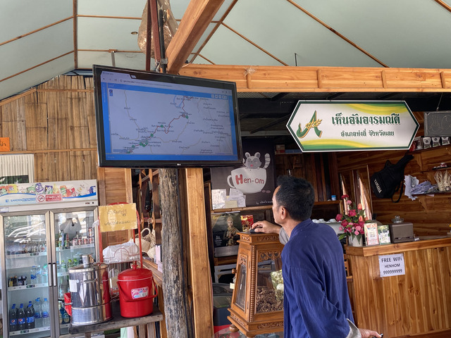

今回、全員に小さな小さなGPSが配布されました。
僕の親指の2/3くらいの大きさです。
小さいので全く邪魔にもならないし、2日に1回くらい充電しないといけないのですが、容量自体が少ないので、それもほとんど気にもなりません。
SPOTのように上を向いていないとデータを送れないというようなこともないようでした。

取得したデータは専用のサイトで誰でも見ることができ、誰がだいたいどこにいるかが把握できます。
チェックポイントもこの辺りまで来ると、最初の人と最後の人とでは数日開きがあるので、いつ頃到着するかがわかるのは、スタッフに対して大きな助けになります。

## Ctl:Tha Li(ร้านกาแฟเห็นอ้ม):1503km ～ Ctl:Dan Sai(ตลาดด่านซ้าย)7-11:1567km

カフェを出発すると、また何もなくなります。

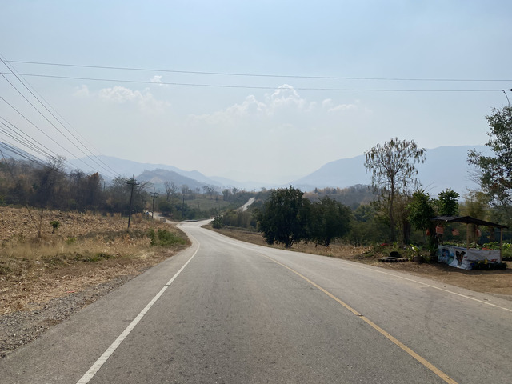

同じような写真が続きます。
こんなに道路の写真ばっかり撮るとは、かなり疲れていたのでしょうか。

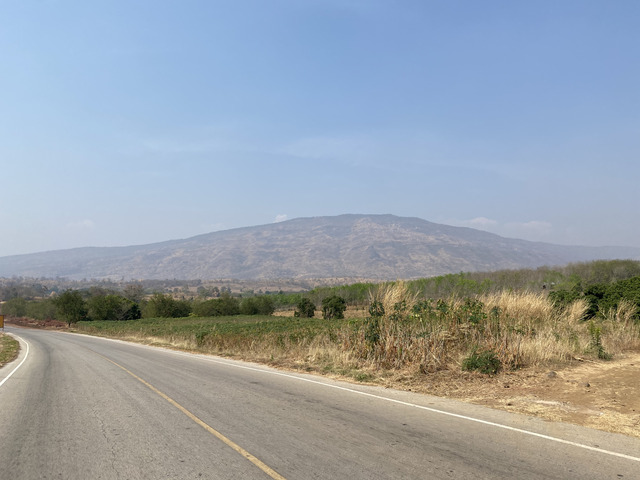

アップダウンが続きますが、どうしても今日はあまり力が入りません。

なんというか、運動をした後、筋肉痛になって、階段を上ろうとすると、ひぇーーってなる、あれです。
あれが、ずーっと続いてる感じです。
昨日までは気にならなかったのですが、今日はアップダウンで負荷が高いから気になるのか、睡眠が足りていなかったのか、それとも単純に6日目で疲れているのか。

やはり、6日目のジンクスは侮れません。

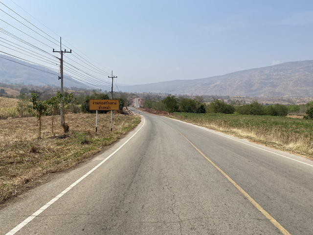

しかも、お昼になってかなり暑くなってきました。
たぶん、この6日間で今日が一番暑いのではないでしょうか。
道路からの輻射熱もあるのですが36度です。

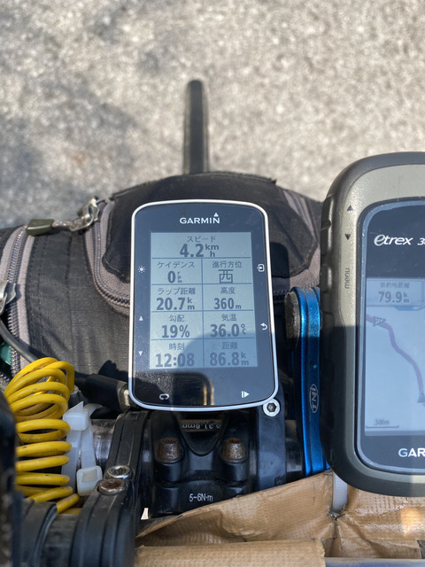

よく見たら、勾配が19%とか出てますね。
押し歩きしながら撮ったものなので、かなり誤差はあると思いますが、降りて押さないとやってられません。

お店も全然ないので、冷たい飲み物も欲しいところです。

途中、花が咲いてたりするとホッとします。

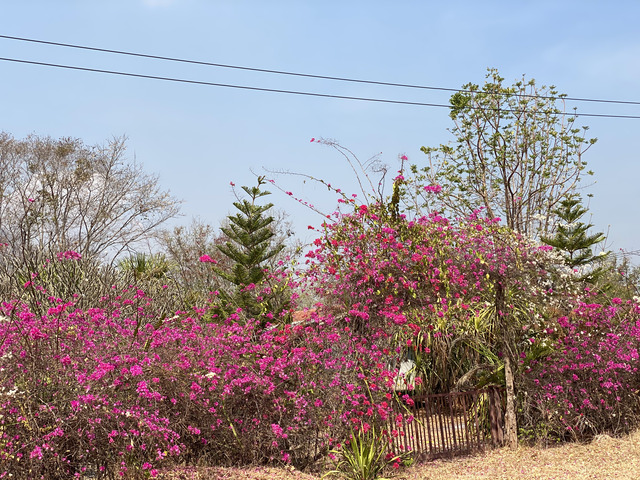

やっと、小さなガソリンスタンドがあったので、スポンサーなど冷たい飲み物をたっぷりいただいて休みます。

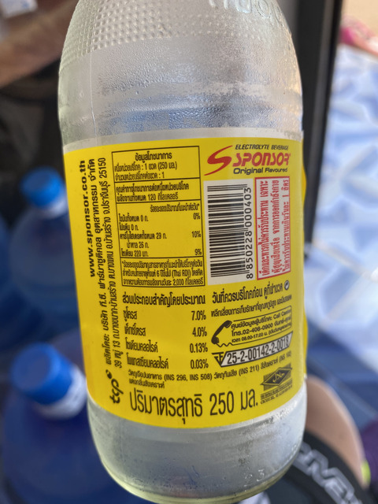

ガソリンスタンドから少し走ると、久しぶりに交差点が出てきました。
交差点と言っても信号も何もない├字路なのですが、ここ、知ってるところです。
2016年末のBPB1400と2018年末のGT600kmブルベで右側から来ました。
その時もラオス国境沿いに走ってきてここに来たので、つまり、ここ何日かメコン川沿いに眺めてきたラオスとはここでお別れということなります。

その交差点の脇にお店があるのを知っているので、昼食で寄って行くことにします。

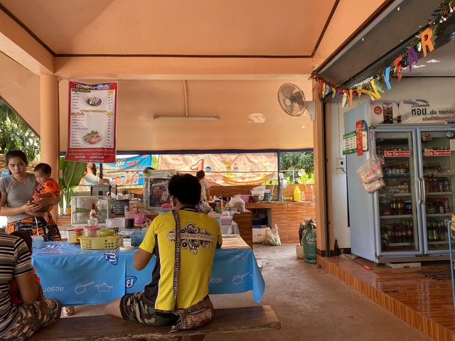

なぜか、食べ物の写真がないのですが、こういうときは写真を撮る余裕もなくむさぼり食ってたはずなので、この日は全体的にエネルギーが足りてなかったのかも知れません。

ここまで来れば、次の次のチェックポイントまでは今まで2回も走っているよく知ったルートです。

しかし、知っているだけに、なかなかつらいのです。
もっと険しい山々を越えてきた前回より、ゆっくりしか進んでいないように感じます。
疲れているから実際ゆっくりなのかも知れません。
知っている道だからゆっくりに感じるのかも知れません。

前回は夕方で涼しかったし、今日はめちゃめちゃ暑いので、比較はできないのでは、などと考えながら走っていると、ダンサイの街が見えてきました。

写真は反対側からですが。

チェックポイントは7-11です。
思ったよりかなり時間がかかっています。

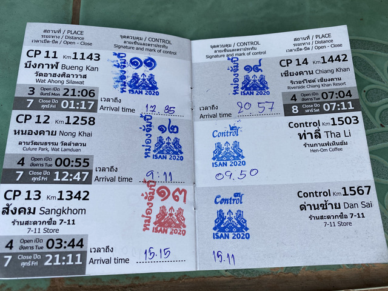

目標はCP16。1690kmなので、ここからだと、まだ123kmあります。
しかも、塩尻峠のような峠をひとつ越えて下りきったところがCP14で、そのあとずっと上ったところがCP16のはずです。

今の体の調子では、行き着けないと感じます。

ということで、今日の目的地はCP14に変更です。
CP14までは42km。
だいたい10kmくらい上り、30kmくらい下りのはずです。

CP14の周りに宿はあるかどうかわかりませんが、疲れたので知ったこっちゃありません。
最悪7-11ホテルで仮眠して、CP15かCP16でぐっすり寝る、という手もあるはずです。

## Ctl:Dan Sai(ตลาดด่านซ้าย)7-11:1567km ～ CP15:Lom Kao(กกกะทอน):1609km

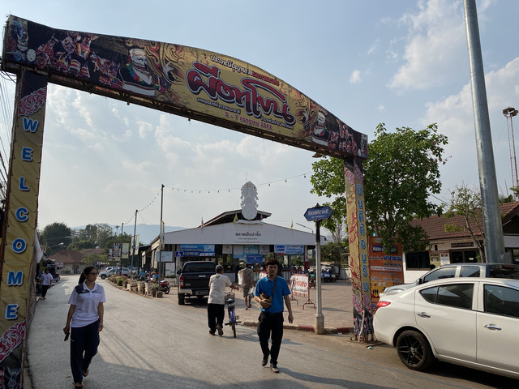

この街はいつも疲れて到着して、CPの7-11の周りがごちゃごちゃしてるので、そのまま通り過ぎてしまっていました。
いつかゆっくり来てみたいとは思っていたので、せっかくです、今回をその機会に充てることにします。

目的地を手前に変更したことで、時間に余裕ができました。
この増えた分の時間をただの睡眠に充てるのではなく、もっと有意義に使いたいと思います。

体の疲れには、タイマッサージです。Google mapで検索すると近くにあるようなので、さっそく訪問です。

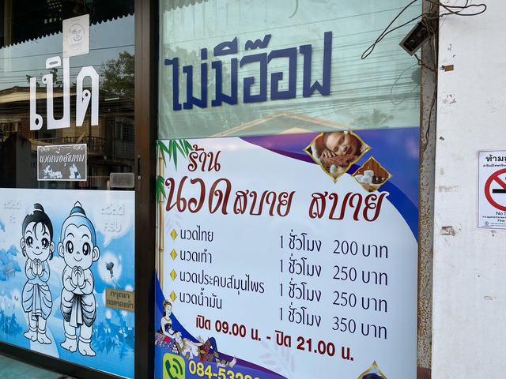

ヌワットタイ 1時間200バーツです。

ブルベ中に時間のかかるマッサージに行く。
時間と疲労回復度を天秤にかけた、数式では表せない世界です。

ひやーー。
効く効く。

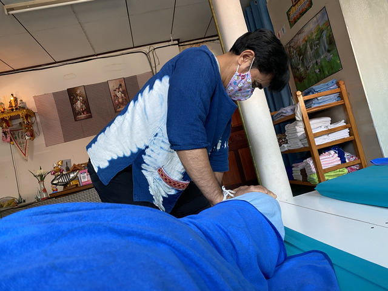

そのままウトウトっと。
仮眠もできました。

これが吉と出るか凶と出るかは、まだわかりません。
しかし、暑い外を避けて、涼しいところでリラックスできたことは間違いなくプラスでしょう。

ついでに、近くでご飯を食べていきます。

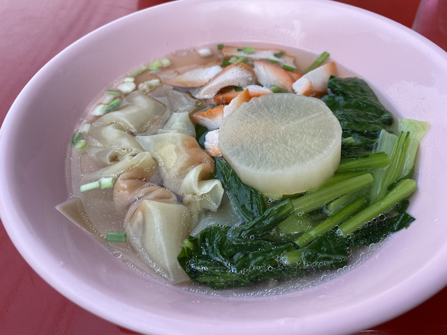

さぁ、この先が上りです。
見た目のインパクトがすごいんですが、ちょっと写真を遠くから撮り過ぎたかも知れません。

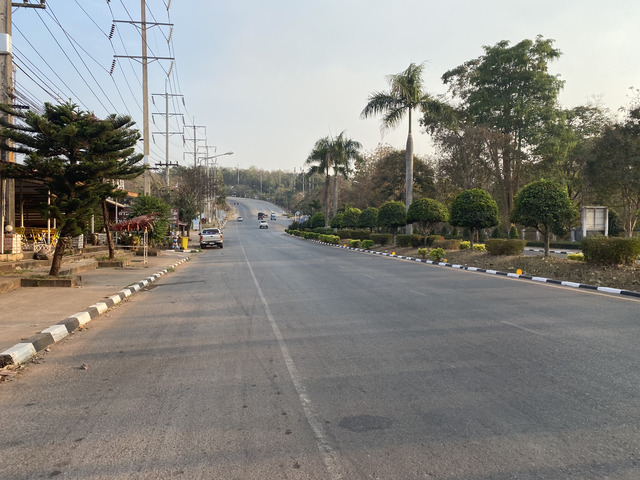

どうも写真に写る景色と、心に映る景色は違うようで、うまく伝わらないので、[前回](https://www.hirano.cc/travel/bicycle/BPB2016/3.html)同様、参考画像を貼っておきます。

頑張ってちんたらちんたら上っていると、右側にビューポイントがあります。
急いでも仕方ないので、寄っていくことにします。

ビューポイントの方に行くと、荷物を積んだ車から見たことのあるTシャツを来た人たちが降りてきました。

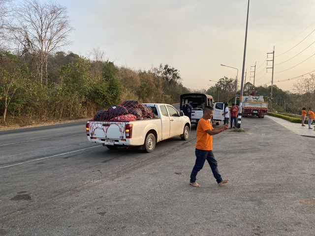

なんと、ISAN2020のスタッフの方達じゃないですか！
ということは、後ろに積んでるのはドロップバッグで、今朝預けたものをパクチョンまで運ぶ途中なのでしょう。

せっかくなので、一緒に写真を撮りましょう。イエーイ！

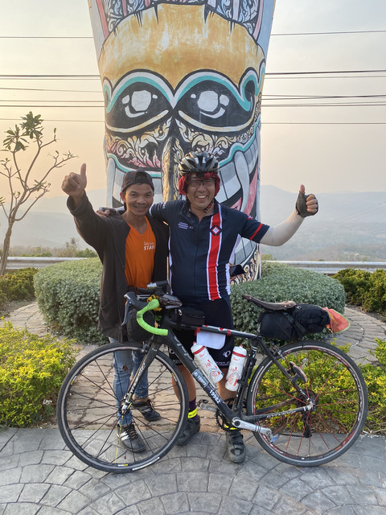

彼から昨晩ドロップバッグを受け取った覚えがありますよ。

写真撮ってくれた彼も、イエーイ！

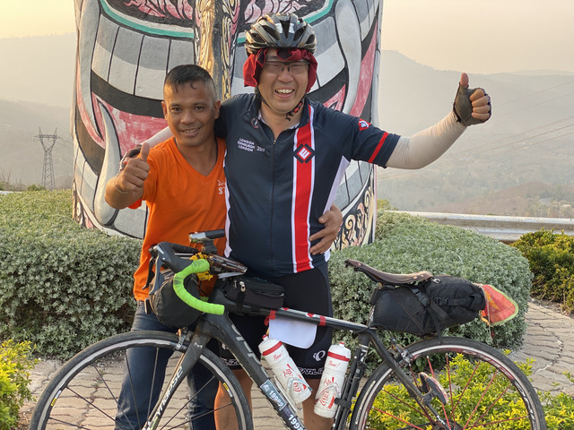

ドゥアイ、ドゥアイ！と呼ぶと、みんな集まってきてくれました。

集合写真です。イエーーーイ！

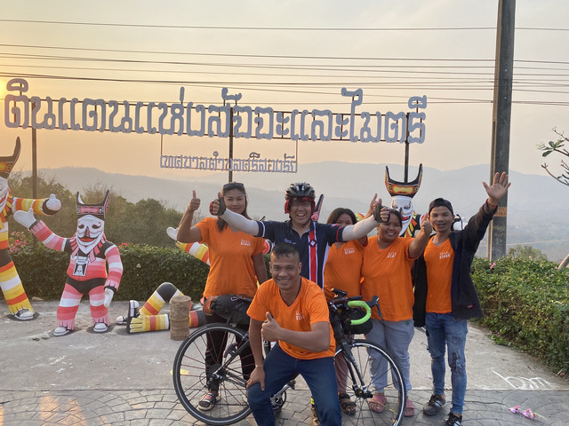

顔隠しちゃってごめんなさいね。

しかし、朝と比べると格段に顔色よくなってますね。
マッサージ効いたかな。

10kmほどで頂上に着きました。
お店があったので、飲み物を補給しました。

出発しようとすると、あらら、後ろのタイヤの空気が減っています。
それで今日は疲れてたんでしょうか、それとも、茂みに駐輪したので、今パンクしたのでしょうか。

暗くなってきたし、パンクを修理するのもめんどくさいので、とりあえず、このまま進んでみることにします。
ここからは30km程、下りとちょっとした上り返しの繰り返ししかないことは知っています。

数kmごとにタイヤを確認しましたが、どうやら30kmくらいならもちそうです。
このまま進むことにします。

以前はかなりのスピードで下った記憶があるのですが、今日は少し後ろに引っ張られる感じです。
が、まぁ、急ぐことはないのでそのまま行きます。

下りきったところの交差点を越えたところの対向車線側に7-11がありました。
CP14です。

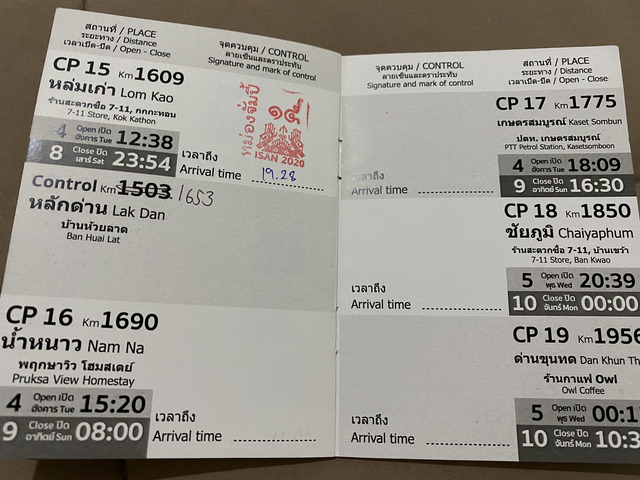

7-11の前には屋台もあって、何人かご飯を食べている仲間もいました。
まだ、先まで進むようです。

さて、ここら辺に宿はあるでしょうか。

飲み物だけ買って、ブルベカードにハンコを押してもらい、レジの人に近くにホテルはないか聞いてみました。
あまり知らなさそうでしたが、並んでいたお客さんが少し行ったところにあると教えてくれました。

外に出ると、作業をしている人がいたので、その人にも聞いてみました。
外だと指を指して方向を教えてもらえるので安心です。
500mくらいという情報も手に入れました。

では、まず、宿の確保に行くことにします。
その後、また戻って来て食事にすればいいでしょう。

500mよりはもう少しありました。
たぶん1kmくらい行ったところでしょうか、リゾートホテルの真っ暗な看板が見えました。
行ってみると、部屋はあるそうです。
素晴らしい！

看板にはレストランとも書いてあったので、何か食べるものはあるかと聞いてみましたが、向かいの7-11で買ってくるといいとのことでした。
ま、よくあることです。

宿のすぐ側に7-11があったので、さっきの7-11に戻る必要はなさそうです。
さっそく、7-11で食事などを買い込んで部屋に戻ります。

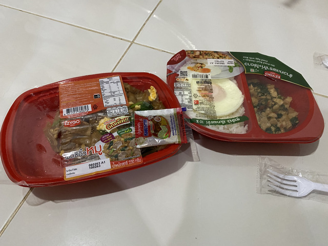

筋肉痛も、進まないのも、エネルギー不足だろうと分析しているので、お弁当2つです。
他にもゼリーとかいろいろ買ったと思います。

パッシーイウとガパオですが、このガパオ、辛すぎて食べられませんでした。
食べてから、前にも失敗したことを思い出しました。
ご飯とたまごはおいしくいただきました。

とりあえず、パンクを修理して明日の準備をします。
スマホのSIMカードが7日用のものを2枚買ったので明日までに入れ替えないとネット難民になってしまいます。
と、入れ替えようとすると・・・、ない。

あら。どっかで落としてしまったようです。

スマホがなくてもゴールまでは行けるとは思うのですが、かなり心細いです。

FaceBookにネット難民になるかも、と書くとコンビニで売ってるよ、とのことでした。
ちょうど向かいに7-11があります。
田舎なのでちょっと不安ですが、明日朝、寄ってみましょう。

気を取り直して、スマホの充電をしようとすると、おっと、ケーブルが死んでしまったようです。
なんてことでしょう、よってたかってネット難民にしたいのでしょうか。
ケーブルもきっと7-11にあるでしょう。
明日聞いてみましょう。

ということで、なんだかとても疲れました。
アップダウンが多かったとはいえ、167kmしか走っていません。

6日目というのはこういうものなのかも知れません。
6日目恐るべしです。
結局6日目のジンクスは破れませんでした。
しかし、6日目のジンクスとうまく向き合う方法は発見したかも知れません。
7日目はなんとか迎えられそうです。

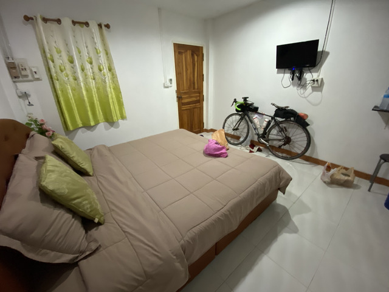

さて、明日は初めての7日目、どうするか。
打開策は、休養ですね。

明日は出発を7時頃にすることにしました。
もっとゆっくりしてもいいのですが、タイの場合昼間は暑くなるので、ゆっくり寝坊するのが最善とは言えないのが難しいところです。

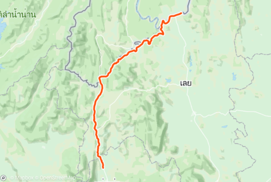

6日目: 移動距離: 167km (計:1,609km)
