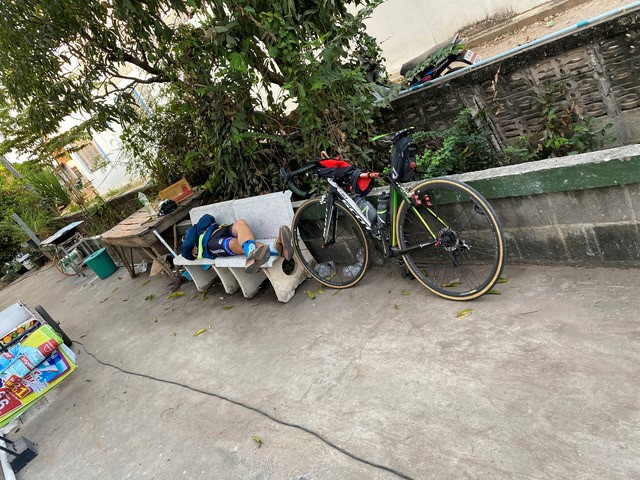

## ホテル:1847km ～ CP18:Chaiyaphum(บ้านเขว้า)7-11:1850km

睡眠時間は少し少なめですが、明るいうちにゴールしようと思うので、予定通り7時前に出発します。

CP18のセブンイレブンまでは3km程でした。

到着は7:09。
ゴールまでは174km。
もう、あと少しです。

セブンイレブンの前には段ボールを敷いて休んでる人もいました。

レジ袋やめましょうか何かのキャンペーンのおっさんからも元気をもらいます。

お店の横でも誰かお休み中でした。

コンビニの向かいに屋台があったのですが、もう少し走ったところで食べたいのでここはパスして出発することにします。

## CP18:Chaiyaphum(บ้านเขว้า)7-11:1850km ～ CP19:Dan Khun Thot(Owl Coffee):1956km

昨日とは変わって、今日はほとんど平坦です。
CP19が少し丘の上にあるので上るのですが、たぶん大したことはないと思われます。

途中で食堂を見かけたので、寄ってみたのですが、まだ空いていないようでした。

そろそろお腹が空いてきたなぁという頃、ちょうどカイヤーンの屋台がありました。
カイヤーンは焼き鳥です。

イサーンの代表的な料理で、カオニャオと呼ばれるもち米と一緒に食べます。

ちょうど、昨日ホテルで一緒になった2人組もここでカイヤーンを食べていました。
同じようなペースのようです。
買いすぎたのか、果物をいただいたので、こちらもおいしくいただきます。

しばらく行くと、大きな道路に出ました。
だんだんと暑くなってきた頃、PTTがあったのでセブンイレブンに寄ります。

PTTのセブンイレブンの場合、自転車はいつもこんな感じで立てかけます。
前輪がクルンと回って倒れるんじゃないかと思うのですが、この状態だと横に押しても全く動きません。

大きな通りから右折して細い道路に入ります。

Lop Buriまで148kmです。
今回はLop Buriには行かないのですが、ここからだとゴールより先にある場所だということは知っています。
少しテンションが上がります。

少し上りがあり、上りきったあたりがCP19でした。

ついに来ました。
最後のCPです。ここを過ぎれば、明日の午後5時までにゴールに着けば完走です。
気に入った町があれば1泊してのんびりしていっても大丈夫です。

ここは、Owl Coffeeという料理もある大きなカフェです。
名前のとおり、ふくろうがいます。

スタッフの方が撮ってくれました。
大きなフクロウと、大きなお腹のおっさんです。

たぶん、Tanaosri1200で一緒に走った方です。

ここで食事をしていたようで、僕もここで注文しますが、なかなかオーダーしたものが来ません。
20分くらい待ってもまだまだかかりそうだったので、キャンセルして別のお店で食べることにし、先に行くことにしました。

## CP19:Dan Khun Thot(Owl Coffee):1956km ～ ゴール:Nakhon Ratchasima(เขาแคน ปากช่อง):2024km

カフェからはしばらく下りです。

100mくらい下るとちょうどお店がありました。

注文してトイレに行って戻って来たら、もうできあがっていました。
さすがです。

クイッティアオ・ナムトックをいただきます。
数日前に覚えた新出単語です。滝ではありません。
ナムトックはこんな感じの、豚の血スープです。
コクがあって、しかし、しつこすぎず、なかなかいけます。

この後の下りはかなり道が粗く穴だらけで恐かったのですが、なんとか無事、パンクすることもなく下り終えることができました。

さて、ついに、ゴールまで残り50kmのところまで来ました。
姫井さん曰く、ゴール手前50kmには魔物が住んでいるそうで、気を引き締めないといけません。
ここまで1974km走ってきましたが、ここで怪我でもしてしまっては今までの努力も水の泡になってしまいます。

というようなことを考えていると、50mほど先に砂ぼこりが見え始めました。
左の家の庭あたりから吹き出してきます。
これは突っ込むとまずい、と直感したので、停止しました。

と、その直後、竜巻のような突風が砂とともに舞い上がり、目の前数十メートルのところをトタン板が左から右へと飛ぶように滑って行きました。

ひやーーー。
おそろしい！！
突っ切らずに止まってよかったですよ。

確かにゴール50km手前には魔物が存在しました。

この後は、平和に進んでいきます。

どなたか写真を撮ってくれました。

あとは、気をつけてのんびり進むだけです。

途中Tonさんが挨拶しながら追い越していきました。

ということで、無事ゴールに到着しました。

受付に行って、ゴールの手続きをします。

ガーミンの記録は、距離2,036Km、獲得標高11,753mでした。
距離は2000kmですが、獲得標高はPBP程度なので、全体的には平坦も多く走りやすかったです。

多くのドロップバッグが残っているので、まだまだ走っている途中の人も多いようです。
制限時間まで、まだ24時間ありますからね。

Tonさんがいたので一緒に記念撮影です。

8日目: 移動距離: 177km (計:2,024km)

さて、ここからバンコクにどうやって戻るかですが、乗せてもらおうとしていた車の人は先にゴールして帰ってしまったそうなので、明日、誰かに乗せてもらって帰ることにします。

主催のModさんたちの記念撮影です。
運営業務以外にも、ルートの途中まで写真を撮りに来てくれたり、それを編集してアップしてくれたり、参加者よりも忙しくしていました。

香港のお友達と会ったので、完走祝いの打ち上げです。

## ゴール ～ バンコク

ホテルでゆっくり休んで、翌日、バンコクまで送ってもらいます。
バンコクまで行く人とマッチングできるので、のんびり過ごします。
ここは、タイです。急いでも何もいいことはありません。

ドロップバッグもかなり減っていました。昨夜のうちに帰ってきた人も多かったのかも知れません。

主催のModさん。ありがとうございました。あと1日頑張ってくださいね～。

後ろの車でバンコクに帰る人とスタッフで記念撮影。
真ん中のグレーのTシャツのDavidさんは、世界中の1200Km以上のブルベを40回くらい完走してるというすごい方でした。

みなさん、ありがとうございました！
ขอบคุณมากครับ. มันสนุกมากครับ!
แล้วพบกันอีก!