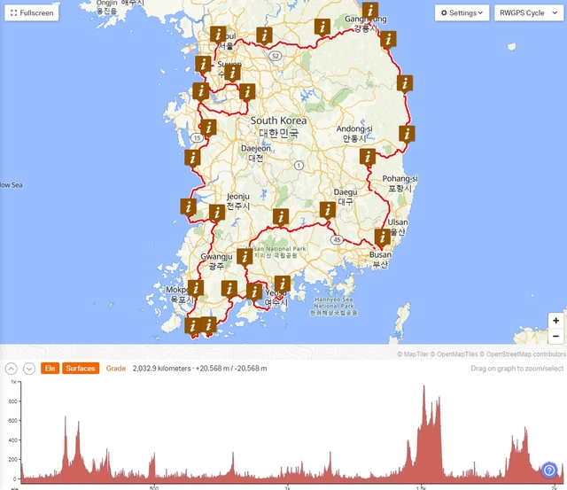

## KOREA 2030

2023年6月3日、韓国を一周する2030kmのブルベが開催されたので、参加してきました。

WORLD EXPO 2030を韓国釜山市へ誘致するためのプロモーションのイベントとして韓国を一周する2030kmのブルベが開催されました。
釜山市が主催しているなど気合いの入ったイベントだと想像できます。

制限時間は10km/hで計算されるので、203時間(8日と11時間)です。
朝6時スタートなので、8泊9日で走る計画を立てれば行けそうです。
2020年のタイの2020kmでは8日でゴールしましたが、今回のコースはめちゃめちゃアップダウンが多いようなので、9日いっぱい使って完走を目指します。

## ルート

釜山をスタートして韓国を時計回りに1周するルートです。
釜山から麗水(ヨス)までは海沿いを行かずに内陸を通るようです。
このあたり結構登ってますね。
麗水から先は島を渡るようなルートで楽しそうです。

西海岸は海の近くを通ったり、少し内陸を走ったりしながらソウルまで向かいます。
全体から見ると、比較的アップダウンは少なめですが、結構ギザギザしてるので要注意ですね。

ソウルからは100kmほどひたすらサイクリングロードを通り、その後、冬季オリンピックの平昌(ピョンチャン)や大関嶺という大きな山を越えて江陵(カンヌン)に降ります。

その後、釜山まで南下するのですが、このあたり意外と獲得標高が多いので、後半走行距離を長めに設定してしまうと辛くなりそうです。

## 大会情報

[KOREA 2030 公式ホームページ](http://www.korearandonneurs.kr:8080/jsp/info_BV/info-k2030)
