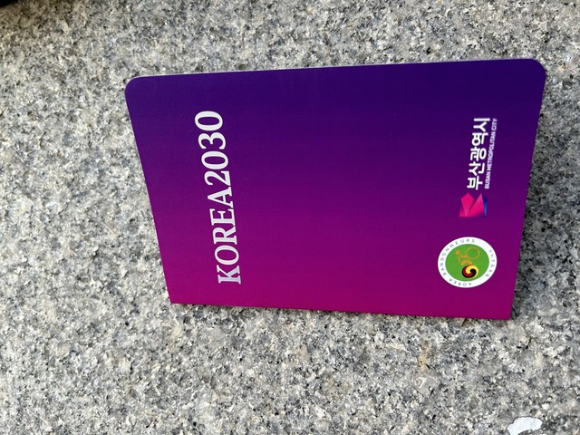

## 金海(キメ)空港からホテルまで

日本は台風で大雨でしたが、釜山に着くといい天気でした。

自転車は大型荷物のどこかから出て来るのかと思って聞いてみたら、普通にベルトコンベアで流れて来るらしく、取ってくるのでちょっと待っててということで、待っていると、ベルトコンベアの途中でつっかえてる自転車の箱を、おじさんがよじ登って引きずり出してきてくれました。。。

プサンへようこそ！

空港からホテルへはタクシーで向かいました。
タクシーは日本のクレジットカードは使えず、韓国のカードは使えました。

タクシーに乗ると、タイのPayuさんから電話がかかってきました。
「釜山に来たの?」
「おーー、Payuさんも参加するの?!!!」
なんか楽しくなりそうです。

## 自転車組み立て

ホテルに着いてチェックインは17時からだったので、それまで自転車を組み立てました。

玄関先で組み立てます。

組み上がりました。
写真をFacebookに載せるとたくさんの友達が、今度のホイールは劣化していないか、と心配そうに確認してくれました。
ありがたや。

ホテルは有名な温泉街なので、部屋には温泉が付いてしました。

帰りにもここを予約してあるので、自転車の箱を1週間預かってもらえるよう交渉しました。
快く引き受けてもらえて助かりました。

## 参加会場

タイの[ISAN2020](https://www.hirano.cc/travel/bicycle/isan2020/)で知り合った韓国のチェ・ヒョンジュンさんが仕事が終わったということで、スタート地点まで運んでくれました。

スタート地点までは10kmと微妙に遠く、ドロップバッグに入れる荷物もあるので非常に助かりました。

すでに多くのドロップバッグが並べられていて、たくさんの人が受付していったようです。

ここで車検を受け、受付をして、ブルベカードやジャージを受け取ります。

会場は競輪場で、「大韓民国最初のワールドエキスポ 2030釜山世界博覧会 誘致のためにスポワン(競輪場の名前)が一緒に走ります」とか書かれていました。
横には、全参加者の国旗と名前が書かれていました。

僕の上のDavid ThompsonさんはLRMを50回くらい完走している猛者です。
今回見かけなかったのですが、参加していたのでしょうか。
久しぶりにお会いしたかったですね。

外国人ではタイからの参加者が最も多く、日本人は4人でした。

この時は、日本人は見かけませんでしたが、タイの人がたくさんいました。

そして、タイの人たちに呼ばれてなぜか一緒に記念撮影です。

いろんな国でいろんな国の知り合いに会えるのは、ほんと心強いですね。

タイのPeeraさん。

韓国のチェヒョンジュンさん。

チェヒョンジュンさん、Ritthiratさん、Payuさん、Notさん。

## 参加者用グッズ、ブルベカード

参加者用グッズは全部でこんな感じでした。

ジャージ、反射ベスト(白色です！)、帽子、ブルベカード、ドロップバッグ x 3、謎の漢文(ハングルの説明)が書かれたもの。

ドロップバッグは全部で3箇所、383km、1069km、1592kmです。
行って帰ってくるタイプです。

ブルベカード表紙

「釜山広域市」って書いてあります。
かっこいい！！！

めくったところ。

「検車完了」のハンコが押されています。

2ページほどチェックポイントの説明です。

ここからハンコを押していくページのようです。

まだきれいな状態です。

1ページ撮り忘れたみたいですが、

最後はこんな感じです。

無事にこのページまで来れるといいですね。

## 前夜祭

無事受付が終わって、チェヒョンジュンさん、タイのPayuさん、Notさんでご飯に行きました。

こんなお肉を5回くらいお代わりして力を蓄えます。

明日から頑張りましょう！

