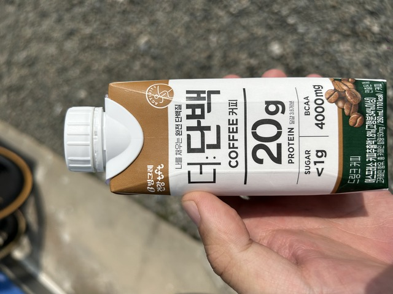
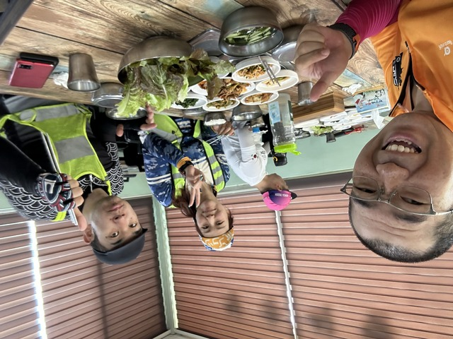
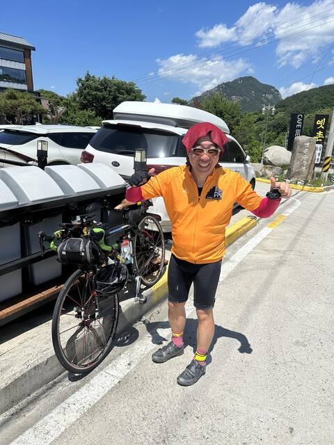
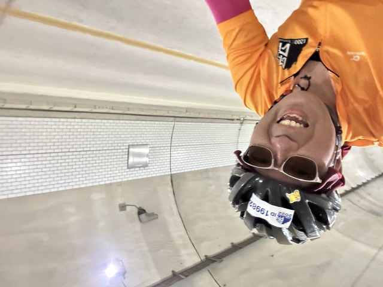
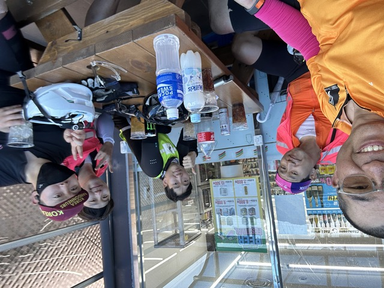
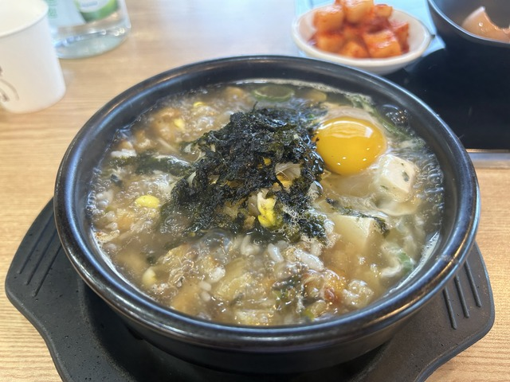

## スタート地点まで

5時に集合してスタート地点へ自走で向かいました。

さすが、地元民です。サイクリングロードなどを駆使して快適にスタート地点に連れて行ってくれました。

## スタート地点

エラい人のあいさつがあったようですが、ギリギリに着くように出発したので、あいさつはちょうど終わったところでした。

タイのTanaosri 1200kmの記念ジャージと韓国の反射ベストで出走します。
2日目の昼前にはドロップバッグに着いている予定なので、1日ちょっとしか着ない予定です。

次はいつ会えるかなぁ。
パチリ。

さて、そろそろ出発です。
今回は先頭集団でガンガン行くような気はないので、後ろの方から出発です。

## スタート:부산(釜山:プサン)～CP1:합천(ハプチョン): 115km

オー、サー、サム、イー、イル！
カウントダウンが終わると、一斉にスタートです。

公園を抜けて、

一般道へ出ます。

釜山市を抜けて隣の市まで行くくらいまで、警察が信号をコントロールして自転車が通れるようにしてくれていました。
市が運営しているイベントなだけあって、なんかすごいです。

ブロンプトンの人が写っていますが、200kmも同時開催なのでたぶんそっちの人だと思います。
さすがに・・・。

韓国では、マンホールや道路の継ぎ目、水たまりなどがあると「おい」とか「ホール」とか声かけします。
車が来たら「チャー」です。
あちこちから声が上がります。
日本と比べてかなり道路がきれいなので、ちょっとした継ぎ目でも「おい」という声が聞こえます。
こりゃ、青森なんか走ると「おいおいおいおい」ってなりますね。

なかなかの速いスピードで進んだ後、サイクリングロードに入りました。

途中大きめの水たまりがあったのですが、自転車を降りて担いで歩いてる人がいました。
汚したくないのか、雨が降ったらどうするのでしょうか。

しばらくサイクリングロードが続きます。

めちゃ景色のいいところに出てきました。

自撮りもパシャリ。

大きな集団はだんだん小さくなって、トンネルの手前にトイレがあったので、ここでばらけました。

ここらへんはのんびりひとりで走っていました。

前の方に集団がいたので合流します。

しばらく行くとコンビニがあったので休憩です。
ここまで、信号はほとんどなしで来ました。

お弁当を試してみます。

焼き肉屋さんの味、ソグムグイ定食です。

まぁまぁいけますが、すごくおいしいわけではないですね。
コンビニ弁当にするなら、出来ればお店で食べるのがよさそうです。

ほかに、タンパク質コーヒー

とうもろこしひげ茶などを買いました。

今回は、道中ずっとだいたいこのとうもろこしひげ茶とポカリスエットで走っていました。

ユーチューバーのパクセムさんという人と少し話して出発です。

店から出たとき、うっかり左側通行をしていまいました。
危ない危ない。
気をつけましょう。

しばらく走るとCP1の電話ボックスがありました。

この電話ボックスは中には電話は入っておらず、スタンプがあります。
韓国では自転車道などがものすごく整備されていて、全国にこんな電話ボックスなどの認証施設があるようです。
サイクリングパスポートのようなスタンプ帳があって、ハンコを集めるといろいろあるようです。
詳しくは[こちら](https://www.bike.go.kr/)とか。

チェックポイントにはすでに何人か到着していて、タイの人の自転車もありました。

なんと、アヒルを自転車に付ける文化は世界共通のようですね。

休んでる人もいます。

## CP1:합천(ハプチョン):115km ～ CP2:함양(ハミャン): 193km

CP1を出発しようとすると、日本語が聞こえてきました。
木内さんとpekoさんです。
どちらも初めてお会いしますが、名前は聞いたことある方達です。

しばらく一緒に走って、お昼を一緒に食べました。

このあたりまでほとんどお店がなかったので、どんどんランドヌールが入ってきて、お店の中はしっちゃかめっちゃかになりました。
いくつものグループが入ってきて、みんなうろうろするので何人いるかもわからない状態で、お店のおばちゃんが、とりあえず全員席に座って～！みたいな状態でした。

このあと、少し一緒に走りましたが、上りもめちゃ速いおふたりだったので、お別れしました。

そのあと、先ほどのユーチューバーのパクセムさんにすごい勢いでしばらく牽いてもらいました。
前にいる二人組のところまで追いつくと、あとはこの人達に着いて行くといい残して後ろの方に去って行きました。
えっ。。
同じチームの人らしいです。

上りの途中にコンビニがあったので駆け込んで休憩です。
アイスと氷を奢ってもらいました。

めっちゃ暑いので、アームカバー、ジャージ、タオル、手袋を全部びしょ濡れにして出発です。

このあとものすごく登るのを知っていたので、先に一人でのんびりと出発しました。

10%とか書いてありますが、だいたいこういうのが出てくると要注意です。

10%どころか、14%もあります。
これが4kmほど続いていました。

日差しも暑かったので、木陰があるたびに、誰か休んでいるのを見かけました。
ガーミンは39.4℃になってますね。

上り終わるとトンネルがありました。

このトンネルすごく涼しくてうれしくて写真を撮りました。
Facebookなんかにもこのトンネルの写真を撮ってる人が多くいたようですが、同じ心境ですかね。

산청군(サンチョン郡)を抜けて

함양군(ハミャン(咸陽)郡)に入ります。

ハミャンのチャックポイントに到着です。

韓国ではコンビニのチェックはレシートをもらうのではなく、自撮り写真を撮るそうです。

うだうだしていると、木内さんとPekoさんも到着して、Cascadeで会ったというオーストラリアから来たFrancisさんも紹介してもらいました。

。。。って、あれ?!
会ったことありますよね???
タイのISAN2020で5日目くらいにノンカーイまで一緒に走った方でした。

これがタイの時。

Payuさんも現れたので、まさに、ノンカーイの昼食の風景の再現でした。
チェヒョンジュンさんもいれば完璧でしたが、彼は速いので先に行ってしまってるでしょう。

これもタイの時。
この写真を撮ってる僕の後ろにチェヒョンジュンさんがいました。

いやー、同窓会みたいで楽しいですね。

ここまで193km、10時間くらいなので、いいペースです。

## CP2:함양(ハミャン):193km ～CP3:주암(チュアム):289km

このあと、まだまだ上りが続きます。

のんびりひとりで走っていると、何度か抜きつ抜かれつするチームがいました。
日本人の人、日本人の人って会うたびに声をかけてくれて、後ろ付いてくるといいよ、とチームに入れてくれます。
よく休憩をするチームなので、ゆっくり先に行ってまーす、と先に行くとまた追いついてくるというようなペースです。

このチームは1日300kmずつ行くそうで、3日目くらいまでよくご一緒しました。

19:30ごろ、大きめの街に出たので、夕食にしました。

ファンテコンナムルクッパです。

ファンテはスケトウダラを干したようなものですね。
温かい食事はいいですね。

夜になってもアップダウンは続きます。

ようやく、21:50頃に주암のCP3に到着です。

とりあえず、カップラーメンを食べて補給です。
疲れていたのか写真がないですね。

日本人の人ですよねぇとまた声をかけられて、あめをもらいました。

韓国語を話す日本人ということでか、いろいろと親しくしてもらってありがたいです。

## CP3:주암(チュアム):289km ～ 宿(순천(スンチョン)): 340km

予約した宿まであと50kmくらいですが、ゆるい峠と、きつい峠を越えます。
チェヒョンジュンさんとPayuさん達は325kmのところのきつい峠の前に宿を取ったそうです。

手前の宿にしとけばよかったと少しだけ後悔しつつ、でも、明日長くなるのもきついので、これでいいのだと納得させながらホテルに向かいました。

宿の到着は午前1時頃。
予定よりはだいぶ速く着いたのでゆっくりできそうです。

明日は8時出発の予定をしていましたが、繰り上げて7時頃出発します。
睡眠時間は4.5時間。
おやすみなさい。Zzz

1日目: 移動距離: 340km + スタート地点までの12km
