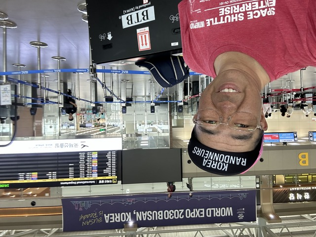
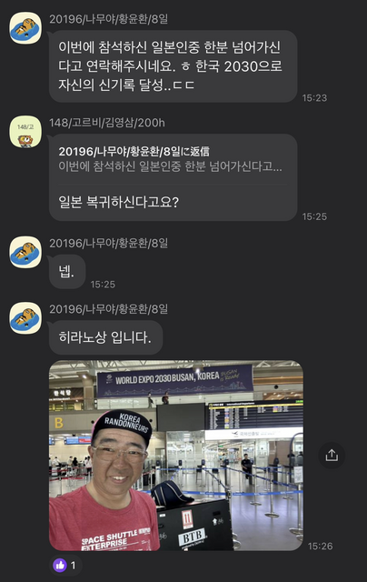
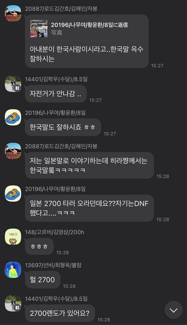
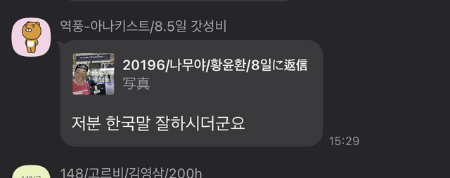
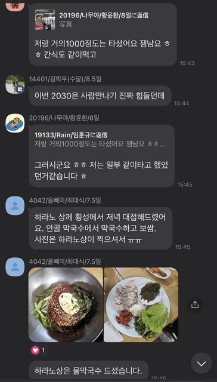
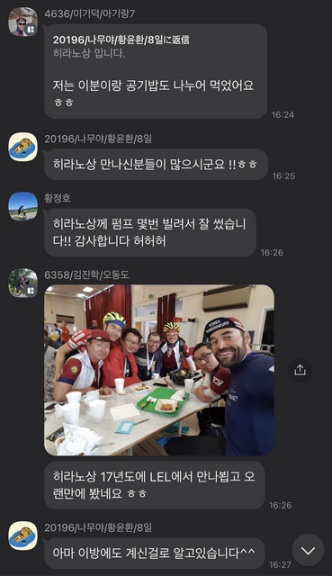

## 帰国 + 番外編

釜山で1泊して、次の日飛行機で東京へ帰りました。

釜山の空港でも2030年の釜山エキスポ招致の宣伝がいっぱいありました。

この時、途中で一緒走って友達になったファンさんに帰るよーとメッセージしたら、Korea2030のカカオグループに載せてくれました。

「今回参加した日本人のひとりが渡航するって連絡してくれましたよ。Korea2030で自身の新記録達成だって」

このあと、飛行機に乗ったので見てなかったのですが、「韓国語ができる人ですよねー」と僕と会った人が返信します。

昨年、日本縦断の2700をDNFしたと話していたので、その話題でもりあがります。

話題が落ち着いた頃、また、目撃者が現れました。

「この人韓国語よくしゃべりますよねぇ」

この後、目撃情報がどんどん出てきます。(笑)

「自分とだいたい1000kmくらいは走りましたよ。おやつも食べて」

「そうそう、自分もちょっと一緒に走ったみたいです」

「平野さんとフェンソンで夕食食べましたよ。アンゴルマッククスでマッククスとポッサム。写真は平野さんが撮ったんでないんです T_T」

「平野さんはムルマッククス食べてました」

「自分はこの人とごはんを半分こして食べましたよ」

「平野さんに会った人多いですねぇ！！」

さらに目撃情報は続きます。

「平野さんにポンプを何回も借りて使わせてもらいました。ありがとうございます。ほほほ」

「平野さんと17年にLELで会って以来久しぶりに会いましたよ」

---
いやー、みなさん、覚えていてくれてありがとうございます。

9日間、ほんとにたくさんの人と会って、一緒に走って、いろいろ話して、ほんとに楽しかったです。

こんなに楽しいブルベは久しぶりでした。
主催者のみなさん、一緒に走ってくれたみなさん、ありがとうございました。
