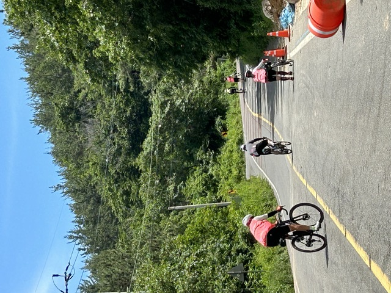
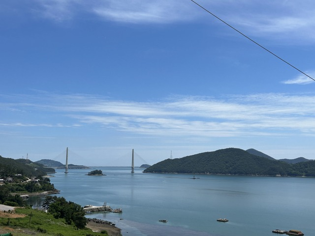

今日は순천(スンチョン)から완도(ワンド)まで行きます。島を渡る景色のいいルートですが、かなり登るようです。

## 宿(순천(スンチョン)): 340km～CP4:여수(ヨス): 383km

朝7:20ごろ、순천(スンチョン)のホテルを出発です。

ホテルはこんなに高いところにあったので、昨夜は押して登りましたよ。
値段と標高が高いだけで、朝食とかもないホテルだったので、50km手前のコンビニで買ったパンを食べて出発です。

相変わらずの細かいアップダウンを1時間ほど走ると、8:30頃ですが朝から開いてる食堂がありました。

一見開いてるかどうかわからないので、영업증(営業中)や「朝ご飯やってます」のハングルが読めるかどうかが重要かも知れません。

お店に入って何が出来るのか聞いてみると、できるものはできるよ、とてきとーな感じだったので、朝ご飯っぽくテンジャンチゲ(味噌チゲ)を注文しました。

でてきました！
なんじゃこりゃ。
パンチャン(メインの料理以外に付いてくるやつ)がめちゃめちゃ豪華じゃないですか。
焼き魚まで付いてます。

メインのテンジャンチゲも蟹が入ってたりとめちゃめちゃ豪華です。

ご飯をもう1杯お代わりして、お腹いっぱいいただきました。
8000ウォン(900円くらい)でした。

1時間ほど走って麗水(ヨス)市内に入ると、昨日いっしょに走った人たちがいました。
呼び止められて寄ってみると、またアイスをいただきました。

麗水市内は12kmほどサイクリングロードを走ります。

入口のところにKOREA 2030kmの垂れ幕がありました。

「KOREA 2030km 麗水(ヨス)市訪問を歓迎します」だそうです。
麗水市、麗水市体育会、麗水市自転車連盟が協賛しているようです。

サイクリングロードはこんな感じで、歩行者と自転車が明確に分かれています。

そこそこアップダウンもあり、途中にはトンネルもありました。

サイクリングロードを終えて少し海沿いに進むとチェックポイントのペンションでした。

ここはドロップバッグがあるので、ジャージを着替えます。
ペンションの何部屋かは開放しているようで、その1部屋に入るとさっきのアイスをくれたチームの人たちがゴロ寝していました。
よく会いますね～。

## CP4:여수(ヨス): 383km ～ CP5:과역(クァヨク): 445km

ヨスの大通りを走っていると自転車の人に日本語で声をかけられました。
「RAAM行ったんですか?」
小澤さんの真っ赤なRAAMジャージ着てたからですね。
KOREA2030の参加者か地元の人かはわからなかったのですが、日本語話す人はすごく多いですね。

しばらく行くと単独の女性の人も走っていました。

どこで泊まったのか聞くと、どこも満室で寝てないんですよ、とのこと。
初日から大変です。。。
最初は人もばらけていないし、1日目だけでも予約しておくのが正解かもですね。

暑かったのか、氷を買わないと、と言い残してスーパーに行ったのでお別れです。

しばらく走って、1時近くになったのでお昼ご飯にしました。

チュオタンです。どじょうです。
スタミナ、栄養満点なのですが、もうちとがっつりしたものが食べたかったかも。

このあたりは、「自転車優先道路」です。

実はこの看板が出てくると危険です。
めちゃめちゃアップダウンが出てくるのですよ。
優先にするなら、トンネルでも作ってくれって感じです。

えげつない坂ですね。

さっきの女性ライダーが背中から氷水をかけてくれました。
こうやって使うためだったのですね。

登りきったところでは、いつものようにいつもの人たちが休んでいます。

僕の宿泊地ワンドより少し向こうまで行く予定らしいです。(この地点では・・・。最終的にワンドに泊まったそうです)

峠をいくつか越えると海が見えてきました。

海の向こうには橋が見えます。

ここからは橋を通っていくつかの島を渡ります。

この部分ですね。

橋です。

海です！

橋とトンネルです。

途中でいつものグループの人たちに会いましたが、アイスを食べると言って休憩所に消えていきました。
速く走って疲れてゆっくり休憩するスタイルですね。

15:10ごろ、チェックポイントに到着です。
8時間で100kmくらいのペースなので、2日目は獲得標高も多く、予定通り時間がかかりますね。

## CP5:과역(クァヨク): 445km ～ CP6:웅치(ウンチ): 492km

しばらく走っていると陽気で眠くなってきた頃にこんな建物がありました。

タイにもよくあるやつですが、それよりはきれいに作られています。
韓国にはこういうのがあちこちにあります。

先客がいるようですが、おじゃまして15分ほど仮眠です。

仮眠して元気に走っていると、宇宙に行く道がありました。

どう宇宙に行くのかは最後までわかりませんでしたが、ひたすらまっすぐです。

しばらく走るとポソンに入りました。

ポソンはお茶が有名です。
緑茶風呂などもあり、以前バスを乗り継いで訪れたことがあるので感慨深いです。

18:30ごろ、チェックポイントに到着です。

夕食時ですが、まわりの食堂が全く開いていないので、どうしようかと考えていると、タイのPayuさん達が来ました。

ここからしばらく一緒に行くことにします。

## CP6:웅치(ウンチ): 492km ～ 宿(완도(ワンド)): 573km

しばらく走ると、よかった、食堂がありました。

中には、すでにさっきの韓国グループや他のライダーもいました。

チャンポンを頼みました。
うまうまです。

ここから先もPayuさん達と走りました。

Payuさん

Notさん

月

何か燃やしてます。

Payuさん達は、だいたい同じペースのようですが、結構速いです。
とくに下りで加速するので、速く走るギヤを付けていない僕は下りでちぎられます。

途中オーストラリアのFrancisさんも後ろからやってきてしばらく一緒に走りました。
昨日は麗水まで行ったけど、お腹を壊して大変だったそうです。

夜の退屈な道を一緒に走ると心強いですね。

日付が変わって0時すぎ、僕の目的地ワンドに到着しました。
Payuさんたちはもう少し先の街のホテルを予約してしまったそうで、ここでお別れです。

Su su na!! がんばって！
おやすみなさい。

夜食にカップラーメンを食べておやすみです。

今日も4時間半ほど寝て、6時頃出発するとしますか。
おやすみなさい。

2日目: 移動距離: 233km (2819m up)
