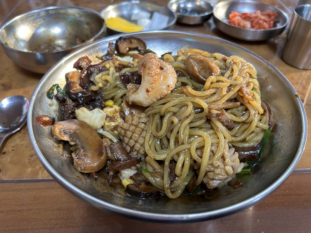

## 宿: 573km ～ CP7:완도(ワンド): 574km

朝6:20ごろ、ホテルを出発してCP7へ向かいます。
CP7はホテルから1kmもないくらいです。

CP7はコンビニなので朝ご飯にします。
タッカルビです。
そんなに鶏は入っていません。

CPには、すでに昨日のグループがいて出発するところでした。
結局ワンドに泊まったそうで、ほんとよく会いますね。

ご飯も食べて出発しようとすると、おっと、CPの写真を撮るのを忘れてました。
危ない危ない。

## CP7:완도(ワンド): 574km ～ 해남(ヘナム): 616km

相変わらずアップダウンがありますが、40km先の해남(海南:ヘナム)を目指します。

少し雨が降ってきましたが、カッパを着るほどではなさそうなので、そのまま行きます。

しばらく走っていると、後ろから2人組が追いついてきました。

一緒に行こうということなので、後ろに付かせてもらいました。
スさんとファンさんで、ファンさんは2年間日本で働いてたそうで日本語もペラペラです。

いつものグループも合流して大きな集団になったのですが、上りのペースが速くなったので、離れて走っていると、スさんとファンさんがゆっくり走って待っていてくれていました。

無事、ヘナムまで到着です。

フェドッパプのあるお店が開いてそうだったので、ご飯を食べていくというと、一緒に行くそうです。

待ってる間スさんはお休みです。

うひゃーー、朝からごちそうです。

これにコチュジャンを入れて混ぜて食べます。

あー、この記事を書いてるだけでお腹が空いてきますよ。

みんなで、いただきまーす。

隣のテーブルでは、ごっつい鍋を食べてる人たちもいました。

料理魔名前を聞いてみると「ヘムルテンジャンチゲ(海鮮味噌チゲ)」。
テンジャンチゲってバリエーション多いんですね。

## 해남(ヘナム): 616km ～ 독천(ドクチョン): 679km

お二人は他の友達を待っているそうなので、お先に出発します。

「地面の終わり」という最南端の碑みたいなのがあったので、記念撮影です。

ちょっと峠を越えて、田舎道を走ります。

田んぼもきれいです。

チェックポイントの7-11が見つからないのですが、もともとここにあったようです。
ドクチョンのターミナルがわかるように写真を撮っておきましょう。

そろそろ1時頃でお腹も空いてきたので近くの食堂でご飯にします。

中に入ると、いつものグループがいました。
行動パターンが似てますね。

おいしそうなのを食べていたので、同じものを注文しました。

## 독천(ドクチョン): 679km ～ 정읍(チョンウプ): 807km

昼食を終えて、別のコンビニで補給をしてひとりでのんびり出発しました。

しばらくすると、あれれ、さっきご飯を食べて先に出ていったグループが後ろから来ました。
どうやら、隣で追加の昼食を食べていたようです。

香港からの2人も加わって、ぐんぐん進みます。
いつもは休憩しまくってるグループなのに、この時はほとんど休まずに走り続けていました。
確かに、僕は9日間でゴールを目指していますが、彼らは7日だか8日だか言っていたのでそろそろペースをあげないとですね。
ま、コンビニも何もありませんでしたが。

2,3時間走って、ようやくコンビニがあったので休憩です。

ここからまたのんびりと一人で進みます。

途中、ちょっと遠回りしているようなところがあったので、これはご飯でも食べて行けということだろうと、中華料理屋に寄りました。

サムソンヘムルチャヂャンミョン。
めちゃめちゃうまうまでした。

まぜたらこんな感じです。

食べ物やに自転車が止まっていると、寄りたくなるものです。
ひとり入ってきました。

名品中華料理。
おいしかったです。

今日の目的地정읍(チョンウプ)の手前は少し登りますが、おいしいご飯を食べたのでとても元気です。

全羅北道の정읍に来ました。
もうひと踏ん張りです。

ちなみに、20:00でまだこのくらいの明るさです。

自撮りも。

40分ほど走ってチェックポイントのモーテルに着きました。

いい感じです。

今日の宿はここのすぐ近くのモーテルです。

おやつを食べて、お風呂に入って、リモコンの使い方がわからなかったのでフロントに聞きに行くと、PayuさんNotさん、それにオーストラリアのFrancisさんがちょうど入ってきました。
同じペースですね～。
値段が聞き取れなかったみたいなので、フロントとPayuさんたちの通訳をちょっとして、おやすみです。

今日は6時間寝ます。

3日目: 移動距離: 234km (1943m up)
