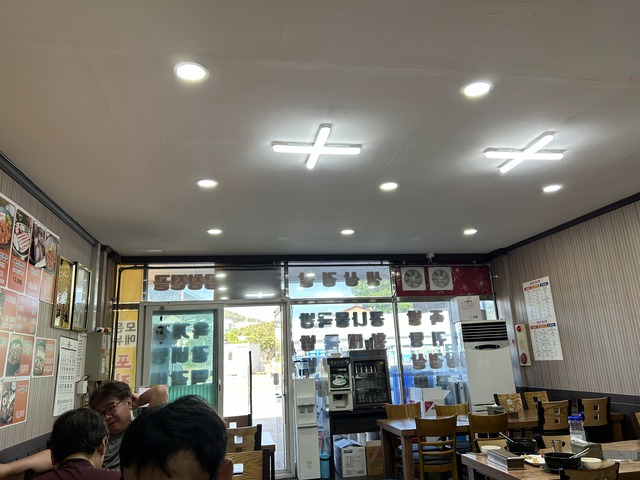
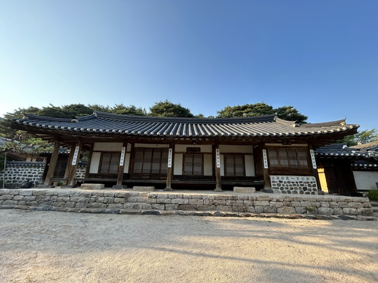

さて4日目です。ドロップバッグのある町당진(タンジン)まで行きます。今回の予定で265kmと2番目に長い距離です。

## 정읍(チョンウプ): 807km ～ CP11:격포(キョクポ): 857km

6時間くらいしっかり寝て、朝5時前の起床です。
サリゴムタン麺のお湯を入れるタイプがあったのでこれを食べます。
うまうまです。

いろいろ準備して、出発する前に空気を少し足しておこうとポンプを取り出すと、

あれれれ?!

先の部品がなくなっていますよ！！！

振動で緩んでどこかに飛んで行ってしまったようです。

どうしようかと頭を抱えていると、ちょうどPayuさん御一行が降りてきたので、ポンプを借りて一緒に行くことにしました。

とりあえず、現状の空気はこれでいいのですが、もし、道中でパンクしたら後ろの誰かを待つしかありません。
昨日の距離を短くしているので、順位としては後ろの方に下がっているはずで、後続が来る確率も下がっているのでちょっとどきどきです。

さいわい、今日の目的地唐津(タンジン)のチェックポイントは自転車屋さんなので営業時間内であればなんとかなりそうではあります。
しかし、到着は夜の予定なので無理な可能性の方が高いです。

じゃ、翌日の出発を遅くするか・・・。
うーん、悩ましいです。

ま、ここで悩んでいても仕方がないので、Payuさん達と出発です。
宿の人曰くFrancisさんは夜明けに出て行ったそうでした。

今日も田んぼのきれいな田舎道を走ります。

今回は宿を全部予約しましたが、ルート沿いにはモーテルやムインテル(無人のモーテル)などもあり、運に任せて進むこともできそうです。

アップダウンが多いですが、景色も少しきれいです。

50km走って午前8時前にチェックポイントのセブンイレブンに着きました。

先に着いた人たちはセブンイレブンの向かいのCUで朝ご飯を食べていました。
セブンイレブンよりCUの方がいいんでしょうかね。

地元の自転車少年もいて、一日200-300km位走って韓半島を一周してると話すと目をキラキラさせていました。

彼の最長は30-50kmくらいらしいので、もう少し大きくなったらきっとフランスあたりでまた会うかも知れません。

お腹が空いてたので、Payuさん達に朝ご飯を提案しました。
ここのCPの手前500mくらいに食堂を見つけていたので、少し戻ってそこに行くことにしました。

食堂なんかあったのか、と不思議そうに言っていたので、ハングルが読めないと食堂なのか、開いているのか、わかりづらいこともあるようです。

カルビタンを注文しました。

うまうまです。

Notさんは筋骨隆々で骨付き肉をかぶりつく姿がなかなかワイルドでいい感じです。

かなり満足していただけたようでした。

## CP11:격포(キョクポ): 857km ～ CP12:서천(ソチョン): 953km

しばらく、自転車優先という名のアップダウンを進みます。

海が見えてくると、セマングム防潮堤というところに出てきました。

ここからは干拓の堤防道路を進むのでアップダウンはありません。
昨年11月に諫早湾の堤防道路も走ったばかりなので楽しみにしていました。

諫早湾の堤防道路は7,8kmなのですが、こちらは30kmくらいあります。
これはすごい。

とにかく、ひたすらまっすぐ進みます。

おっと、運転中の携帯電話使用禁止ですね。
これは、カメラです。そうです。そうです。

道路が広いので海の上を走っている感覚は少ないですが、右も左も海です。

ひたすらまっすぐ走ります。

しかし、かなりの向かい風です。

最初は喜んでいましたが、もう無言でひたすら走ります。

そろそろ疲れてきましたよ。

トンネルがありました。

黄色い花がかなりきれいです。

あまりにもきつくなってきたところに休憩所があったので、離脱しました。
また、後で会いましょう！

時刻はちょうど11時。
止まるときは用事を2つ以上しましょう、という板東さんの教えに従って、今夜通過するチェックポイントの自転車屋さんに電話してみました。

「携帯ポンプ買いたいんですが、着く時間が夜10時くらいになるんですよ。なんとかいい方法ないですかねぇ。」

「じゃ、表の見えないところに置いといて、場所の写真を送るよ。」

「お！それは助かりますぅ。写真のアドレスはどうしたらいいですか?」

「この番号にSMSすれはいいよね?」

「おぅぅ。それでいいです。お金はどうすれば?」

「後でそこに書くよ。」

「ほなよろしくです－！」

日本ではSMSとかほとんど使わないのでその発想はなかったです。
とにかく今日をなんとか乗り切れば、今夜には空気入れが手に入りそうです。

ほどなくして、詳細な場所の写真が何枚かSMSで送られてきました。
BC自転車のチェさん、ありがうございます！！

このあとひとりで向かい風の残りの堤防道路を進みました。

堤防道路が終わってしばらく走ると、コンビニがあり、隣にククス屋さんがありました。

12時前で少し早いですが、お腹が空いたので食事にします。

このあと、CPまで45kmくらいあるのですが、向かい風で疲れていたのか、ほとんど写真がありません。

そして、14:50、チェックポイントに到着です。

風車のモニュメントがあるなんて、風の強い地域なのでしょうか。
やめていただきたいですねぇ。

チュンジャンデという場所のようです。

たくさんの行楽客で賑わっていました。

うろうろしていると、ランドヌールの方ですか? と声をかけてくる方がいて話をすると、チョナンのチームの人で近くなので飲み物や食べ物をたくさん持って来て、応援に来ていたそうです。
いやいや、チョナンからは100kmくらいありますけど。。。
この方、福岡に10年住んでいたそうで日本語もペラペラでした。

話をしていると、速い人はすでにソウルに着いているそうで、それどころか1日半か2日間ソウルで会社に行ってから再出発するそうです。
えーーーっ。
長い間ブルベをやってますが、途中で会社に行く人は見たことないですよ！！！

## CP12:서천(ソチョン): 953km ～ CP13:홍상(ホンソン): 1008km

この区間、疲れていたのか全然覚えがありません。。。
写真も花の写真しかないですね。

疲れた人が撮った花の写真をお楽しみください。

橋の欄干によく花が飾られています。

チェックポイントの手前数kmのガソリンスタンドでトイレに寄って、となりにトンテタンのお店があったので行こうかと思ったのですが、ちょっと時間も早いし、チェックポイントの周りにももっとお店があるだろうと思ってパスしました。

時刻は18:20。
チェックポイントの古民家に到着です。
やっと1008km。もう少しで半分です。

写真を撮っていると中から人が出てきて、今朝早くから自転車でここの写真を撮ってる人がいっぱいいるんだけど、と不思議そうに聞かれました。

プサンから韓半島を一周する大会があって、それの通過証明でここの写真を撮るんですよ、うんたらかんたらと楽しくお話ししました。

せっかくなので中にも入ってみました。

## CP13:홍상(ホンソン): 1008km ～ CP14:당진(タンジン): 1071km

ここからはちょくちょくアップダウンがあります。

古民家周辺にはなにもなかったので、食べるものが欲しいところです。

結局40分くらい登ったり降りたりしながら、ハヌ(韓牛)のお店があったので、吸い込まれるように入りました。

席について、ハヌのお店だしということで、とりあえず、ユッケピビンパを頼みました。

でも、なんか、今日はお腹が空いてて力が出ない気がするのです。
それに、疲れているときの生肉は危険な気もします。

テジカルビを1人前だけ出来ないか、と聞くと、ま、予想通り2人前からだとのこと。
500gもあるやーん、と悩んでいると、500gくらい食べたらいいよ、とのことで、オーダーを変更。
ま、たしかに500gくらいしれてます。

そして、待つこと5分。
来ました。ででーん♪

なかなかの大迫力です。

パンチャンもなかなかの量です。

ごはんも頼んでいろいろ食べてると、追加のパンチャンも来ました。

おーーー。
どんどん来ますよ。

大変ですよ。

いい感じで焼けてきました。

店のおばちゃん達も横で食事していたので、楽しくいろいろ話しながらおいしくいただきました。

最終的には、なぜかおばちゃん達のサムギョプサルも100gくらいいただきました。

途中でもうひとりブルベの人が入ってきましたが、簡単な食事を頼んでいました。
ま、それが普通ですよね～。

たくさん自転車の人が来たでしょ、と聞いてみましたが、今の人で5人目だよとのことでした。

結局1時間くらいしか時間を使わず、ここまでおいしいものをたっぷり食べられたのは、かなりよかったですね。
ちょっと田舎の空いているおいしいお店、最高です。

山を下ると、暗くなってきてホンソンの街がありました。
ここまでくればお店もいっぱいありましたが、多いと迷うのでさっきのところは正解でしたね。

ラウンドアバウとにはたまにモニュメントがあります。

アップダウンを走ること2時間ほど、やっとタンジンに入りました。
大きな地名が変わるところの手前って必ず登らされるんですよね。

下って終わりかと思ったら、もうひとつ峠があって、それを超えたら大きなタンジンの街でした。

チェックポイントの3kmほど手前の病院にドロップバッグがあるので、ジャージを交換します。

ぱぱっと取り替えて、チェックポイントの自転車屋に向かいます。
途中で5,6人に会いましたが、みなさんばらばらでごはんを食べたり、先にホテルに行ったりするそうで、チェックポイントへはひとりで向かいました。

23:00、到着。

スタンプを置いてあるテーブルの奥に、ありましたありました。ポンプです。

包装用のタイラップも切ってくれてあって、すぐに使えるようにしてくれてあります。
なんという優しい気配りでしょうか。

しかも、25000ウォンの値札もあるので、5000ウォン割引してくれたみたいです。
ほんと、感謝です。

他にも同じような仲間がいるようで、いくつか商品が置かれていました。

## ～ 宿

ルートを少し離れて今日はLeeモーテルです。

KモーテルとかHモーテルとか1音節のモーテルが多いですね。
ちなみに、このモーテル、Agodaでの登録名はRemotelです。
英語名と実際の名前が違ってたりするのは、まぁ、韓国ではあるあるですね。

部屋に入ると、なかなか証明がいい感じです。

パソコンもあるので、Garminへルートの登録もできますよ。

自転車は中に入れて、新しいポンプも取り付けました。

オンドル部屋なので布団です。

こんな感じに敷いてみました。

0:15ごろ、おやすみなさい。

5時間半くらい寝て、出発することにします。

4日目: 移動距離: 265km (1993m up)
