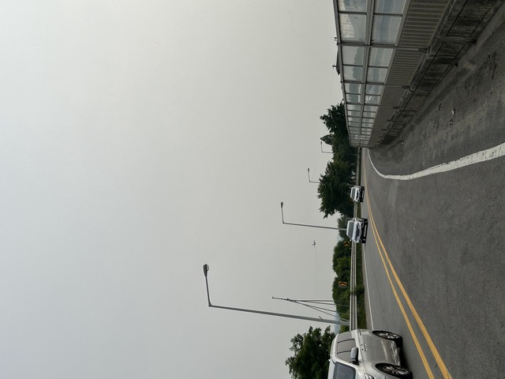
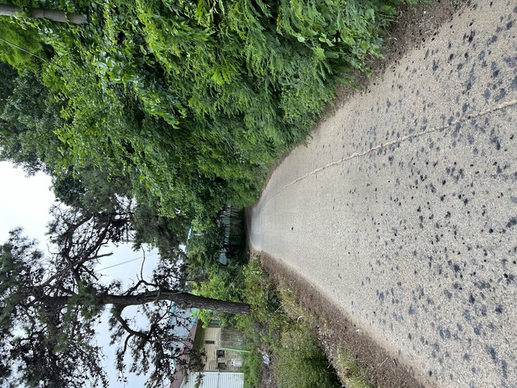

5日目です。今日はソウルまで行く予定です。
タンジンからはピョンテクの方に行くのではなく、チョナンの方に回って、そのあと海側を通って行きます。
直線で行けば近いのですが、すこし迂回する形になるので250kmほど走る予定です。

## 宿: 1071km ～ CP15:천안(チョナン): 1157km

予定通り5時間半ほど寝て出発です。
次のチェックポイントはチョナンとピョンテクの間の峠にあるトンネルです。

今日もきれいなたんぼの風景を進みます。

見渡す限りの田んぼで、なかなか爽快です。

しばらく走ってると、ペダルに違和感があります。
2日ほど前から、上りで踏み込んだりダンシングをすると、足下からパキパキっという音がしていたのですが、今日は平地を走っていてもパキパキ音が鳴ります。

考えられるのはBB周りかクランクかペダルでしょうか。
ペダルは箱に入れて飛行機に乗せるときに外して、組み立てるときに付け直しているのですが、外すのが面倒なのでゆるめに締めた記憶があります。

時間が経つにつれパキパキ鳴る頻度が増えているので、自転車屋に行った方がよさそうです。

調べてみると次のオニャンという街に自転車屋が何軒かありそうです。
開店時刻まで待つ必要があるかも知れませんが、とりあえず2軒はありそうです。

ということで、とりうえず朝ご飯にします。

スンデです。

おいしく食べてると、ブルベの人がひとり入ってきました。
今日は自転車屋を探さないとだわと話をしていると、食堂のおばちゃんがオニャンまで行けばあるよと教えてくれました。
とにかく、オニャンにはありそうです。

オニャンはオニャン温泉で有名なところで、大昔に来たことがあるはずで、その時は食堂を探すのも大変なくらい小さな町だった覚えがあるのですが。

朝ご飯を終えて少し行くと、ルートはサイクリングロードになりました。

サイクリングロードの屋根は太陽光パネルになっています。

「さよなら！歩行者」
すごい看板ですね。
自転車の部分は歩行者は通るなということですね。

写真では切れてしまいましたが、右側には「さよなら！自転車と書いてあります」

サイクリングロードから500m程ルートを外れるところに自転車屋はありました。

が、ただいま9:53。開店前でした。

5kmほど先にも別の自転車屋があって、そっちは開いてそうなので一旦ルートに戻ります。
そっちも開いてなければ、また戻って来ましょう。

サイクリングロードは普通のおじさん達も利用しています。

オニャン温泉駅です。

めちゃめちゃ大都会です。
びっくりです。
昔はバスを乗り継いで来たような。

ルートから少し外れて自転車屋さんありました。

とりあえず、ペダル周りを分解して見てもらいます。

BBはとくに問題はないそうで、クランク、ペダルを締め直して調整してもらいました。
片方のペダルがちょっとゆるかったかなぁということでしたが、大きな問題は見つからなかったそうです。

大きな問題がなさそうだというだけでも安心です。

ついでに、フロントが時々外に落ちてたので、ディレーラーの調整もしてもらいました。

店を出て走ってみると、パキパキ鳴るのは直りました。
素晴らしいです。
でも、インナーからアウターに入れようとすると、あら、入らない。
ま、全然入らないわけではないのですが、アウターに落ちないようにだいぶ内側よりに調整してくれたようです。。。

もう一度店に戻ると、なんと、店は閉まっていました。
さっき開いてたのはラッキーだったのですね。

諦めて走っていると、また自転車屋を見つけたのでここでまた軽く調整してもらいました。

パキパキ音が鳴らないと、だいぶ快適に進む気がします。
今まで音を鳴らすことにいくらかエネルギーを消費していたようですね。

しばらく走ってるとカップルのライダーとこの前氷水をかけてくれた女性がいたのでしばらくご一緒しました。

坂を登っているとオーストラリアのFrancisさんが「おー、こんなところで会うとは！」と言って追い越していきました。

おしゃれなカフェとかタイミングが合わず、ソフトクリーム成分が不足していたので、コンビニでソフトクリームをいただきました。
韓国のコンビニはババンバとか棒のタイプのおいしいアイスクリームが多いので、そういうのばかり食べてました。

お昼ごはんを食べたいのですが、なかなかお店がなく、結局14時前にチェックポイントのトンネル手前の食堂に入りました。

チャヨンポソッタン、天然キノコ鍋です。
うまうまです。

14:30ごろ、これがチェックポイントです。

## CP15:천안(チョナン): 1157km ～ CP16:평택(ピョンテク): 1196km

下ってる途中、この大会とは関係ないようですが、釜山エキスポ2030の垂れ幕を見かけました。

ピョンテクに入ると、飛行機のような轟音が聞こえるようになりました。
でも、普通の飛行機よりもっとすごい音です。

空が見える位置に来ると、戦闘機がビュンビュン飛びまくっていました。

めちゃ速いですね。

16:15ごろ、チェックポイント到着です。

## CP16:평택(ピョンテク): 1196km ～ CP17:화성(ファソン): 1257km

戦闘機はしばらく離陸してぐるっと回って戻って着陸して、を何度も繰り返しているようでした。

戦闘機の音も聞こえなくなった頃、細い道に入ります。

のどかでいい感じです。

そういえば、今夜はモーテルに宿泊なのでいいのですが、明日はペンションなので、遅く着くと誰もいないかもしれないので、念のため電話しておきました。
予定では19時頃には着くつもりなのですが登りも多いので、ペンションには21時頃になるかも、と伝えておきました。

電話を終えるとお昼にちょっと一緒に走ったカップルの人たちが来て、一緒に行きましょうとのことなのでご一緒しました。

途中、ここはなんたらのブルベで来たことがある！と懐かしそうな話していました。
今回のルートは今までの実績のあるいろんなブルベのルートをつないで構成されているのかも知れません。

コンビニに寄るそうで、しばらくしてお別れしました。

僕もお腹が空いてきたので、食堂を探すのですがなかなかありませんでした。
しばらく行くと堤防道路になり、こうなるとお店は期待できません。
幸い向かい風ではなかったので、快適に進みました。

結局19:30ごろ、夕食にありつけました。

チェユクポックムを辛くしないでお願いしました。

うまうまです。

玉子スープも出てきました。

20:30頃、チェックポイントに着くとしばらくして、ファンさんが来ました。

せっかくなので、一緒に行きましょう。

## CP16:화성(ファソン): 1257km ～ CP17:宿 (ソウル): 1327km

今日の宿は次のチェックポイントの5kmくらい手前のソウルの광명(クァンミョン)というところにしました。
ルートはサイクリングロードで何もないところなのですが、500m外れるだけで大都会になります。
あと70kmくらいです。

ファンさんといろいろ話しながら楽しくのんびりと進みます。
ファンさんはさらにその先のチェックポイントまで行くらしいです。
すごいですね。

しばらく行くと、ダートになりました。

夜中にこれはなかなかきついですね。

ダートを抜けるといい景色でした。

大きな道路を走ってると、後ろから車がやって来ました。

ちょうどトイレに寄ったところで車も止まって人が降りてきました。
チョナンのチームの応援団のようです。
さっきのチェックポイントにもそのまえのところにも同じ4人組がいましたが、それがチョナンのチームのようです。

おやつとバナナをいただきました。
このあと、ファンさんがガンガンペースを上げていったので、おやつが活躍しました。

日本だと、知らない人からものをもらったりするのは不正なサポートだ、とかなんだかんだうるさく言う人がたくさんいますが、善意の好意を断らないといけないような文化は日本だけだと思います。

しばらく行くと、また、ひたすらサイクリングロードです。

宿が近づいてきて、あまりペースをあげたくなかったので、ファンさんには先に行ってもらいました。
ゆっくり走ったらいいか、とも提案してくれましたが、それだとファンさんが遅くなってしまうので、一緒に行きたそうで申し訳なかったですが、先に行ってもらいました。

ソウルに近づくと、サイクリングロードの質がよくなってきました。

サイクリングロードを外れて500mほど行くと、カンミョンサゴリ(四つ辻)という大都会です。

ソウル在住ではない人はあまり土地勘がないようで、話した人のほとんどはクァンミョン？どこ？と言っていたので、ルート通りサイクリングロードを走って通り過ぎてしまうとこの街の存在には気付かずソウルしないまで入ってしまうかも知れません。

0:50ごろ、やっと宿に到着です。
今日はHモーテルです。
ちなみに、おとつい止まったのはHホテルです。

こんな感じの部屋です。

Netflixの見れる巨大なテレビと、パソコンが2台あります。

遊びたいところですが、あまり余裕があるわけではないので、おやつを食べて、遊ばずに寝ます。

今日も5時間半ほど寝ることにします。
明日は2600m登りますが、距離は190kmだけです。
7時半くらいに起きればいいでしょう。

おやすみなさい。

5日目: 移動距離: 253km (1779m up) 計:1327km
