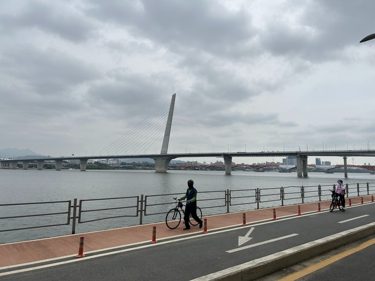

6日目はソウルを出発して東海岸に向けて進みます。途中いくつか山があるので、一つ目の大きな山の頂上付近を目指します。

距離は190kmくらいですが、獲得標高が2600mほどあります。
早めに着いてゆっくりする予定なのですが、うまくいくでしょうか。

## 宿 ～ CP18:서울(ソウル): 1328km

朝8時頃、すでに出勤の人々でいっぱいでした。

朝ご飯を探すと、マクドナルドが見つかりました。
ごはん系がいいのですが、大都会過ぎるのでこれで妥協しましょう。

この機械で注文できます。

こんな感じで注文しました。

ソーセージエッグマフィンですね。

ルート上のサイクリングロードに戻って出発です。

しばらく走ると、何やらチェーンが一周するたびにカタカタ音が鳴ります。
何か引っかかっているのか、よくわからないですが、とりあえずチェックポイントまで行って確認することにします。

チェックポイントは自転車屋で、一旦サイクリングロードから一般道に外れます。

ありましたが、地下一階のようです。

地下への行き方がわからずうろうろしてしまいました。

これですね。
残念ながらお店はまだ開いていないようです。

スタンプを置いた机が設置されていたのでスタンプを押します。
奥には仮眠用にマットなんかも用意されていました。

名前と通過時刻とサインを書きます。
ファンさんは昨夜0:50くらいに無事通過していったようですね。

とりあえず、チェーンがカタカタ鳴る原因を調べてみると、どうやら回らないコマがあったようです。
チェーン落ちしたときに歪んだのか、オイルかゴミが固まっているのでしょうか。

とりあえず、オイルで洗浄してウェットティッシュで拭き取ってみましたが、あまりスムーズには回らないようです。

激坂を登って降りて700mほど離れたところに自転車屋があるようで行ってみましたが、残念ながらオープンまでまだまだ時間があるようでした。

洗浄した結果、スムーズではないものの、めちゃめちゃ困るというほどでもなくなったので、このまま進むことにしました。

うろうろしたり洗浄したりで1時間くらい無駄にしてしまいました。

## CP18:서울(ソウル): 1328km ～ CP19:양평(ヤンピョン): 1411km

ここから東へ80kmほど、ほぼサイクリングロードを進みます。
ソウルは人も交通量も多くごちゃごちゃしているのですが、その全てをサイクリングロードでバイパスする感じです。

サイクリングロードへ戻るところで、なにやら掃除機の逆噴射のような機械でプシュプシュしている人がいました。
これは何でしょうかね。

漢江(ハンガン)をどんどん東に進みます。
自転車に乗ってる人もめちゃめちゃ多いです。

正面にうまく見えるところを逃してしまって後ろの写真ですが、有名な汝矣島(ヨイド)の63(ユクサム)ビルです。

池袋のサンシャインより3階高いです。

サイクリングロードをひたすら走ります。

このあたりは以前社員旅行で韓国に来たときに自転車部の仲間と自転車をレンタルして走った覚えがあります。
あとでStravaを見てみると、前の方が速かったみたいです。。。

地下鉄です。

だいぶ田舎の方に来ました。
この辺りまで来ると、自転車の人もだいぶ減りました。

少し上流の漢江(ハンガン)です。

だいぶ田舎になってしまってお腹も空いたけど何もないなぁ、と思っていた頃、あーーーーー！
自転車屋さん発見です！

ちょっとしたものを販売してるだけではなさそうで、「整備」って書いてあります！！
さっそく寄ってみます。

チェーンが動かないところがあると説明すると見てくれるようです。
韓国の刑事ドラマで、銃を構えて「動くな！」という台詞で覚えた単語が役に立ちました。
「動くな！」は「ウムジギジ マ」なので、「ウムジギジ アンヌンデヨー」と説明すれば大丈夫です。

おじさんは無言でチェーンやスプロケ、プーリー周りを洗浄してくれました。
チェーンが歪んでる可能性が怖かったので、念のためチェーンの交換をお願いしました。

ついでに、ハンドルを動かしたときにキュキュっと音が鳴るのも気になっていたのですが、それはケーブルの付け根が擦れてる音じゃないかという結論になりました。

いやーー、助かりました。
これで、心配事は全部消えました。

全部で7万ウォンでした。

整備も終えてしばらく行くとマンドゥの屋台があったので軽く腹ごしらえです。

おいしかったので、10個か15個くらい食べてもよかったですね。

ここから山の方に入っていきます。

ただし、川沿いでサイクリングロードなので、ほとんど平坦です。

ダムもありました。

トンネルもたくさんあって楽しいです。

ひたすらサイクリングロードを進みます。

電車の駅もありました。

道の幅やトンネルがたくさんあることを考えると、このあたりのサイクリングロードはおそらく、元線路なのではないでしょうか。

トンネルの中もきれいです。

むかしの駅と線路の名残りらしいものがありました。

トンネルはたくさんあります。

オクチョンというところに出ました。

壁に「オクチョン冷麺」と書かれています。
名物なのでしょうか。気になります。

すぐそばにお店があったので、ちょっと遅めの昼食にします。
14:30くらいです。

うまうまです。

「自転車旅行の天国」だそうです。

南漢江(ナマンガン)サイクリングロード、ほんとに走りやすくていいところでした。

一般道に出て、15:30ごろ、チェックポイント到着です。
実は、少し手前にもCUがあって間違えてそっちに行ってしまいました。
KOREA2030ジャージを着た人が無視して通り過ぎて行ったので気付いてよかったです。

## CP19:양평(ヤンピョン): 1411km ～ CP20:횡성(フェンソン): 1507km

あと100kmほどですが、ここからは結構上りです。
21時到着はかなり難しそうですね。

しばらく走ってると、道を間違えてしまいうろうろしてると後ろから来た人達と一緒になりました。

一緒に行っていいですかぁと聞くと、いいよとのことで仲間に入れてもらいました。
更に後ろから2人来るそうです。
4人組で昨日も見かけたチョナンのチームでした。

話していると、ひとりは日本語が話せる方でした。
日本で勉強したわけではなく、中国の北京に留学しているときに日本人の友達と知り合って覚えたそうです。
すごいですね。

ついに、江原道(カンウォンド)に入りました！！

ごはん行くけど、一緒に行く？
とのことで、ご一緒させてもらいました。

マッククスです。

記念撮影、パシャリ。

カムジャジョン

ポッサム

マッククス

このあたりはそば粉がよく取れるようで、冷麺やマッククスが名物のようですね。

冷麺とマッククスの違いはよくわからないのですが、冷麺ははさみで切って食べるほど弾力があって、マッククスははさみがいらない程度のコシ、という感じでしょうか。

とにかくたくさん食べて元気になりました。

上りは遅いので一人で出発しました。
みなさんもう少しのんびりしているようです。
きっと後で追いついて来るでしょう。

この後、街はまったくなくなりました。
道路を管理する事務所や消防隊の基地くらいしかありませんでした。
トイレにも行きたいなぁ、と思っていたところ、スーパーを発見しました。

トイレに寄って買い物をしてると、チョナンのチームはすでに追い着いたようで、おやつを買ってわいわい談笑していました。

ここから先登ると寒くなるかなぁ、と聞かれたので、ちょうど上に着ようか迷ってるのよねと答えて、結局上はウールのインナー、下はタイツを追加し、また、先に出発しました。
天気予報では12時ごろから雨が降りそうなので、なんとかそれまでに着きたいところです。

標高があがると寒くなるはずですが、意外と寒くなりません。
失敗です。
あまりにも暑くて、結局途中で脱いでいると、下からわいわい話し声が聞こえてきて失敗だったねーと話しながら追い越していきました。

ほどなくしてテギサンの山頂です。

23時過ぎ、チェックポイント到着です。

チョナンのチームもまだいました。
今日は30km先のチンブまで行くそうです。

## ～ 宿

宿まではルート上を5kmほど下るだけです。

かなり遅くなりましたが、予め電話しておいたので大丈夫でしょう。
到着して、フロントがわからなかったので電話すると息子さんが出てきてくれました。
遅くにすみませんです。

集合住宅のような作りのペンションです。

部屋の中はかなりおしゃれで、ゲーム機なんかもあります。

台所もあります。
本当はもっと早く着いてのんびりリゾートするつもりだったのですが、ま、こんなもんですよね。

シャワーを浴びていると、外は大雨になりました。
ギリギリセーフだったようです。
天気予報はあたりますね。
チョナンの人たちびしょ濡れになっちゃいましたね。

後半は短い距離で計画してあるので明日も200kmくらいです。
しかし、標高1000mから0mまで行くのですが、なぜか2500m近く登る予定です。

ま、疲れるよりはのんびり行く方がいいので、7時間くらい寝て8時くらいに起きればいいでしょう。

おやすみなさい。

6日目: 移動距離: 188km (2606m up) 計:1515km
