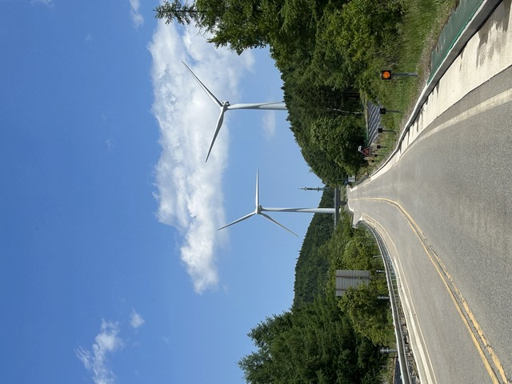
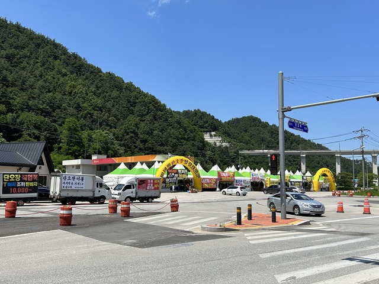

今日は江陵(カンヌン)まで下って、海岸線沿いを南下します。
標高1000mから0mまで下るはずなのに、なぜか2500m近くも登ります。

## 宿 ～ CP21:강릉(カンヌン): 1592km

おはようございます。
いい感じのリゾートです。

昨日は真っ暗でしたが、玄関はこんな感じでした。

出発してしばらくは下りで、とくに町はなさそうです。
町が出てきたら朝食にすることにします。

しばらく走ると食堂の前におばちゃんがいたので聞いてみましたが、まだ準備しているところとのことでした。

その向かいに開いている食堂があったので、そちらに入ることにしました。

サンドゥンイネ チップパプというのを頼みます。
双子の家のおうちごはん、て感じでしょうか。

おばちゃんは双子なんでしょうかね。

いろんなおかずが出てきて豪華です。

1週間で韓国を一周しているという話をすると、「もっと食べないと！」と言われたので、ご飯をおかわりしました。
おかわりのご飯の代金はおばちゃんからのおごりだそうです。

下りですが、ここからもう少し峠を越えます

かなりいい天気になってきました。

どんどん進みます。

奥の方に山が見えてきました。

平昌(ピョンチャン)に到着です。

冬季オリンピックあったあのピョンチャンです。

冬は寒いのでしょうが、今日は暑いのでアイスを食べます。
ババンバーです。

ここから先を登るとテガンリョンです。
テガンリョンを超えるとついにカンヌンです。

12:45ごろ、やっとテガンリョンに到着です。

こういうモニュメントがあると登った甲斐がありますね。

眼下にカンヌンの町や海が見えます。

ここから先8kmは急な下りです。

前に車がいたので、あまり速度は出せず、のんびり下りました。

熱海峠を長くしたような感じでした。

下るとなにやらお店がありましたが、食事はなく、衣類のようです。

ようこそ、ここはカンヌンです。

なんかバリケードが出てきて道を見違えたのかと思いましたが、正しいルートで大学の中に入っていきました。

CP手前は往復なので、戻りでご飯を食べるところの目星を付けておきます。
海鮮冷麺のお店と、たこ料理のお店がありました。

しばらく進むと、ありました！
ここから路地に入るようです。

が、見つかりません。
ちょっと迷っちゃいました。

14:25ごろ、CP21に到着です。
スタンプを押してもらって、ドロップバッグもあるので、ジャージを着替えます。

おでんがあったので、少しいただきます。

めちゃめちゃ刺さってますね。

残り439kmも安全運転で釜山で会いましょう！

## CP21:강릉(カンヌン): 1592km ～ CP22:삼쳑(サムチョク): 1649km

折り返してたこ料理のお店に入りました。
が、なんと、ちょうど終わったところでした。
ちょっと遅かったですね。

もうひとつの候補の冷麺のお店に入りました。
冷麺ばかり続きますが、ここら一帯はそば粉の有名な地域なのでしょうか。

フェネンミョンです。お刺身冷麺です。

辛くしないようにできるかと聞いたら、赤い部分を外しましょうか、と提案してくれましたが、この赤い部分にお刺身が入っているのでなくなったら困ります。
ということで、半分にしてくれましたが、ちょっと損した気分です。

もちろん、うまうまです。

こちらはチュクミ(小さいたこ)のマンドゥです。

うまうまです。

海岸沿いの道を進みます。

1995年の視聴率64.5%の韓国ドラマ、モレシゲで有名な場所をぜひ見てきて、と会社の人から聞いていたので寄り道しようと思っていたのですが、ちゃんとルートになっていました。

チョンドンジンの駅です。
実は僕はドラマを見ていないので、ただのDNFポイントです。

モレは砂、シゲは時計で、モレシゲは砂時計です。
公園の中心に巨大な砂時計がありました。

自撮りもパシャッ。

モレシゲを過ぎると、アホみたいな激坂が出てきました。
写真ではあまり伝わりませんね。

距離も短いのでさすがに押しました。

何ヶ所か町ごとに海鮮のお店がたくさんあり、賑わっています。

さっき冷麺を食べたばかりなので通り過ぎるしかないのが残念です。

19時過ぎになったころ、ちょうど海鮮のお店がいろいろ出てきたので夕食にします。

モドゥムムルフェ(全部入りムルフェ)です。

ムルフェはこのあたりの名物で、野菜、海鮮、甘酸っぱく辛いソースの料理です。
そうめんみたいなので食べます。

全部入りなのでかなり高級です。
アワビやホヤ、なまこなどいろいろ入っていました。

19:45ごろ、CPに到着です。

## CP22:삼쳑(サムチョク): 1649km ～ 宿:울진(ウルジン): 1716km

ここからひたすらアップダウンです。

70～100mくらいを上って下っての繰り返しです。
何度繰り返したかわかりません。

途中、一人で走っている人に会いました。
韓国では一人で走っている人は少ない印象ですが、この人は、いつもチームで走るならフレッシュが存在する意味がないよ、と言っていました。
確かにそうですね。
その場でチームになるのはいいですが、最初から最後まで一緒だとフレッシュと同じかも知れません。

時刻は、22時半を過ぎです。まだまだアップダウンが続くので宿への到着は1時頃になりそうです。
おなかもすいてきたので、何か軽く食べたいところです。

店を探しながらしばらく行くと、深夜まで開いてる店がありました。

何があるのか聞くと、タッカンマリ(鶏一匹)があるそうです。

どれだけすごい量が出てくるのか、おどおどしましたが、そんなにすごい量ではなく安心しました。

1時間ほど走って、ウルジンに入りました。

午前1時前に宿に到着しました。

海沿いにあるモーテルでこのあたりは朝日がきれいな場所のようです。
が、早起きしても眠いので、ゆっくり5時間ほど寝て出発することにします。

おやすみなさい。

7日目: 移動距離: 201km (2474m up) 計:1716km
