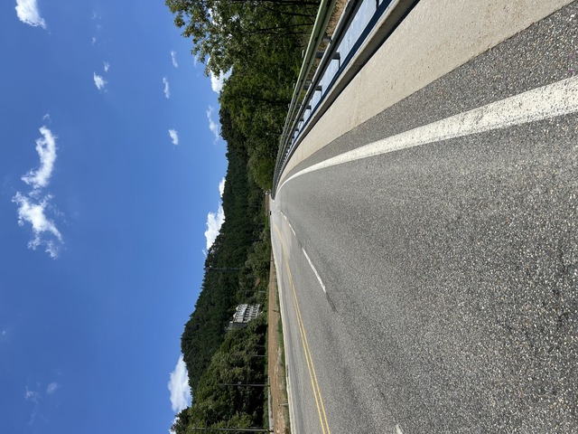

## 宿 ～ CP21:강릉(カンヌン): 1592km

12:43

14:25

## CP21:강릉(カンヌン): 1592km ～ CP22:삼쳑(サムチョク): 1649km

14:48

19:17

19:46

## CP22:삼쳑(サムチョク): 1649km ～ 宿:울진(ウルジン): 1716km

22:50

23:50

0:50

5時間くらい

7日目: 移動距離: 201km (2474m up) 計:1716km
