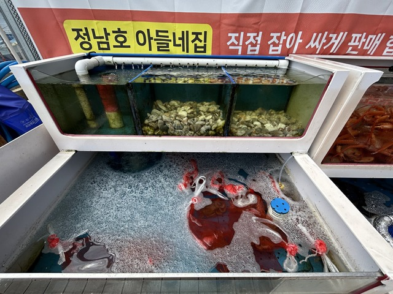

## 宿 ～ CP23:울진(ウルジン): 1722km

12kmくらい

7:30発

7:56

## CP23:울진(ウルジン): 1722km ～ CP24:영덕(ヨンドク): 1797km

10:19

13:55

## CP24:영덕(ヨンドク): 1797km ～ CP25:청송(チョンソン): 1893km

14:10 満員

17:30

20:07

22:10

## CP25:청송(チョンソン): 1893km ～ 宿:영천(ヨンチョン) 1928km

23:57

8日目: 移動距離: 212km (2617m up) 計:1928km
