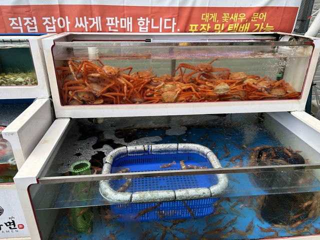

今日も短めで210kmほど走る予定ですが、相変わらず獲得標高が多く2600mくらい上ります。
後半に長く走るような予定にしなくて本当によかったです。

## 宿 ～ CP23:울진(ウルジン): 1722km

宿から次のチェックポイントまでは12kmくらいです。
朝、7:30くらいに出発しました。

宿の窓からの海側の景色です。
霧が出ていますね。

道路も結構霧が出ていました。

昨日友人がFacebookに載せていた食堂の前を通りました。

24時間のスンデのお店で魅力的ですが、さっきコンビニで買ったキムパプを食べたばかりなので、もう少し進んでから何か食べることにします。

次のチェックポイントの手前に謎の魚がありました。

ルートは、魚の周りをぐるっと回るようにして、

魚の中に吸い込まれます。

8時頃、魚の橋を渡ると、チェックポイントのハンコが置かれている電話ボックスに到着です。

## CP23:울진(ウルジン): 1722km ～ CP24:영덕(ヨンドク): 1797km

チェックポイントは無事通過しましたが、このあたりにはお店も何もなさそうです。

イカが売られてるようですが、朝早いのでまだ開いていないし、食べられるような所でもなさそうです。

道路沿いにはイカのオブジェが並んでいて、イカの有名な町なのでしょう。

しばらく行くとお店の前にブルベの人がいたので寄ってみました。
タイの人と韓国の人のカップルで、ここには食べる物はなかったそうです。

しばらく一緒に走りましたが、ペースがよくわからないので、また一人になりました。
走るのが速い男性の方が先まで行って、適当なところで待っているスタイルのようでした。

この後も何件か食堂はありましたが、まだやっていませんでした。

海に突き出した展望台です。

東海岸なので、朝日がきれいに見えるのだと思います。

ちょっと上ってみたかったですが、だいぶ歩きそうなのでやめました。

10時半近くになって、やっと開いている食堂を見つけました。

ラーメン屋のようです。

独島(竹島)エビというのもかなり気になりますが、とにかくおなかがすいたので、タコのラーメンを頼みます。

直接捕った材料を使って調理しているので、大きさにばらつきがあるそうです。

店の前にはこんな感じのいけすがあって、材料が泳いでいます。

天然物ですね。
楽しみです。

うおーーっ！
すごいの来ましたよ！！

日本のスーパーのタコより弾力があって、めちゃめちゃおいしかったです。

おなかも満たされたので、しばらく元気に走ります。

ガソリンスタンドにコンビニがあったので、いつも通りポカリスエットとお茶を買ってボトルに詰め替えます。

と、ここで、ボトルが黒いことに気づきました。

チェーンの汚れか何かが付いたのかと思いましたが、どうやら外側ではなく内側のようです。
中を覗いてもみると、黒いカビのようなものが大量に付着しています。

ボトルはだいたい毎日、中に水を入れて振って洗っていました。
いつもと同じようにやってみましたが、この黒いのは取れないようです。
指で軽くこすってみると取れます。

今まで透明ではないボトルを使っていたので気づかなかったのですが、今までもずっとこんなだったのでしょうか。

水を入れて振っても取れないということは、このまま水を入れて飲んでもたいして黒いものが溶け出すわけではない、という気もしますが、一度見てしまうともう飲めません。

コンビニでスポンジを買って洗いました。

スポンジがこんな風になるくらい真っ黒でした。

ひやーーー。恐ろしいですね。

気を取り直して進むと、イカが大量に干されていました。

軽い丘を登るとトイレと小屋があったのでトイレに寄りました。

ついでにタイヤに空気を足しておこうと小屋の方に行くと、「砂埃を取る機械」と書かれた所に空気入れのようなものがあります。

漢江のサイクリングロードのところにも、謎の空気を噴射する装置があったのですが、それが以前ここにもあって、今は空気入れになったということでしょうか。

先はこんな風になっていて、ピストル型で勢いよく空気が出ます。
全部で4台あって、3つがMTB用、1つだけがフレンチバルブ用でした。
韓国の普通の自転車乗りはMTBが多いですね。

ところで、いい感じに空気が入ったら止まるのでしょうか。
それとも、タイヤが爆発するまで空気が入るのでしょうか。

説明を見てみます。

「2. タイヤの空気圧を手でチェックしてください」

そうですか、そうですか。
説明書はちゃんと読んだ方がいいですね。
危なくタイヤを爆発させてしまうところでした。

横にも大事そうな説明書があります。

「他のエアガンの問題点!!!」
「ハニャングリーンパークのエアガンは違います!!!」

ただの宣伝ですね。
こちらは読まなくて良さそうです。

こちらも動作しないときの説明なので無視しましょう。

こんな感じの場所でした。

しばらく進むと、14時頃、丘を登り切ったところでチェックポイントに到着しました。

先に到着していたYoutuberっぽい人に取材を受けましたが、どこかで動画になっているのでしょうか。

チェックポイント周辺はこんな感じで、何かの歌の歌詞がかいてあったり、

公園の名前の書かれた石碑があったり、

歌ってる人がいたり、

とても賑やかでした。

## CP24:영덕(ヨンドク): 1797km ～ CP25:청송(チョンソン): 1893km

さて、次のチェックポイントまでは100kmほどです。
宿は次のチェックポイントから30kmほど下った町に予定しています。
まだまだ長いですね。

お昼ご飯を食べようと、なにか名物っぽいお店があったので寄りましたが、残念ながら満員で何分待つかも分からない状態でした。

諦めて、しばらく行った先にあった食堂に入りました。

大きな蟹の看板がありました。

このあたりを過ぎると、ルートは海沿いを離れて内陸に進みます。
今までも十分アップダウンですが、本格的な上り区間に入ります。

暑いので、いつものようにタオルやジャージをびしょ濡れにして進みます。

だんだんと山っぽくなって来ました。

17時頃になり、この後はほとんどお店がないと予想されるので、食べられるところで食べることにします。

が、どこの店も全然やってません。

「もう少し登ると、2,3軒あるよ」と言うのですが、もう少し登っても同じ事を言われます。

4,5軒目でやっと開いているところを見つけました。

そろそろ肉が足りていなかったのでチェユクポックムを注文しました。

オリブルコギも食べたかったところですが、2人前からなのでたぶん多すぎるし、ちょっと高級すぎますね。

チェユクポックムも大量でした。

が、うっかりしました。
辛くしないで、と言うのを忘れました。

これ、めちゃめちゃ辛くて、コップの水でしゃぶしゃぶ洗い流しながら食べました。。。

近くには滝も流れていました。

同じような山道を進みます。

のんびり走っていると、後ろから「ヒラノさーん」と声が聞こえます。

えっ?! 誰?!

LELで一緒だった、キムジンハクさんでした。

いやー、久しぶりです！

うしろからすごい勢いで追いついてきたので、少しだけ話して、またバラバラに走りました。

お店も何もなかったのですが、しばらく走ると、20時頃やっとお店がありました。
ちょうど、キムジンハクさんのチームが入るところで、ご一緒しました。

店にいた地元のお客さんが、全員にアイスをごちそうしてくれました。
カムサハムニダ！

歓談していると、タイ人韓国人カップルも入ってきました。

めちゃ賑やかで楽しいですね。

次のチェックポイントは山の頂上にあるドライブインで、周りには宿や町がありません。
キムジンハクさんチームは、僕と同じくチェックポイントから30kmほど下った영천(ヨンチョン)という町まで行くそうです。
そこまで行けば、ゴールまではちょうど100kmほどで、計画も立てやすいです。

タイ人韓国人カップルはこのすぐ先に宿を見つけたらしく、そこで休んでいくそうです。

キムジンハクさんチームは速いので、またひとりでどんどん上ります。

夜10時過ぎ、頂上のドライブインに到着しました。

お店も開いていないので、スタッフの人いて飲み物を配っていました。
途中工事区間があるので気をつけて、という案内ももらいました。
夜遅くまてご苦労様です。

ここは最後のチェックポイントで、次のチェックポイントはゴール受付です。
ついに、完走が見えてきました。

## CP25:청송(チョンソン): 1893km ～ 宿:영천(ヨンチョン) 1928km

宿までは基本下り基調です。

途中ライトアップされたきれいな橋がありました。
車が通る橋ではなく、歩行者が通る橋のようでした。

何か食べるところが開いていれば寄ろうかと思ったのですが、特になさそうだったので、コンビニでサンドイッチやキムパプを買って宿に向かいました。

0時ちょうどくらいに、宿に到着です。

宿のおばちゃんが、値上げしたけどヤノルチャ(韓国の宿予約アプリ)の登録を間違えて本当はこの値段なんだけど今回だけはアプリの値段でいいから、と悲しそうな目で話をするので、差額を現金で払いました。

ちなみに、ヤノルチャは韓国の電話番号でSMSが受け取れないと会員登録できず、あきらめてAgodaから予約したのですが、やはり韓国のアプリとそのまま裏で連携しているのですね。

あと、昨日から自転車の人がやたら来るんだけど、と不思議がっていました。
やはりこの町で泊まる人は多いようですね。

部屋は大きな部屋でした。

おなかが空いたので、サンドイッチを食べて、

おやすみなさい。

明日は17時までにゴールすれば完走です。
天気予報では午後雨予報も出ているので、14時か15時ごろ到着するようにしましょう。
アップダウンは少ない予定ですが、ないわけではないので、余裕を持った方がいいでしょう。
ということで、7時すぎに起きて出発することにします。

8日目: 移動距離: 212km (2617m up) 計:1928km
