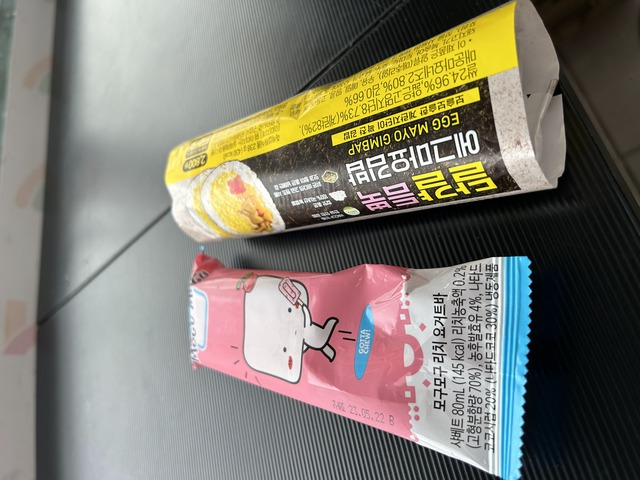

## 宿 ～ ゴール:釜山(プサン): 2030km

今日は7時頃起きて釜山まで100km、アップダウンが激しくなければ、のんびり14時くらいの到着予定です。

朝、ふと目を覚ますとまだ目覚ましは鳴っていないようです。
時計を見ると、あれれ?!
すでに8:20です！！

日本を出発するときにもアラームが鳴らなくてギリギリで飛行機に乗ったのですが、最後
またこれですか?!

ということで、急いで準備をして8:40くらいに出発です。

朝食用に買ってあったキムパプはしっかり食べます。
これは、急いでいても省略してはいけません。

17時までにゴールすれば大丈夫なので、基本的には余裕がありますが、昨日、おとついのようなアップダウンが続くとちょっとまずいです。

とりあえず、いつもより速めに進むことにしました。

9:20ごろ、ちょうどいいところに中華料理店がありました。
開いているようで、チャヂャンミョンを注文します。

5分もしないうちにできあがってきました。
すばらしいです。

うまうまです。

あまりひどいアップダウンもなく、いい感じのペースで進めています。

軽いお昼ご飯として、コンビニでアイスとキムパプを食べました。

丘を登るとついに釜山の標識が見えました。

ついに戻ってきました。
あと、4kmです。
感慨深いものです。

街中を安全第一で進み、ついにスタート地点に戻ってきました。

9日目: 移動距離: 102km (693m up) 計:2030km
