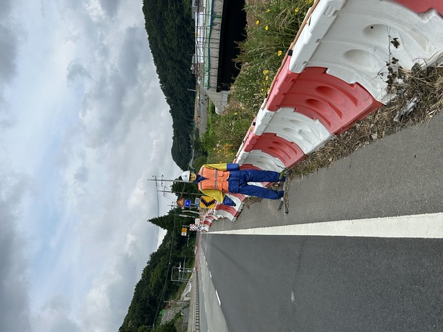
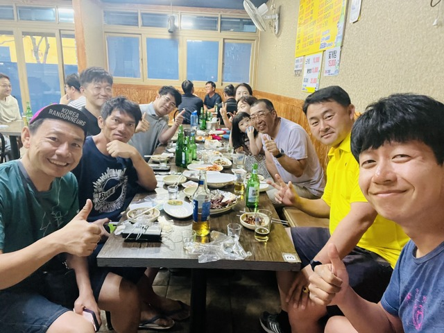
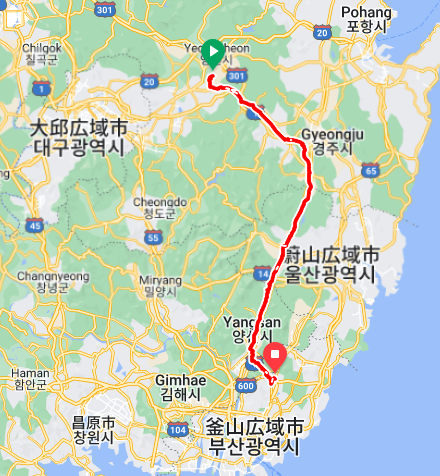
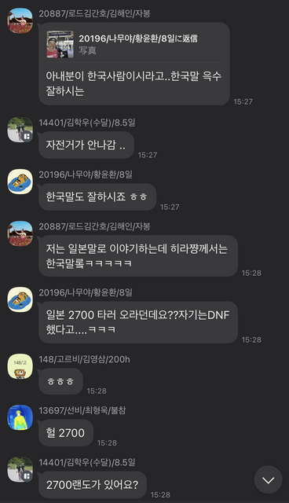
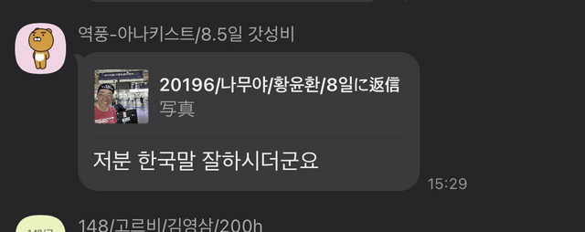
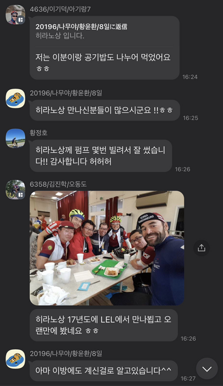

## 宿 ～ ゴール:釜山(プサン): 2030km

今日は7時頃起きて釜山まで100km、アップダウンが激しくなければ、のんびり14時くらいの到着予定です。

朝、ふと目を覚ますとまだ目覚ましは鳴っていないようです。
時計を見ると、あれれ?!
すでに8:20です！！

日本を出発するときにもアラームが鳴らなくてギリギリで飛行機に乗ったのですが、最後にまたこれですか?!

ということで、急いで準備をして8:40くらいに出発です。

朝食用に買ってあったキムパプはしっかり食べます。
これは、急いでいても省略してはいけません。

17時までにゴールすれば大丈夫なので、基本的には余裕がありますが、昨日、おとついのようなアップダウンが続くとちょっとまずいです。

とりあえず、いつもより速めに進むことにしました。

9:20ごろ、ちょうどいいところに中華料理店がありました。
開いているようで、チャヂャンミョンを注文します。

5分もしないうちにできあがってきました。
すばらしいです。

うまうまです。

しばらく進んでいると、円形の古墳群がありました。

あまりひどいアップダウンもなく、いい感じのペースで進めています。

道路脇にチャメの看板がありました。

チャメは韓国の果物で、日本では売っていないものです。

でも、箱で大量にしか売っていなかったようなので、パスです。

山羊料理のお店でしょうか。

まだ食べたことがないので、一度食べてみたいものです。

田んぼの中に大量のマンションがあります。

常時右折可ですが、赤信号の時は一旦停止後右折に変わりましたって。

軽いお昼ご飯として、コンビニでアイスとキムパプを食べました。

こんな感じで入ってます。

うまうまです。

なんか、おっさん立ってビックリましたよ。

人形ですよ。

丘を登るとついに釜山の標識が見えました。

ついに戻ってきました。
あと、4kmです。
感慨深いものです。

街中を安全第一で進み、ついにスタート地点に戻ってきました！！！

## ゴール

ゴール受付をします。

ブルベカードと完走証をパシャリ。

こちらが撮ったやつ。

201時間03分で完走です。

完走証もかっこいいですね。

ブルベカードもスタンプがたっぷりです。

なぜかCP5はないけど。

看板と一緒に撮ってもらいました。

名前のところでもパシャリ。

スタッフの方と記念撮影。

ドロップバッグはあと10人分くらいありました。

スタッフの方達と遊んでいると、奥からキムジンハクさんが出てきましたので、一緒に帰ることにしました。

土日は地下鉄に自転車をそのまま持ち込んでも大丈夫です。

チェヒョンジュンさんやPayuさんNotさん達が打ち上げをしているそうで、合流します。

payuさん達は今朝、チェヒョンジュンさんはおとつい到着したそうです。

ということで、全体でこんな感じになりました。

Garminはこんな感じです。

ホテルからスタート地点までもの10kmくらいも含めてしまったんですが、2030kmに対して、だいぶ多く走ってますねぇ。
そんなに寄り道してないと思うんですが。

宿に戻ってサドルを見ると、ちょっと曲がってました。

昨日の夜、宿で自転車を立てかけたときにサドルに負荷がかかってたみたいですね。

緩めて締め直すと直りました。

9日目: 移動距離: 102km (693m up) 計:2030km

## 翌日 + 番外編

釜山で1泊して、次の日飛行機で東京へ帰りました。

釜山の空港でも2030年の釜山エキスポ招致の宣伝がいっぱいありました。

この時、途中で一緒走って友達になったファンさんに帰るよーとメッセージしたら、Korea2030のカカオグループに載せてくれました。

「今回参加した日本人のひとりが渡航するって連絡してくれましたよ。Korea2030で自身の新記録達成だって」

このあと、飛行機に乗ったので見てなかったのですが、「韓国語ができる人ですよねー」と僕と会った人が返信します。

昨年、日本縦断の2700をDNFしたと話していたので、その話題でもりあがります。

話題が落ち着いた頃、また、目撃者が現れました。

「この人韓国語よくしゃべりますよねぇ」

この後、目撃情報がどんどん出てきます。(笑)

「自分とだいたい1000kmくらいは走りましたよ。おやつも食べて」

「そうそう、自分もちょっと一緒に走ったみたいです」

「平野さんとフェンソンで夕食食べましたよ。アンゴルマッククスでマッククスとポッサム。写真は平野さんが撮ったんでないんです T_T」

「平野さんはムルマッククス食べてました」

「自分はこの人とごはんを半分こして食べましたよ」

「平野さんに会った人多いですねぇ！！」

さらに目撃情報は続きます。

「平野さんにポンプを何回も借りて使わせてもらいました。ありがとうございます。ほほほ」

「平野さんと17年にLELで会って以来久しぶりに会いましたよ」

---
いやー、みなさん、覚えていてくれてありがとうございます。

9日間、ほんとにたくさんの人と会って、一緒に走って、いろいろ話して、ほんとに楽しかったです。
