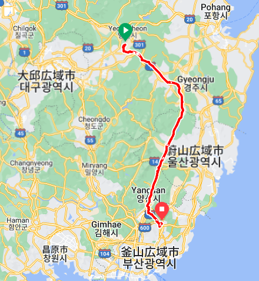

## まとめ

### 道路状況

- 道路の路面状態は基本的にいいです
- つぎはぎが少なく穴も少ない印象です
    - ライダーはちょっとしたつぎはぎでも、声出しをして避けます
    - 日本だとずっと声を出し続けないといけないかも知れません
- 速度を出させないための凸凹がかなりあります
- 交差点内は砂利が浮いているところも多くありました。特に左折の時に注意です

### 交通ルール

- 右側通行です
- 基本的に常に右折可です
- 4つ目の信号では青信号でも左折できません
    - 左矢印で左折します
    - たぶん「非保護」と書いていなければ対向車は止まっています
- 自転車やバイクは赤信号を守りません
    - 止まっていると、行かないんですか?と聞かれたりします。
    - ちょっと気持ち右に寄りながら信号無視します
    - 常時右折可なので、右折+Uターン+右折ということだそうです
    - 同様に赤信号で進む車もたくさん見ました
    - 安全を確認してるので、ルール重視より結果として安全だと思います
    - 気は遣います
- 前の車両優先
    - 何千台もすれ違いましたが、後ろから無理に追い越す車は1台もありませんでした
    - 日本より圧倒的に安全です
    - おそらく前の車両が優先という意識があるのだと思います
    - 黄色線でも完全に対向車線に出て追い越す車も多いです
    - ここは交通ルールより安全優先ですね

### 電子マネー

### 雰囲気

今日は7時頃起きて釜山まで100km、アップダウンが激しくなければ、のんびり14時くらいの到着予定です。

朝、ふと目を覚ますとまだ目覚ましは鳴っていないようです。
時計を見ると、あれれ?!
すでに8:20です！！

日本を出発するときにもアラームが鳴らなくてギリギリで飛行機に乗ったのですが、最後
またこれですか?!

ということで、急いで準備をして出発です。

朝食用に買ってあったキムパプはしっかり食べます。
これは、急いでいても省略してはいけません。

17時までにゴールすれば大丈夫なので、基本的には余裕がありますが、昨日、おとついのようなアップダウンが続くとちょっとまずいです。

とりあえず、いつもより速めに進むことにしました。

ちょうどいいところに中華料理店がありました。
開いているようで、チャヂャンミョンを注文します。

5分もしないうちにできあがってきました。
すばらしいです。

うまうまです。

あまりひどいアップダウンもなく、いい感じのペースで進めています。

軽いお昼ご飯として、コンビニでアイスとキムパプを食べました。

丘を登るとついに釜山の標識が見えました。
ついに戻ってきました。
あと、4kmです。
感慨深いものです。

街中を安全第一で進み、ついにスタート地点に戻ってきました。

9日目: 移動距離:  km ( m up) 計:2030km
