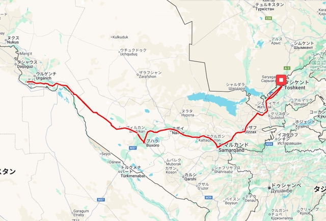
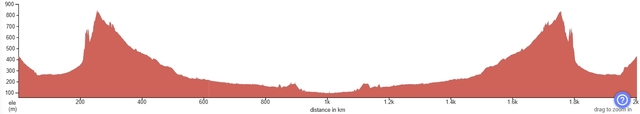

## Great Silk Road 2025 (2000km)

2025年9月17日、ウズベキスタンの2000kmブルベに参加してきました。
タシケントを出発してシルクロードを通って世界遺産の町、サマルカンド、ブハラ、ヒヴァを往復するブルベです。

ウズベキスタンでは毎年1200km～1300kmのブルベが開催されているようです。
2023年9月にも一度1200kmのシルクルートを申し込んだのですが、仕事の都合でDNSしました。

今回は初の2000kmで、おそらくブハラ、ヒヴァの間がルートになっているのは初めてではないかと思われます。

## ルート

タシケントを出発して、サマルカンドまで約300km、ブハラまで約270km(570km)、ヒヴァまで約430km(1000km)で、往復2000kmになります。
途中にあまり大きな街はなく、3つの街がチェックポイントとなっています。
ブハラとヒヴァ間はキジルクム砂漠という砂漠地帯です。Google Map等で見る限り、街は見当たりません。
この間の430kmをどう攻略するかが肝になりそうです。

2000kmにもかかわらず、獲得標高は4000m程度とほぼ平坦のルートです。

## 大会情報

[Great Silk Road 2025 公式ホームページ](https://audax.uz/great-silk-road-2025-en)
