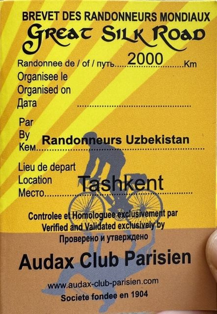

## きっかけ

2019年ごろだったでしょうか、ブルベ界の有名人マヤさんからシルクルートという1200kmのブルベは素晴らしい、という話を聞きました。
シルクロードというと砂漠の中の一本道をらくだに乗って旅しているようなイメージです。
ウズベキスタンという国でだいたい毎年開催されているそうです。

ウズベキスタンというのは中央アジアにある国で・・・。
お恥ずかしながら中央アジアがどこにあるのかも知りませんでした。
コロナにはなかなか海外ブルベには参加出来ていなかったのですが、とりあえず、そんなに素晴らしいのなら一度行ってみようと2023年に一度申し込みました。
しかし、ちょうど転職の時期と重なってしまい、この年は断念しました。

2024年はルートがシルクロードではなかったので参加しなかったのですが、日本から小原(こはら)さんという方が参加されて、その後体験談の講演会が開催されました。
そこで、少し大会の様子を聞き、また興味が湧き始めたころ、2025年9月に2000kmのブルベが開催されることがわかりました。
2000kmだと、1200kmよりゆったり走ることができます。
獲得標高も全体で4000mと驚くほど少ないアップダウンです。
風しだいだけど、これなら、多少道が悪くても楽しめるのかもしれない、と参加を決意しました。
河内長野1560kmやLELの参加中にも、道中で中央アジアをランドナーで横断したという温玉ねぎとろさんに話を聞いて、太いタイヤがいいよ、などアドバイスをもらいました。

## 申し込み

申し込みは[ホームページ](https://audax.uz/)から簡単な情報を入力するだけです。
しばらくすると、主催者が手動で参加者一覧を更新します。
参加費はUSドル、ルーブル、ユーロ、ウズベキスタンスムのいずれでも支払可能です。
前日の出走受付の時に払います。USドルで払ったので、30ドルでした。

大会の連絡や、途中のチェックポイントの写真などはTelegramというLINEのようなアプリ上でおこないます。
Telegramでは写真をアップした時刻がアプリ上に表示されるので、その時刻を証跡に使うと言っていました。

ちなみに、大会に関する情報はほどんど流れてきませんでした。
ルートだけあれば完走出来るでしょ、くらいの感じです。

チェックポイントの位置なども大会の1週間ほど前に質問すると、ブルベカードのPDFが送られてきました。
主催者も参加者も事前にチェックポイントの位置はたいして気にしていない様子でした。

## 大会中のサポートなど

人数が集まると、宿泊やドロップバッグを用意する体制はあるようですが、利用者がいないので今回はやらないということでした。
つまり、今回の2000kmブルベには、ドロップバッグはありません。
途中のチェックポイントも写真を送るだけなので、PBPやLELのように豪華な食事や仮眠所は存在しません。

## 大会の流れ

前日の朝11時に、主催者の自宅に集合して、ブルベカードを受け取ります。
当日スタート地点に集まり、写真を撮って出発です。
今回は1200kmと2000kmが同時開催だったのですが、1200kmの方はブルベカードの出発時刻より朝早く出てもいいよ、とのことでした。
チェックポイントでは、自撮り写真を撮ってTelegramのグループにアップします。
ゴールも同様に自撮り写真を撮ってTelegramのグループにアップします。
ゴール後、主催者の家に行って、ブルベカードを提出して終了です。

## 走行計画

Agodaなどで予約できるホテルは観光地などの都市部に限られるようでした。
1日何km走りたいと思っても、都合のいい場所に予約できるホテルがあるとは限らないので、道中で計画を微調整しながら走るのがよさそうです。
問題は、砂漠区間の何もないところです。

主催者に事前に聞いてみたら、「キャラバンサライ」というのがあってトラックとかが止まってるからわかるよ、という話だったのですが、これは結果として実際走ってもわかりませんでした。
また、チャイハナと呼ばれる食堂には小上がりの座敷があって、そういうところで仮眠ができるようです。

砂漠区間に、カラカルパクスタン共和国に一瞬入る部分があって、Google Mapによるとそのあたりにホテルが1軒あるのであてにすることにします。

|day|宿泊地|距離|総距離|
|---|------|---|------|
|1日目|サマルカンド|302km|302km|
|2日目|ブハラ|271km|573km|2819m|
|3日目|砂漠のホテル|267km|840km|
|4日目|ヒヴァ|162km|1002km|
|5日目|砂漠のレストラン|240km|1242km|1779m|
|6日目|ブハラを少し過ぎたところのホテル|238km|1480km|
|7日目|サマルカンド|226km|1706km|
|8日目|Sardabaのホテル|171km|1877km|
|9日目|タシケント|124km|2001km|

というような予定です。

4日目は162kmしか走らないので、ヒヴァをゆっくり観光できればいいですね。
8日目も171kmと短いので、朝サマルカンドを観光してもいいかもしれません。

往復コースなので、8日目のホテルは1日目に存在を確認します。
存在しなければ、その後の街で探すか、一気にタシケントまで走るのも候補にします。

6日目のホテルは2日目に存在を確認することにします。

5日目のレストランは、3日目に泊まれそうかどうかを確認することにします。

3日目のホテルは開いてる(空いてる)ことをお祈りするしかありません。
Google Mapにレビューがあるので存在する可能性は高いと思っていますが、満室の可能性もあります。
50kmほど先にチャイハナはあるようなので、最悪そこを目指します。

ちなみに、一緒に参加したロシアのグループは6日で完走して7日目には帰りの飛行機を取ってあると言っていました。
